

### 206

|Name|RAJ2000[deg]|DEJ2000[deg] |Ext[arcmin]| Ext,ml | z | z_src| C|GC(XSZ,Delta_z<0.01)| GC(OPT,Delta_z<0.01)|GC| R_sig[arcmin] | R500[arcmin] | R500[Mpc]| CRsig[c/s] | CR500[c/s] |L500[1E44 erg/s]|F500[1E-12 erg/s/cm^2]| M500[1E14 Msun]|Tx[keV]|Cnt_sig|Beta|Rc[arcmin]|Comment|Alias|
|---|---|---|---|---|---|------|---|--------|---------|----------|---|---|---|---|---|---|---|---|---|---|---|---|---|---|
|206| 81.381| -31.574| 2.95| 251.54| 0.0376(0.005)| z1, z_xsz| B| MCXC, Tar, XB| A| A, MCXC, Tar, W, XB| 14.650| 16.386| 0.733| 0.511(0.045)| 0.522(0.046)| 0.325(0.018)| 9.897(0.551)| 1.16(0.03)| 2.38(0.04)| 308.5| 0.651(-0.068+0.092)| 3.668(-0.700+0.855)| -| k370|

|[RASS image](../image/206/206_img.pdf)|[filtered image](../image/206/206_fil.pdf)|[Segment image](../image/206/206_seg.pdf)|
|-------------------|--------------------|-------------------|
| 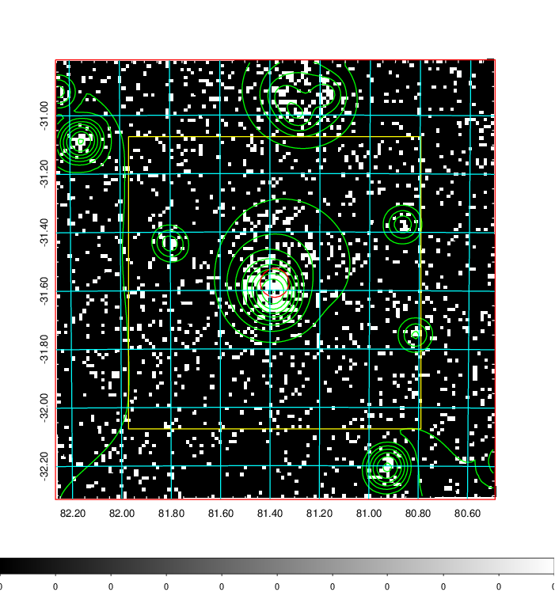  | 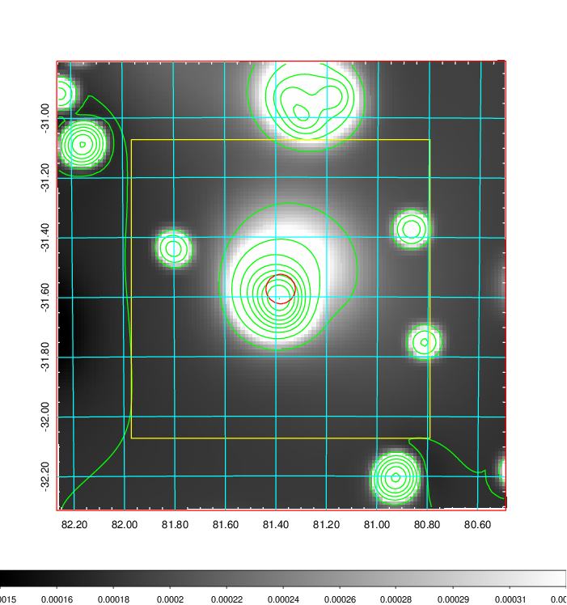   | 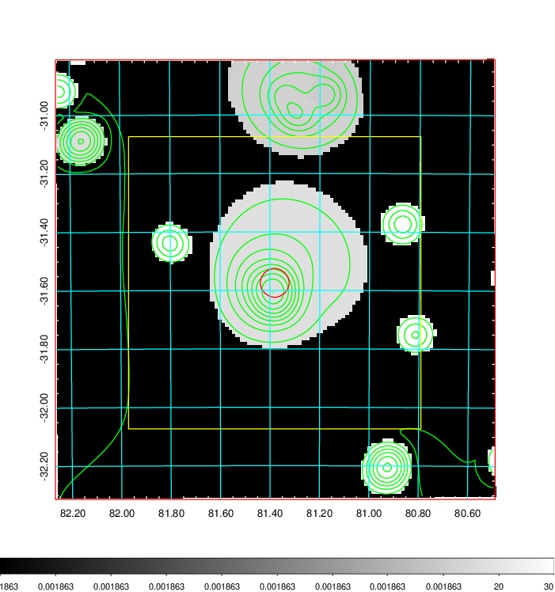  |

|[Exposure image](../image/206/206_mex.pdf)| [nH image](../image/206/206_nh.pdf)| [Planck image](../image/206/206_p.pdf)|
|-------------------|--------------------|-------------------|
|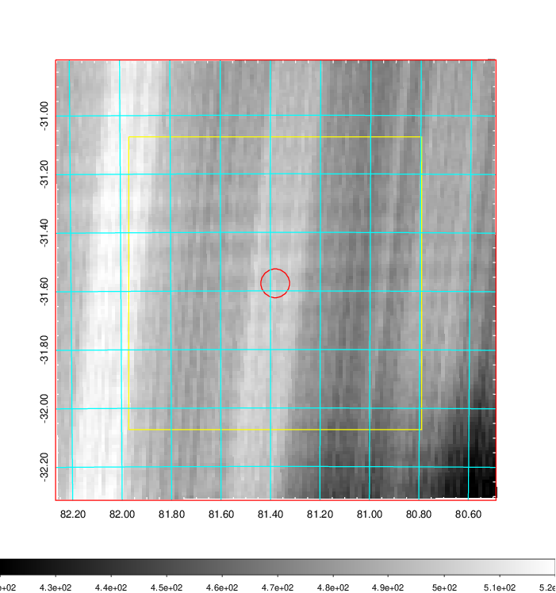   | 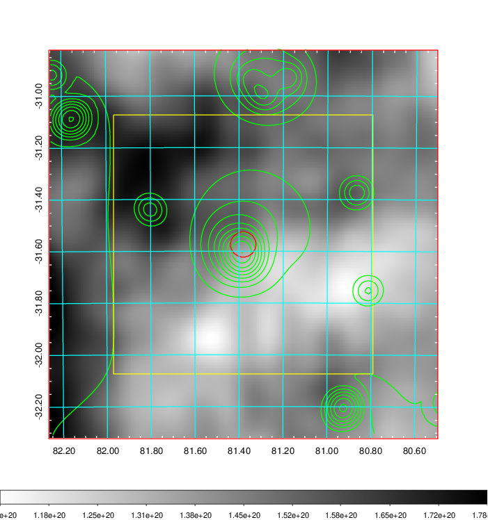    | 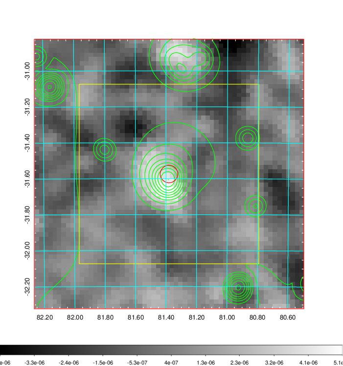 |

|[Redshift Histogram](../image/206/206_zg.pdf) | [DSS image(z1)](../image/206/206_dss_z1.pdf)      |  [DSS image(z2)](../image/206/206_dss_z2.pdf)    |
|-------------------|--------------------|-------------------|
|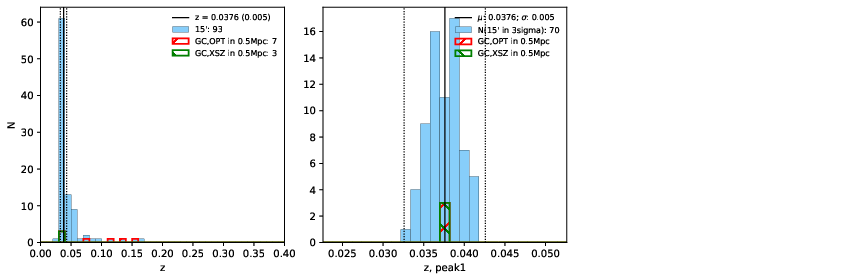 |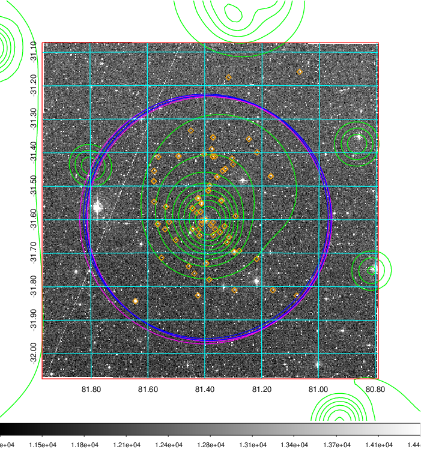  Blue circle for optical clusters;  Magenta circle for XSZ clusters;  all with r=1Mpc;  Only GC with Delta_z<0.01 are shown. | 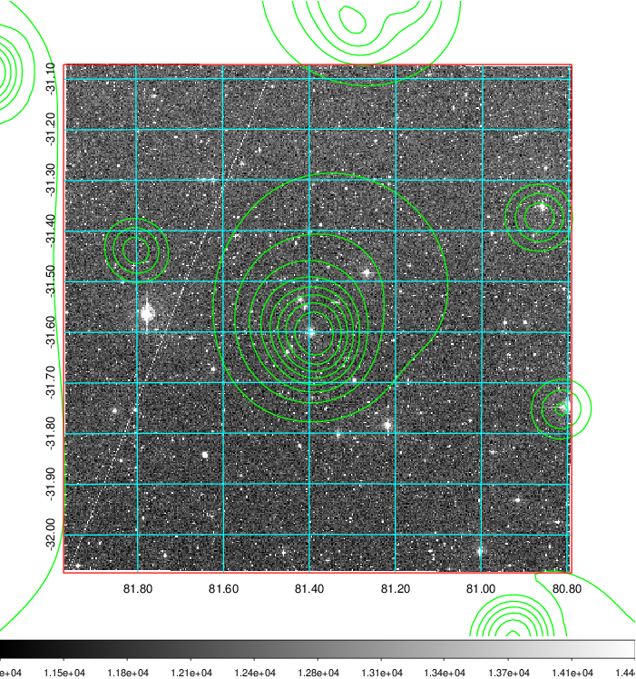 Blue circle for optical clusters;  Magenta circle for XSZ clusters;  all with r=1Mpc;  Only GC with Delta_z<0.01 are shown.  |

|[Previous-identified clusters](../image/206/206_gc.pdf) | [2MASS image](../image/206/206_2mass.pdf)      |
|-------------------|-------------------|
|  Green, magenta, and blue circles  for optical, X-ray and SZ clusters  respectively, with redshift of clusters  labelled. The radius of circles  are 1Mpc.|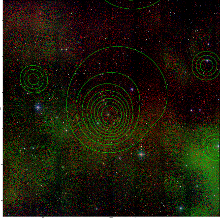  |

|[DES image](../image/206/206_des.pdf)   |[PS1 image](../image/206/206_ps1.pdf)            |
|-------------------|-------------------|
| 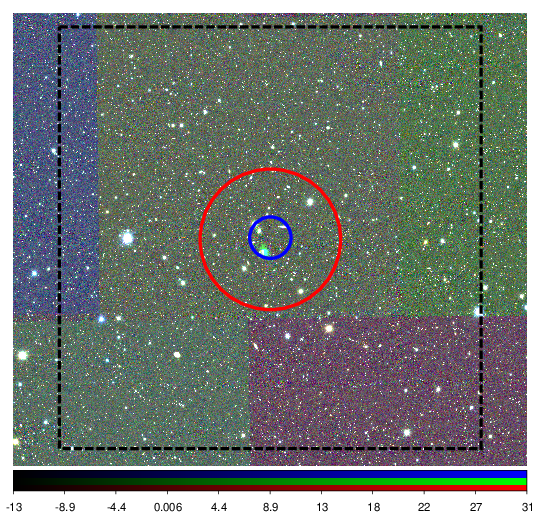  | 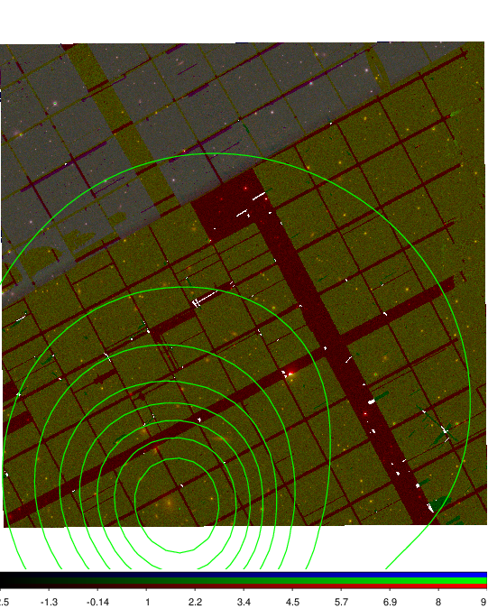  |
