

### 207

|Name|RAJ2000[deg]|DEJ2000[deg] |Ext[arcmin]| Ext,ml | z | z_src| C|GC(XSZ,Delta_z<0.01)| GC(OPT,Delta_z<0.01)|GC| R_sig[arcmin] | R500[arcmin] | R500[Mpc]| CRsig[c/s] | CR500[c/s] |L500[1E44 erg/s]|F500[1E-12 erg/s/cm^2]| M500[1E14 Msun]|Tx[keV]|Cnt_sig|Beta|Rc[arcmin]|Comment|Alias|
|---|---|---|---|---|---|------|---|--------|---------|----------|---|---|---|---|---|---|---|---|---|---|---|---|---|---|
|207| 82.223| -39.459| 0.80| 42.06| 0.2839(0.000)| z_xsz| B| MCXC, PSZ2, Tar| W| MCXC, N, PSZ2, Tar, W| 12.700| 5.457| 1.403| 0.311(0.035)| 0.284(0.032)| 14.660(0.623)| 5.770(0.245)| 10.50(0.20)| 10.04(0.12)| 229.8| 0.688(-0.081+0.117)| 1.857(-0.557+0.648)| -| k011|

|[RASS image](../image/207/207_img.pdf)|[filtered image](../image/207/207_fil.pdf)|[Segment image](../image/207/207_seg.pdf)|
|-------------------|--------------------|-------------------|
| 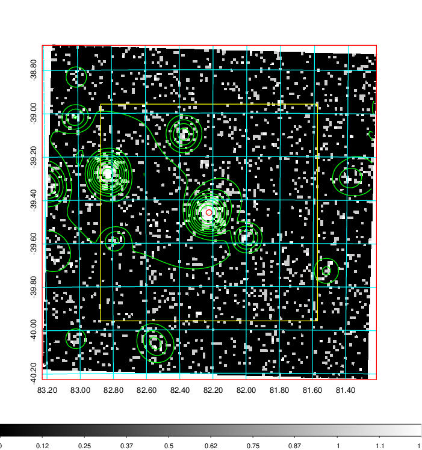  | 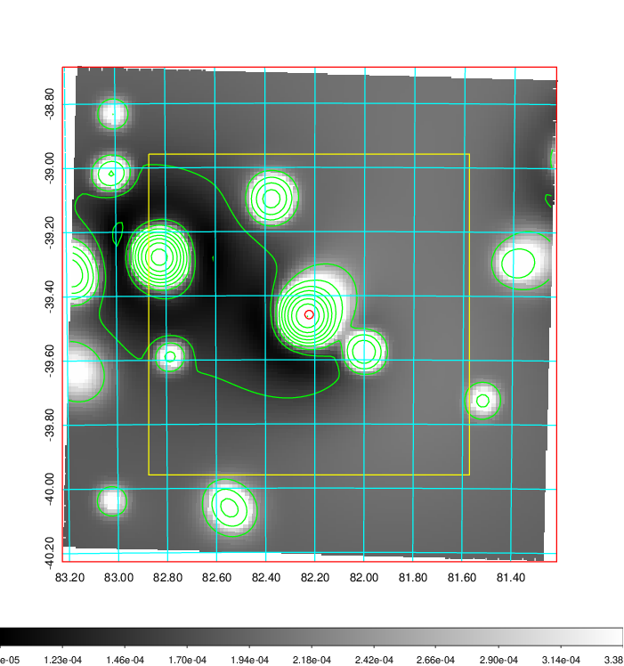   | 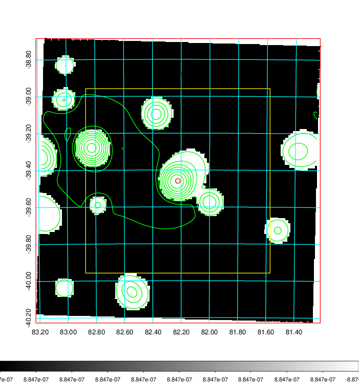  |

|[Exposure image](../image/207/207_mex.pdf)| [nH image](../image/207/207_nh.pdf)| [Planck image](../image/207/207_p.pdf)|
|-------------------|--------------------|-------------------|
|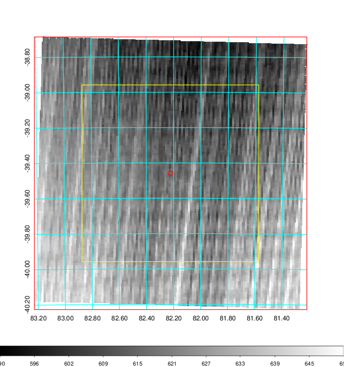   | 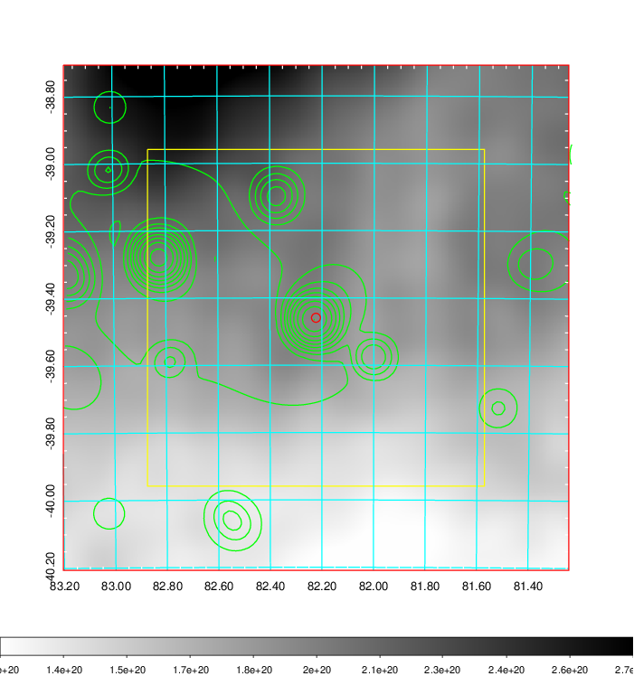    | 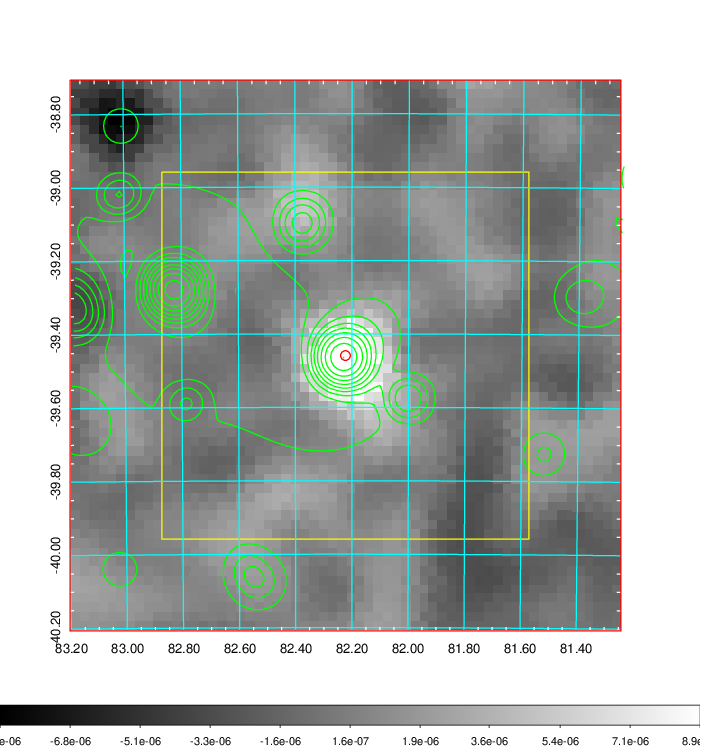 |

|[Redshift Histogram](../image/207/207_zg.pdf) | [DSS image(z1)](../image/207/207_dss_z1.pdf)      |  [DSS image(z2)](../image/207/207_dss_z2.pdf)    |
|-------------------|--------------------|-------------------|
|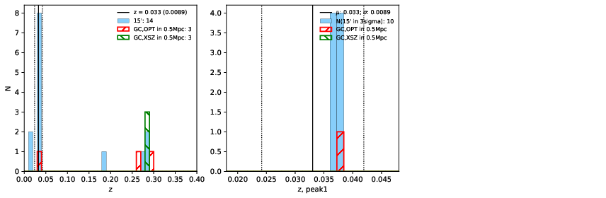 |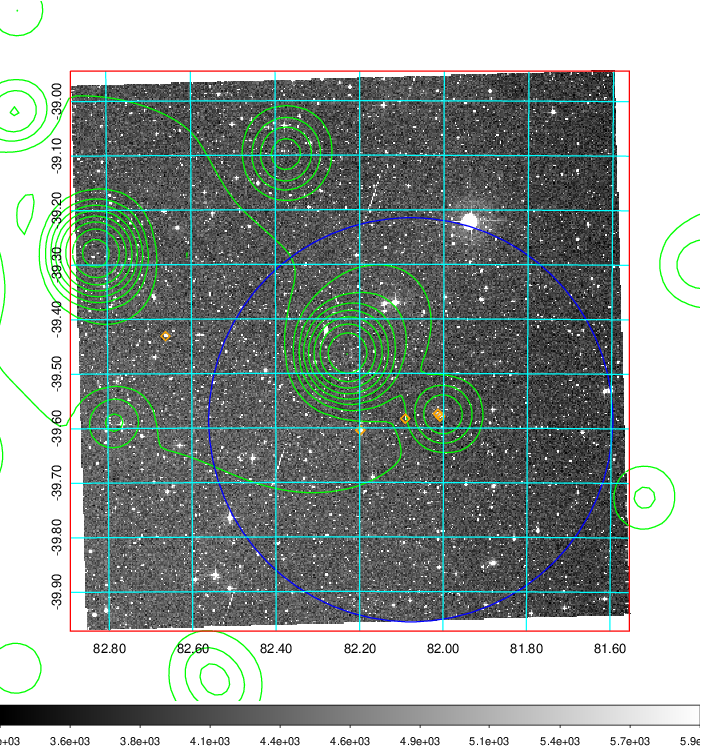  Blue circle for optical clusters;  Magenta circle for XSZ clusters;  all with r=1Mpc;  Only GC with Delta_z<0.01 are shown. | 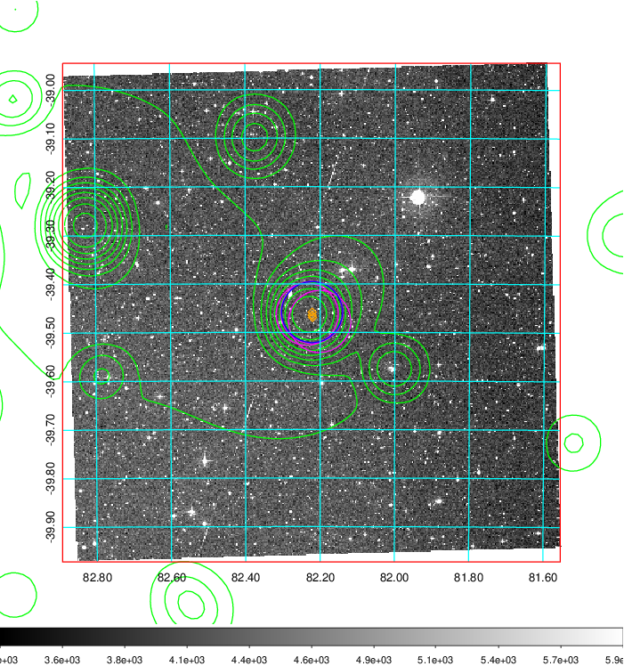 Blue circle for optical clusters;  Magenta circle for XSZ clusters;  all with r=1Mpc;  Only GC with Delta_z<0.01 are shown.  |

|[Previous-identified clusters](../image/207/207_gc.pdf) | [2MASS image](../image/207/207_2mass.pdf)      |
|-------------------|-------------------|
|  Green, magenta, and blue circles  for optical, X-ray and SZ clusters  respectively, with redshift of clusters  labelled. The radius of circles  are 1Mpc.|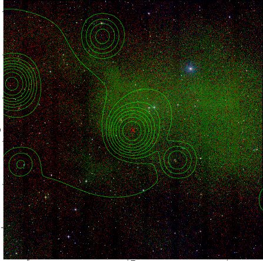  |

|[DES image](../image/207/207_des.pdf)   |
|-------------------|
| 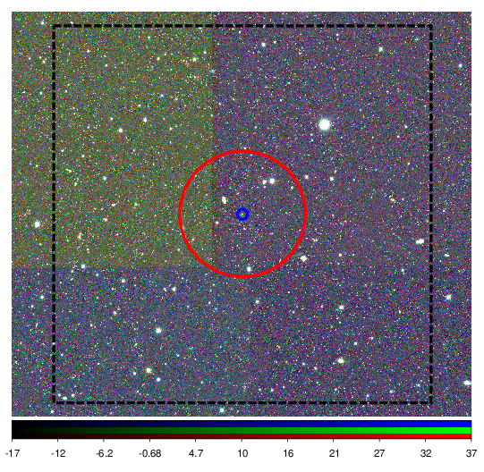  |
