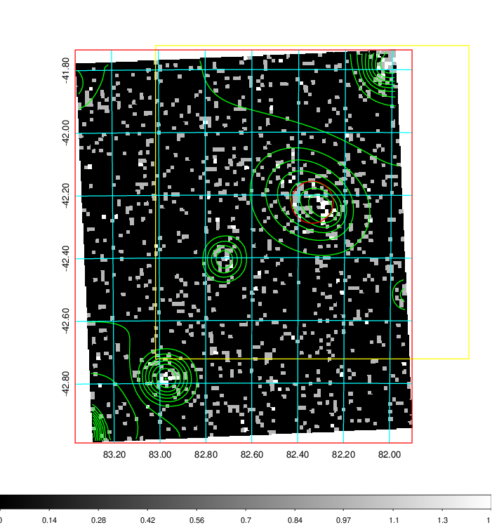
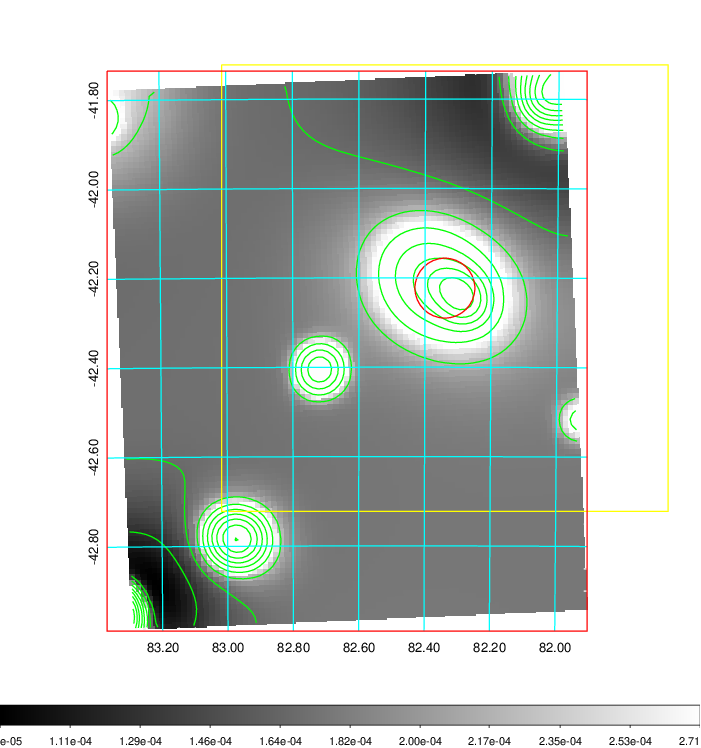
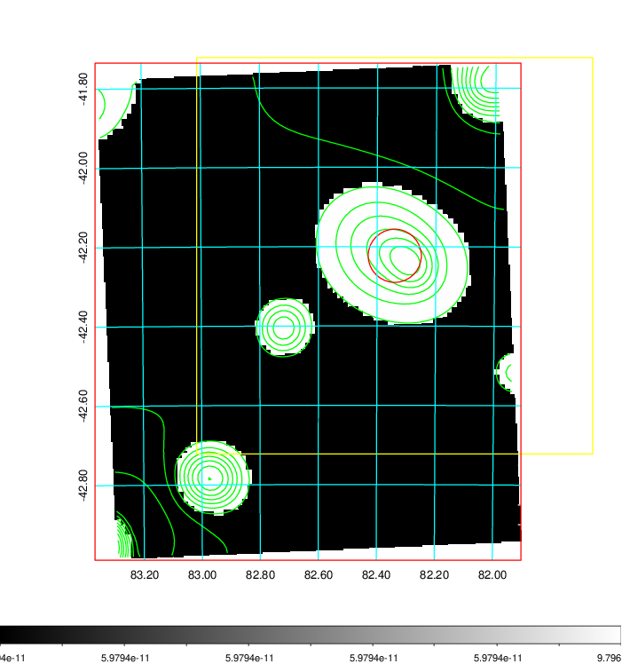
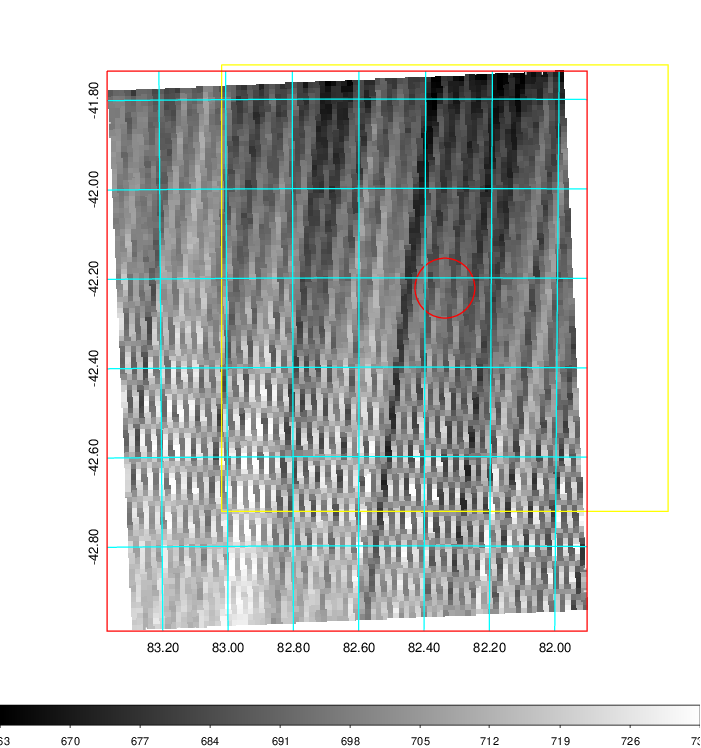
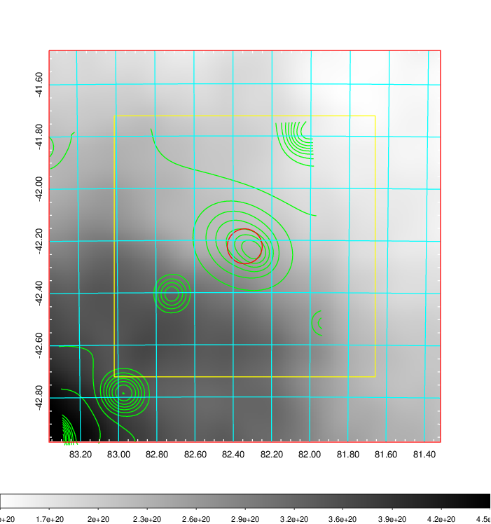
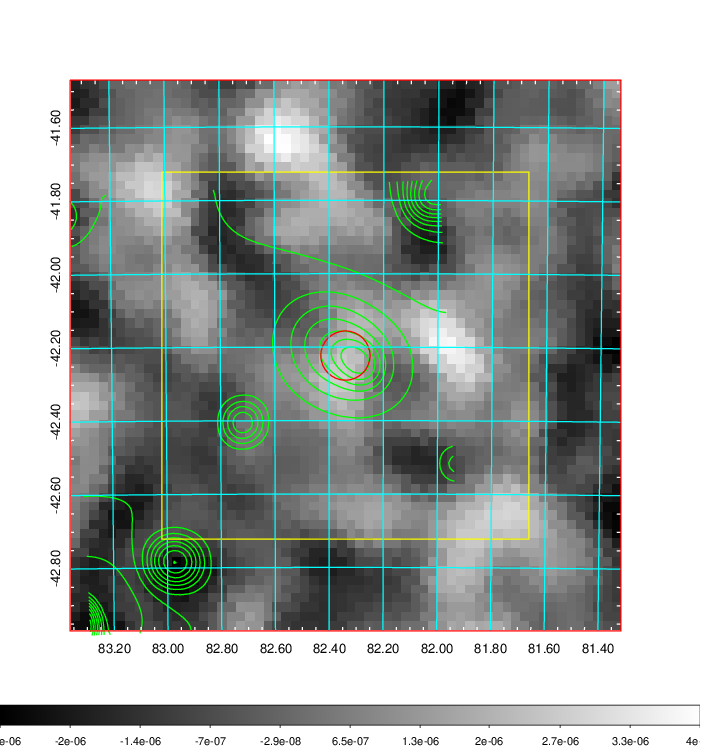
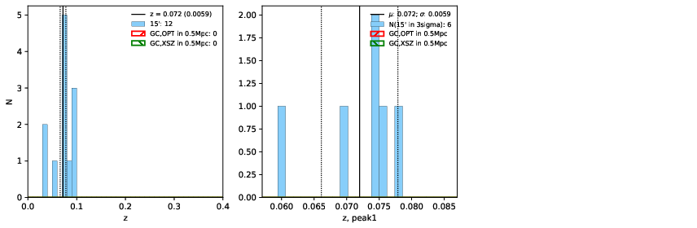
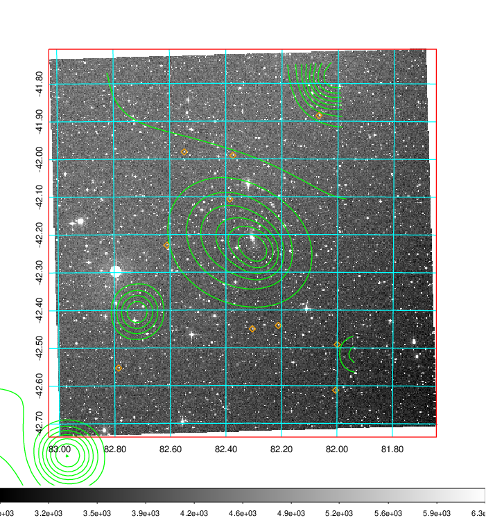
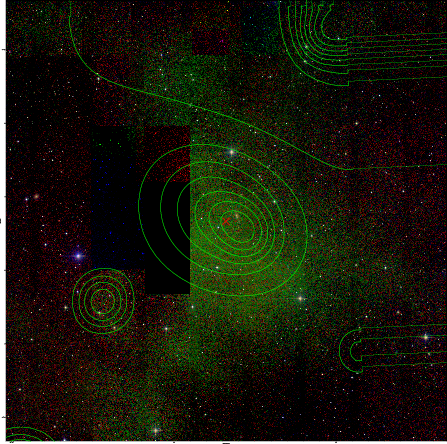
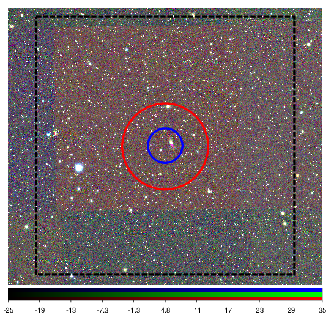

### 208

|Name|RAJ2000[deg]|DEJ2000[deg] |Ext[arcmin]| Ext,ml | z | z_src| C|GC(XSZ,Delta_z<0.01)| GC(OPT,Delta_z<0.01)|GC| R_sig[arcmin] | R500[arcmin] | R500[Mpc]| CRsig[c/s] | CR500[c/s] |L500[1E44 erg/s]|F500[1E-12 erg/s/cm^2]| M500[1E14 Msun]|Tx[keV]|Cnt_sig|Beta|Rc[arcmin]|Comment|Alias|
|---|---|---|---|---|---|------|---|--------|---------|----------|---|---|---|---|---|---|---|---|---|---|---|---|---|---|
|208| 82.340| -42.223| 4.02| 61.70| 0.0310(0.000)| -| G| -| -| -| 14.825| 13.548| 0.504| 0.136(0.035)| 0.134(0.034)| 0.043(0.008)| 1.937(0.373)| 0.37(0.04)| 1.18(0.07)| 116.7| 0.880(-0.107+0.082)| 6.189(-1.009+0.774)| $z$ of BCG| t197|

|[RASS image](../image/208/208_img.pdf)|[filtered image](../image/208/208_fil.pdf)|[Segment image](../image/208/208_seg.pdf)|
|-------------------|--------------------|-------------------|
|   |    |   |

|[Exposure image](../image/208/208_mex.pdf)| [nH image](../image/208/208_nh.pdf)| [Planck image](../image/208/208_p.pdf)|
|-------------------|--------------------|-------------------|
|   |     |  |

|[Redshift Histogram](../image/208/208_zg.pdf) | [DSS image(z1)](../image/208/208_dss_z1.pdf)      |  [DSS image(z2)](../image/208/208_dss_z2.pdf)    |
|-------------------|--------------------|-------------------|
| |  Blue circle for optical clusters;  Magenta circle for XSZ clusters;  all with r=1Mpc;  Only GC with Delta_z<0.01 are shown. |  Blue circle for optical clusters;  Magenta circle for XSZ clusters;  all with r=1Mpc;  Only GC with Delta_z<0.01 are shown.  |

|[Previous-identified clusters](../image/208/208_gc.pdf) | [2MASS image](../image/208/208_2mass.pdf)      |
|-------------------|-------------------|
|  Green, magenta, and blue circles  for optical, X-ray and SZ clusters  respectively, with redshift of clusters  labelled. The radius of circles  are 1Mpc.|  |

|[DES image](../image/208/208_des.pdf)   |
|-------------------|
|   |
