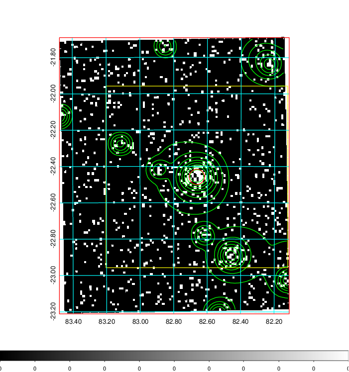
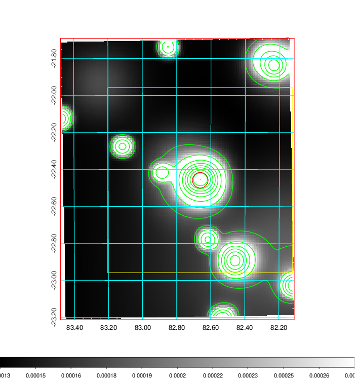
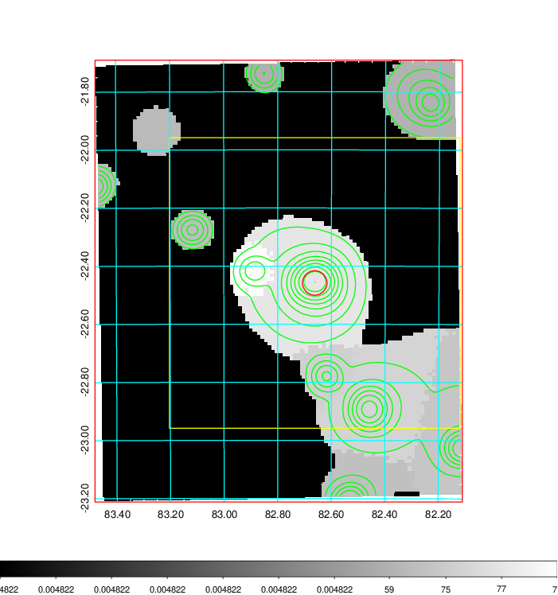
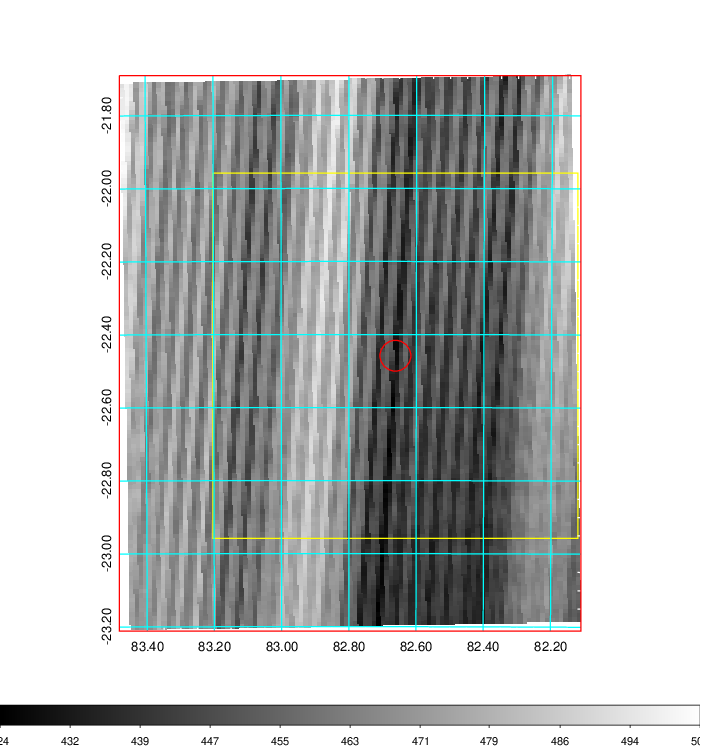
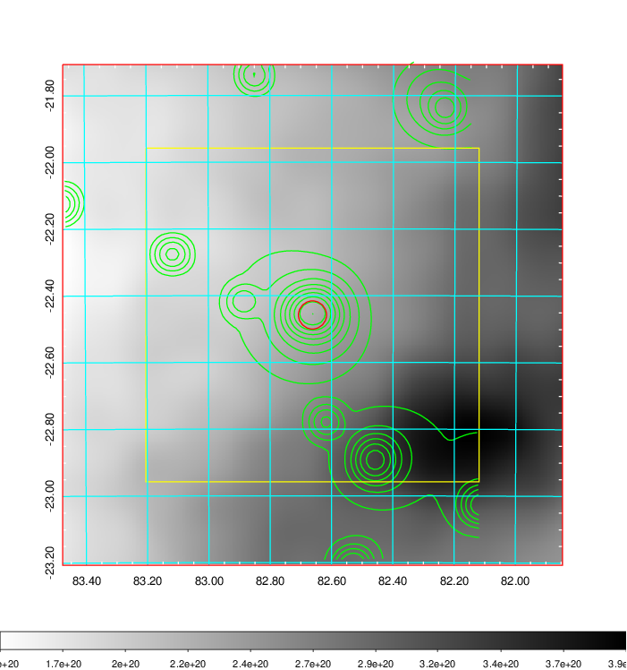
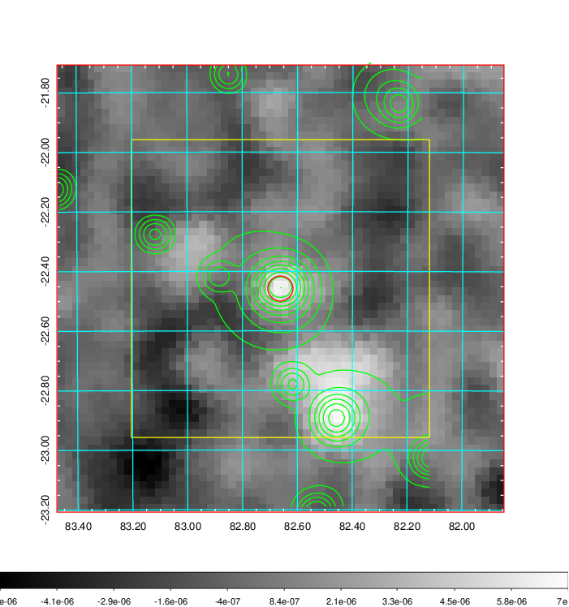
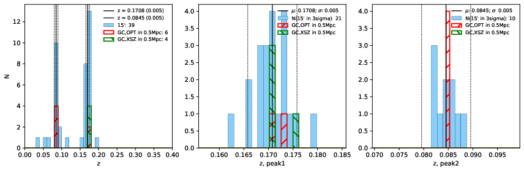
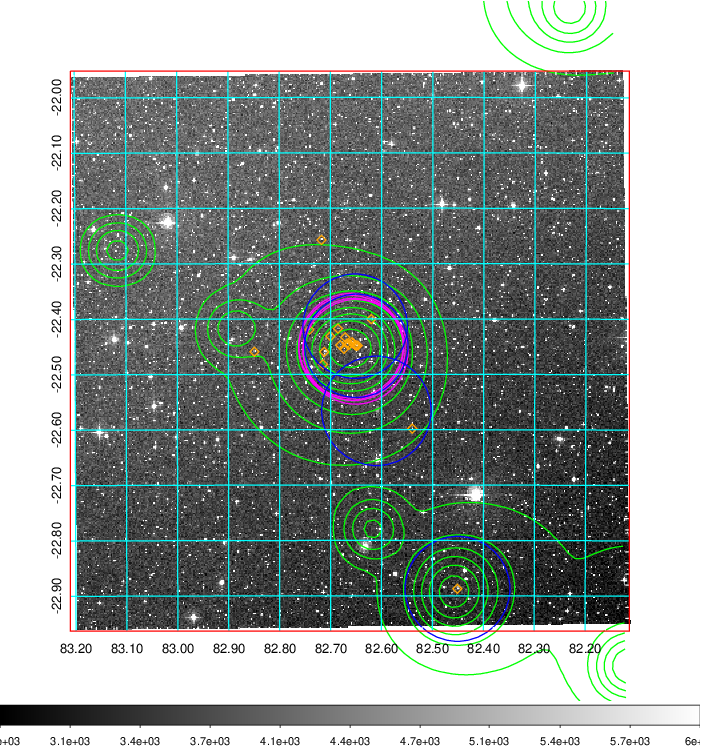
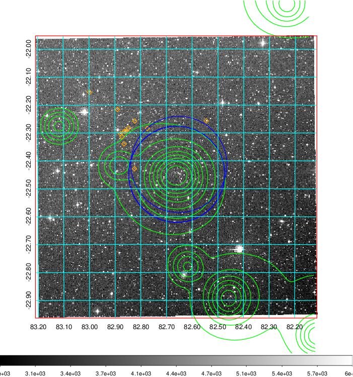
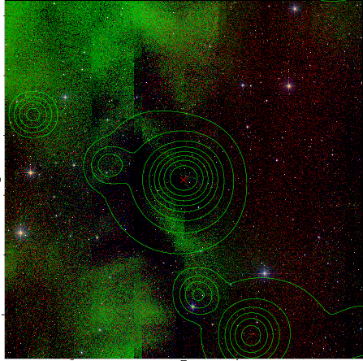

### 209

|Name|RAJ2000[deg]|DEJ2000[deg] |Ext[arcmin]| Ext,ml | z | z_src| C|GC(XSZ,Delta_z<0.01)| GC(OPT,Delta_z<0.01)|GC| R_sig[arcmin] | R500[arcmin] | R500[Mpc]| CRsig[c/s] | CR500[c/s] |L500[1E44 erg/s]|F500[1E-12 erg/s/cm^2]| M500[1E14 Msun]|Tx[keV]|Cnt_sig|Beta|Rc[arcmin]|Comment|Alias|
|---|---|---|---|---|---|------|---|--------|---------|----------|---|---|---|---|---|---|---|---|---|---|---|---|---|---|
|209| 82.662| -22.458| 2.54| 78.10| 0.1708(0.005)| z1, z_xsz| B| MCXC, PSZ2, Tar, XB| A, W| A, MCXC, N, PSZ2, Tar, W, XB| 10.750| 6.535| 1.141| 0.258(0.035)| 0.243(0.033)| 3.871(0.275)| 4.782(0.340)| 4.99(0.17)| 6.10(0.13)| 112.8| 0.809(-0.123+0.122)| 4.078(-0.921+0.797)| -| k304|

|[RASS image](../image/209/209_img.pdf)|[filtered image](../image/209/209_fil.pdf)|[Segment image](../image/209/209_seg.pdf)|
|-------------------|--------------------|-------------------|
|   |    |   |

|[Exposure image](../image/209/209_mex.pdf)| [nH image](../image/209/209_nh.pdf)| [Planck image](../image/209/209_p.pdf)|
|-------------------|--------------------|-------------------|
|   |     |  |

|[Redshift Histogram](../image/209/209_zg.pdf) | [DSS image(z1)](../image/209/209_dss_z1.pdf)      |  [DSS image(z2)](../image/209/209_dss_z2.pdf)    |
|-------------------|--------------------|-------------------|
| |  Blue circle for optical clusters;  Magenta circle for XSZ clusters;  all with r=1Mpc;  Only GC with Delta_z<0.01 are shown. |  Blue circle for optical clusters;  Magenta circle for XSZ clusters;  all with r=1Mpc;  Only GC with Delta_z<0.01 are shown.  |

|[known Abell/XSZ clusters](../image/209/209_gc.pdf) | [2MASS image](../image/209/209_2mass.pdf)      |
|-------------------|-------------------|
|  Magenta, blue and green circles  for optical, X-ray and SZ clusters  respectively, with redshift of clusters  labelled. The radius of circles  are 1Mpc.|  |

|[DES image](../image/209/209_des.pdf)   |[PS1 image](../image/209/209_ps1.pdf)            |
|-------------------|-------------------|
|   |   |
