

### 21

|Name|RAJ2000[deg]|DEJ2000[deg] |Ext[arcmin]| Ext,ml | z | z_src| C|GC(XSZ,Delta_z<0.01)| GC(OPT,Delta_z<0.01)|GC| R_sig[arcmin] | R500[arcmin] | R500[Mpc]| CRsig[c/s] | CR500[c/s] |L500[1E44 erg/s]|F500[1E-12 erg/s/cm^2]| M500[1E14 Msun]|Tx[keV]|Cnt_sig|Beta|Rc[arcmin]|Comment|Alias|
|---|---|---|---|---|---|------|---|--------|---------|----------|---|---|---|---|---|---|---|---|---|---|---|---|---|---|
|21| 5.329| 22.326| 11.32| 117.95| 0.0190(0.005)| z1, z_opt| S| -| N| C, F20, N, SPI, W| 29.638| 23.452| 0.542| 0.484(0.085)| 0.468(0.082)| 0.056(0.007)| 6.860(0.914)| 0.46(0.03)| 1.34(0.06)| 146.4| 0.920(-0.093+0.058)| 14.653(-1.534+1.113)| -| t475|

|[RASS image](../image/21/21_img.pdf)|[filtered image](../image/21/21_fil.pdf)|[Segment image](../image/21/21_seg.pdf)|
|-------------------|--------------------|-------------------|
| 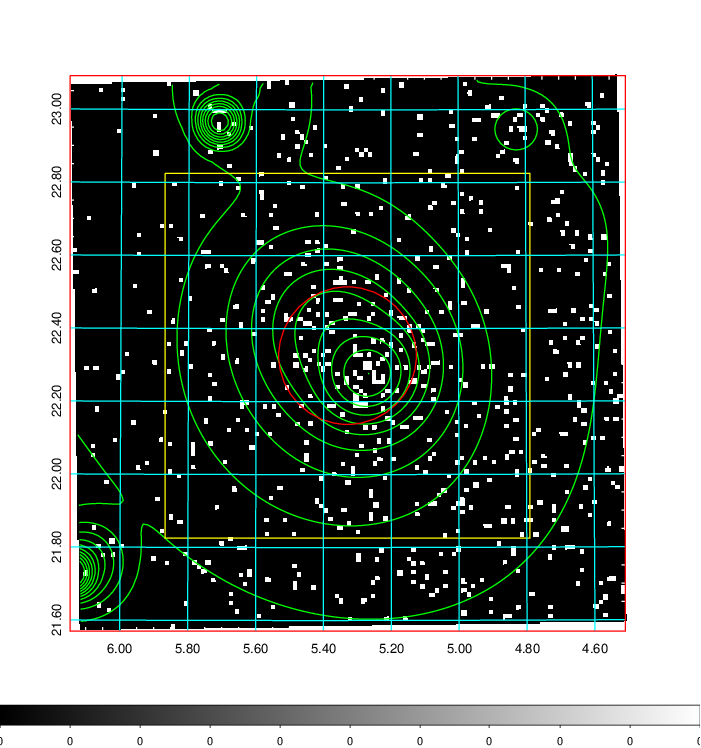  | 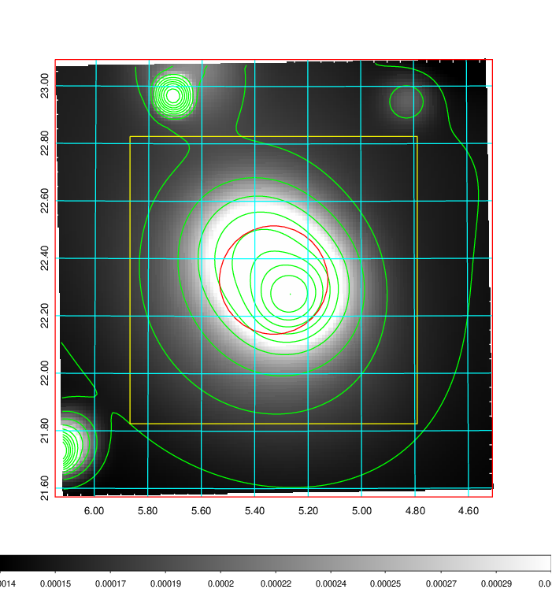   | 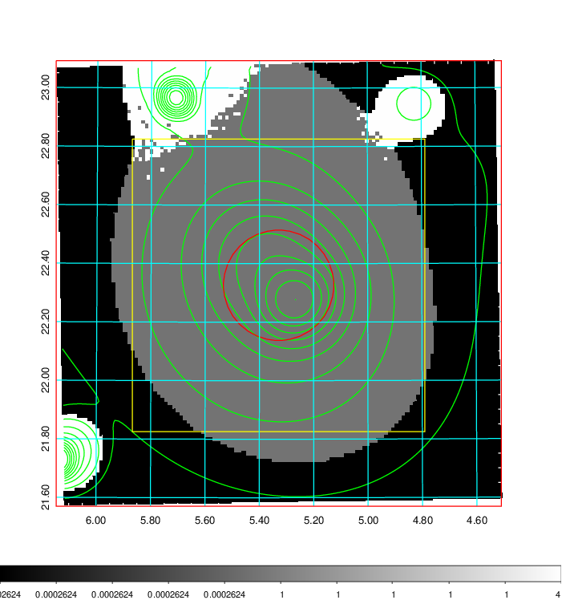  |

|[Exposure image](../image/21/21_mex.pdf)| [nH image](../image/21/21_nh.pdf)| [Planck image](../image/21/21_p.pdf)|
|-------------------|--------------------|-------------------|
|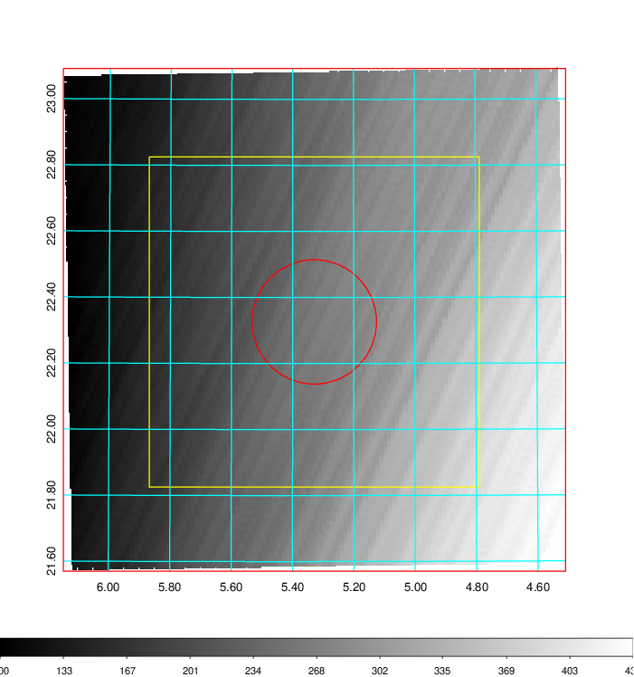   | 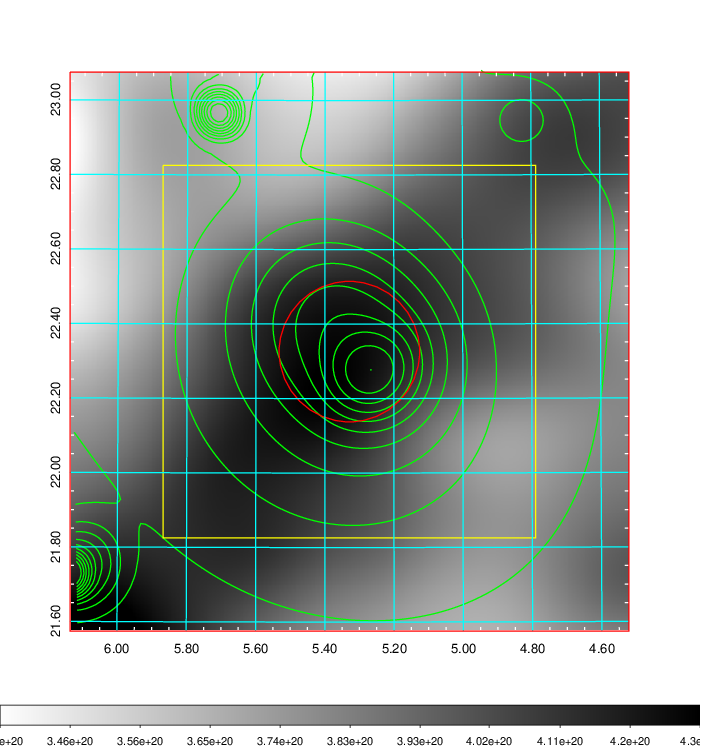    | 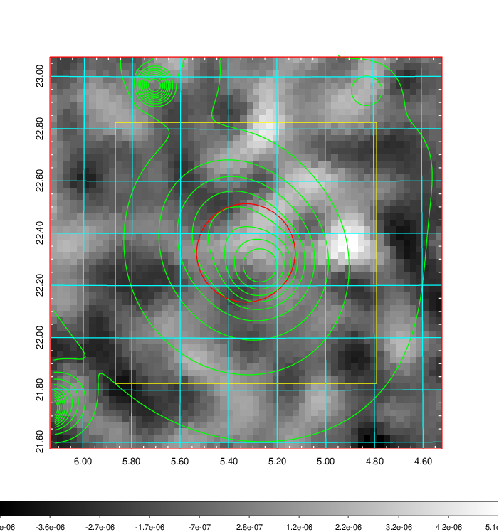 |

|[Redshift Histogram](../image/21/21_zg.pdf) | [DSS image(z1)](../image/21/21_dss_z1.pdf)      |  [DSS image(z2)](../image/21/21_dss_z2.pdf)    |
|-------------------|--------------------|-------------------|
|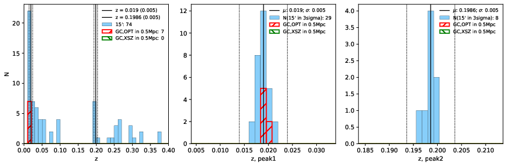 |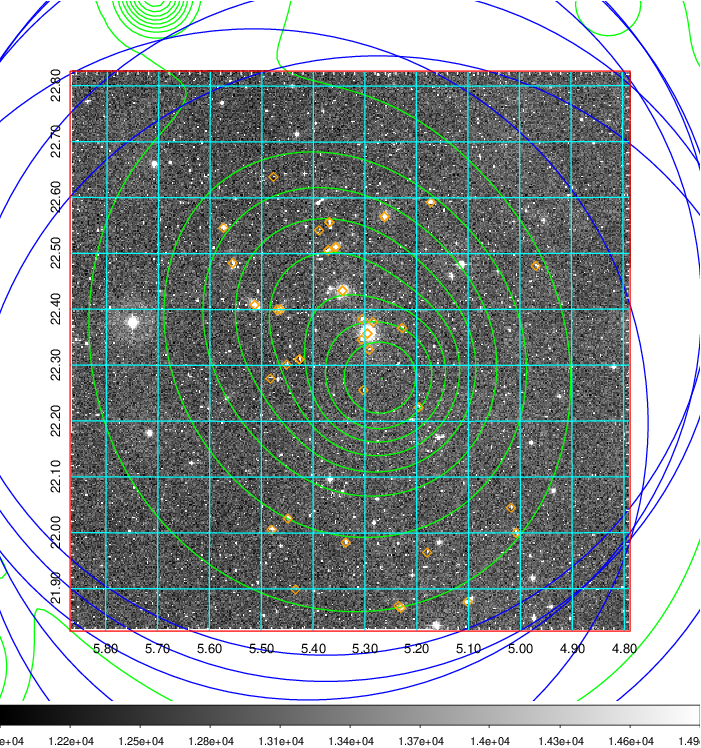  Blue circle for optical clusters;  Magenta circle for XSZ clusters;  all with r=1Mpc;  Only GC with Delta_z<0.01 are shown. | 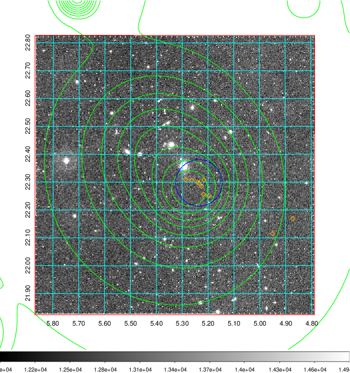 Blue circle for optical clusters;  Magenta circle for XSZ clusters;  all with r=1Mpc;  Only GC with Delta_z<0.01 are shown.  |

|[Previous-identified clusters](../image/21/21_gc.pdf) | [2MASS image](../image/21/21_2mass.pdf)      |[SDSS image](../image/21/21_sdss.pdf)   |
|-------------------|-------------------|-------------------|
|  Green, magenta, and blue circles  for optical, X-ray and SZ clusters  respectively, with redshift of clusters  labelled. The radius of circles  are 1Mpc.|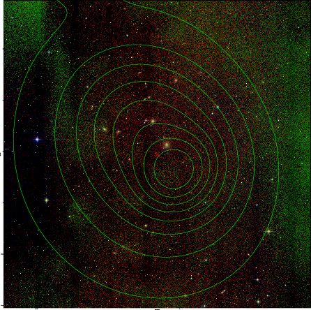  | 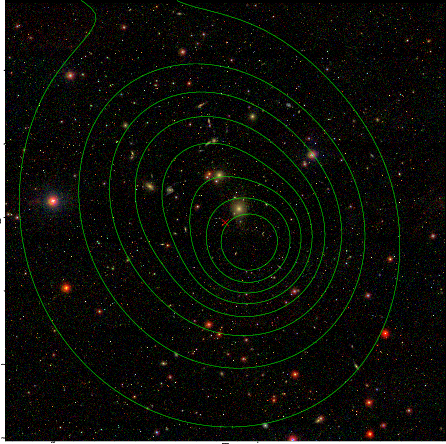  |

