

### 210

|Name|RAJ2000[deg]|DEJ2000[deg] |Ext[arcmin]| Ext,ml | z | z_src| C|GC(XSZ,Delta_z<0.01)| GC(OPT,Delta_z<0.01)|GC| R_sig[arcmin] | R500[arcmin] | R500[Mpc]| CRsig[c/s] | CR500[c/s] |L500[1E44 erg/s]|F500[1E-12 erg/s/cm^2]| M500[1E14 Msun]|Tx[keV]|Cnt_sig|Beta|Rc[arcmin]|Comment|Alias|
|---|---|---|---|---|---|------|---|--------|---------|----------|---|---|---|---|---|---|---|---|---|---|---|---|---|---|
|210| 82.874| -55.344| 4.87| 28.15| 0.2977(0.000)| -| G| -| -| N, PSZ2, Tar, W| 24.206| 3.537| 0.940| 0.042(0.041)| 0.036(0.036)| 1.954(1.418)| 0.690(0.500)| 3.21(1.10)| 4.85(1.06)| 127.6| 0.934(-0.086+0.048)| 6.852(-0.832+0.756)| An SZ cluster with $z$ = 0.3 and offset = 0.75 Mpc| k518|

|[RASS image](../image/210/210_img.pdf)|[filtered image](../image/210/210_fil.pdf)|[Segment image](../image/210/210_seg.pdf)|
|-------------------|--------------------|-------------------|
| 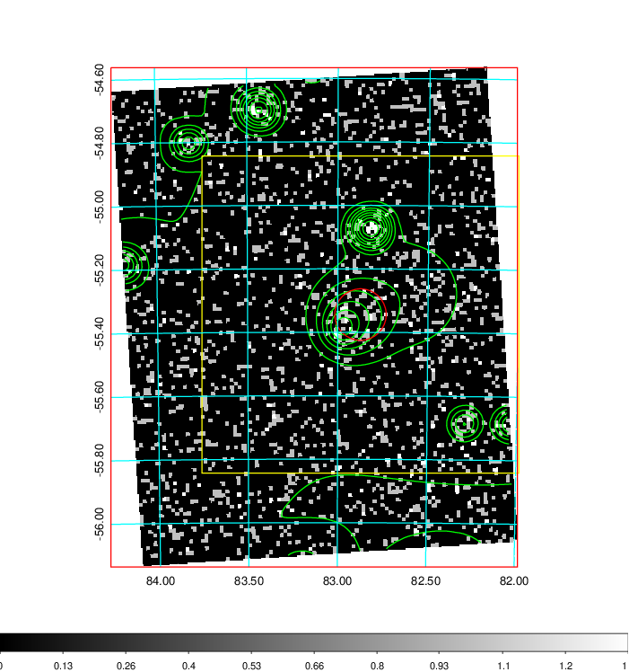  | 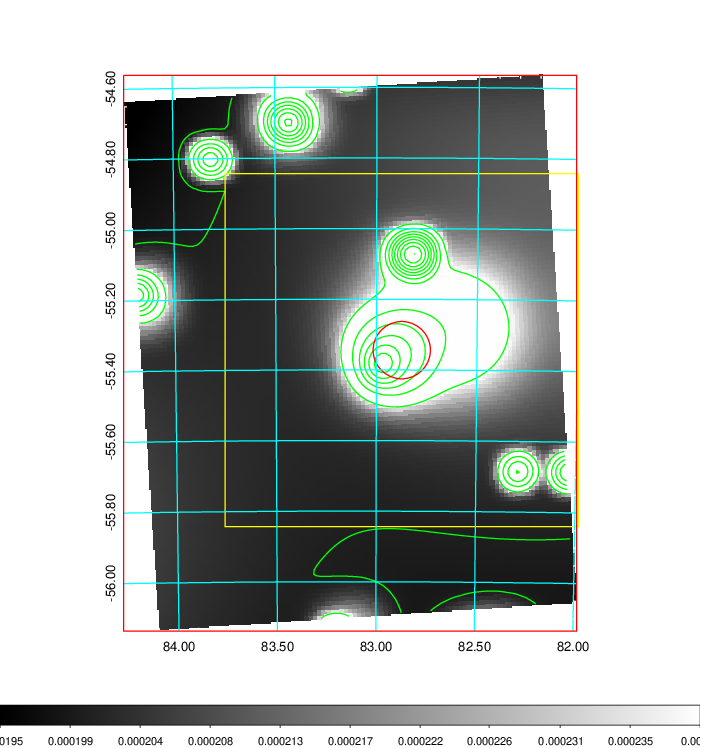   | 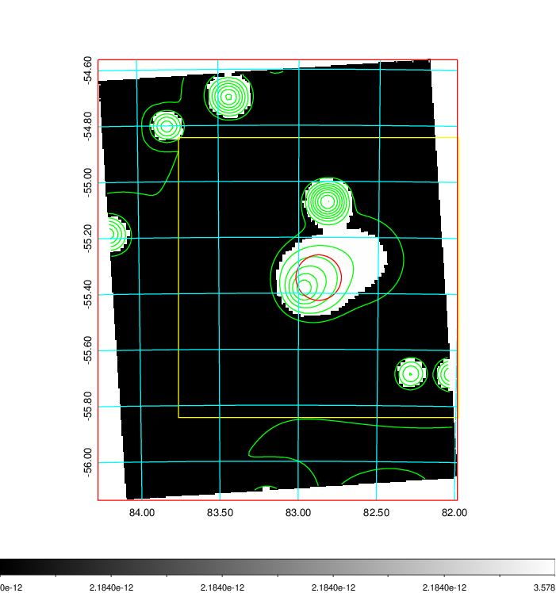  |

|[Exposure image](../image/210/210_mex.pdf)| [nH image](../image/210/210_nh.pdf)| [Planck image](../image/210/210_p.pdf)|
|-------------------|--------------------|-------------------|
|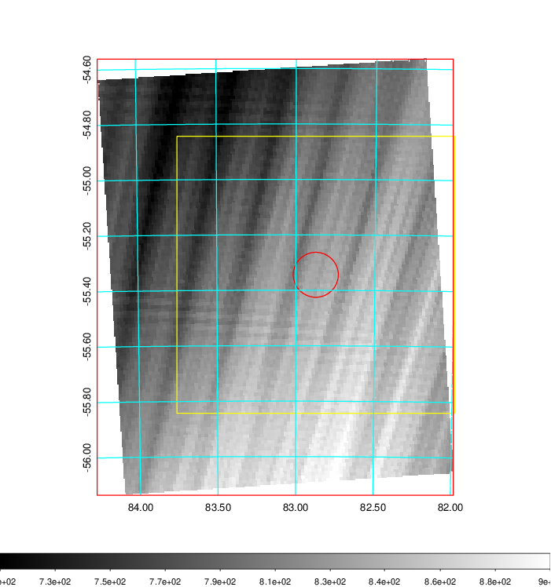   | 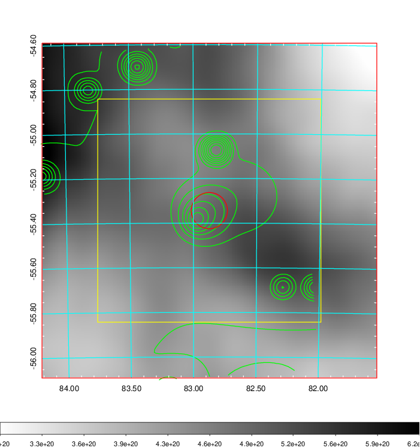    | 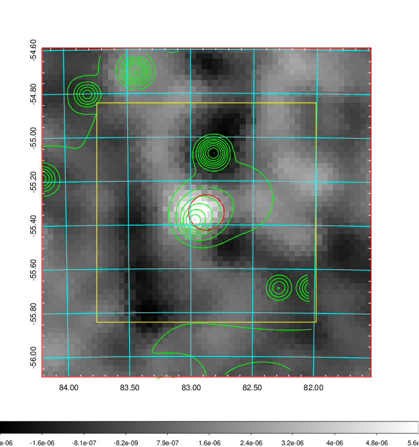 |

|[Redshift Histogram](../image/210/210_zg.pdf) | [DSS image(z1)](../image/210/210_dss_z1.pdf)      |  [DSS image(z2)](../image/210/210_dss_z2.pdf)    |
|-------------------|--------------------|-------------------|
|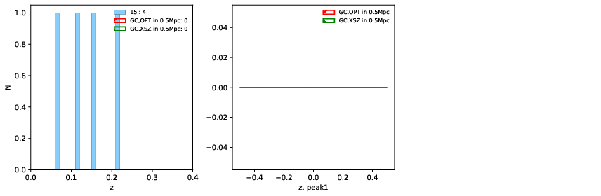 |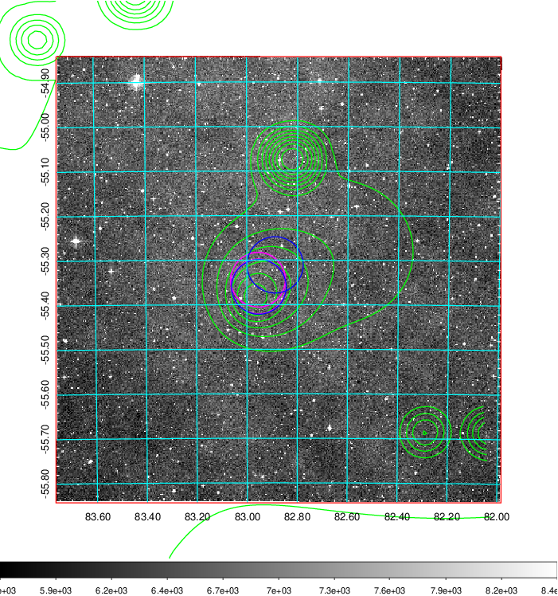  Blue circle for optical clusters;  Magenta circle for XSZ clusters;  all with r=1Mpc;  Only GC with Delta_z<0.01 are shown. | 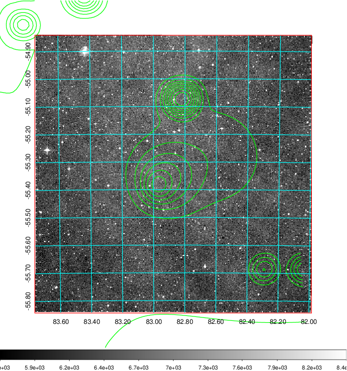 Blue circle for optical clusters;  Magenta circle for XSZ clusters;  all with r=1Mpc;  Only GC with Delta_z<0.01 are shown.  |

|[Previous-identified clusters](../image/210/210_gc.pdf) | [2MASS image](../image/210/210_2mass.pdf)      |
|-------------------|-------------------|
|  Green, magenta, and blue circles  for optical, X-ray and SZ clusters  respectively, with redshift of clusters  labelled. The radius of circles  are 1Mpc.|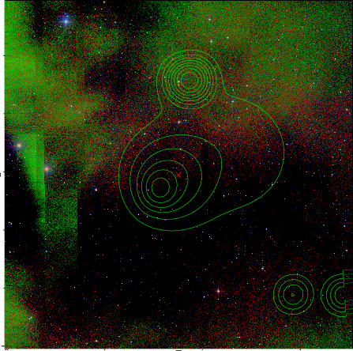  |

|[DES image](../image/210/210_des.pdf)   |
|-------------------|
| 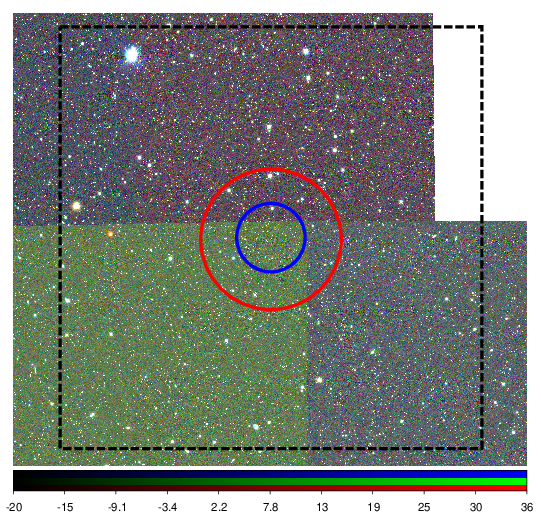  |
