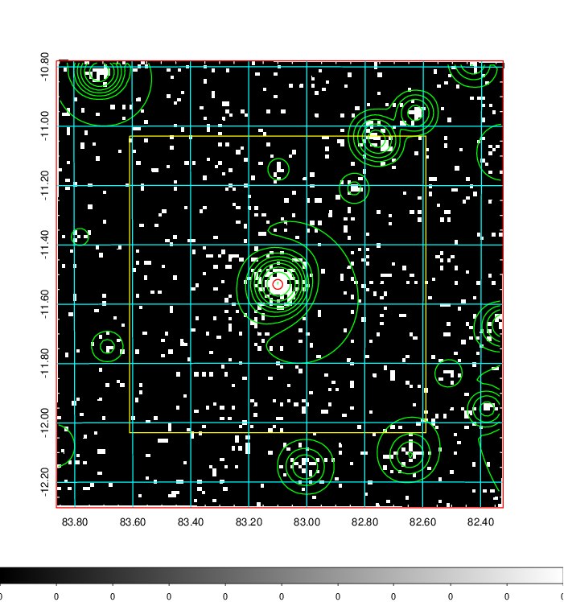
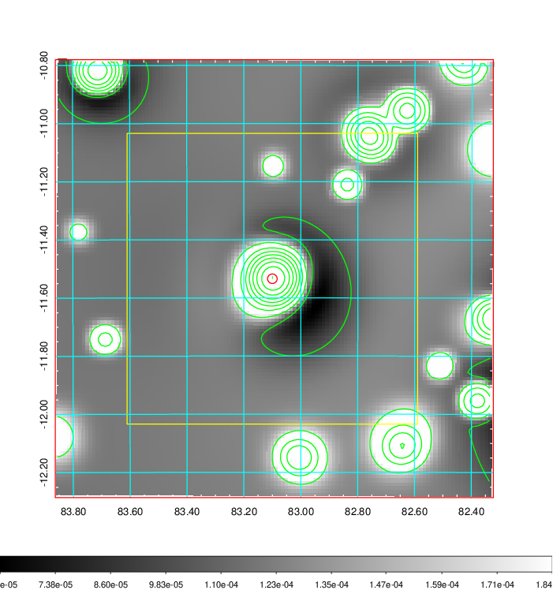
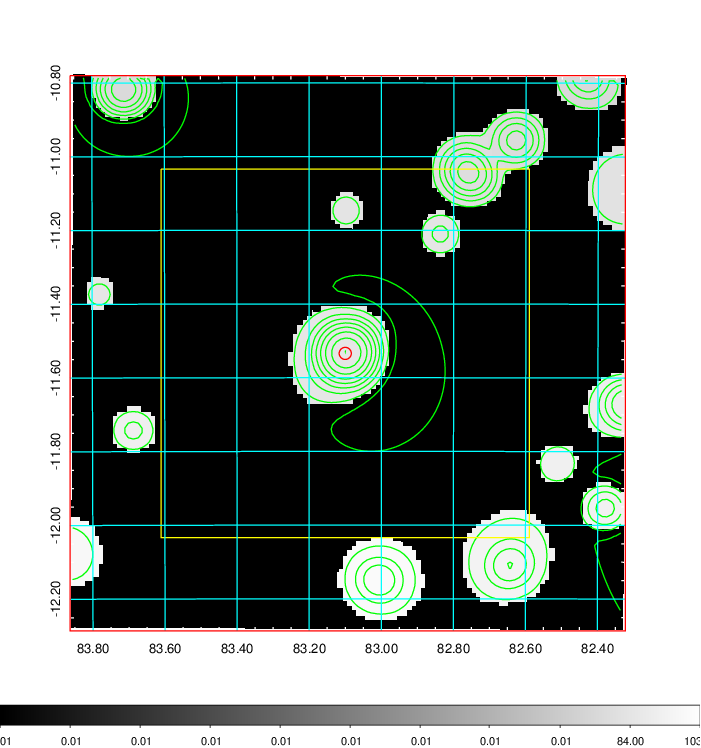
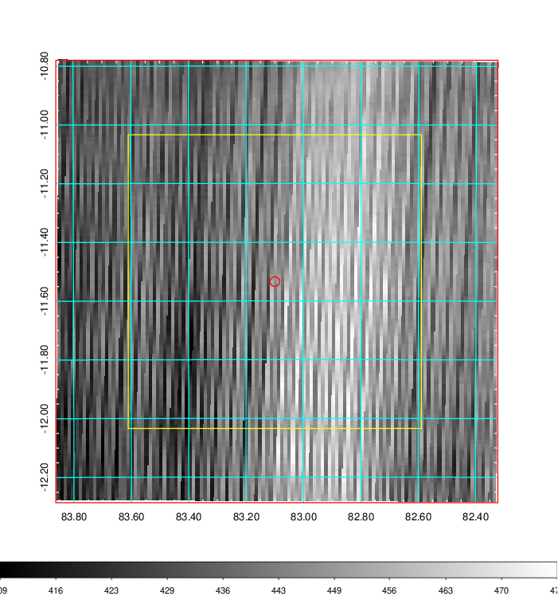
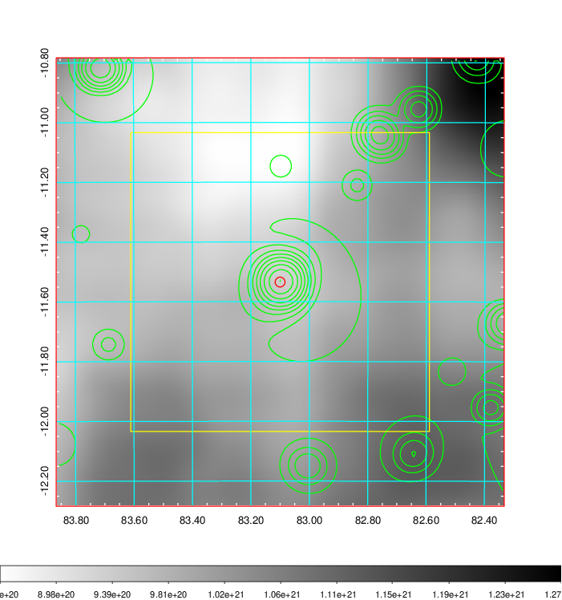
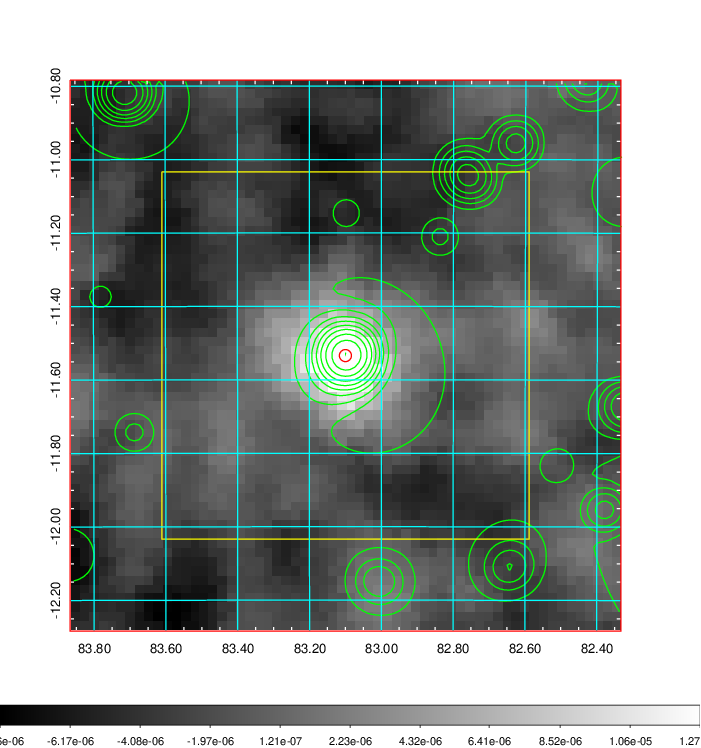
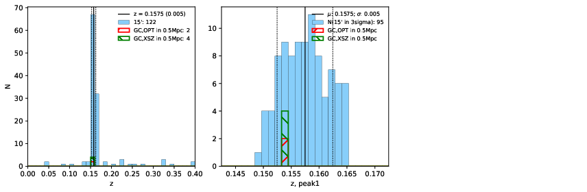
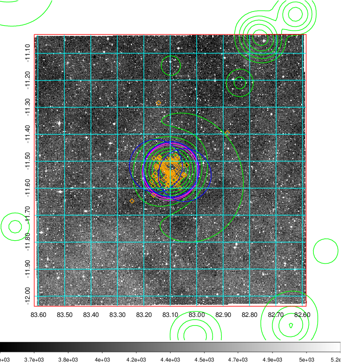
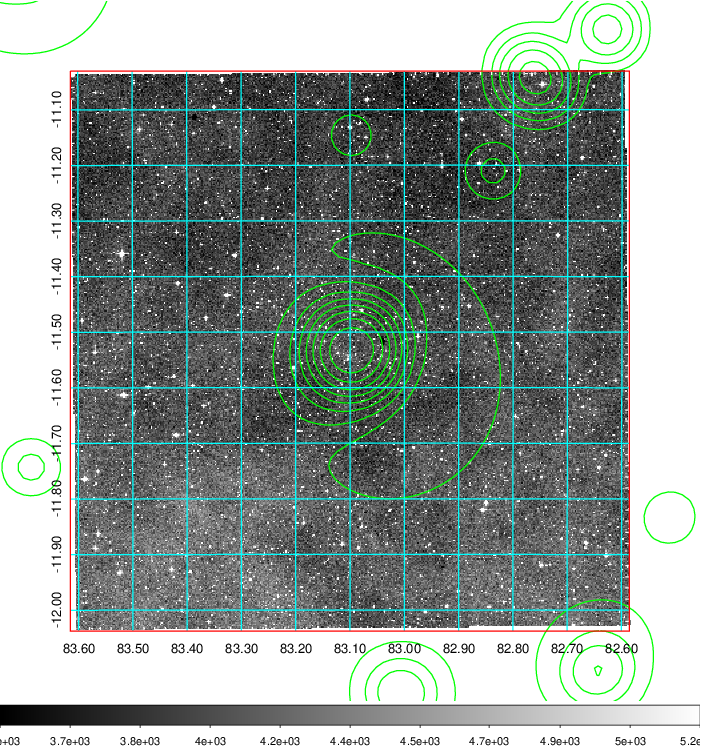
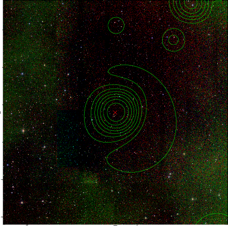

### 211

|Name|RAJ2000[deg]|DEJ2000[deg] |Ext[arcmin]| Ext,ml | z | z_src| C|GC(XSZ,Delta_z<0.01)| GC(OPT,Delta_z<0.01)|GC| R_sig[arcmin] | R500[arcmin] | R500[Mpc]| CRsig[c/s] | CR500[c/s] |L500[1E44 erg/s]|F500[1E-12 erg/s/cm^2]| M500[1E14 Msun]|Tx[keV]|Cnt_sig|Beta|Rc[arcmin]|Comment|Alias|
|---|---|---|---|---|---|------|---|--------|---------|----------|---|---|---|---|---|---|---|---|---|---|---|---|---|---|
|211| 83.100| -11.534| 0.99| 46.83| 0.1575(0.005)| z1, z_xsz| B| MCXC, PSZ2, Tar, XB| A| A, MCXC, PSZ2, Tar, W, XB| 12.700| 7.664| 1.252| 0.401(0.038)| 0.377(0.036)| 4.570(0.144)| 6.749(0.212)| 6.51(0.10)| 7.15(0.07)| 161.1| 0.713(-0.082+0.119)| 2.198(-0.545+0.653)| -| k032|

|[RASS image](../image/211/211_img.pdf)|[filtered image](../image/211/211_fil.pdf)|[Segment image](../image/211/211_seg.pdf)|
|-------------------|--------------------|-------------------|
|   |    |   |

|[Exposure image](../image/211/211_mex.pdf)| [nH image](../image/211/211_nh.pdf)| [Planck image](../image/211/211_p.pdf)|
|-------------------|--------------------|-------------------|
|   |     |  |

|[Redshift Histogram](../image/211/211_zg.pdf) | [DSS image(z1)](../image/211/211_dss_z1.pdf)      |  [DSS image(z2)](../image/211/211_dss_z2.pdf)    |
|-------------------|--------------------|-------------------|
| |  Blue circle for optical clusters;  Magenta circle for XSZ clusters;  all with r=1Mpc;  Only GC with Delta_z<0.01 are shown. |  Blue circle for optical clusters;  Magenta circle for XSZ clusters;  all with r=1Mpc;  Only GC with Delta_z<0.01 are shown.  |

|[known Abell/XSZ clusters](../image/211/211_gc.pdf) | [2MASS image](../image/211/211_2mass.pdf)      |
|-------------------|-------------------|
|  Magenta, blue and green circles  for optical, X-ray and SZ clusters  respectively, with redshift of clusters  labelled. The radius of circles  are 1Mpc.|  |

|[PS1 image](../image/211/211_ps1.pdf)            |
|-------------------|
|   |
