

### 213

|Name|RAJ2000[deg]|DEJ2000[deg] |Ext[arcmin]| Ext,ml | z | z_src| C|GC(XSZ,Delta_z<0.01)| GC(OPT,Delta_z<0.01)|GC| R_sig[arcmin] | R500[arcmin] | R500[Mpc]| CRsig[c/s] | CR500[c/s] |L500[1E44 erg/s]|F500[1E-12 erg/s/cm^2]| M500[1E14 Msun]|Tx[keV]|Cnt_sig|Beta|Rc[arcmin]|Comment|Alias|
|---|---|---|---|---|---|------|---|--------|---------|----------|---|---|---|---|---|---|---|---|---|---|---|---|---|---|
|213| 83.641| -30.490| 15.20| 34.81| 0.0358(0.005)| z1,| G| -| -| N, W| 13.188| 11.792| 0.504| 0.103(0.031)| 0.101(0.030)| 0.044(0.014)| 1.477(0.456)| 0.38(0.06)| 1.18(0.12)| 48.3| 0.785(-0.171+0.150)| 7.227(-1.813+1.440)| -| t535|

|[RASS image](../image/213/213_img.pdf)|[filtered image](../image/213/213_fil.pdf)|[Segment image](../image/213/213_seg.pdf)|
|-------------------|--------------------|-------------------|
| 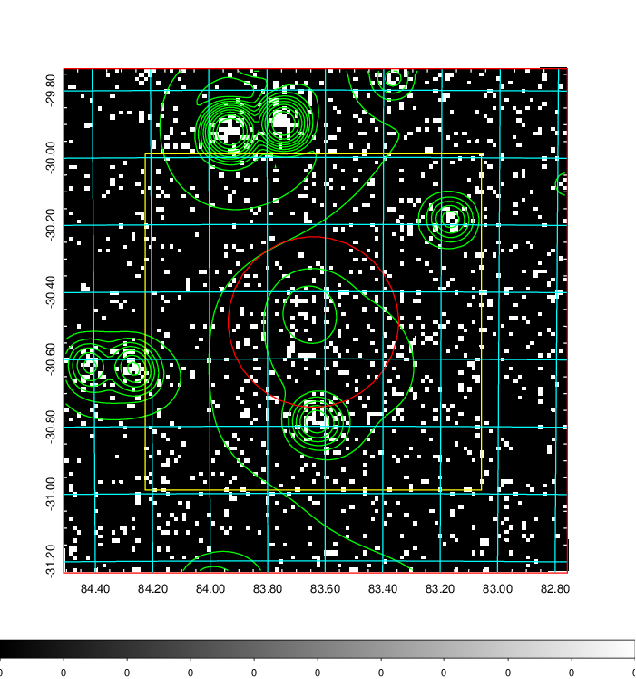  | 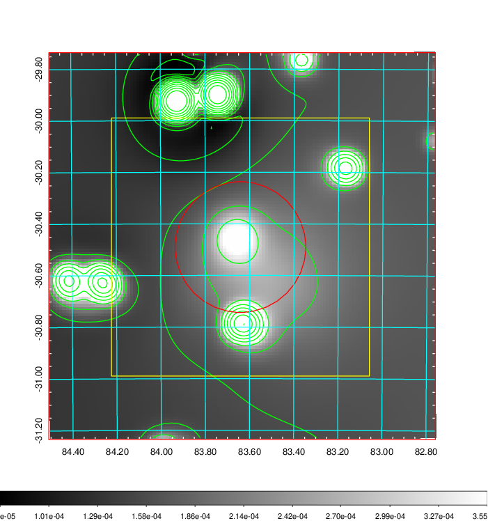   | 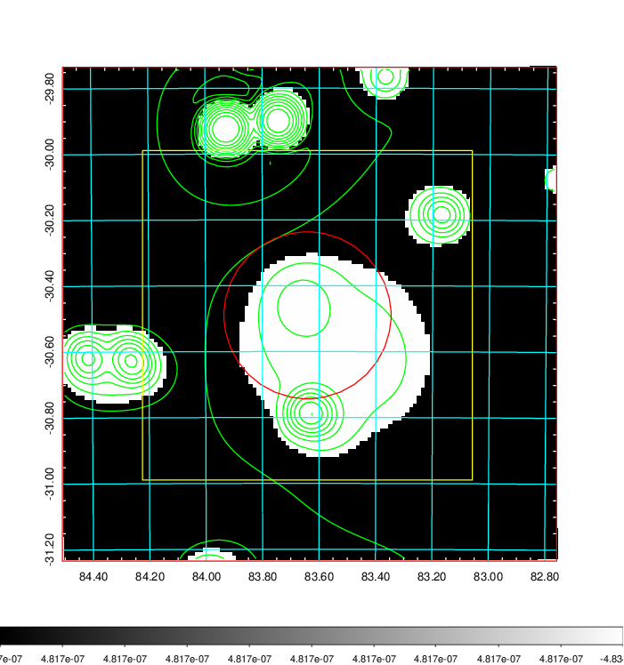  |

|[Exposure image](../image/213/213_mex.pdf)| [nH image](../image/213/213_nh.pdf)| [Planck image](../image/213/213_p.pdf)|
|-------------------|--------------------|-------------------|
|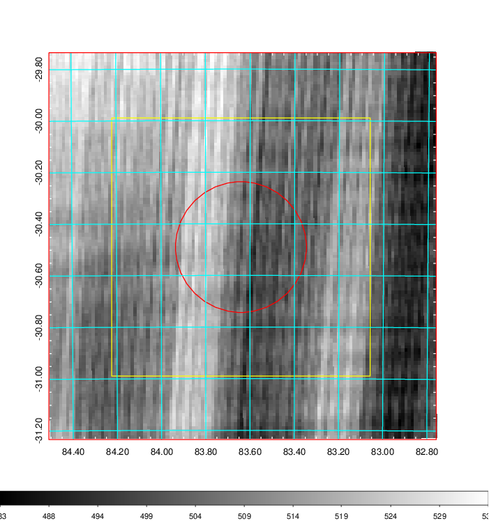   | 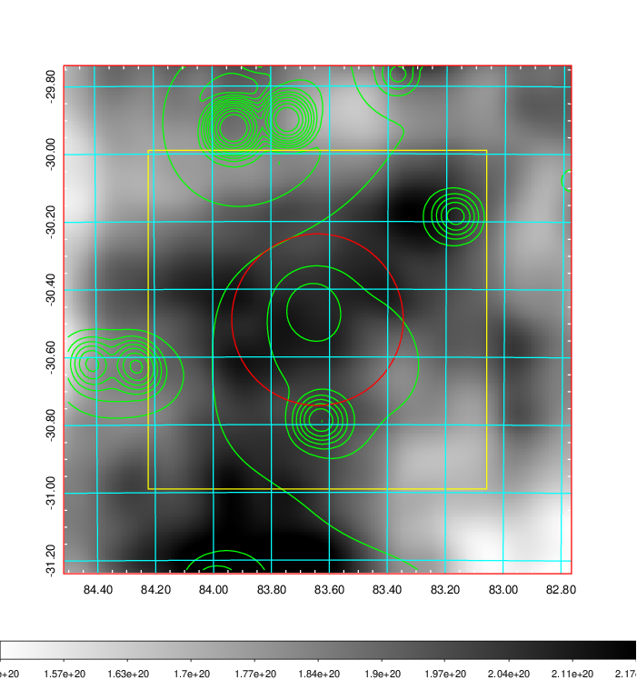    | 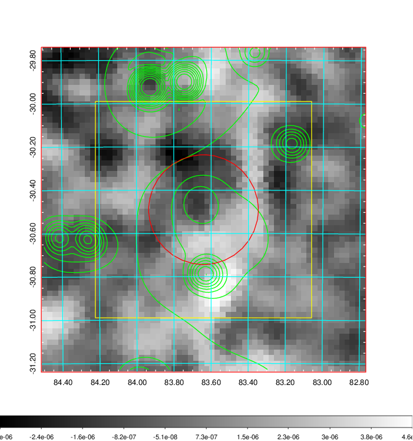 |

|[Redshift Histogram](../image/213/213_zg.pdf) | [DSS image(z1)](../image/213/213_dss_z1.pdf)      |  [DSS image(z2)](../image/213/213_dss_z2.pdf)    |
|-------------------|--------------------|-------------------|
|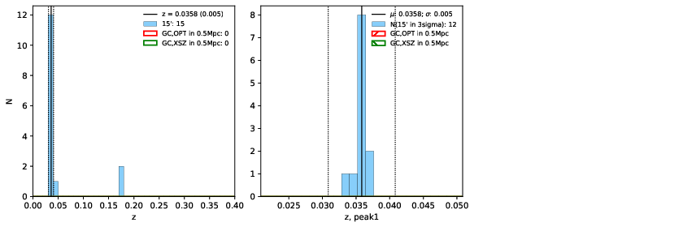 |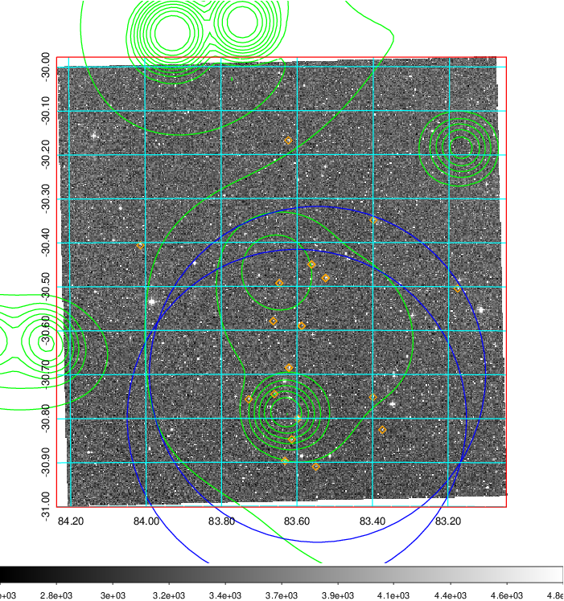  Blue circle for optical clusters;  Magenta circle for XSZ clusters;  all with r=1Mpc;  Only GC with Delta_z<0.01 are shown. | 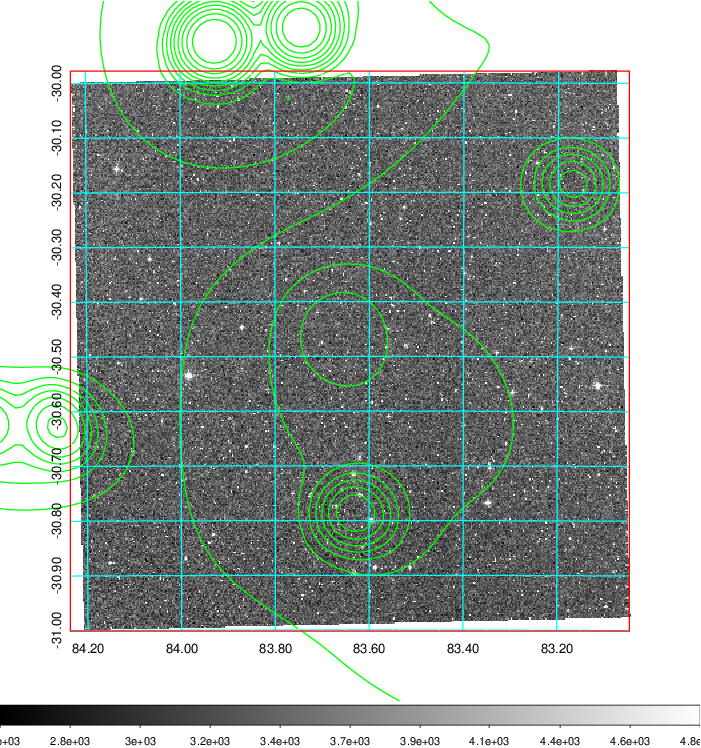 Blue circle for optical clusters;  Magenta circle for XSZ clusters;  all with r=1Mpc;  Only GC with Delta_z<0.01 are shown.  |

|[Previous-identified clusters](../image/213/213_gc.pdf) | [2MASS image](../image/213/213_2mass.pdf)      |
|-------------------|-------------------|
|  Green, magenta, and blue circles  for optical, X-ray and SZ clusters  respectively, with redshift of clusters  labelled. The radius of circles  are 1Mpc.|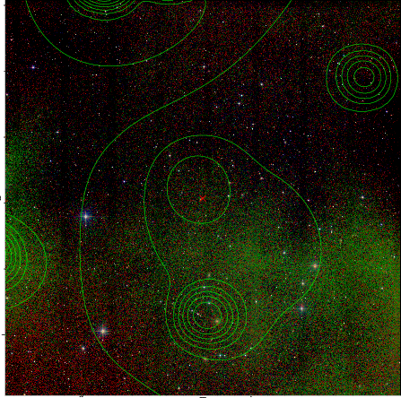  |

|[DES image](../image/213/213_des.pdf)   |[PS1 image](../image/213/213_ps1.pdf)            |
|-------------------|-------------------|
| 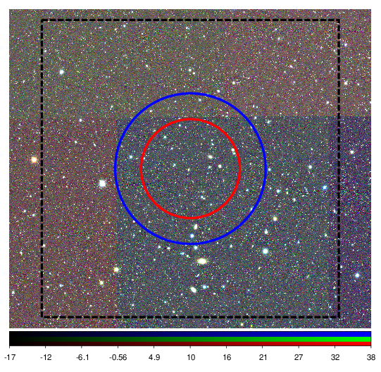  | 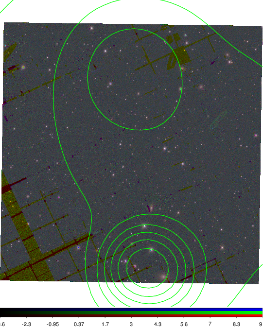  |
