

### 214

|Name|RAJ2000[deg]|DEJ2000[deg] |Ext[arcmin]| Ext,ml | z | z_src| C|GC(XSZ,Delta_z<0.01)| GC(OPT,Delta_z<0.01)|GC| R_sig[arcmin] | R500[arcmin] | R500[Mpc]| CRsig[c/s] | CR500[c/s] |L500[1E44 erg/s]|F500[1E-12 erg/s/cm^2]| M500[1E14 Msun]|Tx[keV]|Cnt_sig|Beta|Rc[arcmin]|Comment|Alias|
|---|---|---|---|---|---|------|---|--------|---------|----------|---|---|---|---|---|---|---|---|---|---|---|---|---|---|
|214| 83.759| -38.129| 4.73| 29.15| 0.0757(0.005)| z1, z_opt| S| -| A| A, N| 22.231| 7.072| 0.609| 0.061(0.047)| 0.055(0.043)| 0.135(0.081)| 0.959(0.577)| 0.69(0.21)| 1.75(0.34)| 106.4| 0.849(-0.164+0.108)| 4.002(-1.221+0.914)| -| t248|

|[RASS image](../image/214/214_img.pdf)|[filtered image](../image/214/214_fil.pdf)|[Segment image](../image/214/214_seg.pdf)|
|-------------------|--------------------|-------------------|
| 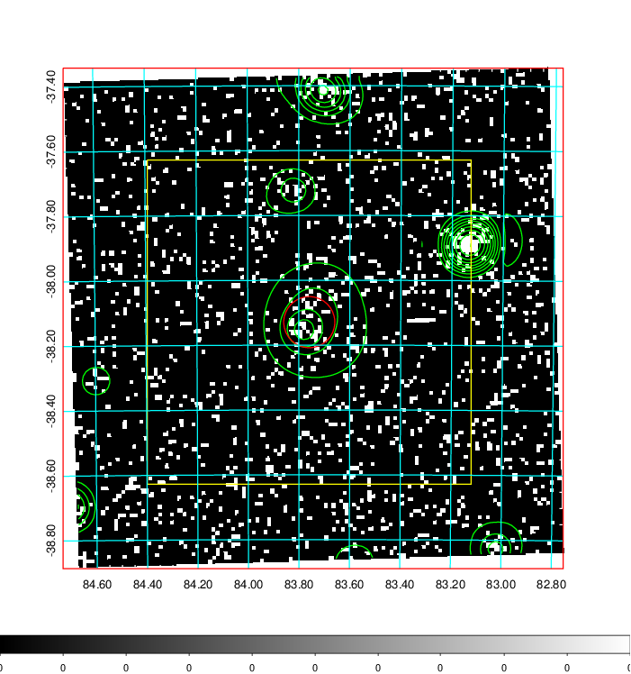  | 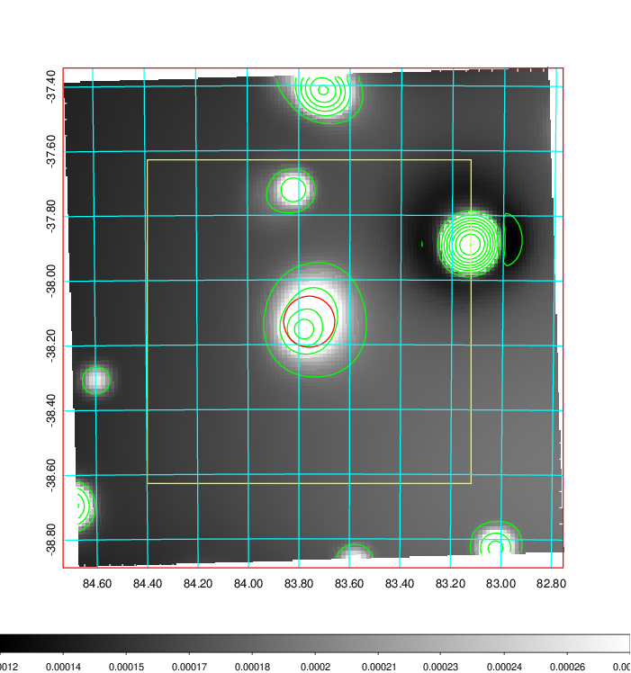   | 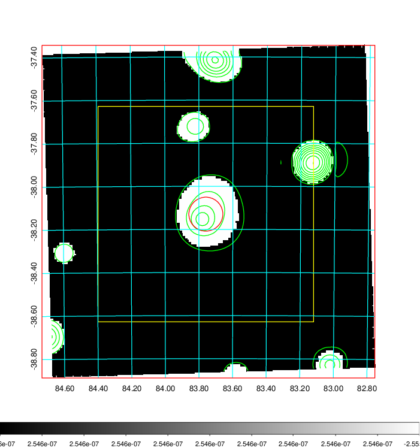  |

|[Exposure image](../image/214/214_mex.pdf)| [nH image](../image/214/214_nh.pdf)| [Planck image](../image/214/214_p.pdf)|
|-------------------|--------------------|-------------------|
|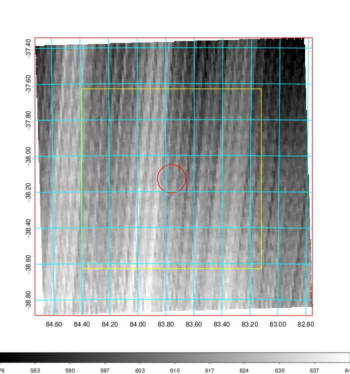   | 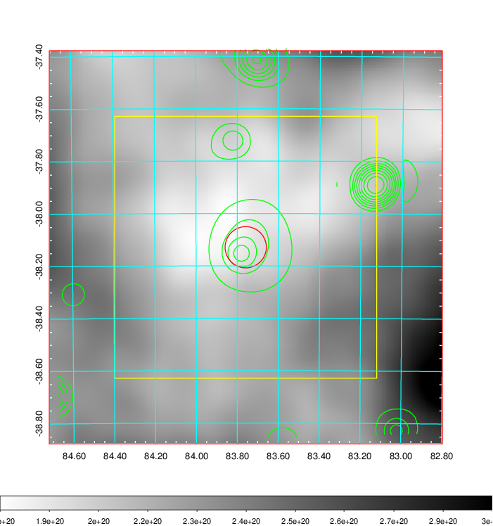    | 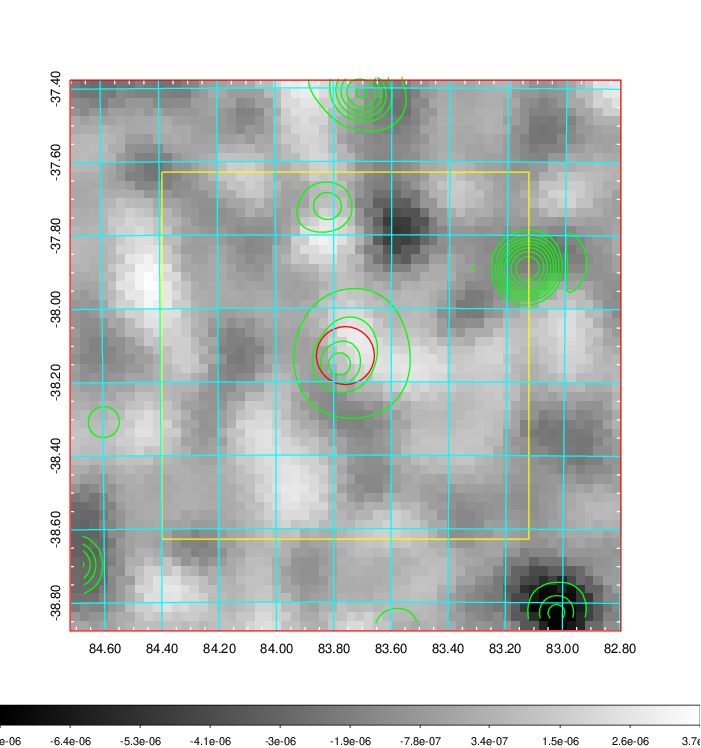 |

|[Redshift Histogram](../image/214/214_zg.pdf) | [DSS image(z1)](../image/214/214_dss_z1.pdf)      |  [DSS image(z2)](../image/214/214_dss_z2.pdf)    |
|-------------------|--------------------|-------------------|
|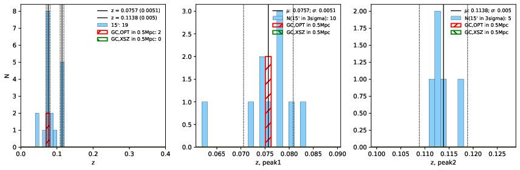 |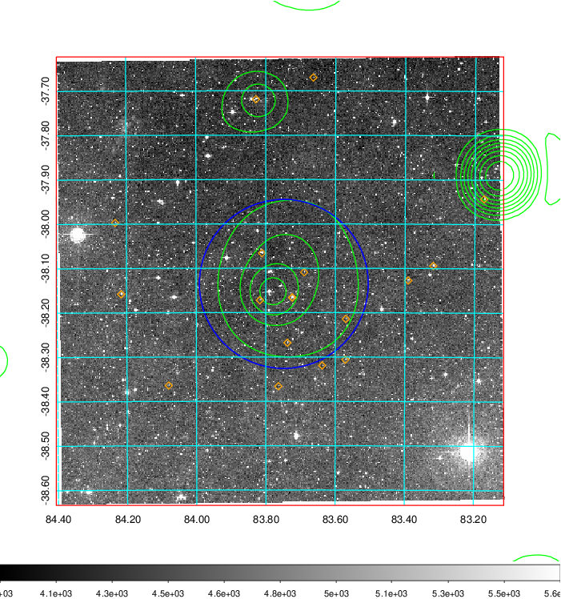  Blue circle for optical clusters;  Magenta circle for XSZ clusters;  all with r=1Mpc;  Only GC with Delta_z<0.01 are shown. | 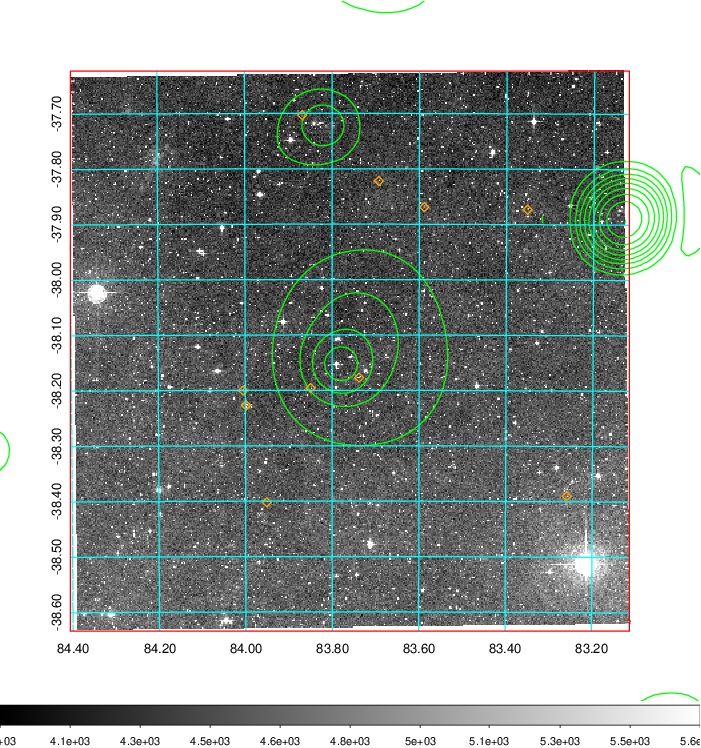 Blue circle for optical clusters;  Magenta circle for XSZ clusters;  all with r=1Mpc;  Only GC with Delta_z<0.01 are shown.  |

|[Previous-identified clusters](../image/214/214_gc.pdf) | [2MASS image](../image/214/214_2mass.pdf)      |
|-------------------|-------------------|
|  Green, magenta, and blue circles  for optical, X-ray and SZ clusters  respectively, with redshift of clusters  labelled. The radius of circles  are 1Mpc.|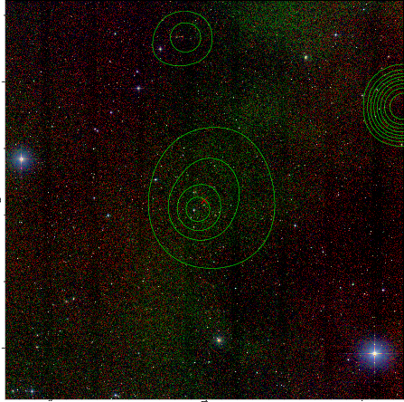  |

|[DES image](../image/214/214_des.pdf)   |
|-------------------|
| 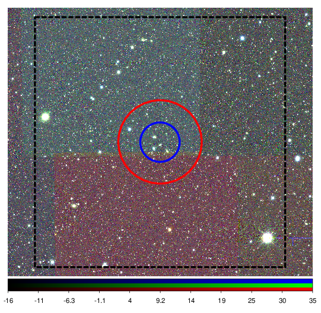  |
