

### 215

|Name|RAJ2000[deg]|DEJ2000[deg] |Ext[arcmin]| Ext,ml | z | z_src| C|GC(XSZ,Delta_z<0.01)| GC(OPT,Delta_z<0.01)|GC| R_sig[arcmin] | R500[arcmin] | R500[Mpc]| CRsig[c/s] | CR500[c/s] |L500[1E44 erg/s]|F500[1E-12 erg/s/cm^2]| M500[1E14 Msun]|Tx[keV]|Cnt_sig|Beta|Rc[arcmin]|Comment|Alias|
|---|---|---|---|---|---|------|---|--------|---------|----------|---|---|---|---|---|---|---|---|---|---|---|---|---|---|
|215| 84.563| -20.622| 1.90| 80.27| 0.0874(0.005)| z1, z_xsz| B| MCXC, PSZ2, Tar| A, N| A, MCXC, N, PSZ2, Tar, XB| 11.238| 9.004| 0.884| 0.249(0.034)| 0.241(0.033)| 0.856(0.058)| 4.495(0.304)| 2.13(0.07)| 3.51(0.08)| 128.5| 0.942(-0.074+0.043)| 4.533(-0.421+0.336)| -| k196|

|[RASS image](../image/215/215_img.pdf)|[filtered image](../image/215/215_fil.pdf)|[Segment image](../image/215/215_seg.pdf)|
|-------------------|--------------------|-------------------|
| 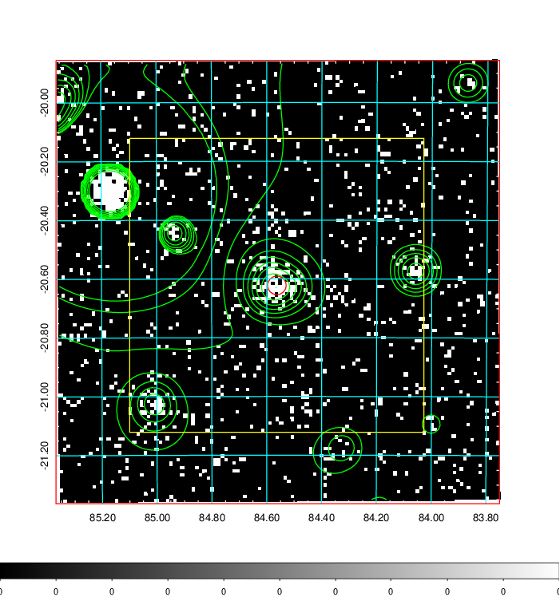  | 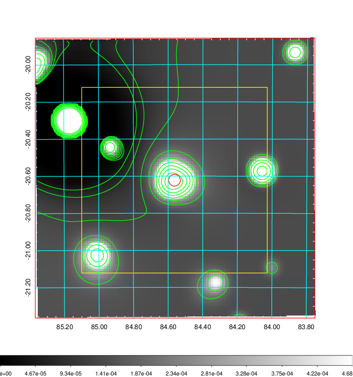   | 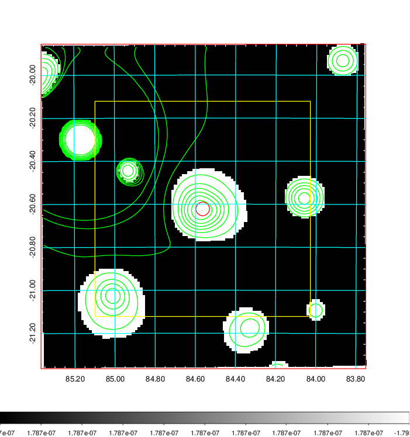  |

|[Exposure image](../image/215/215_mex.pdf)| [nH image](../image/215/215_nh.pdf)| [Planck image](../image/215/215_p.pdf)|
|-------------------|--------------------|-------------------|
|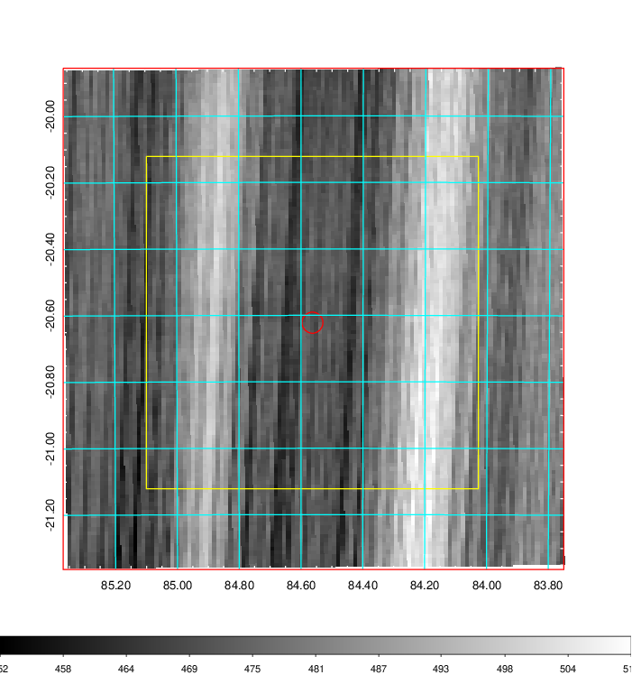   | 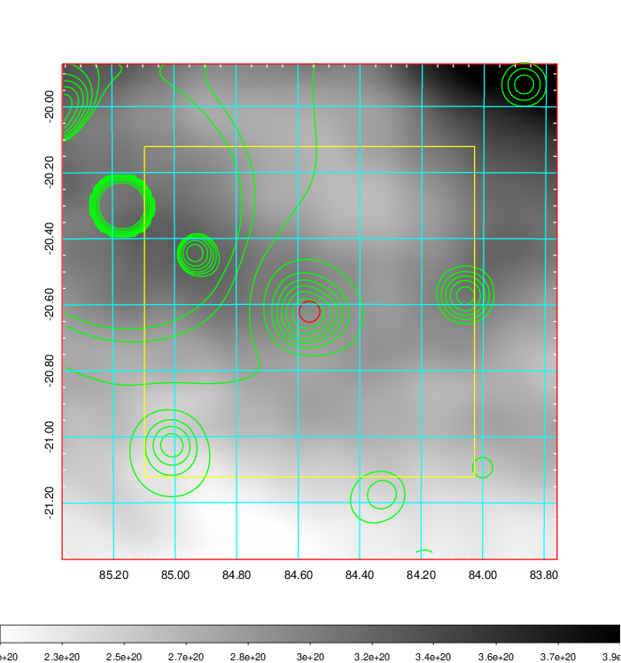    | 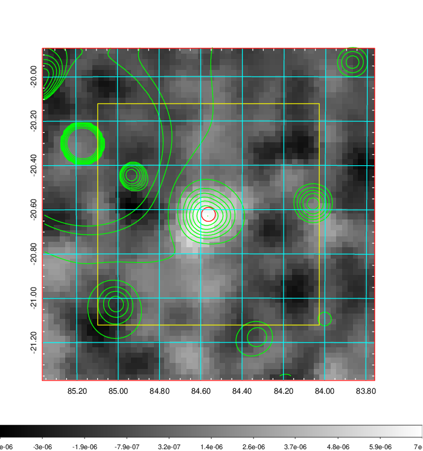 |

|[Redshift Histogram](../image/215/215_zg.pdf) | [DSS image(z1)](../image/215/215_dss_z1.pdf)      |  [DSS image(z2)](../image/215/215_dss_z2.pdf)    |
|-------------------|--------------------|-------------------|
|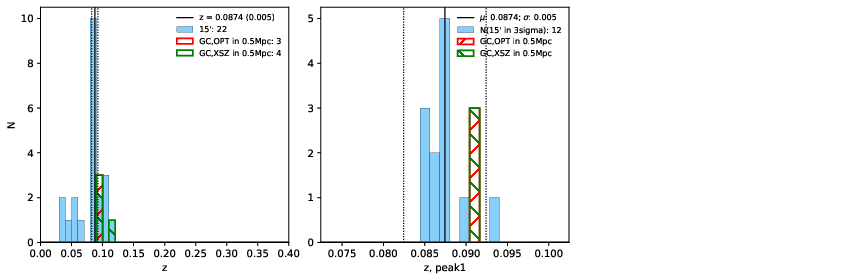 |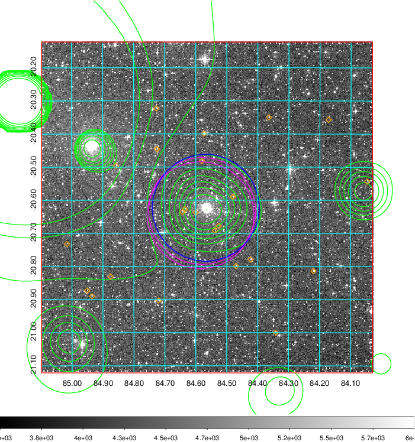  Blue circle for optical clusters;  Magenta circle for XSZ clusters;  all with r=1Mpc;  Only GC with Delta_z<0.01 are shown. | 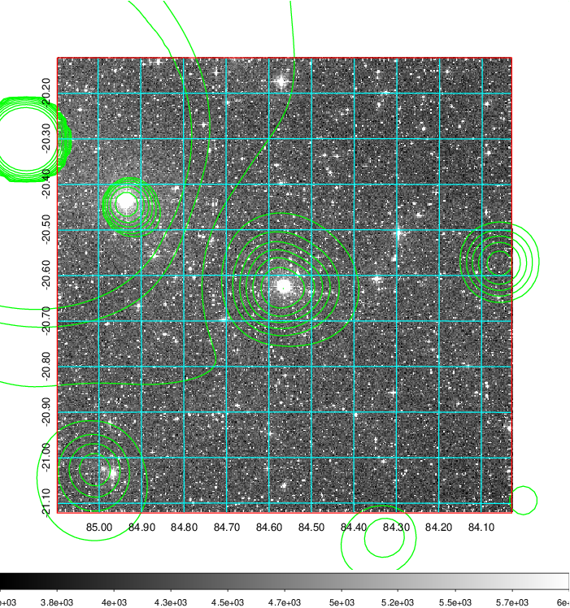 Blue circle for optical clusters;  Magenta circle for XSZ clusters;  all with r=1Mpc;  Only GC with Delta_z<0.01 are shown.  |

|[Previous-identified clusters](../image/215/215_gc.pdf) | [2MASS image](../image/215/215_2mass.pdf)      |
|-------------------|-------------------|
|  Green, magenta, and blue circles  for optical, X-ray and SZ clusters  respectively, with redshift of clusters  labelled. The radius of circles  are 1Mpc.|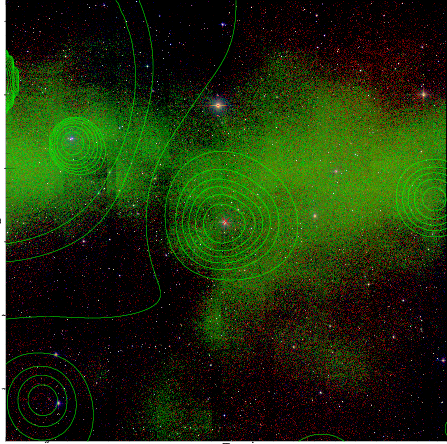  |

|[DES image](../image/215/215_des.pdf)   |[PS1 image](../image/215/215_ps1.pdf)            |
|-------------------|-------------------|
| 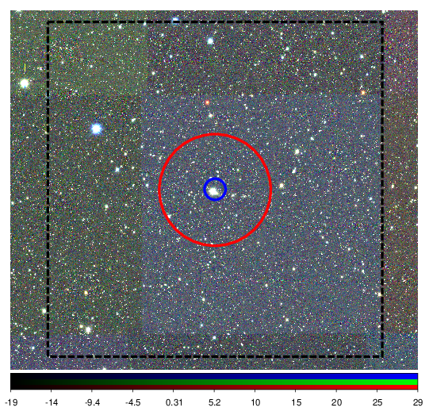  | 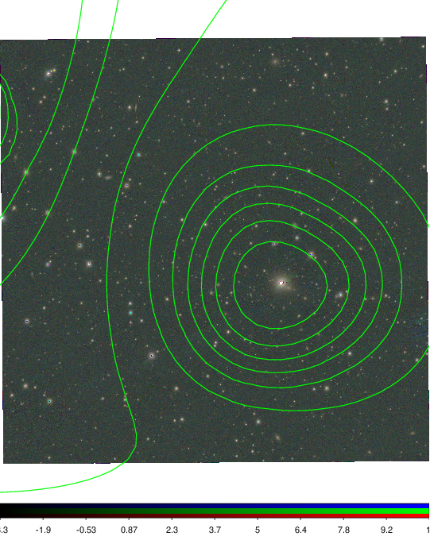  |
