

### 217

|Name|RAJ2000[deg]|DEJ2000[deg] |Ext[arcmin]| Ext,ml | z | z_src| C|GC(XSZ,Delta_z<0.01)| GC(OPT,Delta_z<0.01)|GC| R_sig[arcmin] | R500[arcmin] | R500[Mpc]| CRsig[c/s] | CR500[c/s] |L500[1E44 erg/s]|F500[1E-12 erg/s/cm^2]| M500[1E14 Msun]|Tx[keV]|Cnt_sig|Beta|Rc[arcmin]|Comment|Alias|
|---|---|---|---|---|---|------|---|--------|---------|----------|---|---|---|---|---|---|---|---|---|---|---|---|---|---|
|217| 85.047| -43.384| 2.03| 39.48| 0.0850(0.005)| z1, z_xsz| B| MCXC| A| A, MCXC, W| 11.238| 8.761| 0.838| 0.208(0.027)| 0.201(0.026)| 0.658(0.054)| 3.667(0.299)| 1.82(0.07)| 3.18(0.08)| 170.2| 0.684(-0.102+0.149)| 4.035(-1.056+1.320)| -| k223|

|[RASS image](../image/217/217_img.pdf)|[filtered image](../image/217/217_fil.pdf)|[Segment image](../image/217/217_seg.pdf)|
|-------------------|--------------------|-------------------|
| 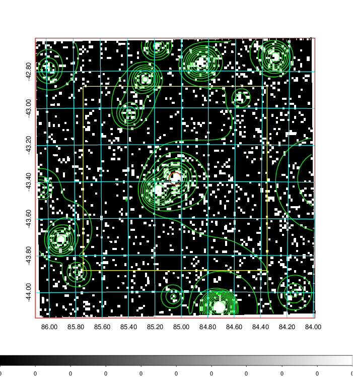  | 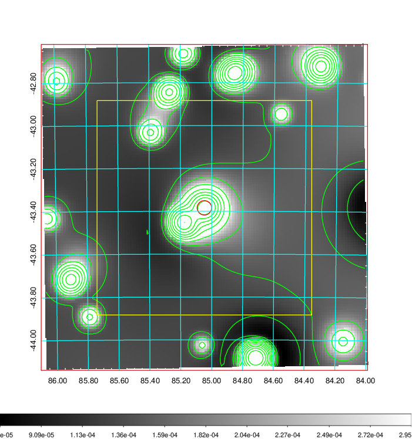   | 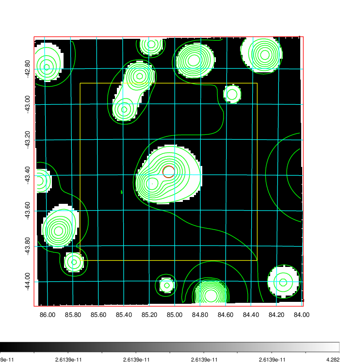  |

|[Exposure image](../image/217/217_mex.pdf)| [nH image](../image/217/217_nh.pdf)| [Planck image](../image/217/217_p.pdf)|
|-------------------|--------------------|-------------------|
|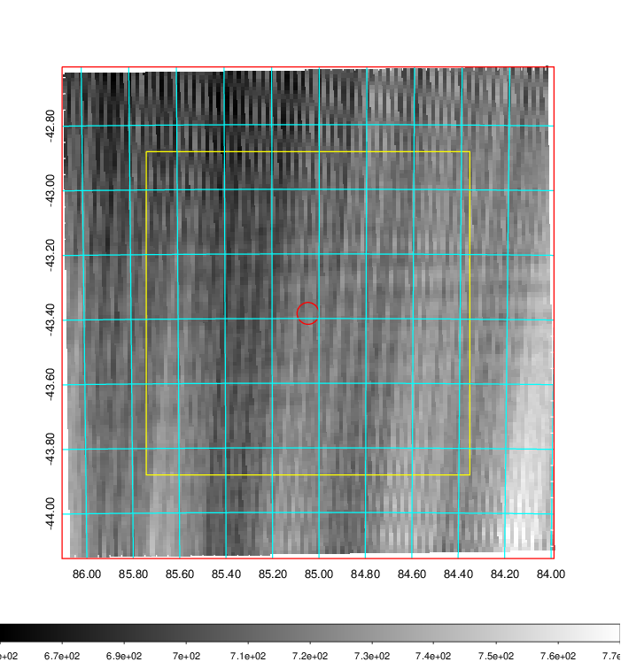   | 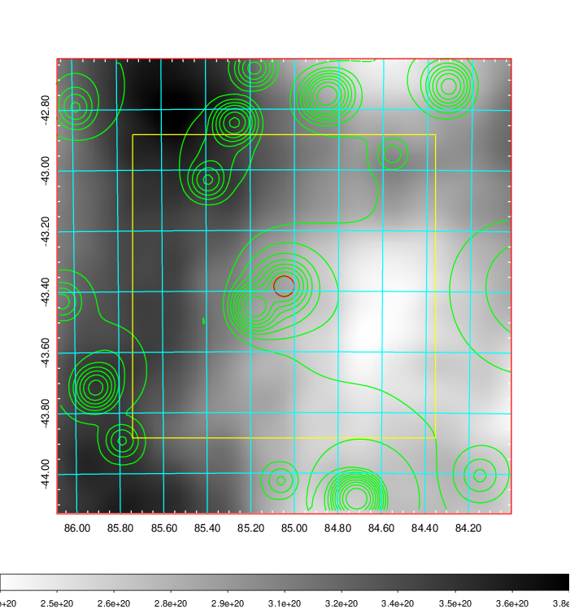    | 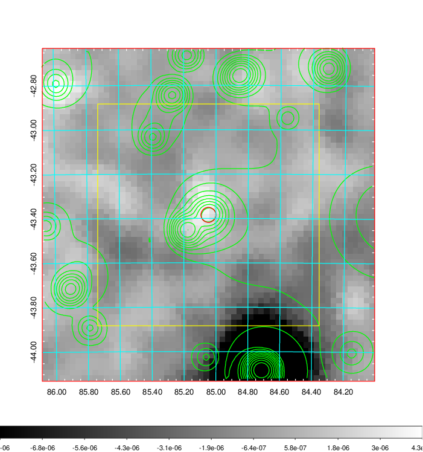 |

|[Redshift Histogram](../image/217/217_zg.pdf) | [DSS image(z1)](../image/217/217_dss_z1.pdf)      |  [DSS image(z2)](../image/217/217_dss_z2.pdf)    |
|-------------------|--------------------|-------------------|
|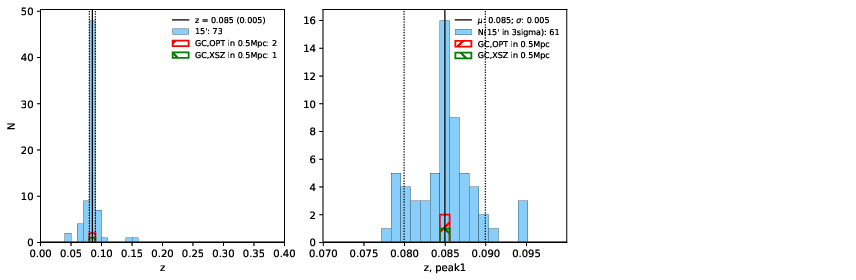 |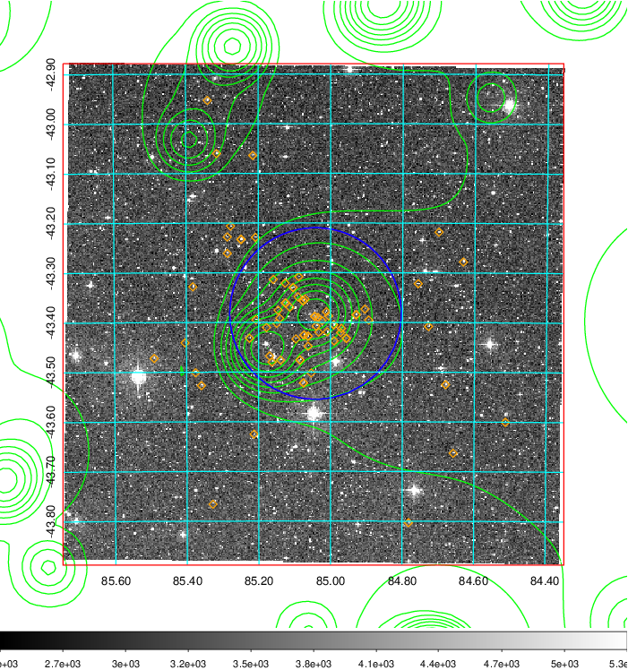  Blue circle for optical clusters;  Magenta circle for XSZ clusters;  all with r=1Mpc;  Only GC with Delta_z<0.01 are shown. | 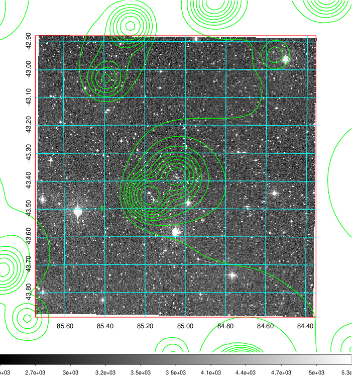 Blue circle for optical clusters;  Magenta circle for XSZ clusters;  all with r=1Mpc;  Only GC with Delta_z<0.01 are shown.  |

|[Previous-identified clusters](../image/217/217_gc.pdf) | [2MASS image](../image/217/217_2mass.pdf)      |
|-------------------|-------------------|
|  Green, magenta, and blue circles  for optical, X-ray and SZ clusters  respectively, with redshift of clusters  labelled. The radius of circles  are 1Mpc.|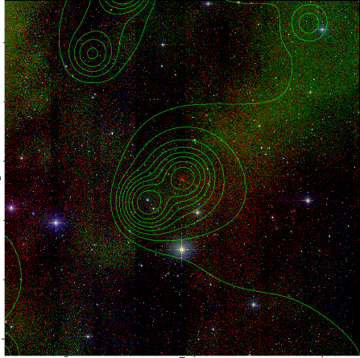  |

|[DES image](../image/217/217_des.pdf)   |
|-------------------|
| 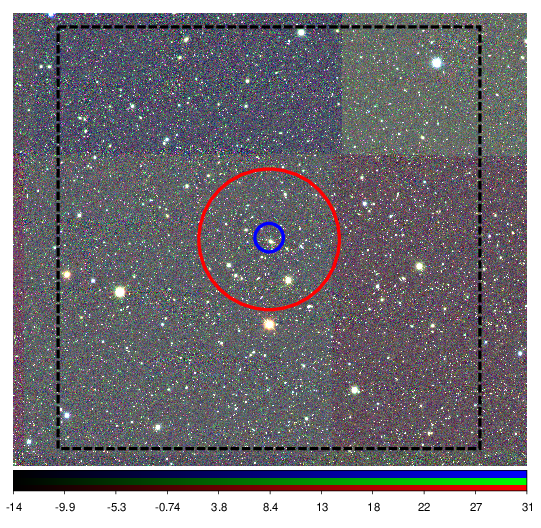  |
