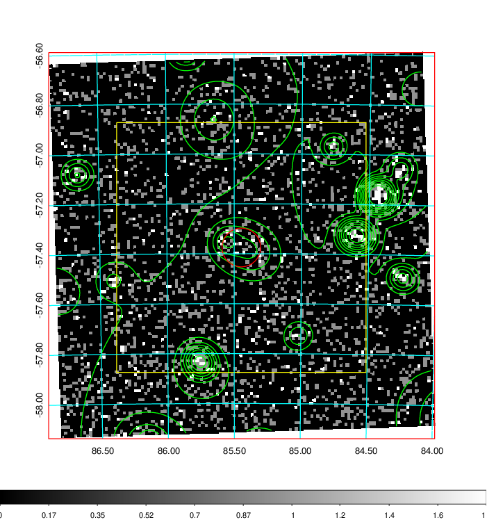
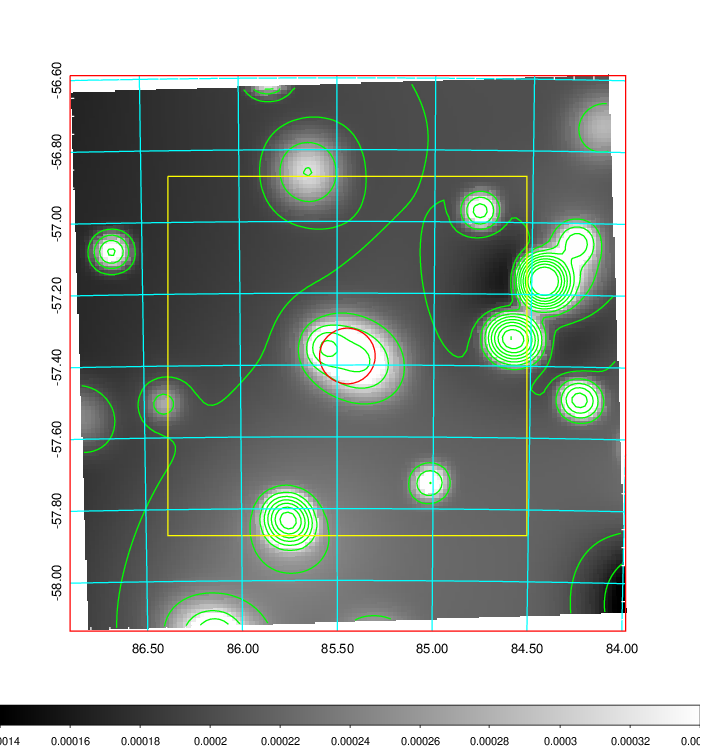
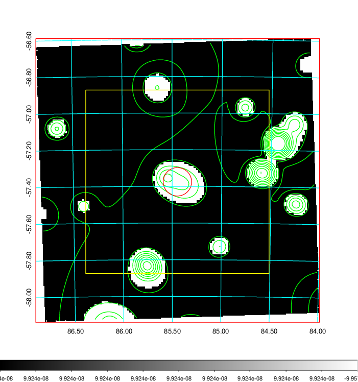
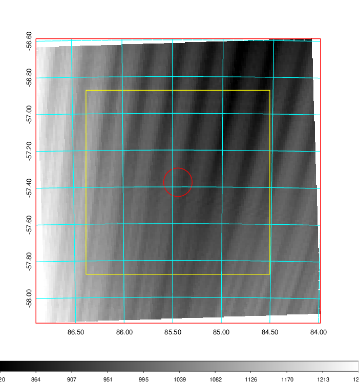
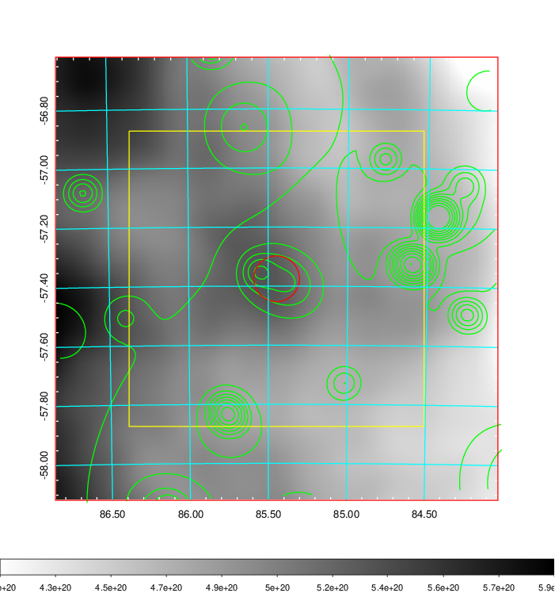
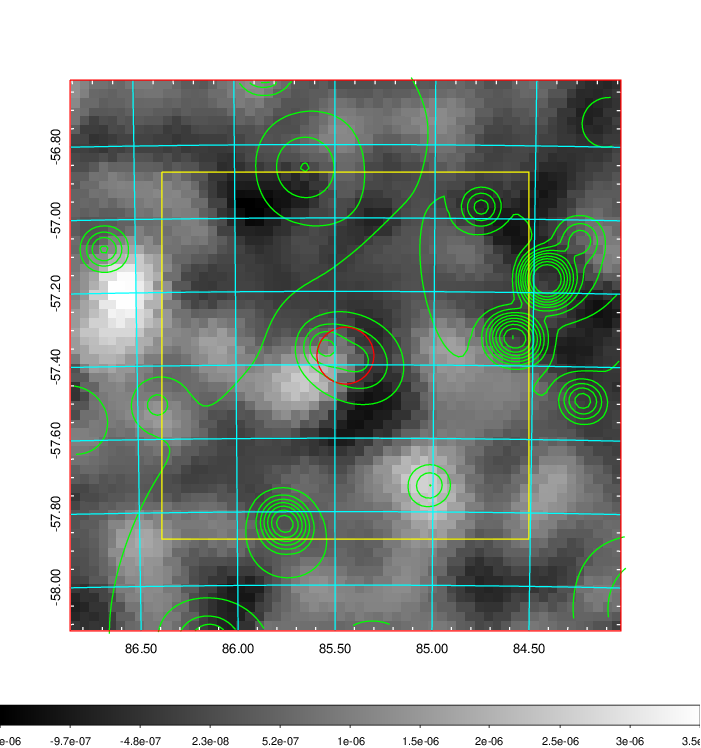
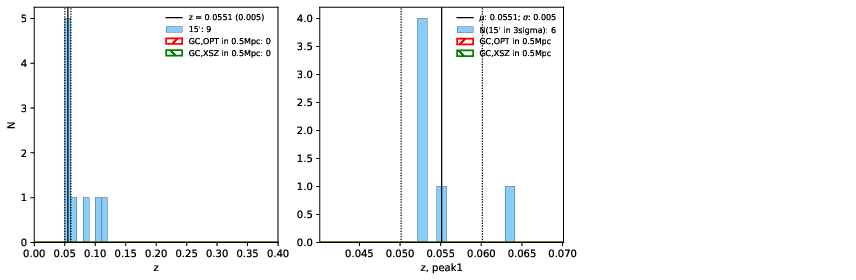
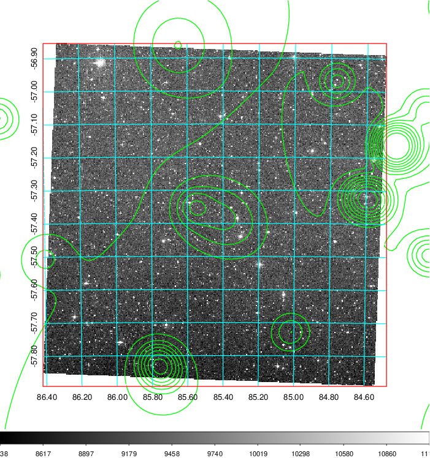
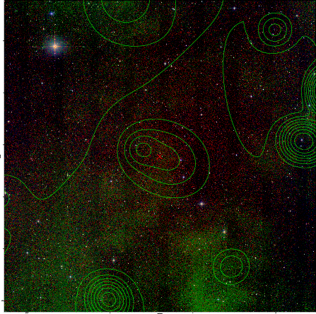

### 218

|Name|RAJ2000[deg]|DEJ2000[deg] |Ext[arcmin]| Ext,ml | z | z_src| C|GC(XSZ,Delta_z<0.01)| GC(OPT,Delta_z<0.01)|GC| R_sig[arcmin] | R500[arcmin] | R500[Mpc]| CRsig[c/s] | CR500[c/s] |L500[1E44 erg/s]|F500[1E-12 erg/s/cm^2]| M500[1E14 Msun]|Tx[keV]|Cnt_sig|Beta|Rc[arcmin]|Comment|Alias|
|---|---|---|---|---|---|------|---|--------|---------|----------|---|---|---|---|---|---|---|---|---|---|---|---|---|---|
|218| 85.447| -57.375| 4.65| 28.32| 0.0551(0.005)| z1,| G| -| -| -| 36.145| 10.899| 0.700| 0.203(0.059)| 0.182(0.053)| 0.221(0.129)| 3.060(1.790)| 1.03(0.31)| 2.22(0.42)| 391.1| 0.502(-0.002+0.004)| 4.784(-0.138+0.218)| -| t240|

|[RASS image](../image/218/218_img.pdf)|[filtered image](../image/218/218_fil.pdf)|[Segment image](../image/218/218_seg.pdf)|
|-------------------|--------------------|-------------------|
|   |    |   |

|[Exposure image](../image/218/218_mex.pdf)| [nH image](../image/218/218_nh.pdf)| [Planck image](../image/218/218_p.pdf)|
|-------------------|--------------------|-------------------|
|   |     |  |

|[Redshift Histogram](../image/218/218_zg.pdf) | [DSS image(z1)](../image/218/218_dss_z1.pdf)      |  [DSS image(z2)](../image/218/218_dss_z2.pdf)    |
|-------------------|--------------------|-------------------|
| |  Blue circle for optical clusters;  Magenta circle for XSZ clusters;  all with r=1Mpc;  Only GC with Delta_z<0.01 are shown. |  Blue circle for optical clusters;  Magenta circle for XSZ clusters;  all with r=1Mpc;  Only GC with Delta_z<0.01 are shown.  |

|[known Abell/XSZ clusters](../image/218/218_gc.pdf) | [2MASS image](../image/218/218_2mass.pdf)      |
|-------------------|-------------------|
|  Magenta, blue and green circles  for optical, X-ray and SZ clusters  respectively, with redshift of clusters  labelled. The radius of circles  are 1Mpc.|  |

|[DES image](../image/218/218_des.pdf)   |
|-------------------|
|   |
