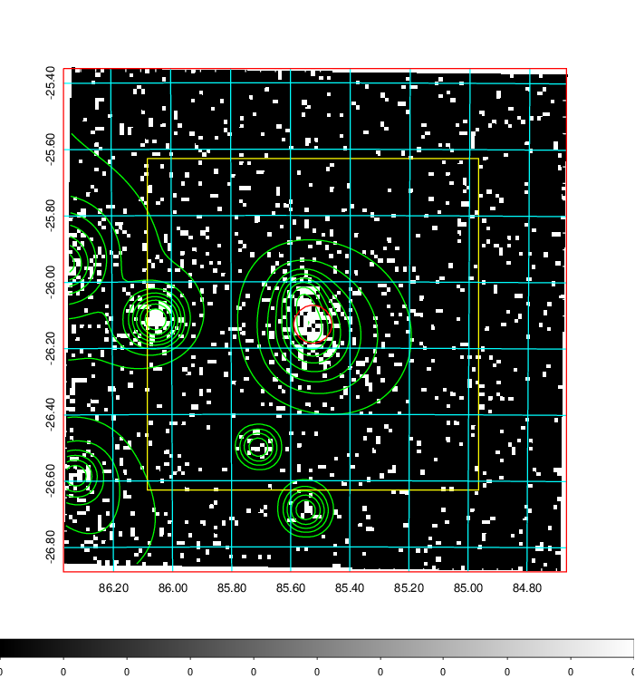
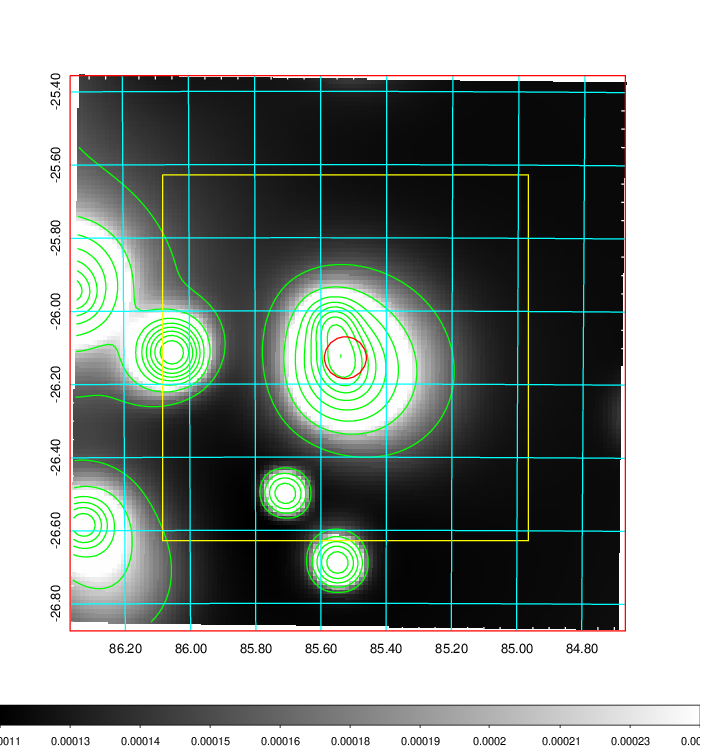
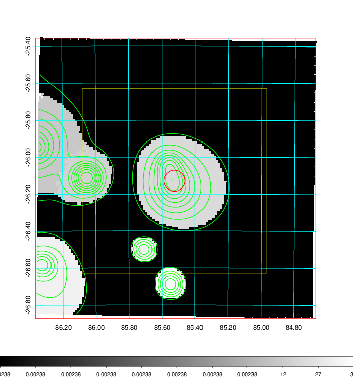
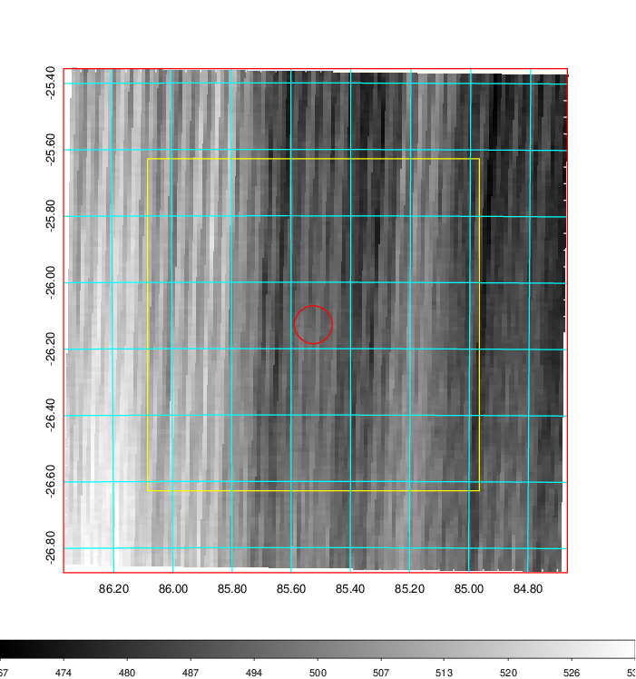
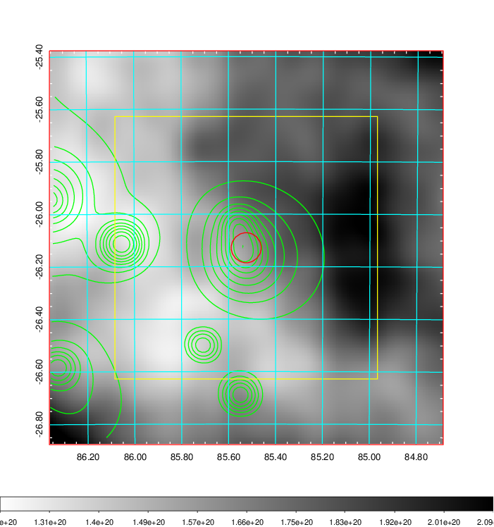
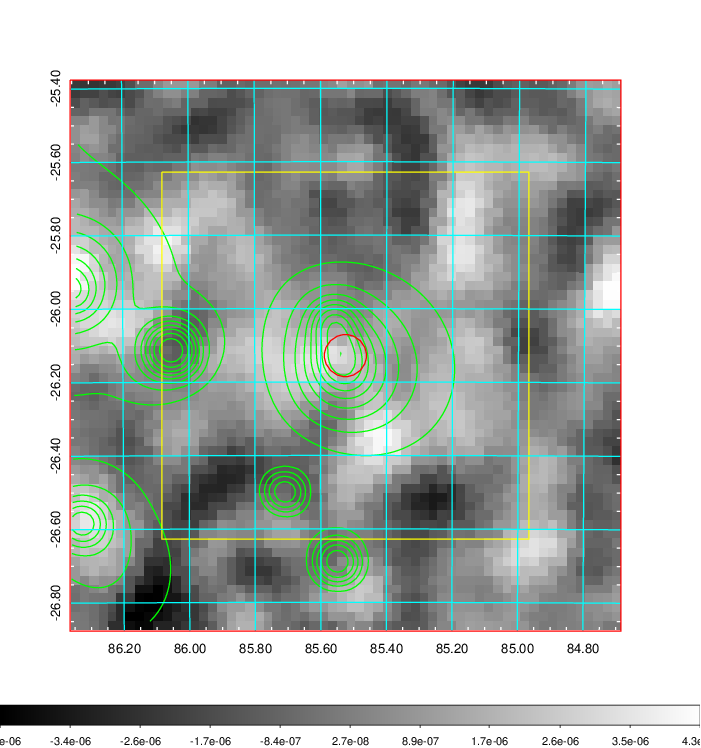
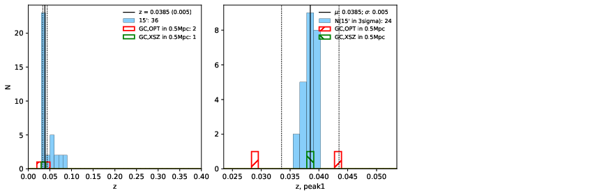
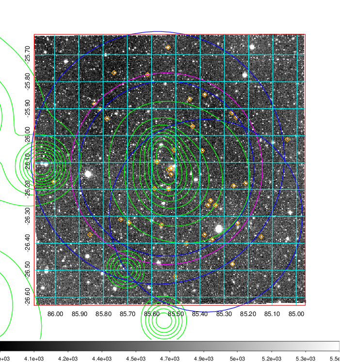
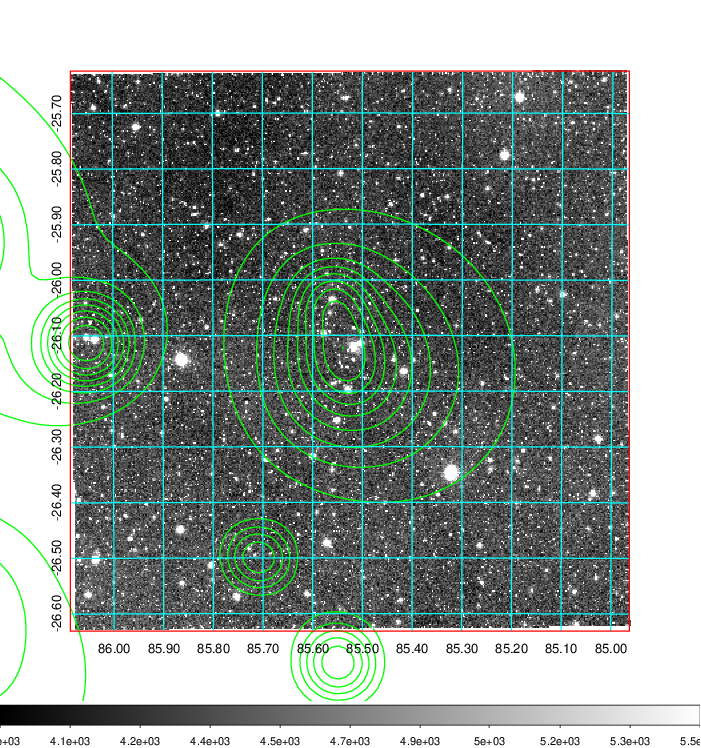
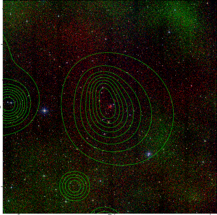

### 219

|Name|RAJ2000[deg]|DEJ2000[deg] |Ext[arcmin]| Ext,ml | z | z_src| C|GC(XSZ,Delta_z<0.01)| GC(OPT,Delta_z<0.01)|GC| R_sig[arcmin] | R500[arcmin] | R500[Mpc]| CRsig[c/s] | CR500[c/s] |L500[1E44 erg/s]|F500[1E-12 erg/s/cm^2]| M500[1E14 Msun]|Tx[keV]|Cnt_sig|Beta|Rc[arcmin]|Comment|Alias|
|---|---|---|---|---|---|------|---|--------|---------|----------|---|---|---|---|---|---|---|---|---|---|---|---|---|---|
|219| 85.525| -26.128| 3.44| 151.16| 0.0385(0.005)| z1, z_xsz| B| MCXC| A, N| A, MCXC, N| 16.800| 14.806| 0.678| 0.342(0.052)| 0.336(0.051)| 0.216(0.023)| 6.263(0.677)| 0.92(0.05)| 2.06(0.07)| 171.1| 0.721(-0.060+0.082)| 4.876(-0.740+0.914)| -| k420|

|[RASS image](../image/219/219_img.pdf)|[filtered image](../image/219/219_fil.pdf)|[Segment image](../image/219/219_seg.pdf)|
|-------------------|--------------------|-------------------|
|   |    |   |

|[Exposure image](../image/219/219_mex.pdf)| [nH image](../image/219/219_nh.pdf)| [Planck image](../image/219/219_p.pdf)|
|-------------------|--------------------|-------------------|
|   |     |  |

|[Redshift Histogram](../image/219/219_zg.pdf) | [DSS image(z1)](../image/219/219_dss_z1.pdf)      |  [DSS image(z2)](../image/219/219_dss_z2.pdf)    |
|-------------------|--------------------|-------------------|
| |  Blue circle for optical clusters;  Magenta circle for XSZ clusters;  all with r=1Mpc;  Only GC with Delta_z<0.01 are shown. |  Blue circle for optical clusters;  Magenta circle for XSZ clusters;  all with r=1Mpc;  Only GC with Delta_z<0.01 are shown.  |

|[known Abell/XSZ clusters](../image/219/219_gc.pdf) | [2MASS image](../image/219/219_2mass.pdf)      |
|-------------------|-------------------|
|  Magenta, blue and green circles  for optical, X-ray and SZ clusters  respectively, with redshift of clusters  labelled. The radius of circles  are 1Mpc.|  |

|[DES image](../image/219/219_des.pdf)   |[PS1 image](../image/219/219_ps1.pdf)            |
|-------------------|-------------------|
|   |   |
