

### 22

|Name|RAJ2000[deg]|DEJ2000[deg] |Ext[arcmin]| Ext,ml | z | z_src| C|GC(XSZ,Delta_z<0.01)| GC(OPT,Delta_z<0.01)|GC| R_sig[arcmin] | R500[arcmin] | R500[Mpc]| CRsig[c/s] | CR500[c/s] |L500[1E44 erg/s]|F500[1E-12 erg/s/cm^2]| M500[1E14 Msun]|Tx[keV]|Cnt_sig|Beta|Rc[arcmin]|Comment|Alias|
|---|---|---|---|---|---|------|---|--------|---------|----------|---|---|---|---|---|---|---|---|---|---|---|---|---|---|
|22| 5.400| 28.056| 1.89| 42.19| 0.0930(0.005)| z1, z_xsz| B| F20, MCXC, PSZ2, SPI, Tar| N, RM, W| F20, MCXC, N, PSZ2, SPI, Tar, W| 15.138| 8.904| 0.924| 0.277(0.042)| 0.259(0.039)| 1.045(0.096)| 4.813(0.442)| 2.45(0.11)| 3.83(0.11)| 116.1| 0.589(-0.059+0.099)| 2.075(-0.581+0.822)| -| k193|

|[RASS image](../image/22/22_img.pdf)|[filtered image](../image/22/22_fil.pdf)|[Segment image](../image/22/22_seg.pdf)|
|-------------------|--------------------|-------------------|
| 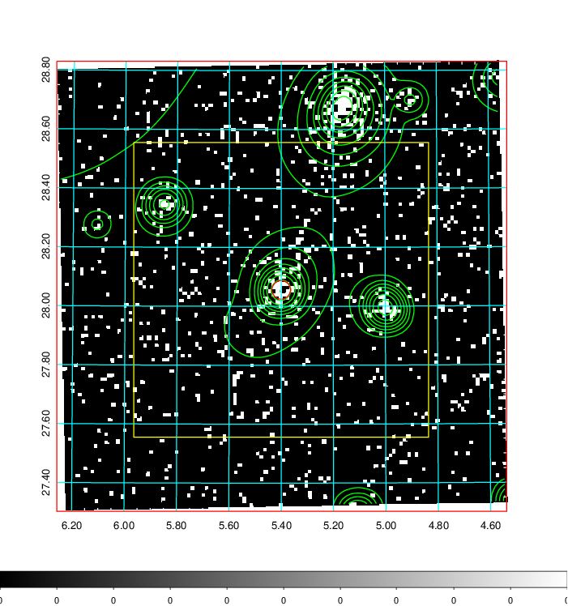  | 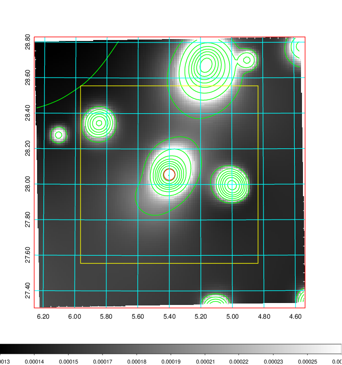   | 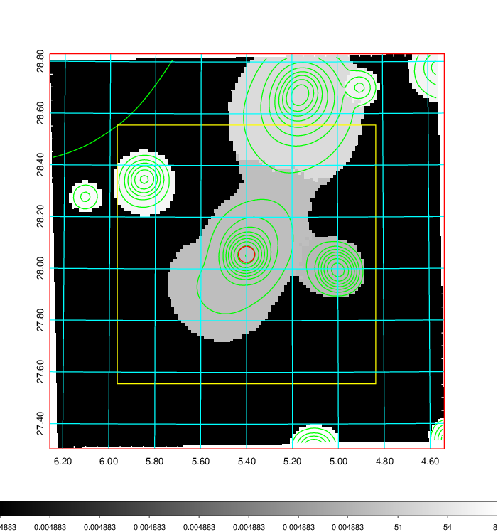  |

|[Exposure image](../image/22/22_mex.pdf)| [nH image](../image/22/22_nh.pdf)| [Planck image](../image/22/22_p.pdf)|
|-------------------|--------------------|-------------------|
|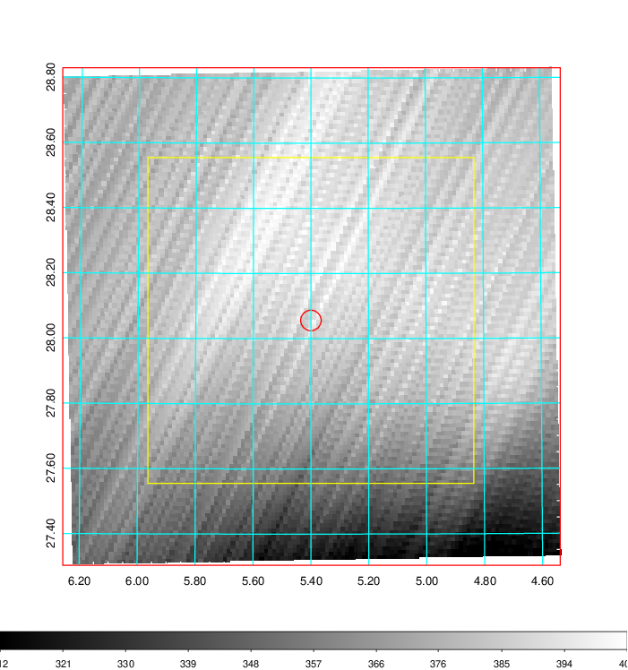   | 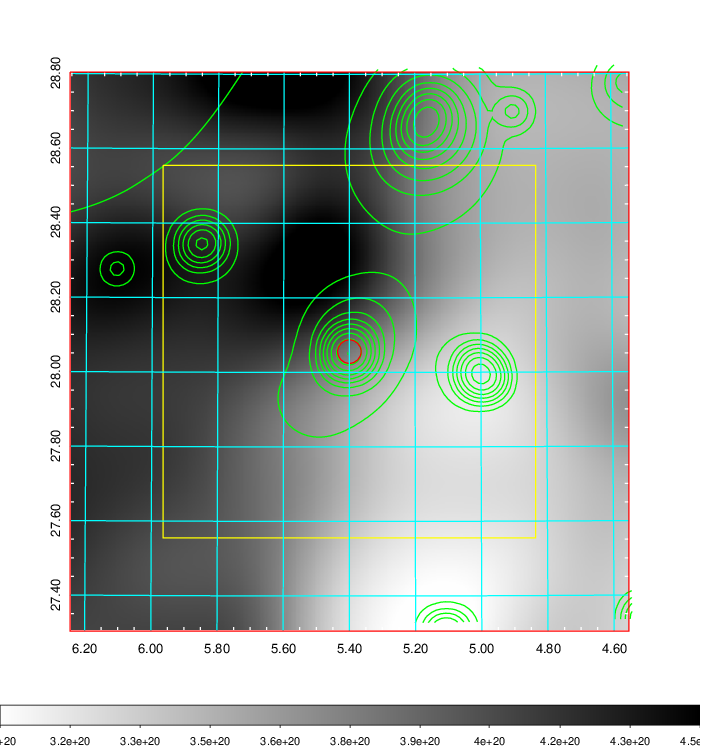    | 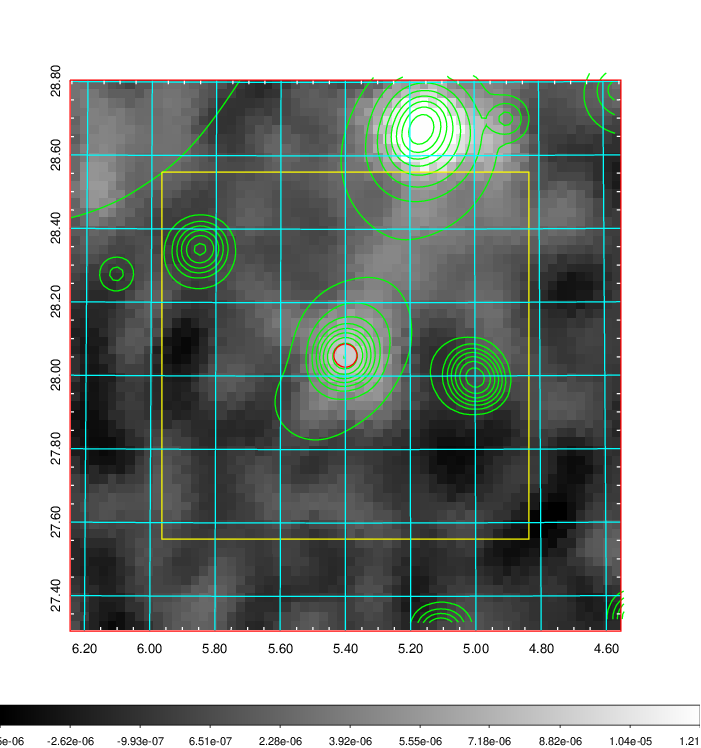 |

|[Redshift Histogram](../image/22/22_zg.pdf) | [DSS image(z1)](../image/22/22_dss_z1.pdf)      |  [DSS image(z2)](../image/22/22_dss_z2.pdf)    |
|-------------------|--------------------|-------------------|
|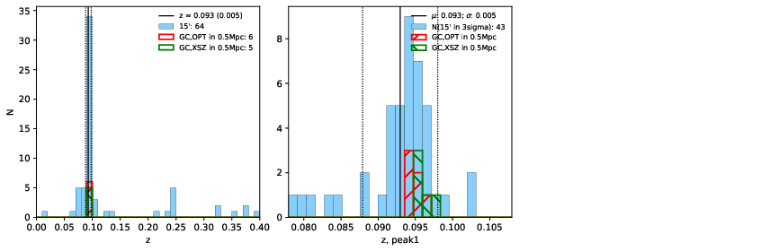 |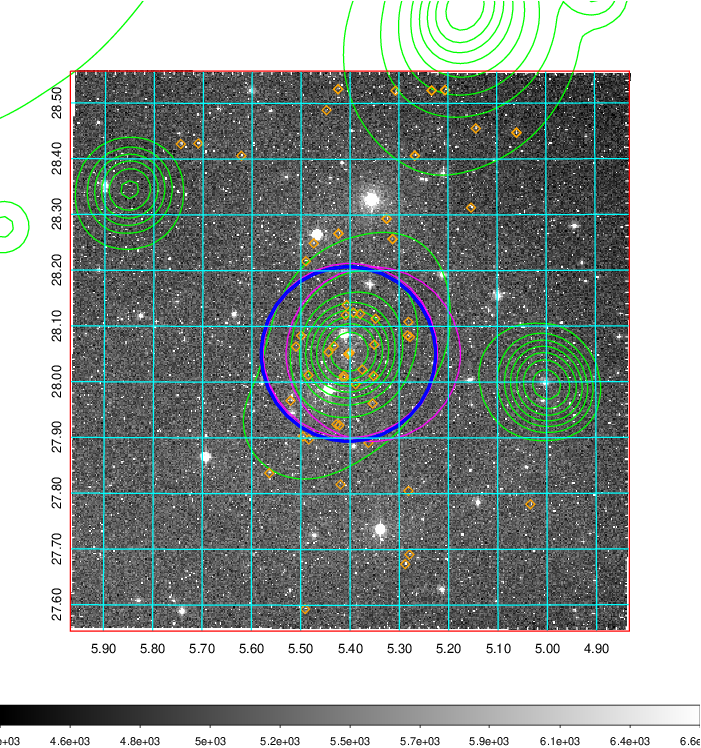  Blue circle for optical clusters;  Magenta circle for XSZ clusters;  all with r=1Mpc;  Only GC with Delta_z<0.01 are shown. | 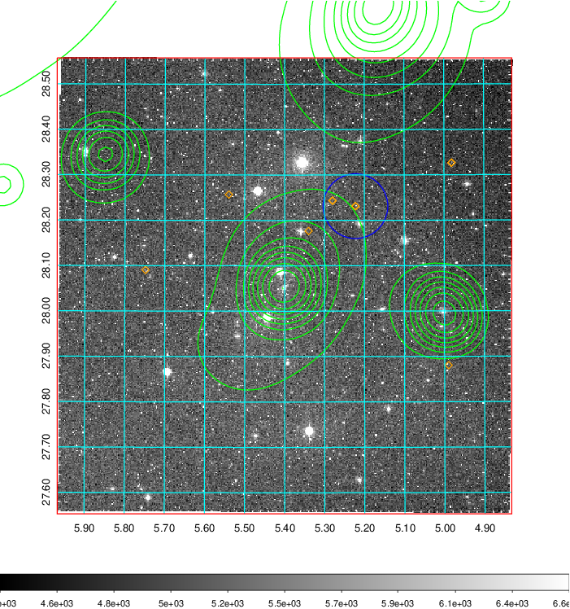 Blue circle for optical clusters;  Magenta circle for XSZ clusters;  all with r=1Mpc;  Only GC with Delta_z<0.01 are shown.  |

|[Previous-identified clusters](../image/22/22_gc.pdf) | [2MASS image](../image/22/22_2mass.pdf)      |[SDSS image](../image/22/22_sdss.pdf)   |
|-------------------|-------------------|-------------------|
|  Green, magenta, and blue circles  for optical, X-ray and SZ clusters  respectively, with redshift of clusters  labelled. The radius of circles  are 1Mpc.|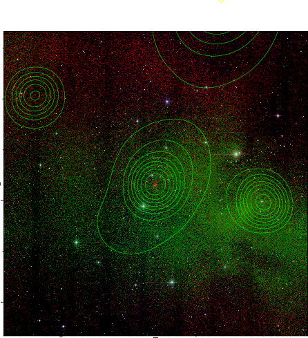  | 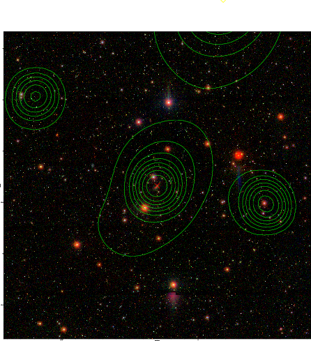  |

