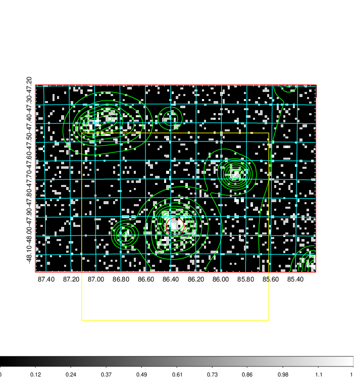
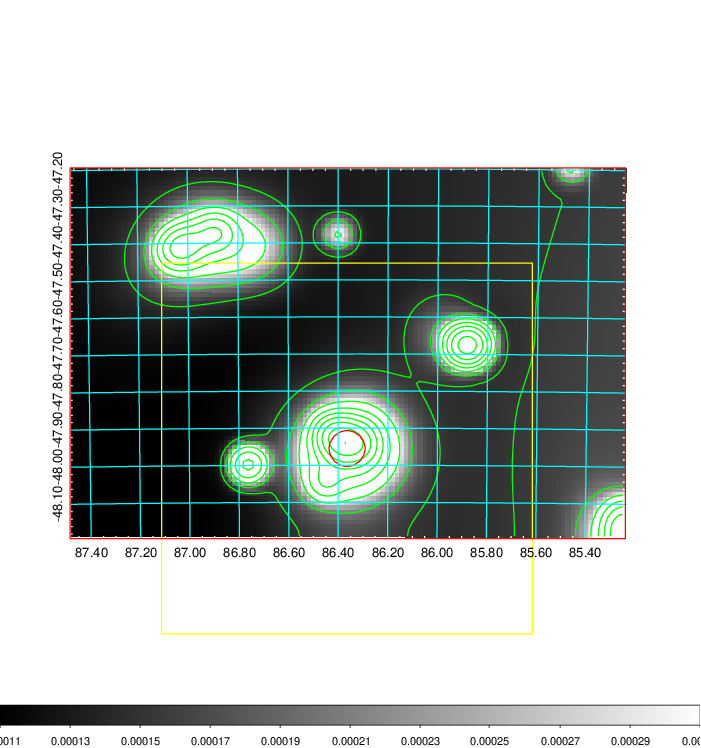
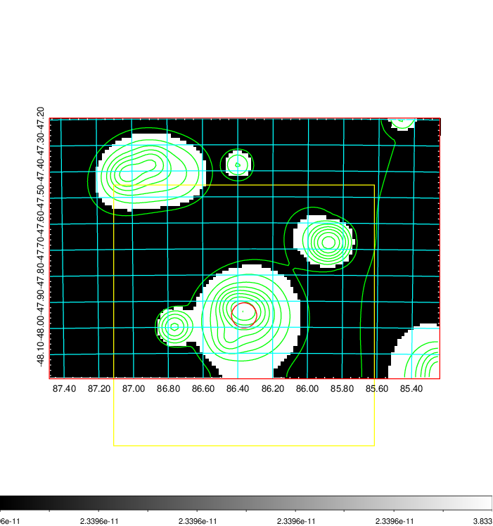
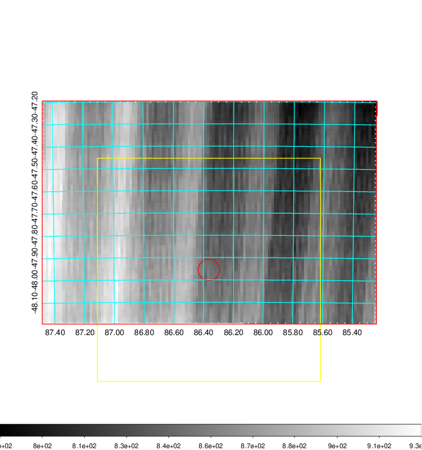
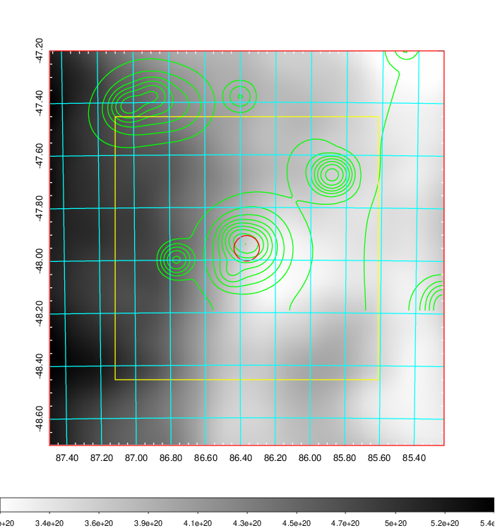
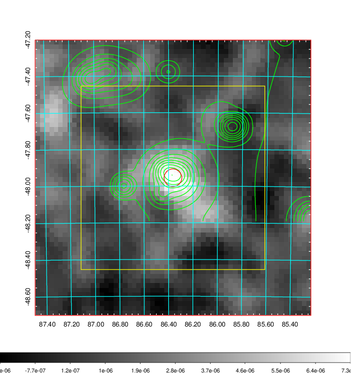
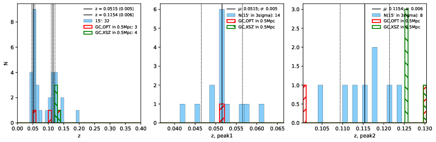
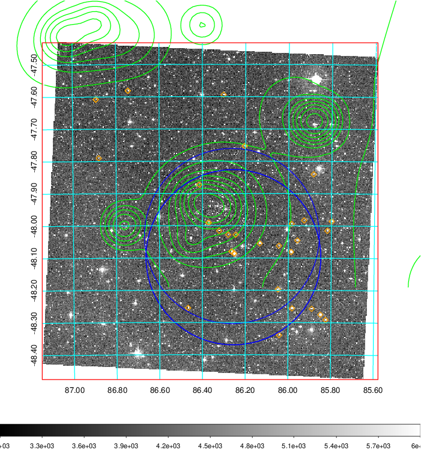
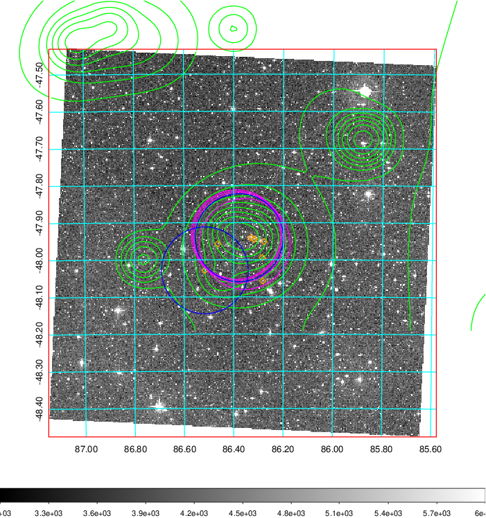
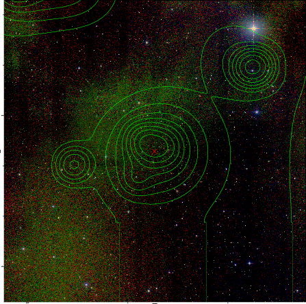

### 220

|Name|RAJ2000[deg]|DEJ2000[deg] |Ext[arcmin]| Ext,ml | z | z_src| C|GC(XSZ,Delta_z<0.01)| GC(OPT,Delta_z<0.01)|GC| R_sig[arcmin] | R500[arcmin] | R500[Mpc]| CRsig[c/s] | CR500[c/s] |L500[1E44 erg/s]|F500[1E-12 erg/s/cm^2]| M500[1E14 Msun]|Tx[keV]|Cnt_sig|Beta|Rc[arcmin]|Comment|Alias|
|---|---|---|---|---|---|------|---|--------|---------|----------|---|---|---|---|---|---|---|---|---|---|---|---|---|---|
|220| 86.364| -47.955| 2.91| 178.47| 0.1277(0.000)| z_xsz| B| MCXC, PSZ2, Tar| A| A, B15, MCXC, N, PSZ2, Tar, W| 10.262| 7.567| 1.036| 0.262(0.023)| 0.251(0.023)| 2.029(0.088)| 4.733(0.206)| 3.58(0.08)| 4.90(0.07)| 207.2| 0.939(-0.077+0.044)| 5.895(-0.546+0.377)| -| k364|

|[RASS image](../image/220/220_img.pdf)|[filtered image](../image/220/220_fil.pdf)|[Segment image](../image/220/220_seg.pdf)|
|-------------------|--------------------|-------------------|
|   |    |   |

|[Exposure image](../image/220/220_mex.pdf)| [nH image](../image/220/220_nh.pdf)| [Planck image](../image/220/220_p.pdf)|
|-------------------|--------------------|-------------------|
|   |     |  |

|[Redshift Histogram](../image/220/220_zg.pdf) | [DSS image(z1)](../image/220/220_dss_z1.pdf)      |  [DSS image(z2)](../image/220/220_dss_z2.pdf)    |
|-------------------|--------------------|-------------------|
| |  Blue circle for optical clusters;  Magenta circle for XSZ clusters;  all with r=1Mpc;  Only GC with Delta_z<0.01 are shown. |  Blue circle for optical clusters;  Magenta circle for XSZ clusters;  all with r=1Mpc;  Only GC with Delta_z<0.01 are shown.  |

|[known Abell/XSZ clusters](../image/220/220_gc.pdf) | [2MASS image](../image/220/220_2mass.pdf)      |
|-------------------|-------------------|
|  Magenta, blue and green circles  for optical, X-ray and SZ clusters  respectively, with redshift of clusters  labelled. The radius of circles  are 1Mpc.|  |

|[DES image](../image/220/220_des.pdf)   |
|-------------------|
|   |
