

### 221

|Name|RAJ2000[deg]|DEJ2000[deg] |Ext[arcmin]| Ext,ml | z | z_src| C|GC(XSZ,Delta_z<0.01)| GC(OPT,Delta_z<0.01)|GC| R_sig[arcmin] | R500[arcmin] | R500[Mpc]| CRsig[c/s] | CR500[c/s] |L500[1E44 erg/s]|F500[1E-12 erg/s/cm^2]| M500[1E14 Msun]|Tx[keV]|Cnt_sig|Beta|Rc[arcmin]|Comment|Alias|
|---|---|---|---|---|---|------|---|--------|---------|----------|---|---|---|---|---|---|---|---|---|---|---|---|---|---|
|221| 86.370| -25.931| 3.94| 87.90| 0.0436(0.005)| z1, z_xsz| B| MCXC, Tar, XB| A, N, W| A, MCXC, N, Tar, W, XB| 12.700| 12.191| 0.628| 0.188(0.033)| 0.186(0.033)| 0.151(0.021)| 3.381(0.477)| 0.73(0.05)| 1.79(0.08)| 99.9| 0.852(-0.140+0.104)| 5.584(-1.148+0.839)| -| k471|

|[RASS image](../image/221/221_img.pdf)|[filtered image](../image/221/221_fil.pdf)|[Segment image](../image/221/221_seg.pdf)|
|-------------------|--------------------|-------------------|
| 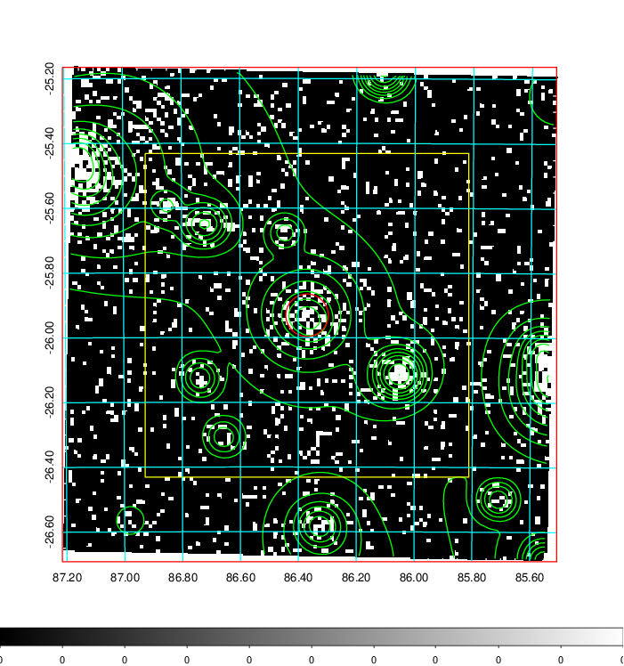  | 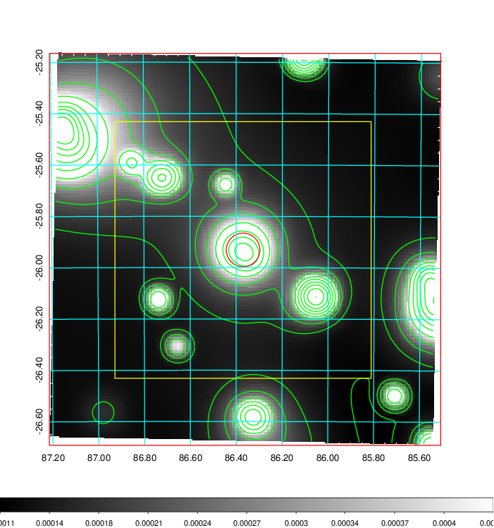   | 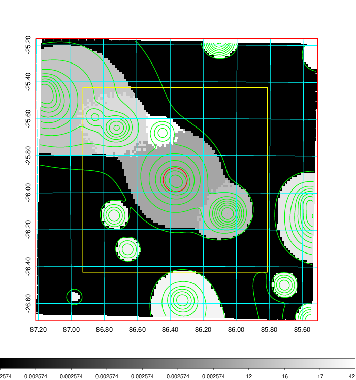  |

|[Exposure image](../image/221/221_mex.pdf)| [nH image](../image/221/221_nh.pdf)| [Planck image](../image/221/221_p.pdf)|
|-------------------|--------------------|-------------------|
|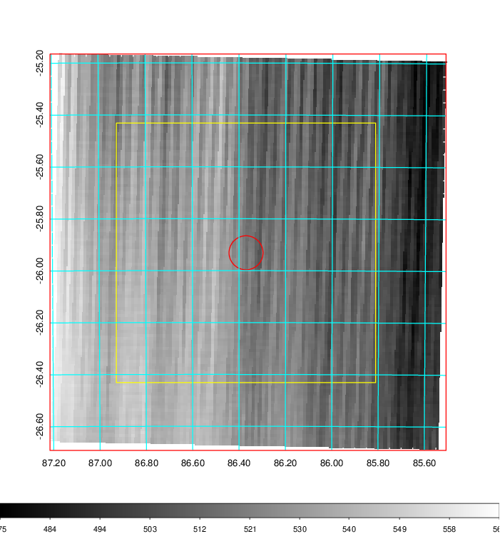   | 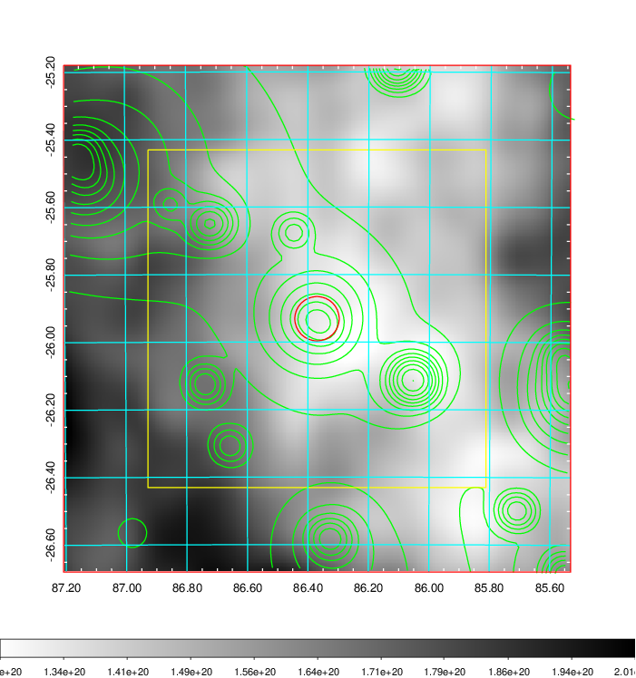    | 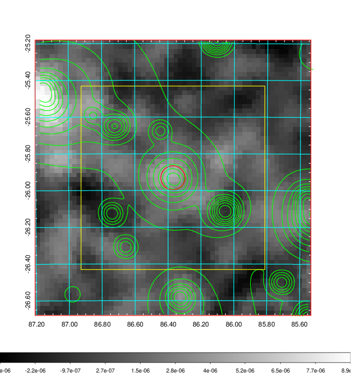 |

|[Redshift Histogram](../image/221/221_zg.pdf) | [DSS image(z1)](../image/221/221_dss_z1.pdf)      |  [DSS image(z2)](../image/221/221_dss_z2.pdf)    |
|-------------------|--------------------|-------------------|
|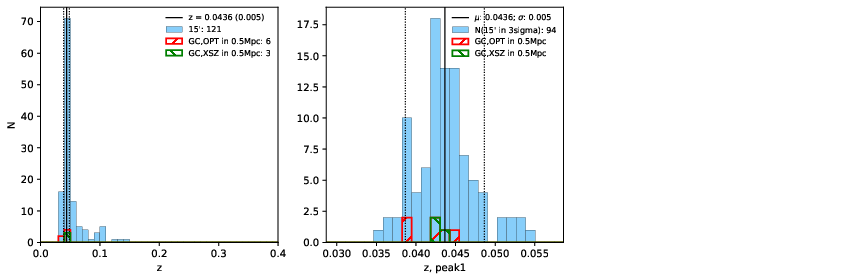 |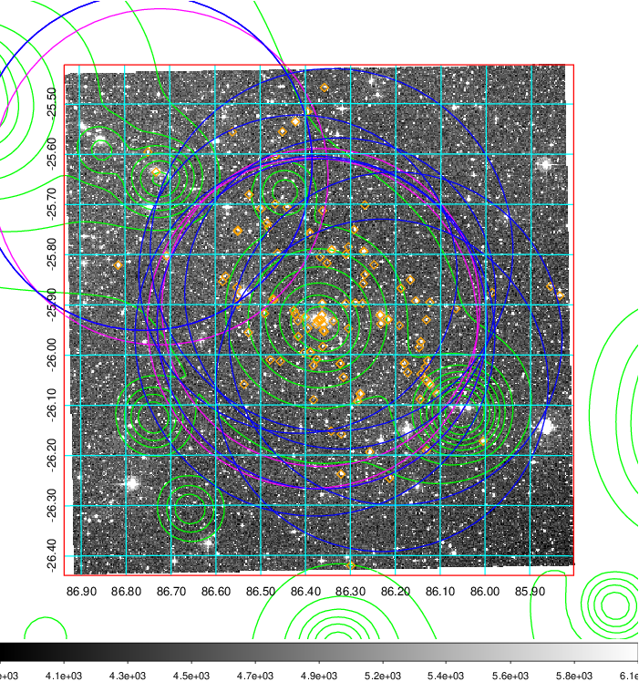  Blue circle for optical clusters;  Magenta circle for XSZ clusters;  all with r=1Mpc;  Only GC with Delta_z<0.01 are shown. | 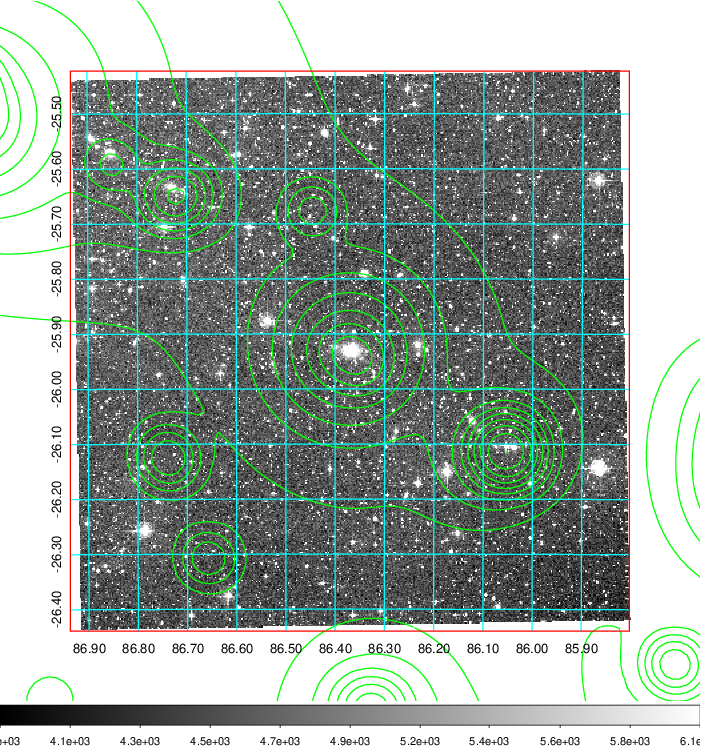 Blue circle for optical clusters;  Magenta circle for XSZ clusters;  all with r=1Mpc;  Only GC with Delta_z<0.01 are shown.  |

|[Previous-identified clusters](../image/221/221_gc.pdf) | [2MASS image](../image/221/221_2mass.pdf)      |
|-------------------|-------------------|
|  Green, magenta, and blue circles  for optical, X-ray and SZ clusters  respectively, with redshift of clusters  labelled. The radius of circles  are 1Mpc.|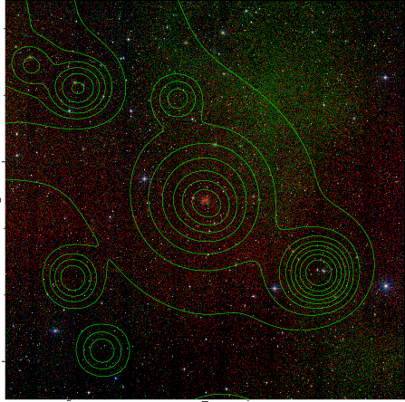  |

|[DES image](../image/221/221_des.pdf)   |[PS1 image](../image/221/221_ps1.pdf)            |
|-------------------|-------------------|
| 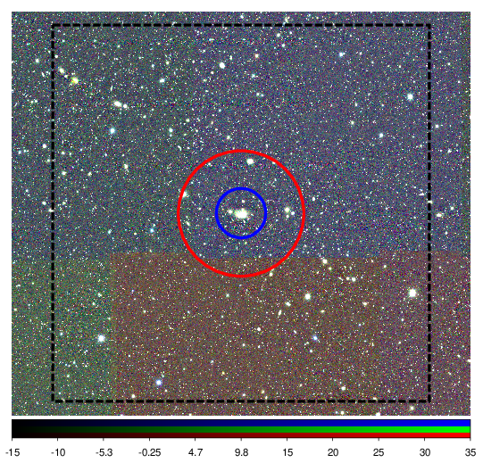  | 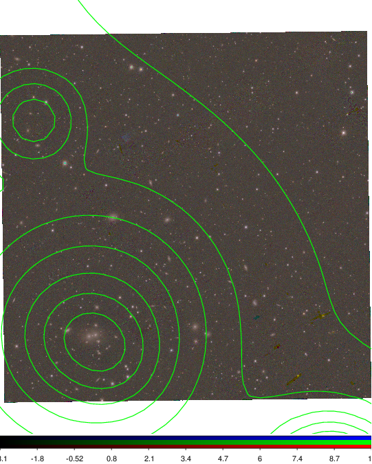  |
