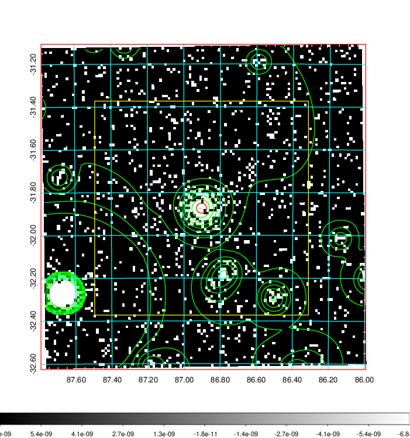
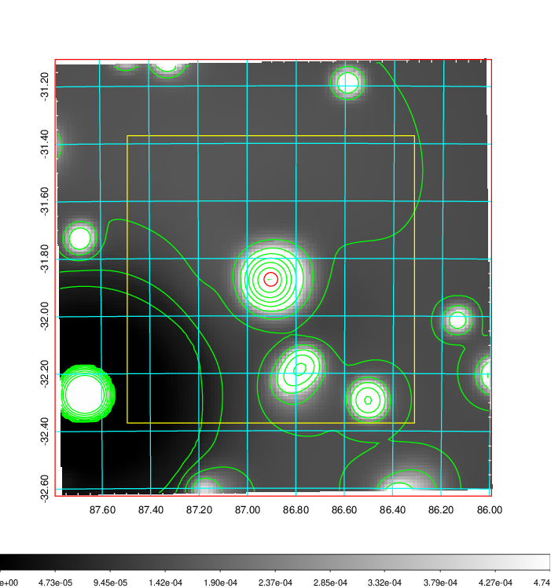
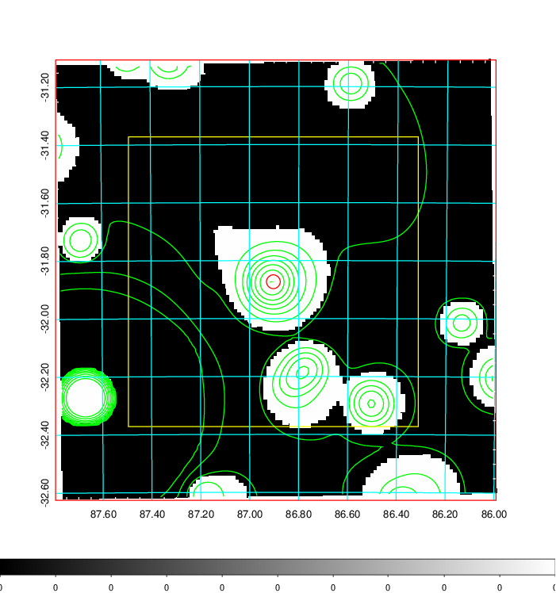
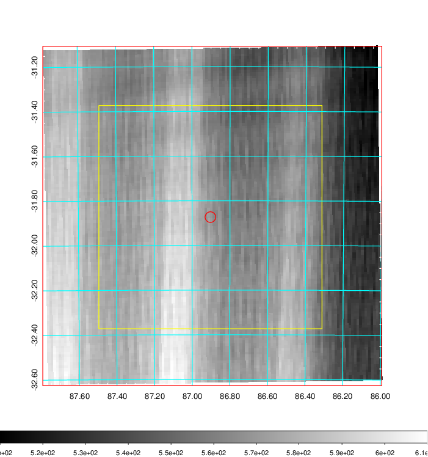
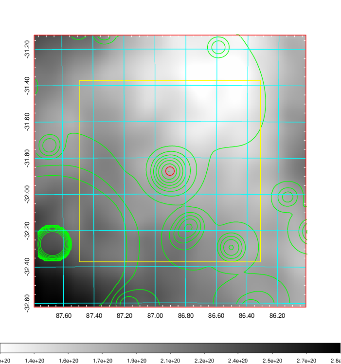
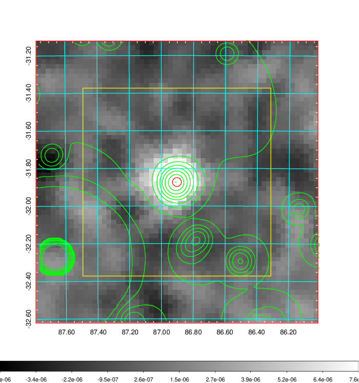
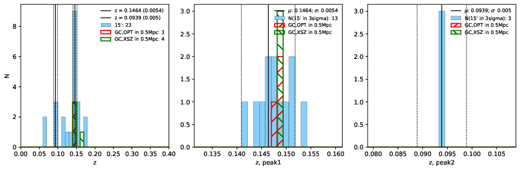
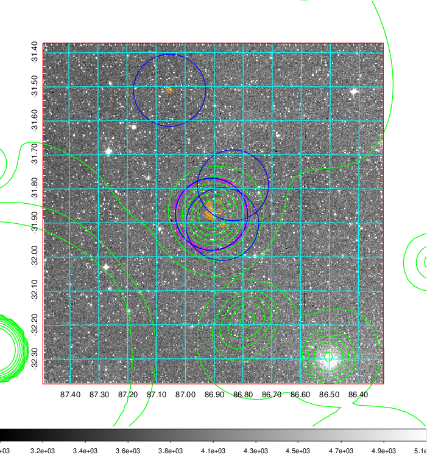
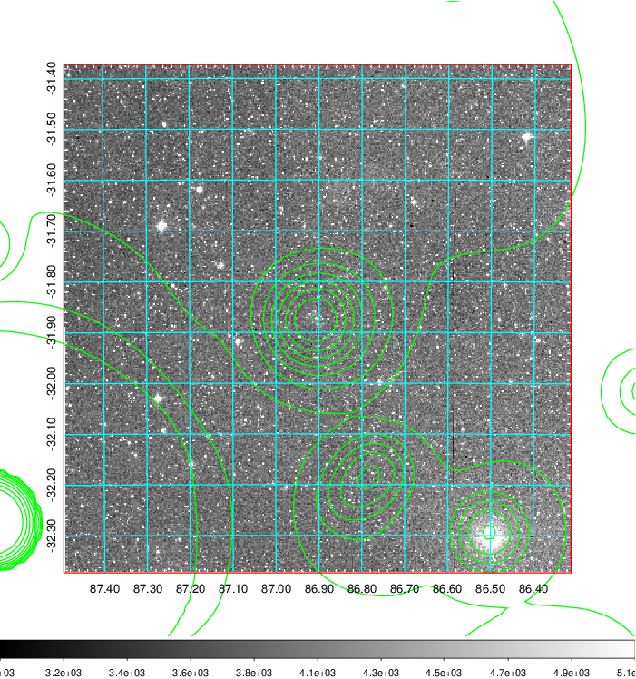
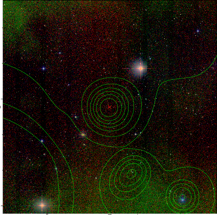

### 222

|Name|RAJ2000[deg]|DEJ2000[deg] |Ext[arcmin]| Ext,ml | z | z_src| C|GC(XSZ,Delta_z<0.01)| GC(OPT,Delta_z<0.01)|GC| R_sig[arcmin] | R500[arcmin] | R500[Mpc]| CRsig[c/s] | CR500[c/s] |L500[1E44 erg/s]|F500[1E-12 erg/s/cm^2]| M500[1E14 Msun]|Tx[keV]|Cnt_sig|Beta|Rc[arcmin]|Comment|Alias|
|---|---|---|---|---|---|------|---|--------|---------|----------|---|---|---|---|---|---|---|---|---|---|---|---|---|---|
|222| 86.903| -31.873| 1.43| 112.40| 0.1464(0.005)| z1, z_xsz| B| MCXC, PSZ2, Tar| A, W| A, MCXC, PSZ2, Tar, W, XB| 12.700| 7.769| 1.194| 0.425(0.036)| 0.399(0.033)| 4.613(0.179)| 7.993(0.311)| 5.59(0.10)| 6.48(0.08)| 247.1| 0.690(-0.070+0.099)| 2.334(-0.524+0.640)| -| k100|

|[RASS image](../image/222/222_img.pdf)|[filtered image](../image/222/222_fil.pdf)|[Segment image](../image/222/222_seg.pdf)|
|-------------------|--------------------|-------------------|
|   |    |   |

|[Exposure image](../image/222/222_mex.pdf)| [nH image](../image/222/222_nh.pdf)| [Planck image](../image/222/222_p.pdf)|
|-------------------|--------------------|-------------------|
|   |     |  |

|[Redshift Histogram](../image/222/222_zg.pdf) | [DSS image(z1)](../image/222/222_dss_z1.pdf)      |  [DSS image(z2)](../image/222/222_dss_z2.pdf)    |
|-------------------|--------------------|-------------------|
| |  Blue circle for optical clusters;  Magenta circle for XSZ clusters;  all with r=1Mpc;  Only GC with Delta_z<0.01 are shown. |  Blue circle for optical clusters;  Magenta circle for XSZ clusters;  all with r=1Mpc;  Only GC with Delta_z<0.01 are shown.  |

|[known Abell/XSZ clusters](../image/222/222_gc.pdf) | [2MASS image](../image/222/222_2mass.pdf)      |
|-------------------|-------------------|
|  Magenta, blue and green circles  for optical, X-ray and SZ clusters  respectively, with redshift of clusters  labelled. The radius of circles  are 1Mpc.|  |

|[DES image](../image/222/222_des.pdf)   |
|-------------------|
|   |
