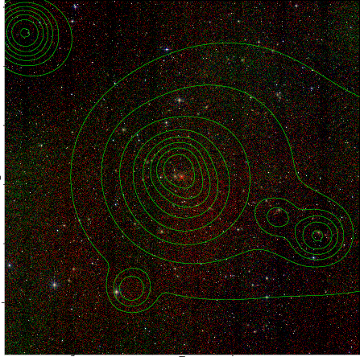

### 224

|Name|RAJ2000[deg]|DEJ2000[deg] |Ext[arcmin]| Ext,ml | z | z_src| C|GC(XSZ,Delta_z<0.01)| GC(OPT,Delta_z<0.01)|GC| R_sig[arcmin] | R500[arcmin] | R500[Mpc]| CRsig[c/s] | CR500[c/s] |L500[1E44 erg/s]|F500[1E-12 erg/s/cm^2]| M500[1E14 Msun]|Tx[keV]|Cnt_sig|Beta|Rc[arcmin]|Comment|Alias|
|---|---|---|---|---|---|------|---|--------|---------|----------|---|---|---|---|---|---|---|---|---|---|---|---|---|---|
|224| 87.158| -25.482| 5.50| 485.34| 0.0402(0.005)| z1, z_xsz| B| MCXC, PSZ2, Tar, XB| A, N, W| A, MCXC, N, PSZ2, Tar, W, XB| 26.675| 17.250| 0.823| 0.832(0.058)| 0.786(0.054)| 0.564(0.025)| 14.962(0.672)| 1.65(0.04)| 2.95(0.04)| 491.0| 0.602(-0.025+0.028)| 4.961(-0.467+0.507)| -| k530|

|[RASS image](../image/224/224_img.pdf)|[filtered image](../image/224/224_fil.pdf)|[Segment image](../image/224/224_seg.pdf)|
|-------------------|--------------------|-------------------|
|   |    |   |

|[Exposure image](../image/224/224_mex.pdf)| [nH image](../image/224/224_nh.pdf)| [Planck image](../image/224/224_p.pdf)|
|-------------------|--------------------|-------------------|
|   |     |  |

|[Redshift Histogram](../image/224/224_zg.pdf) | [DSS image(z1)](../image/224/224_dss_z1.pdf)      |  [DSS image(z2)](../image/224/224_dss_z2.pdf)    |
|-------------------|--------------------|-------------------|
| |  Blue circle for optical clusters;  Magenta circle for XSZ clusters;  all with r=1Mpc;  Only GC with Delta_z<0.01 are shown. |  Blue circle for optical clusters;  Magenta circle for XSZ clusters;  all with r=1Mpc;  Only GC with Delta_z<0.01 are shown.  |

|[Previous-identified clusters](../image/224/224_gc.pdf) | [2MASS image](../image/224/224_2mass.pdf)      |
|-------------------|-------------------|
|  Green, magenta, and blue circles  for optical, X-ray and SZ clusters  respectively, with redshift of clusters  labelled. The radius of circles  are 1Mpc.|  |

|[DES image](../image/224/224_des.pdf)   |[PS1 image](../image/224/224_ps1.pdf)            |
|-------------------|-------------------|
|   |   |
