

### 225

|Name|RAJ2000[deg]|DEJ2000[deg] |Ext[arcmin]| Ext,ml | z | z_src| C|GC(XSZ,Delta_z<0.01)| GC(OPT,Delta_z<0.01)|GC| R_sig[arcmin] | R500[arcmin] | R500[Mpc]| CRsig[c/s] | CR500[c/s] |L500[1E44 erg/s]|F500[1E-12 erg/s/cm^2]| M500[1E14 Msun]|Tx[keV]|Cnt_sig|Beta|Rc[arcmin]|Comment|Alias|
|---|---|---|---|---|---|------|---|--------|---------|----------|---|---|---|---|---|---|---|---|---|---|---|---|---|---|
|225| 87.168| -21.892| 3.45| 100.61| 0.0904(0.007)| z1, z_xsz| B| MCXC, Tar| N, W| A, MCXC, N, Tar, W| 10.750| 8.678| 0.878| 0.228(0.031)| 0.221(0.030)| 0.849(0.066)| 4.150(0.321)| 2.10(0.08)| 3.48(0.09)| 108.5| 0.937(-0.082+0.046)| 7.249(-0.689+0.531)| -| k421|

|[RASS image](../image/225/225_img.pdf)|[filtered image](../image/225/225_fil.pdf)|[Segment image](../image/225/225_seg.pdf)|
|-------------------|--------------------|-------------------|
| 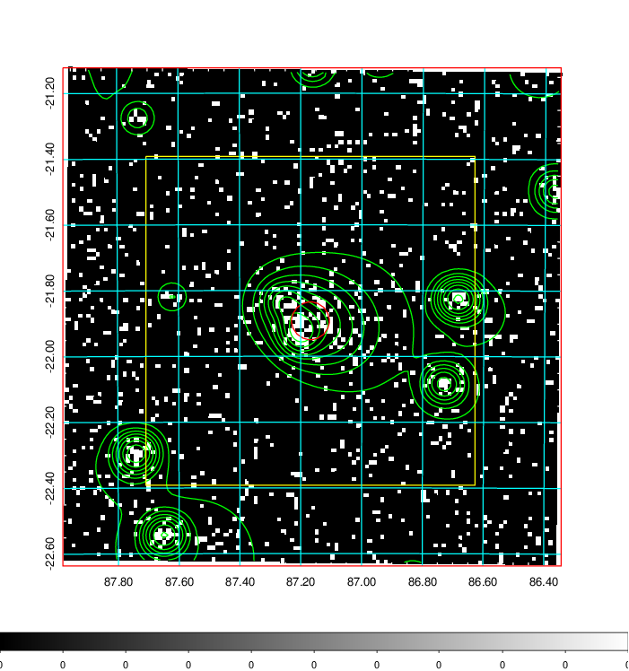  | 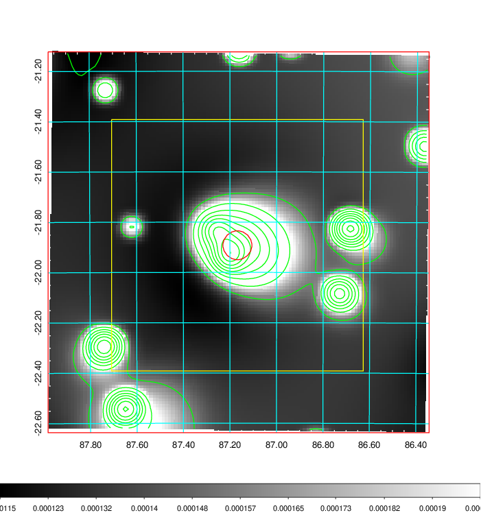   | 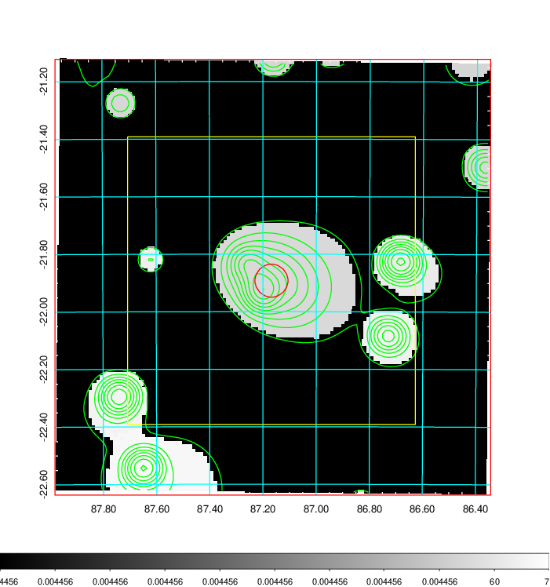  |

|[Exposure image](../image/225/225_mex.pdf)| [nH image](../image/225/225_nh.pdf)| [Planck image](../image/225/225_p.pdf)|
|-------------------|--------------------|-------------------|
|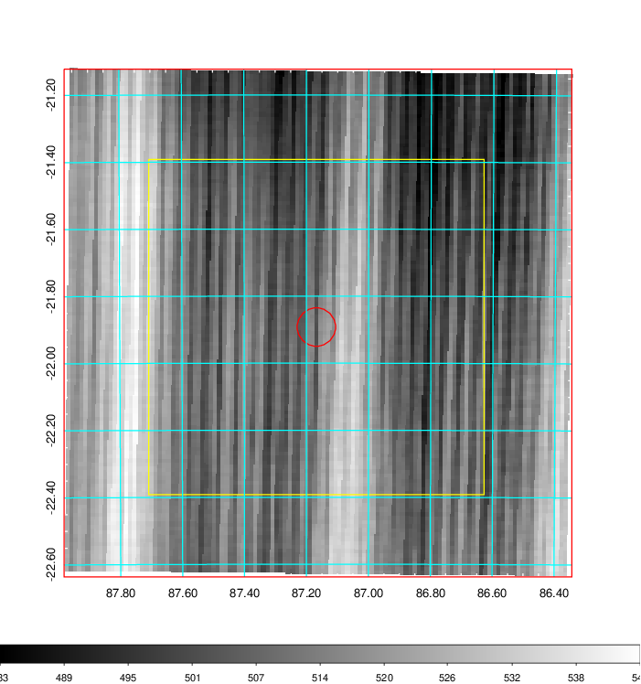   | 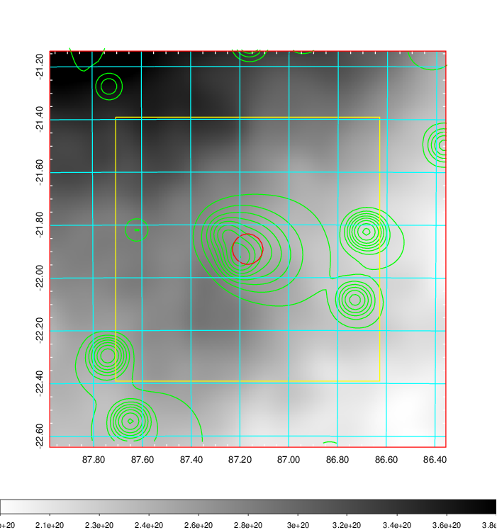    | 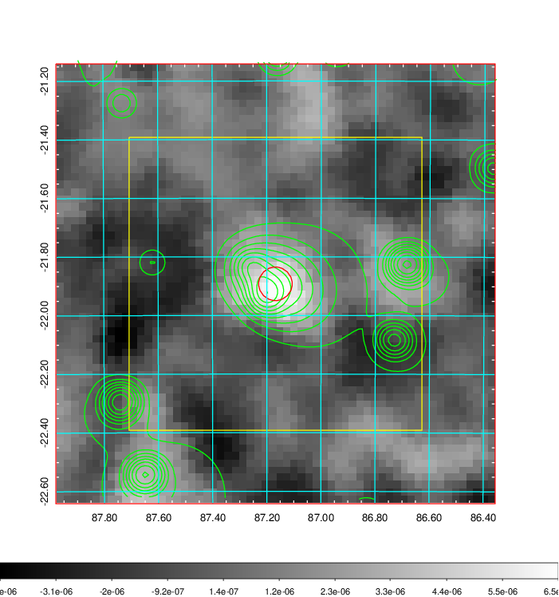 |

|[Redshift Histogram](../image/225/225_zg.pdf) | [DSS image(z1)](../image/225/225_dss_z1.pdf)      |  [DSS image(z2)](../image/225/225_dss_z2.pdf)    |
|-------------------|--------------------|-------------------|
|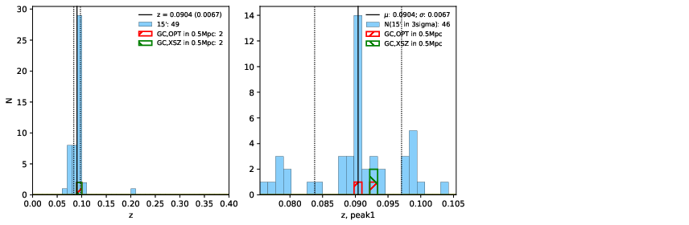 |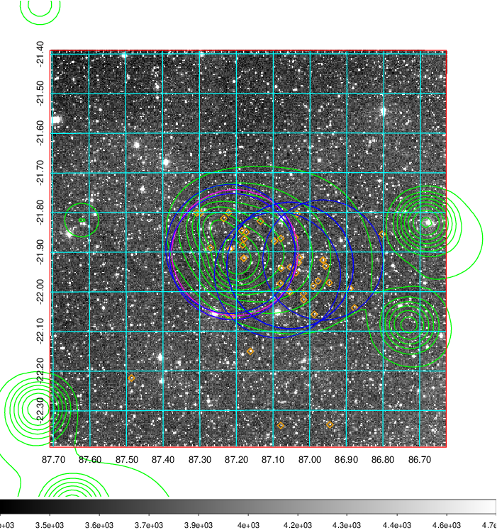  Blue circle for optical clusters;  Magenta circle for XSZ clusters;  all with r=1Mpc;  Only GC with Delta_z<0.01 are shown. | 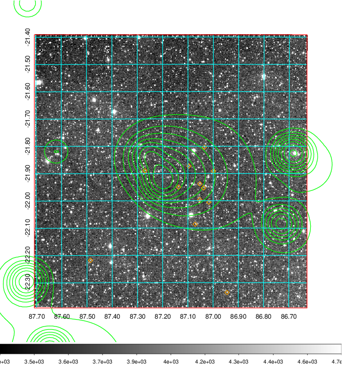 Blue circle for optical clusters;  Magenta circle for XSZ clusters;  all with r=1Mpc;  Only GC with Delta_z<0.01 are shown.  |

|[Previous-identified clusters](../image/225/225_gc.pdf) | [2MASS image](../image/225/225_2mass.pdf)      |
|-------------------|-------------------|
|  Green, magenta, and blue circles  for optical, X-ray and SZ clusters  respectively, with redshift of clusters  labelled. The radius of circles  are 1Mpc.|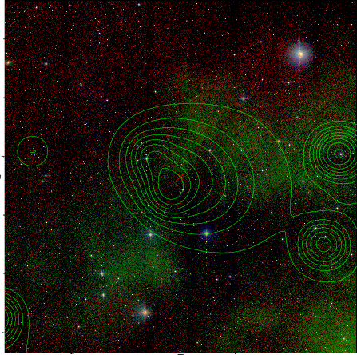  |

|[DES image](../image/225/225_des.pdf)   |[PS1 image](../image/225/225_ps1.pdf)            |
|-------------------|-------------------|
| 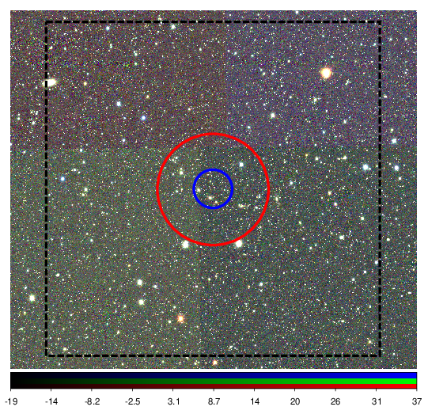  | 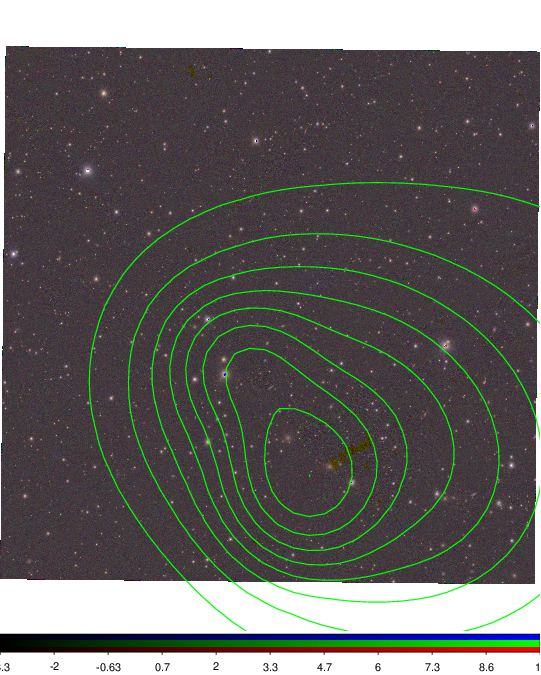  |
