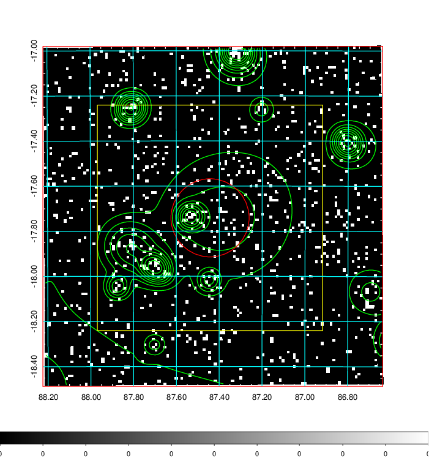
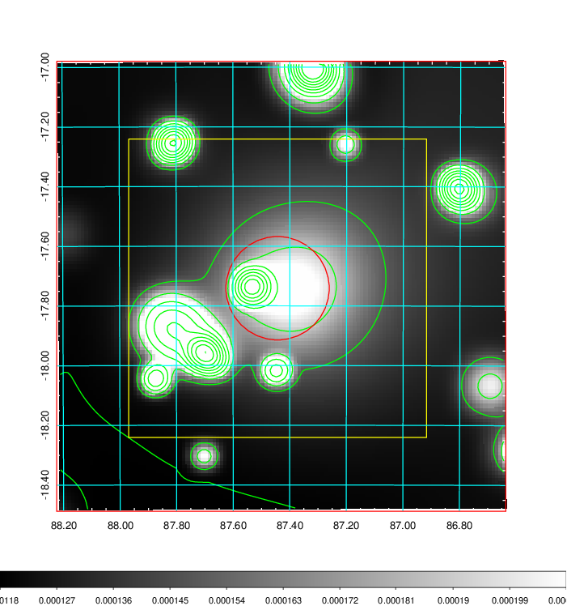
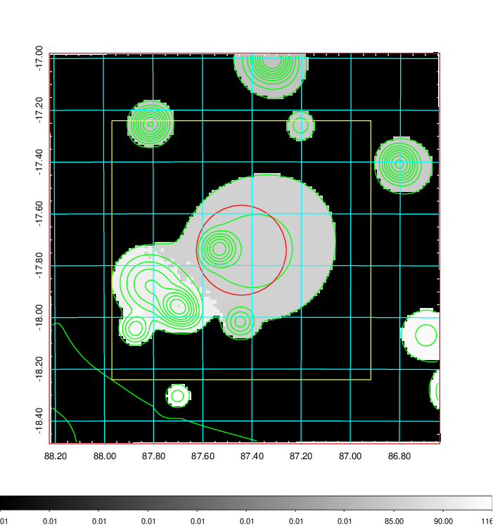
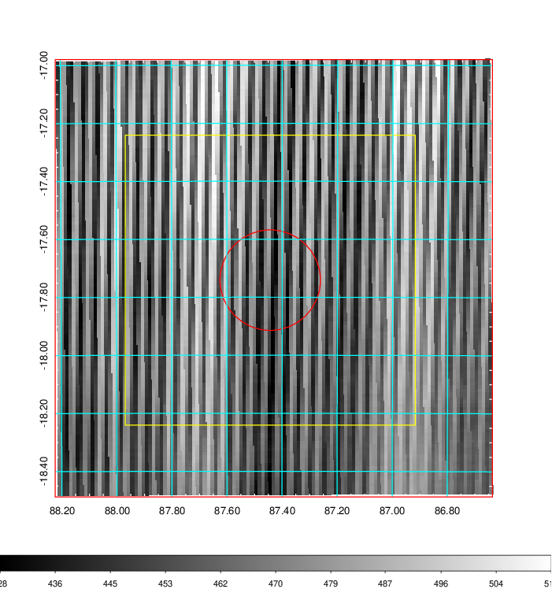
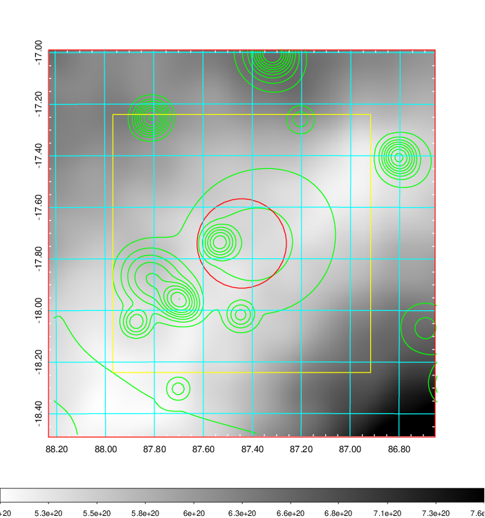
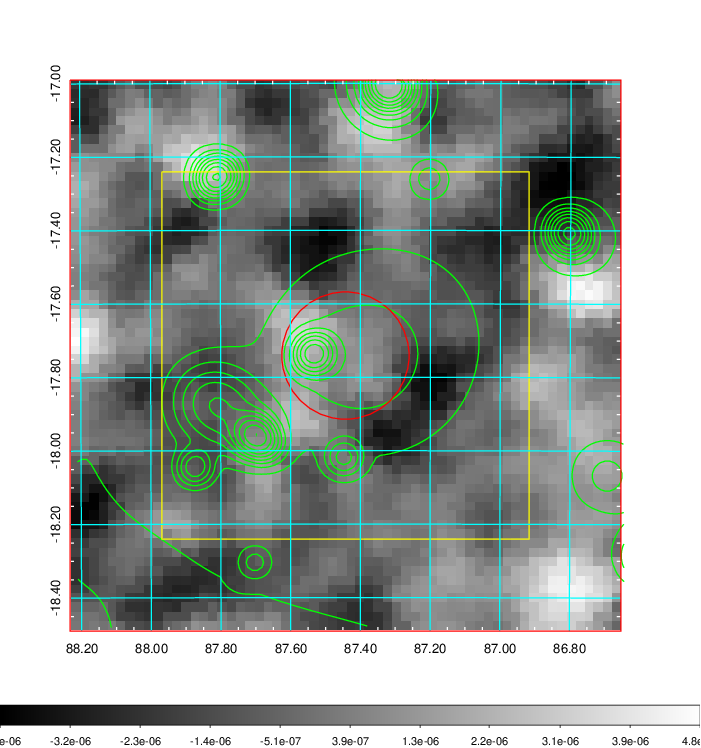
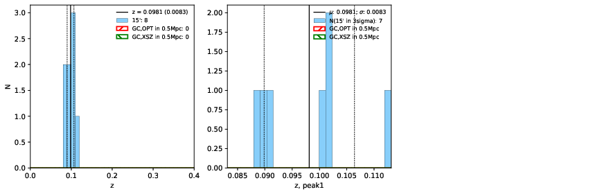
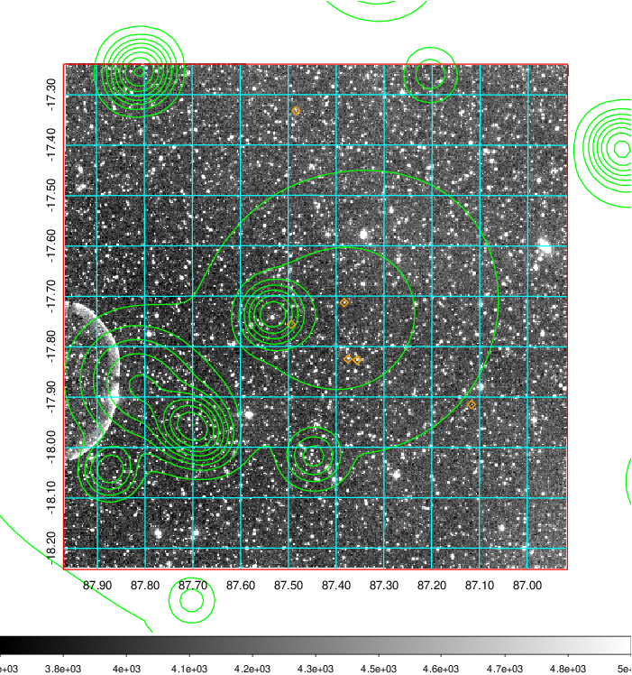
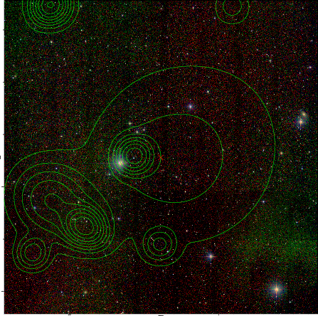
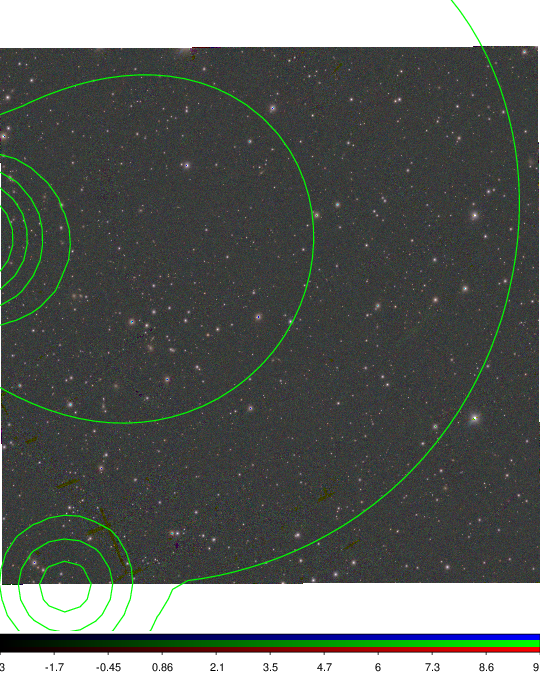

### 226

|Name|RAJ2000[deg]|DEJ2000[deg] |Ext[arcmin]| Ext,ml | z | z_src| C|GC(XSZ,Delta_z<0.01)| GC(OPT,Delta_z<0.01)|GC| R_sig[arcmin] | R500[arcmin] | R500[Mpc]| CRsig[c/s] | CR500[c/s] |L500[1E44 erg/s]|F500[1E-12 erg/s/cm^2]| M500[1E14 Msun]|Tx[keV]|Cnt_sig|Beta|Rc[arcmin]|Comment|Alias|
|---|---|---|---|---|---|------|---|--------|---------|----------|---|---|---|---|---|---|---|---|---|---|---|---|---|---|
|226| 87.443| -17.741| 10.40| 30.04| 0.0981(0.008)| z1,| G| -| -| -| 21.244| 7.356| 0.800| 0.126(0.049)| 0.114(0.044)| 0.489(0.242)| 2.010(0.996)| 1.60(0.40)| 2.95(0.47)| 86.9| 0.520(-0.015+0.031)| 4.949(-0.319+0.497)| -| t454|

|[RASS image](../image/226/226_img.pdf)|[filtered image](../image/226/226_fil.pdf)|[Segment image](../image/226/226_seg.pdf)|
|-------------------|--------------------|-------------------|
|   |    |   |

|[Exposure image](../image/226/226_mex.pdf)| [nH image](../image/226/226_nh.pdf)| [Planck image](../image/226/226_p.pdf)|
|-------------------|--------------------|-------------------|
|   |     |  |

|[Redshift Histogram](../image/226/226_zg.pdf) | [DSS image(z1)](../image/226/226_dss_z1.pdf)      |  [DSS image(z2)](../image/226/226_dss_z2.pdf)    |
|-------------------|--------------------|-------------------|
| |  Blue circle for optical clusters;  Magenta circle for XSZ clusters;  all with r=1Mpc;  Only GC with Delta_z<0.01 are shown. |  Blue circle for optical clusters;  Magenta circle for XSZ clusters;  all with r=1Mpc;  Only GC with Delta_z<0.01 are shown.  |

|[Previous-identified clusters](../image/226/226_gc.pdf) | [2MASS image](../image/226/226_2mass.pdf)      |
|-------------------|-------------------|
|  Green, magenta, and blue circles  for optical, X-ray and SZ clusters  respectively, with redshift of clusters  labelled. The radius of circles  are 1Mpc.|  |

|[PS1 image](../image/226/226_ps1.pdf)            |
|-------------------|
|   |
