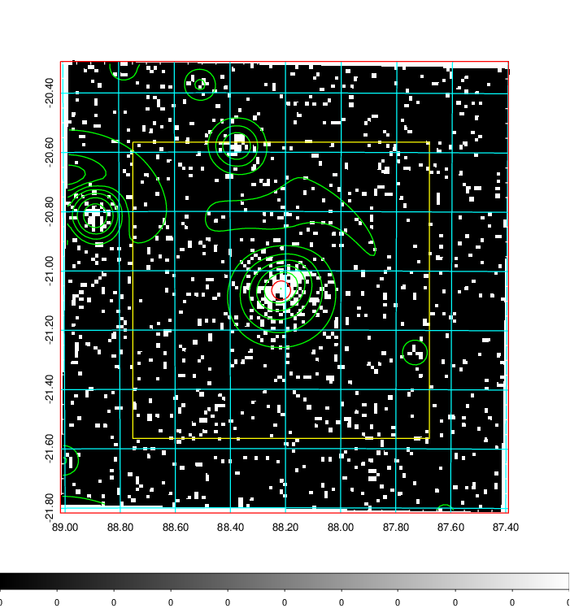
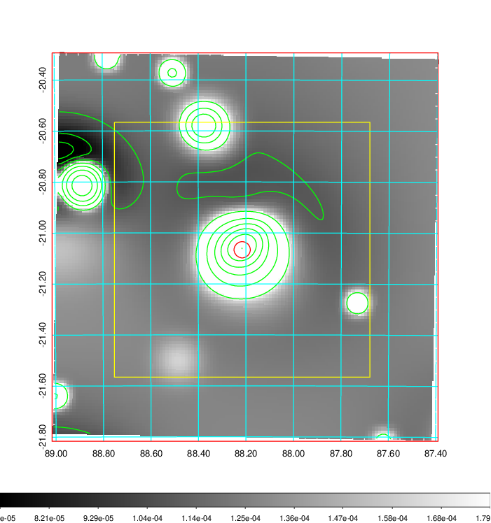
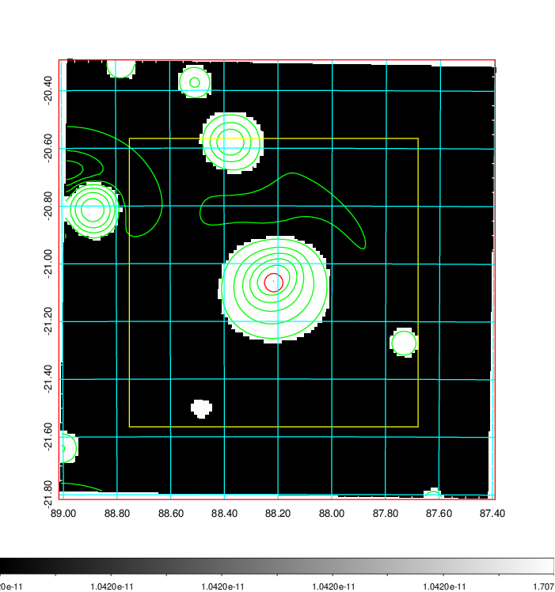
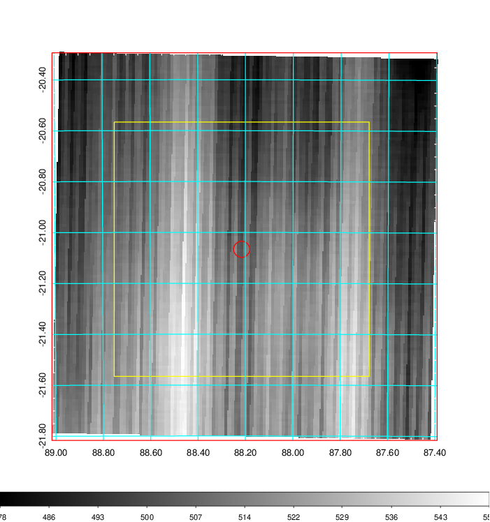
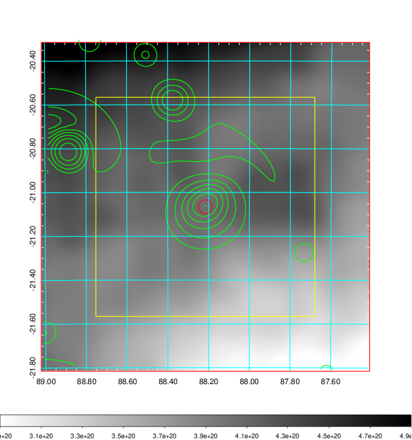
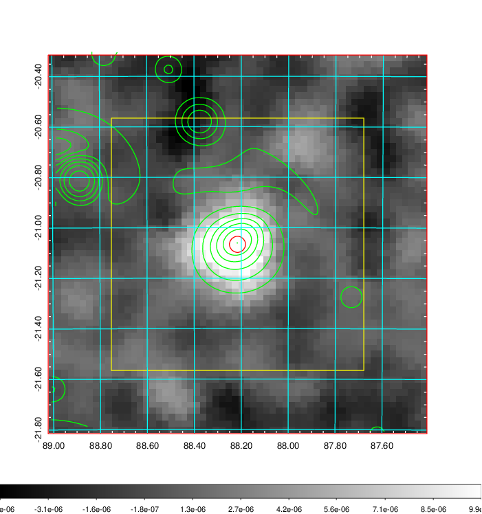
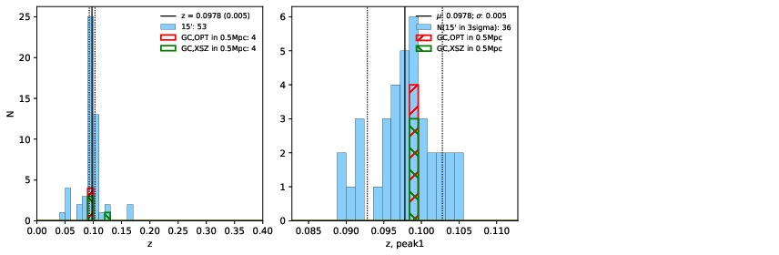
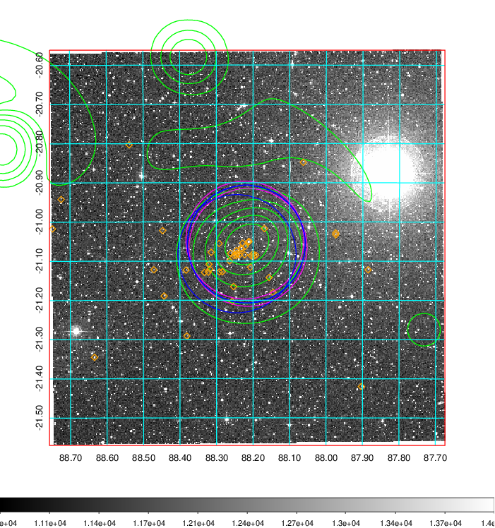
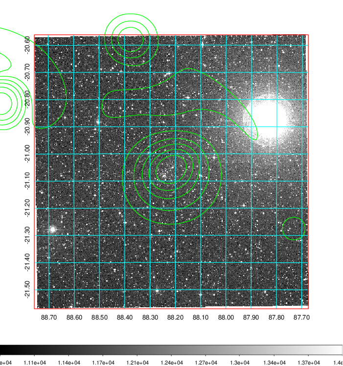

### 227

|Name|RAJ2000[deg]|DEJ2000[deg] |Ext[arcmin]| Ext,ml | z | z_src| C|GC(XSZ,Delta_z<0.01)| GC(OPT,Delta_z<0.01)|GC| R_sig[arcmin] | R500[arcmin] | R500[Mpc]| CRsig[c/s] | CR500[c/s] |L500[1E44 erg/s]|F500[1E-12 erg/s/cm^2]| M500[1E14 Msun]|Tx[keV]|Cnt_sig|Beta|Rc[arcmin]|Comment|Alias|
|---|---|---|---|---|---|------|---|--------|---------|----------|---|---|---|---|---|---|---|---|---|---|---|---|---|---|
|227| 88.216| -21.066| 1.91| 172.64| 0.0978(0.005)| z1, z_xsz| B| MCXC, PSZ2, Tar| A, W| A, MCXC, PSZ2, Tar, W, XB| 14.162| 9.855| 1.069| 0.499(0.038)| 0.475(0.037)| 2.136(0.068)| 8.835(0.281)| 3.82(0.06)| 5.05(0.05)| 251.3| 0.831(-0.095+0.101)| 3.830(-0.648+0.611)| -| k198|

|[RASS image](../image/227/227_img.pdf)|[filtered image](../image/227/227_fil.pdf)|[Segment image](../image/227/227_seg.pdf)|
|-------------------|--------------------|-------------------|
|   |    |   |

|[Exposure image](../image/227/227_mex.pdf)| [nH image](../image/227/227_nh.pdf)| [Planck image](../image/227/227_p.pdf)|
|-------------------|--------------------|-------------------|
|   |     |  |

|[Redshift Histogram](../image/227/227_zg.pdf) | [DSS image(z1)](../image/227/227_dss_z1.pdf)      |  [DSS image(z2)](../image/227/227_dss_z2.pdf)    |
|-------------------|--------------------|-------------------|
| |  Blue circle for optical clusters;  Magenta circle for XSZ clusters;  all with r=1Mpc;  Only GC with Delta_z<0.01 are shown. |  Blue circle for optical clusters;  Magenta circle for XSZ clusters;  all with r=1Mpc;  Only GC with Delta_z<0.01 are shown.  |

|[known Abell/XSZ clusters](../image/227/227_gc.pdf) | [2MASS image](../image/227/227_2mass.pdf)      |
|-------------------|-------------------|
|  Magenta, blue and green circles  for optical, X-ray and SZ clusters  respectively, with redshift of clusters  labelled. The radius of circles  are 1Mpc.|  |

|[DES image](../image/227/227_des.pdf)   |[PS1 image](../image/227/227_ps1.pdf)            |
|-------------------|-------------------|
|   |   |
