

### 228

|Name|RAJ2000[deg]|DEJ2000[deg] |Ext[arcmin]| Ext,ml | z | z_src| C|GC(XSZ,Delta_z<0.01)| GC(OPT,Delta_z<0.01)|GC| R_sig[arcmin] | R500[arcmin] | R500[Mpc]| CRsig[c/s] | CR500[c/s] |L500[1E44 erg/s]|F500[1E-12 erg/s/cm^2]| M500[1E14 Msun]|Tx[keV]|Cnt_sig|Beta|Rc[arcmin]|Comment|Alias|
|---|---|---|---|---|---|------|---|--------|---------|----------|---|---|---|---|---|---|---|---|---|---|---|---|---|---|
|228| 89.290| -37.478| 2.09| 128.24| 0.0450(0.005)| z1, z_xsz| B| MCXC| A, N| A, MCXC, N| 13.188| 13.766| 0.731| 0.346(0.031)| 0.348(0.031)| 0.299(0.016)| 6.280(0.333)| 1.16(0.03)| 2.38(0.04)| 230.9| 0.676(-0.071+0.102)| 3.203(-0.643+0.815)| -| k231|

|[RASS image](../image/228/228_img.pdf)|[filtered image](../image/228/228_fil.pdf)|[Segment image](../image/228/228_seg.pdf)|
|-------------------|--------------------|-------------------|
| 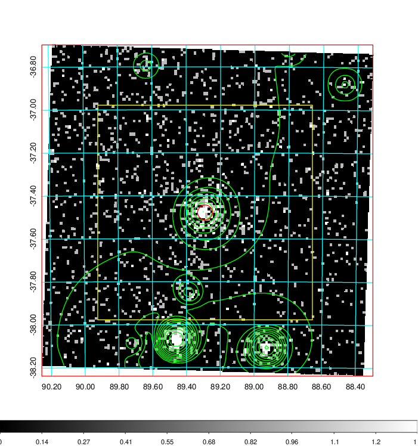  | 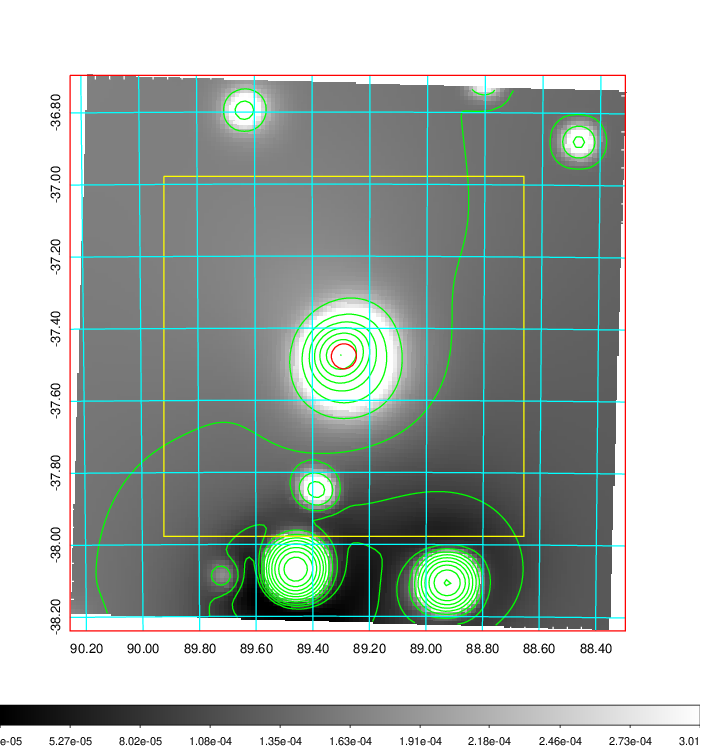   | 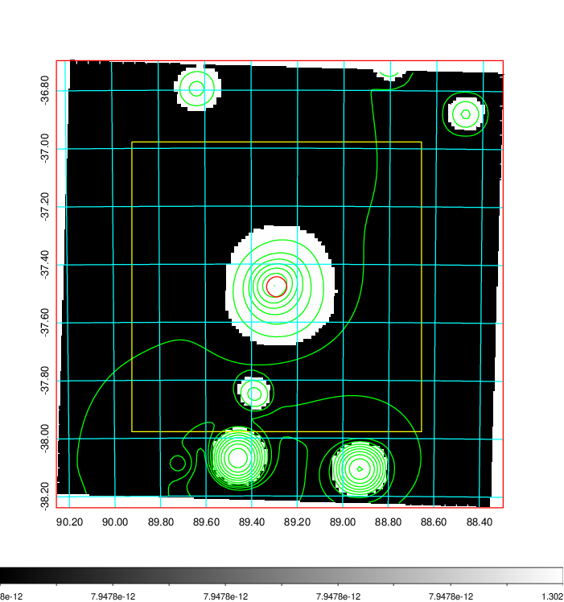  |

|[Exposure image](../image/228/228_mex.pdf)| [nH image](../image/228/228_nh.pdf)| [Planck image](../image/228/228_p.pdf)|
|-------------------|--------------------|-------------------|
|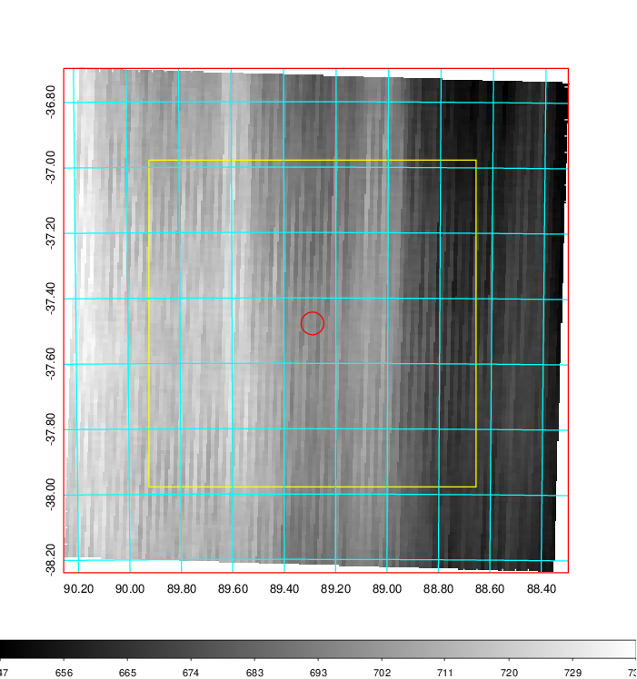   | 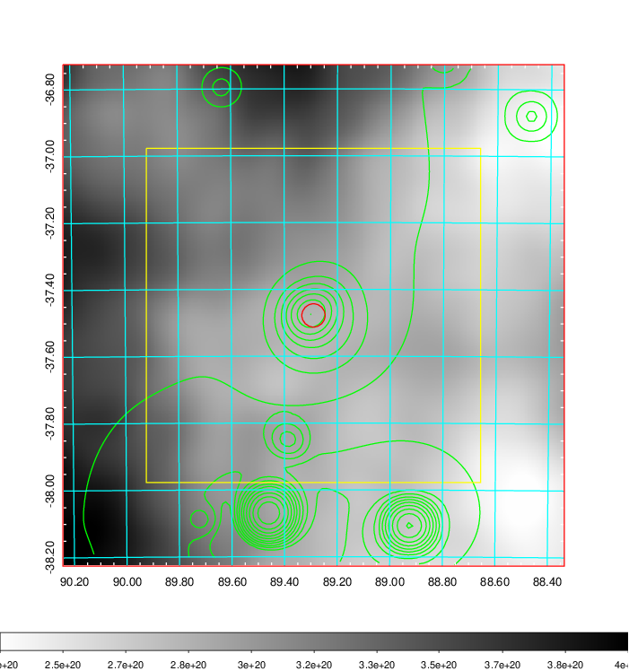    | 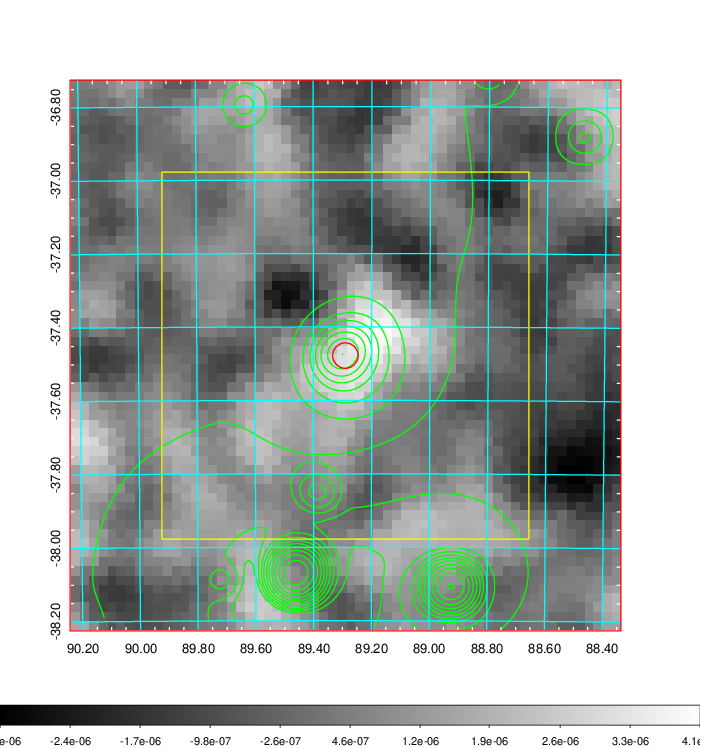 |

|[Redshift Histogram](../image/228/228_zg.pdf) | [DSS image(z1)](../image/228/228_dss_z1.pdf)      |  [DSS image(z2)](../image/228/228_dss_z2.pdf)    |
|-------------------|--------------------|-------------------|
|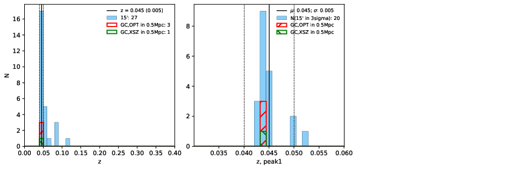 |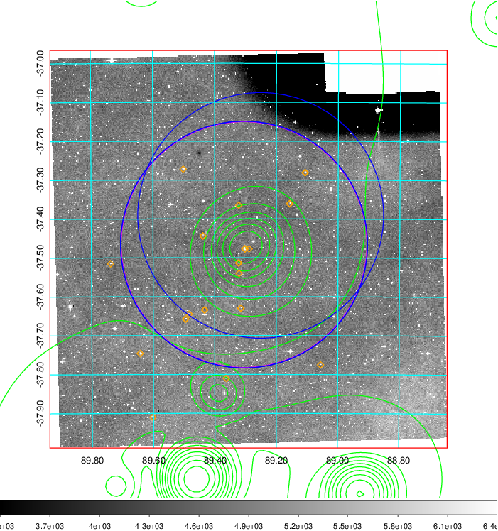  Blue circle for optical clusters;  Magenta circle for XSZ clusters;  all with r=1Mpc;  Only GC with Delta_z<0.01 are shown. | 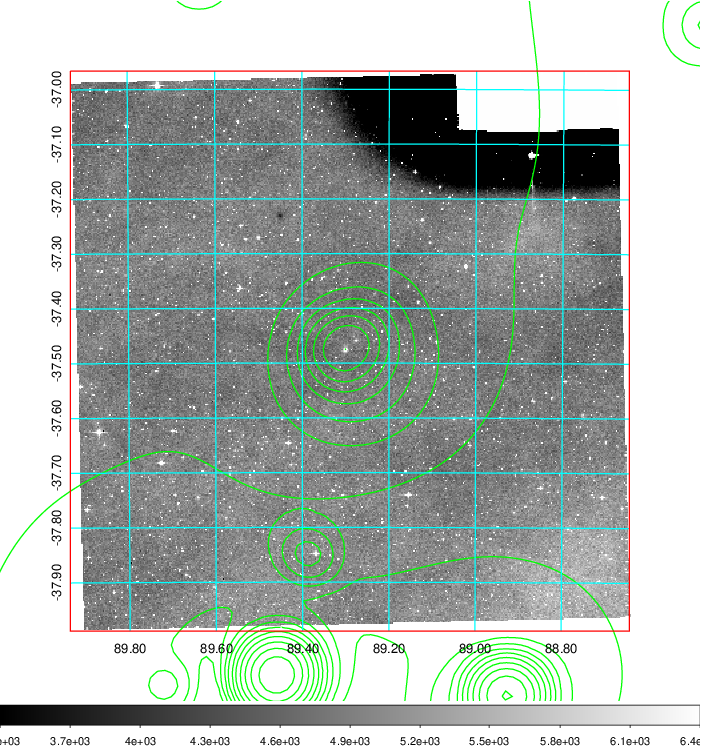 Blue circle for optical clusters;  Magenta circle for XSZ clusters;  all with r=1Mpc;  Only GC with Delta_z<0.01 are shown.  |

|[Previous-identified clusters](../image/228/228_gc.pdf) | [2MASS image](../image/228/228_2mass.pdf)      |
|-------------------|-------------------|
|  Green, magenta, and blue circles  for optical, X-ray and SZ clusters  respectively, with redshift of clusters  labelled. The radius of circles  are 1Mpc.|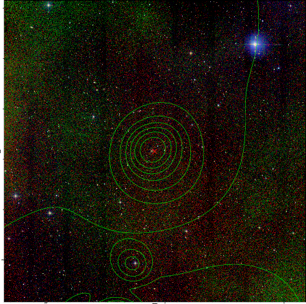  |

|[DES image](../image/228/228_des.pdf)   |
|-------------------|
| 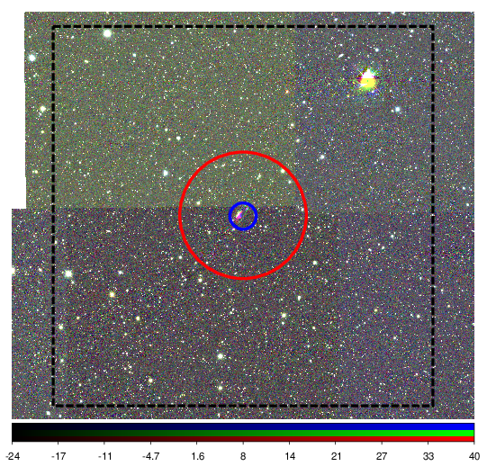  |
