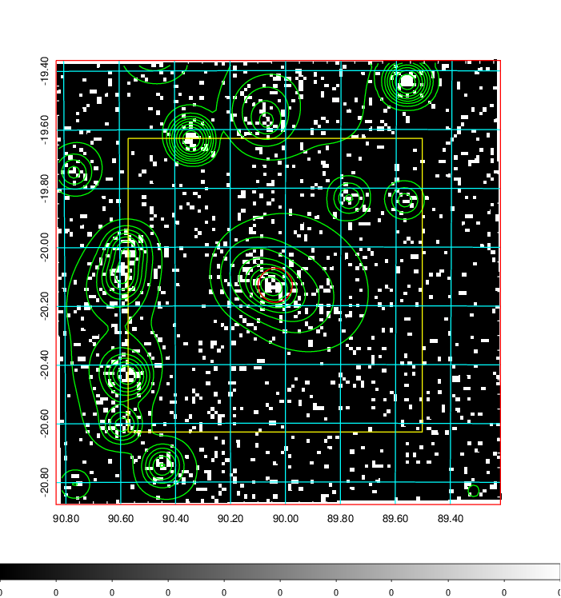
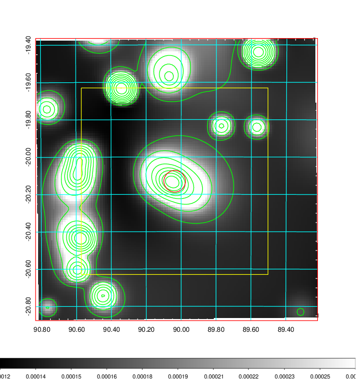
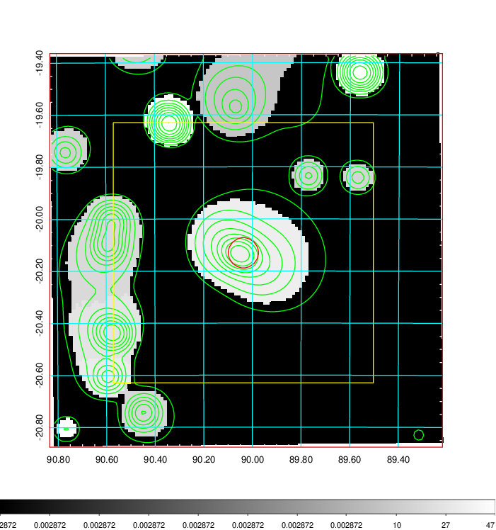
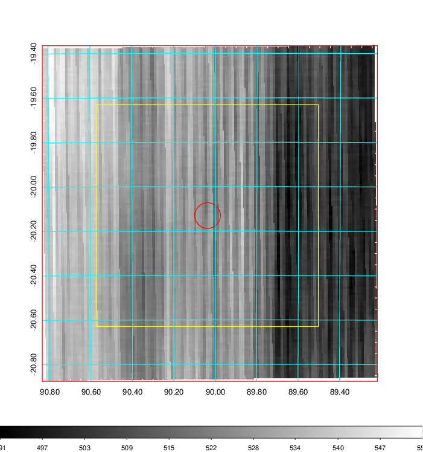
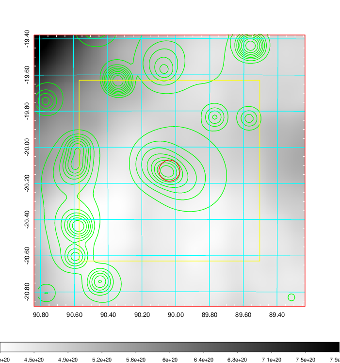
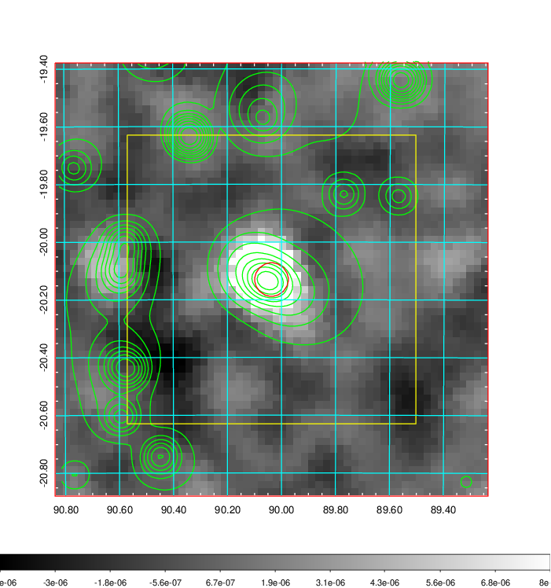
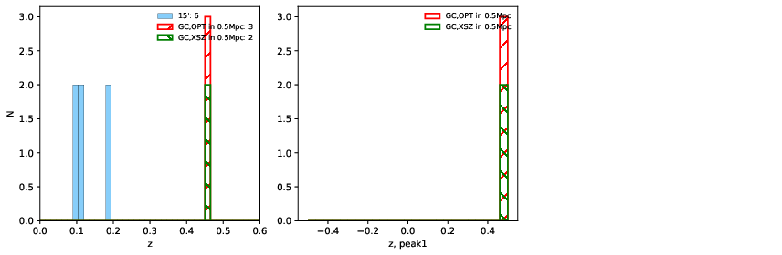
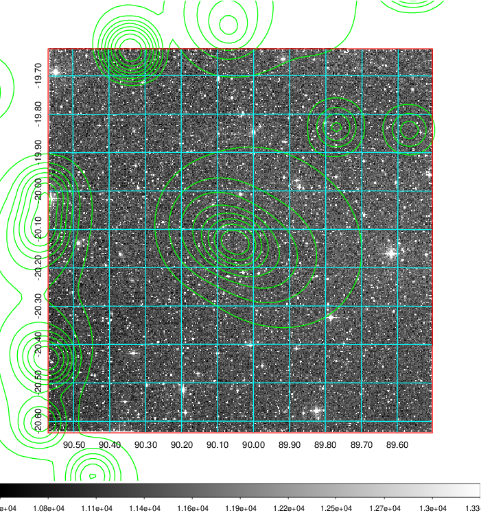
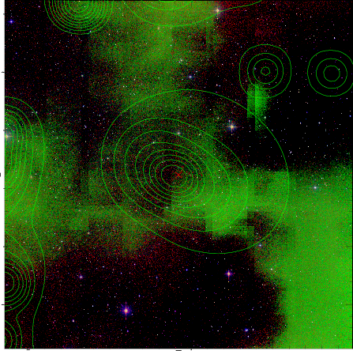
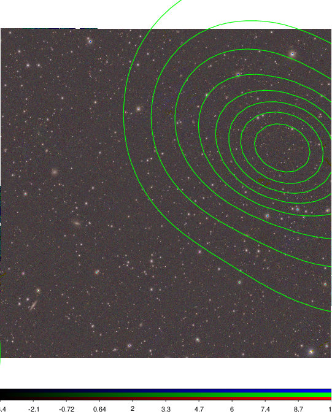

### 229

|Name|RAJ2000[deg]|DEJ2000[deg] |Ext[arcmin]| Ext,ml | z | z_src| C|GC(XSZ,Delta_z<0.01)| GC(OPT,Delta_z<0.01)|GC| R_sig[arcmin] | R500[arcmin] | R500[Mpc]| CRsig[c/s] | CR500[c/s] |L500[1E44 erg/s]|F500[1E-12 erg/s/cm^2]| M500[1E14 Msun]|Tx[keV]|Cnt_sig|Beta|Rc[arcmin]|Comment|Alias|
|---|---|---|---|---|---|------|---|--------|---------|----------|---|---|---|---|---|---|---|---|---|---|---|---|---|---|
|229| 90.037| -20.130| 3.49| 63.33| 0.4600(0.000)| z_xsz| B| Tar| N| N, PSZ2, Tar| 11.238| 4.102| 1.435| 0.179(0.032)| 0.162(0.029)| 24.988(2.579)| 3.177(0.328)| 13.75(0.60)| 12.65(0.36)| 109.9| 0.771(-0.144+0.147)| 4.556(-1.316+1.178)| -| k430|

|[RASS image](../image/229/229_img.pdf)|[filtered image](../image/229/229_fil.pdf)|[Segment image](../image/229/229_seg.pdf)|
|-------------------|--------------------|-------------------|
|   |    |   |

|[Exposure image](../image/229/229_mex.pdf)| [nH image](../image/229/229_nh.pdf)| [Planck image](../image/229/229_p.pdf)|
|-------------------|--------------------|-------------------|
|   |     |  |

|[Redshift Histogram](../image/229/229_zg.pdf) | [DSS image(z1)](../image/229/229_dss_z1.pdf)      |  [DSS image(z2)](../image/229/229_dss_z2.pdf)    |
|-------------------|--------------------|-------------------|
| |  Blue circle for optical clusters;  Magenta circle for XSZ clusters;  all with r=1Mpc;  Only GC with Delta_z<0.01 are shown. |  Blue circle for optical clusters;  Magenta circle for XSZ clusters;  all with r=1Mpc;  Only GC with Delta_z<0.01 are shown.  |

|[Previous-identified clusters](../image/229/229_gc.pdf) | [2MASS image](../image/229/229_2mass.pdf)      |
|-------------------|-------------------|
|  Green, magenta, and blue circles  for optical, X-ray and SZ clusters  respectively, with redshift of clusters  labelled. The radius of circles  are 1Mpc.|  |

|[PS1 image](../image/229/229_ps1.pdf)            |
|-------------------|
|   |
