

### 23

|Name|RAJ2000[deg]|DEJ2000[deg] |Ext[arcmin]| Ext,ml | z | z_src| C|GC(XSZ,Delta_z<0.01)| GC(OPT,Delta_z<0.01)|GC| R_sig[arcmin] | R500[arcmin] | R500[Mpc]| CRsig[c/s] | CR500[c/s] |L500[1E44 erg/s]|F500[1E-12 erg/s/cm^2]| M500[1E14 Msun]|Tx[keV]|Cnt_sig|Beta|Rc[arcmin]|Comment|Alias|
|---|---|---|---|---|---|------|---|--------|---------|----------|---|---|---|---|---|---|---|---|---|---|---|---|---|---|
|23| 6.377| -33.039| 2.38| 120.49| 0.0512(0.005)| z1, z_xsz| B| MCXC, PSZ2, Tar| A, N, W| A, MCXC, N, PSZ2, Tar, W| 12.212| 13.760| 0.825| 0.500(0.051)| 0.510(0.052)| 0.610(0.036)| 9.820(0.574)| 1.68(0.05)| 2.99(0.06)| 156.8| 0.846(-0.111+0.102)| 4.645(-0.824+0.687)| -| k277|

|[RASS image](../image/23/23_img.pdf)|[filtered image](../image/23/23_fil.pdf)|[Segment image](../image/23/23_seg.pdf)|
|-------------------|--------------------|-------------------|
| 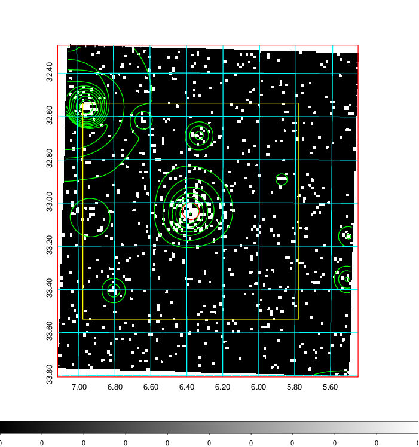  | 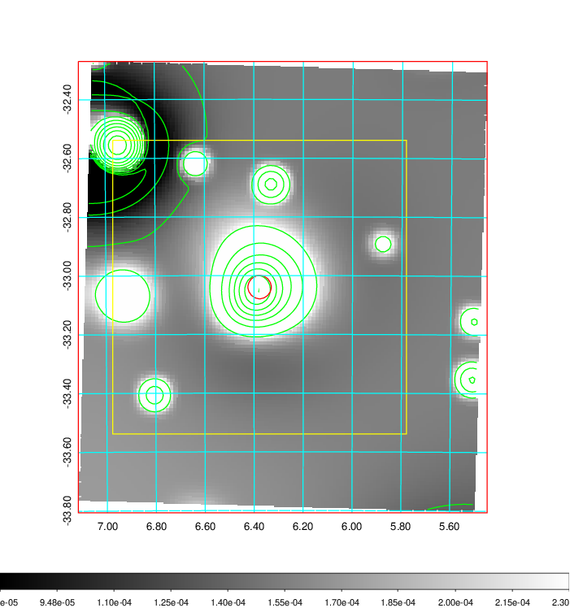   | 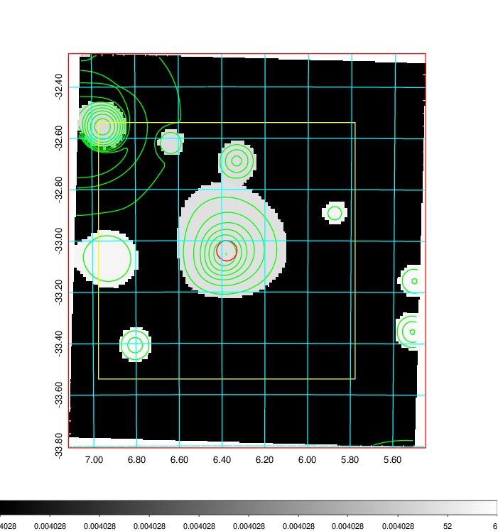  |

|[Exposure image](../image/23/23_mex.pdf)| [nH image](../image/23/23_nh.pdf)| [Planck image](../image/23/23_p.pdf)|
|-------------------|--------------------|-------------------|
|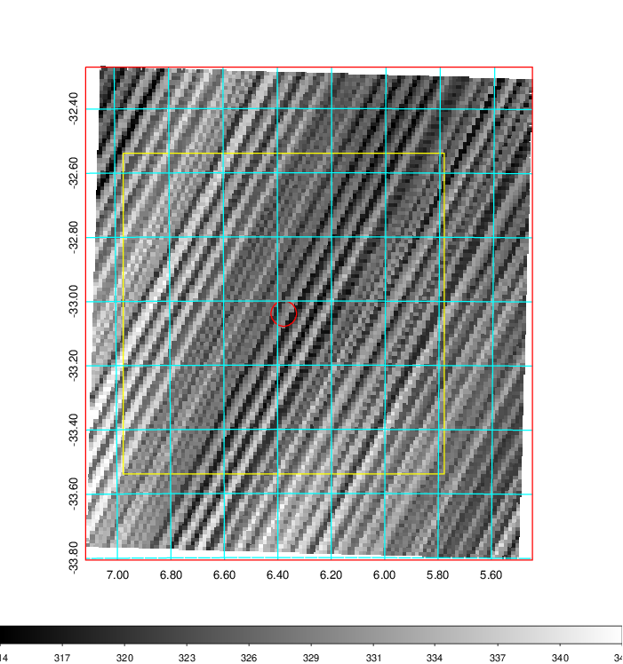   | 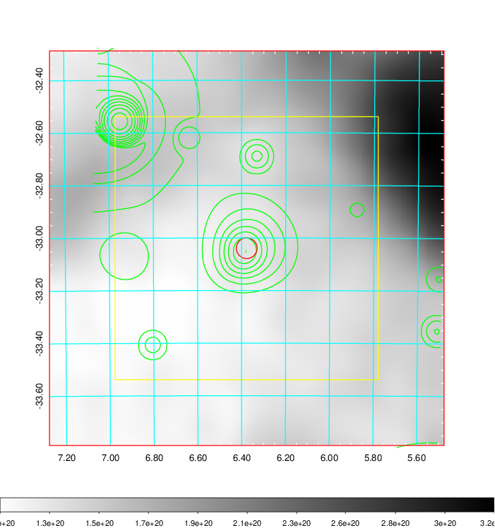    | 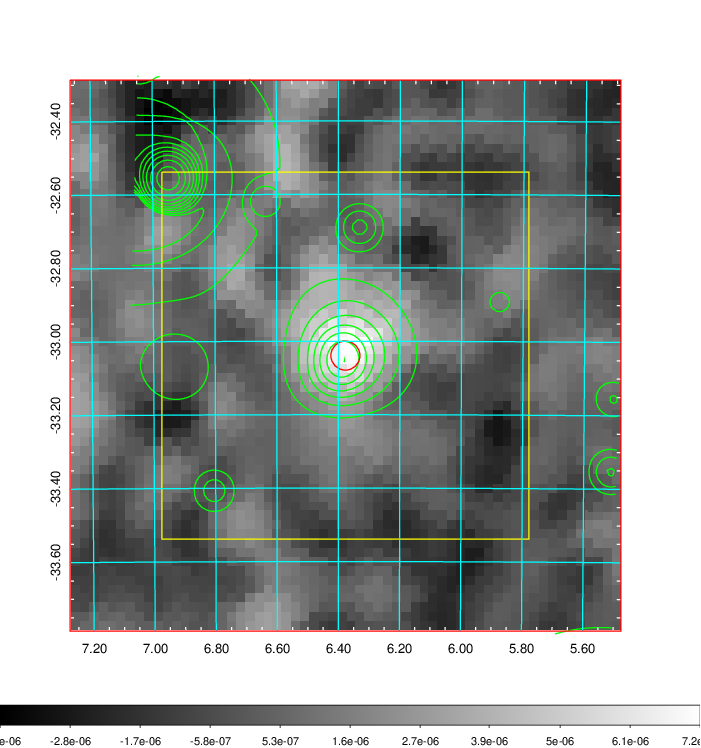 |

|[Redshift Histogram](../image/23/23_zg.pdf) | [DSS image(z1)](../image/23/23_dss_z1.pdf)      |  [DSS image(z2)](../image/23/23_dss_z2.pdf)    |
|-------------------|--------------------|-------------------|
|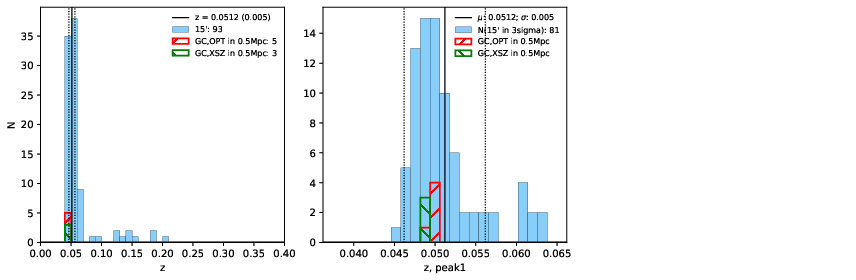 |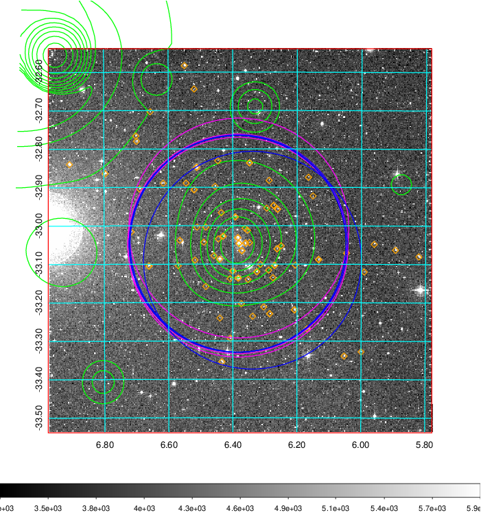  Blue circle for optical clusters;  Magenta circle for XSZ clusters;  all with r=1Mpc;  Only GC with Delta_z<0.01 are shown. | 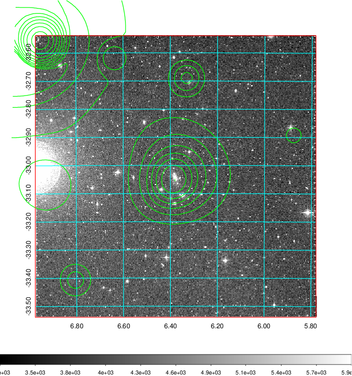 Blue circle for optical clusters;  Magenta circle for XSZ clusters;  all with r=1Mpc;  Only GC with Delta_z<0.01 are shown.  |

|[Previous-identified clusters](../image/23/23_gc.pdf) | [2MASS image](../image/23/23_2mass.pdf)      |
|-------------------|-------------------|
|  Green, magenta, and blue circles  for optical, X-ray and SZ clusters  respectively, with redshift of clusters  labelled. The radius of circles  are 1Mpc.|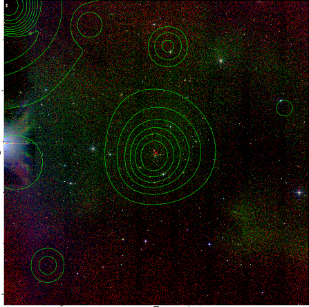  |

|[DES image](../image/23/23_des.pdf)   |[ATLAS image](../image/23/23_s.pdf)        |
|-------------------|-------------------|
| 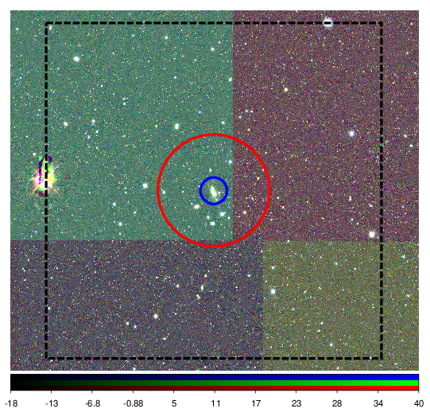  | 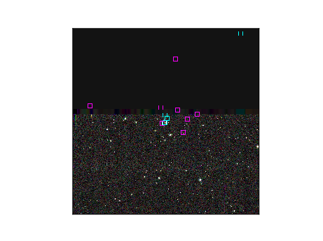  |
