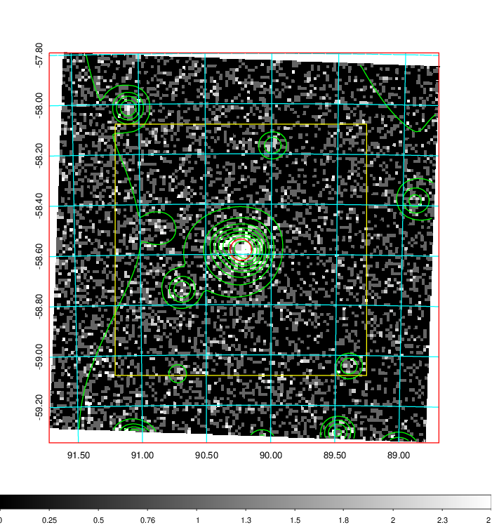
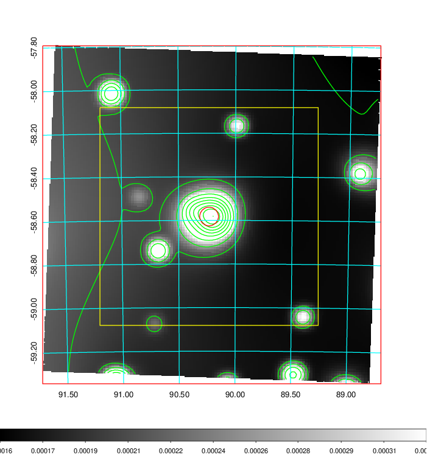
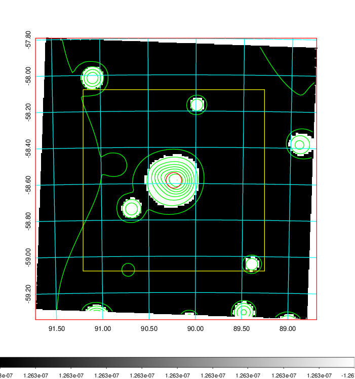
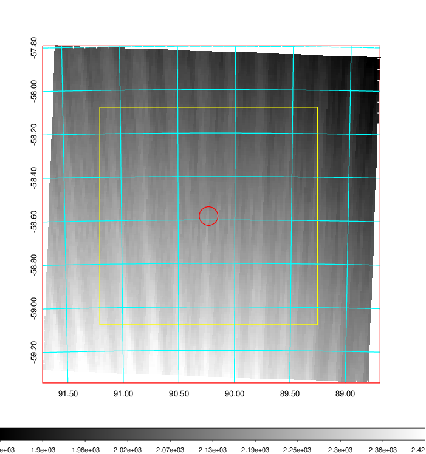
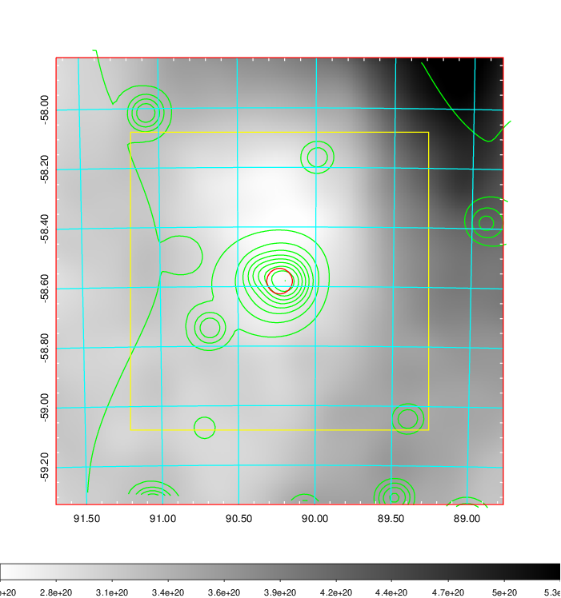
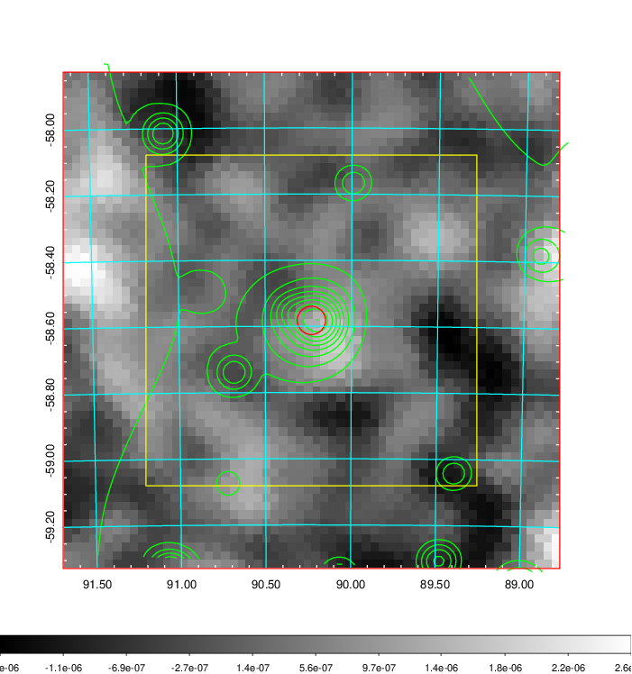
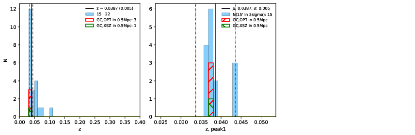
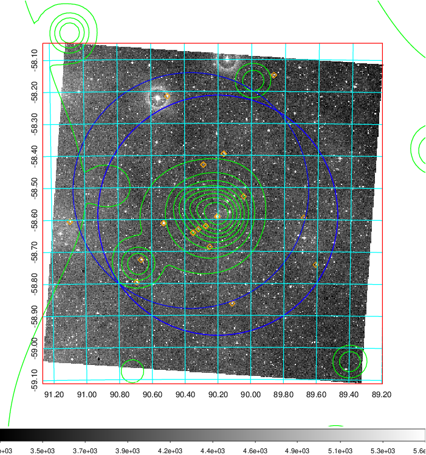
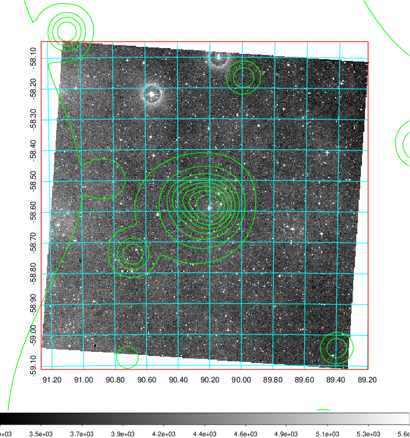
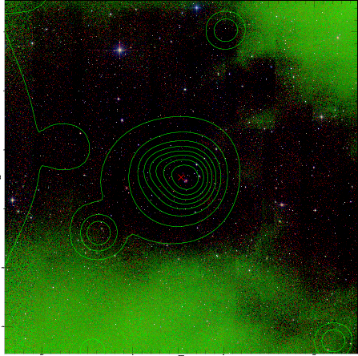

### 230

|Name|RAJ2000[deg]|DEJ2000[deg] |Ext[arcmin]| Ext,ml | z | z_src| C|GC(XSZ,Delta_z<0.01)| GC(OPT,Delta_z<0.01)|GC| R_sig[arcmin] | R500[arcmin] | R500[Mpc]| CRsig[c/s] | CR500[c/s] |L500[1E44 erg/s]|F500[1E-12 erg/s/cm^2]| M500[1E14 Msun]|Tx[keV]|Cnt_sig|Beta|Rc[arcmin]|Comment|Alias|
|---|---|---|---|---|---|------|---|--------|---------|----------|---|---|---|---|---|---|---|---|---|---|---|---|---|---|
|230| 90.232| -58.582| 2.58| 168.82| 0.0387(0.005)| z1, z_xsz| B| MCXC| A, N| A, MCXC, N| 18.281| 11.648| 0.536| 0.120(0.021)| 0.113(0.020)| 0.060(0.006)| 1.717(0.167)| 0.45(0.02)| 1.33(0.04)| 335.1| 0.974(-0.038+0.019)| 4.782(-0.251+0.212)| -| k313|

|[RASS image](../image/230/230_img.pdf)|[filtered image](../image/230/230_fil.pdf)|[Segment image](../image/230/230_seg.pdf)|
|-------------------|--------------------|-------------------|
|   |    |   |

|[Exposure image](../image/230/230_mex.pdf)| [nH image](../image/230/230_nh.pdf)| [Planck image](../image/230/230_p.pdf)|
|-------------------|--------------------|-------------------|
|   |     |  |

|[Redshift Histogram](../image/230/230_zg.pdf) | [DSS image(z1)](../image/230/230_dss_z1.pdf)      |  [DSS image(z2)](../image/230/230_dss_z2.pdf)    |
|-------------------|--------------------|-------------------|
| |  Blue circle for optical clusters;  Magenta circle for XSZ clusters;  all with r=1Mpc;  Only GC with Delta_z<0.01 are shown. |  Blue circle for optical clusters;  Magenta circle for XSZ clusters;  all with r=1Mpc;  Only GC with Delta_z<0.01 are shown.  |

|[known Abell/XSZ clusters](../image/230/230_gc.pdf) | [2MASS image](../image/230/230_2mass.pdf)      |
|-------------------|-------------------|
|  Magenta, blue and green circles  for optical, X-ray and SZ clusters  respectively, with redshift of clusters  labelled. The radius of circles  are 1Mpc.|  |

|[DES image](../image/230/230_des.pdf)   |
|-------------------|
|   |
