

### 231

|Name|RAJ2000[deg]|DEJ2000[deg] |Ext[arcmin]| Ext,ml | z | z_src| C|GC(XSZ,Delta_z<0.01)| GC(OPT,Delta_z<0.01)|GC| R_sig[arcmin] | R500[arcmin] | R500[Mpc]| CRsig[c/s] | CR500[c/s] |L500[1E44 erg/s]|F500[1E-12 erg/s/cm^2]| M500[1E14 Msun]|Tx[keV]|Cnt_sig|Beta|Rc[arcmin]|Comment|Alias|
|---|---|---|---|---|---|------|---|--------|---------|----------|---|---|---|---|---|---|---|---|---|---|---|---|---|---|
|231| 90.417| -39.994| 6.59| 1265.52| 0.0463(0.005)| z1, z_xsz| B| MCXC, PSZ2, Tar, XB| A, N| A, MCXC, N, PSZ2, Tar, W, XB| 25.194| 16.494| 0.900| 0.944(0.048)| 0.893(0.046)| 0.811(0.020)| 16.087(0.401)| 2.16(0.03)| 3.50(0.03)| 800.8| 0.991(-0.014+0.007)| 10.233(-0.192+0.169)| -| k552|

|[RASS image](../image/231/231_img.pdf)|[filtered image](../image/231/231_fil.pdf)|[Segment image](../image/231/231_seg.pdf)|
|-------------------|--------------------|-------------------|
| 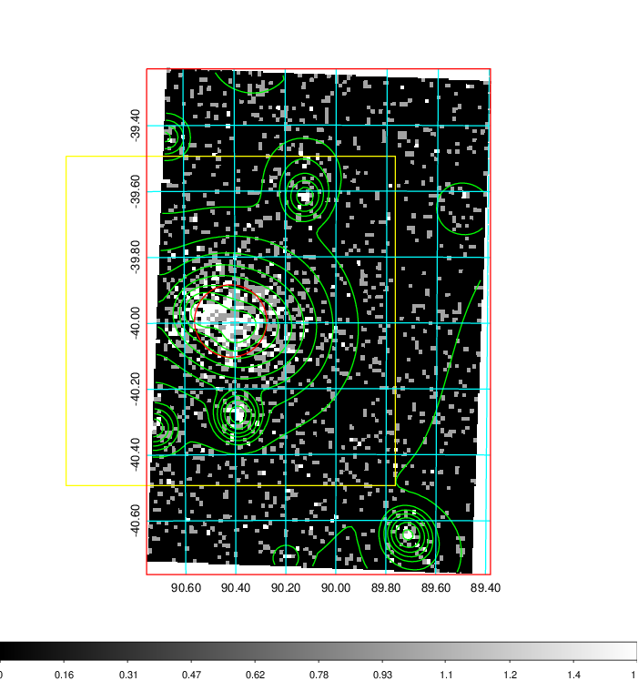  | 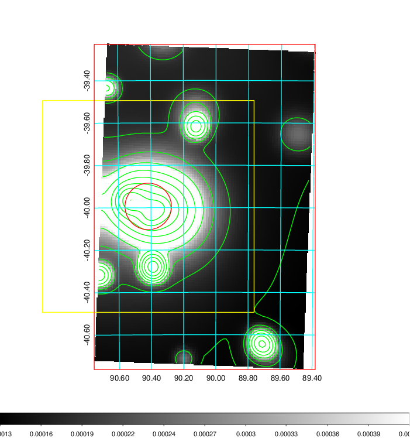   | 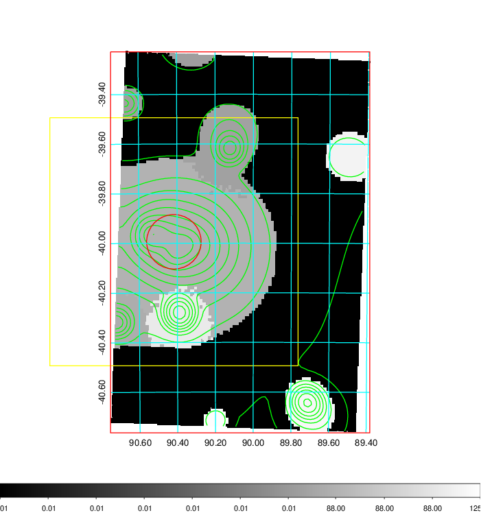  |

|[Exposure image](../image/231/231_mex.pdf)| [nH image](../image/231/231_nh.pdf)| [Planck image](../image/231/231_p.pdf)|
|-------------------|--------------------|-------------------|
|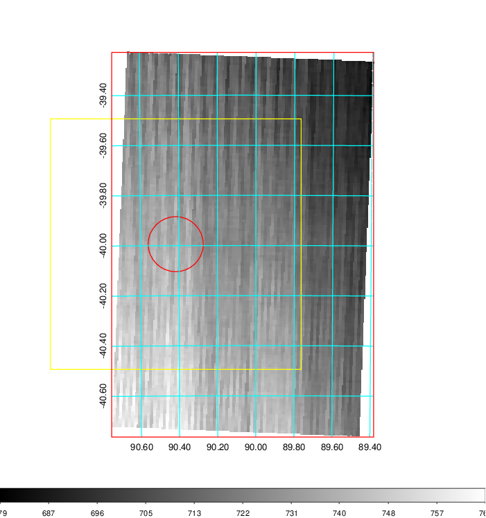   | 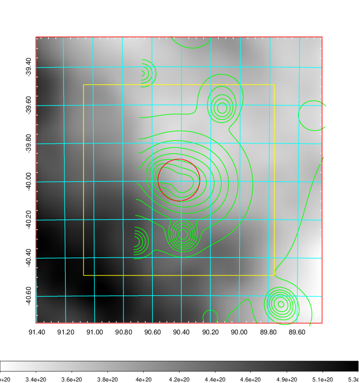    | 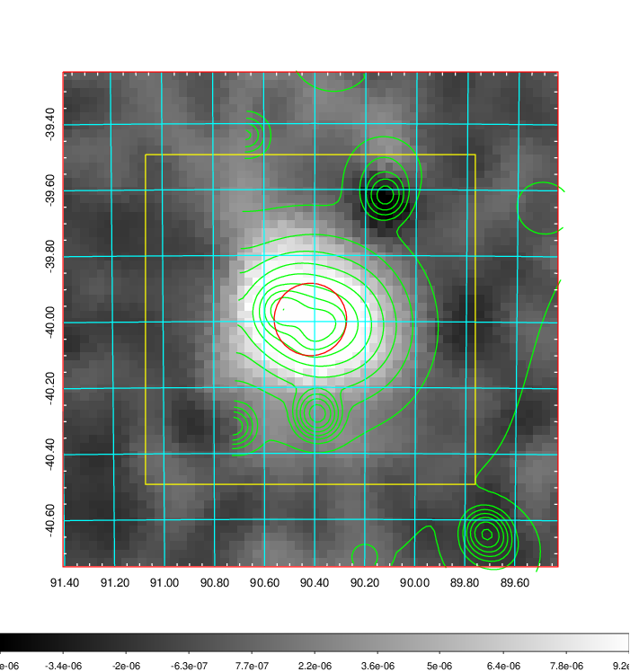 |

|[Redshift Histogram](../image/231/231_zg.pdf) | [DSS image(z1)](../image/231/231_dss_z1.pdf)      |  [DSS image(z2)](../image/231/231_dss_z2.pdf)    |
|-------------------|--------------------|-------------------|
|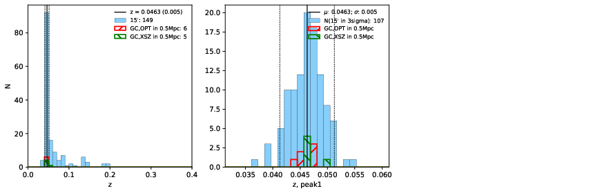 |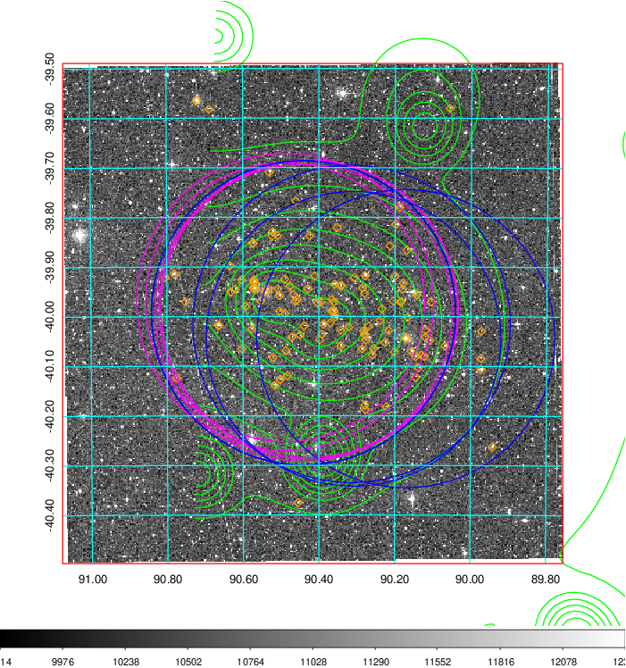  Blue circle for optical clusters;  Magenta circle for XSZ clusters;  all with r=1Mpc;  Only GC with Delta_z<0.01 are shown. | 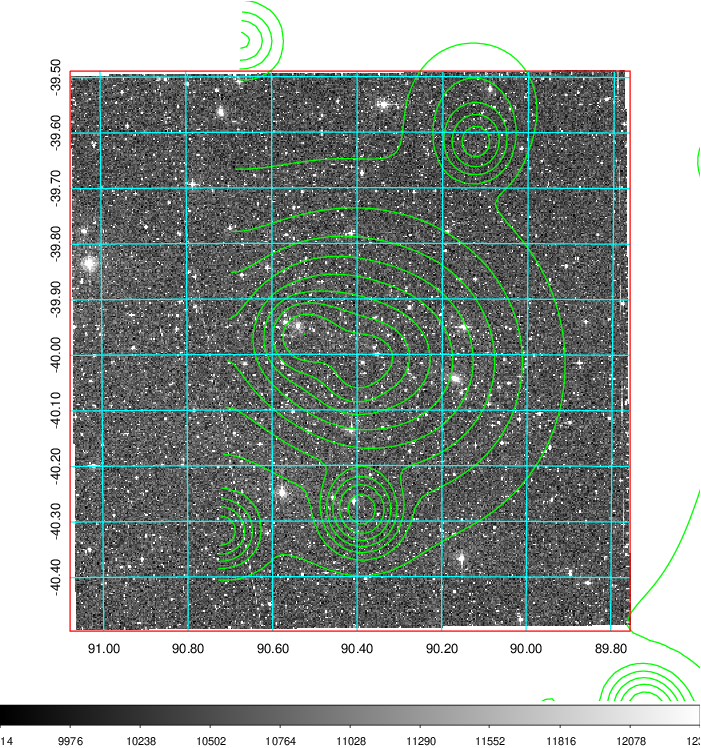 Blue circle for optical clusters;  Magenta circle for XSZ clusters;  all with r=1Mpc;  Only GC with Delta_z<0.01 are shown.  |

|[Previous-identified clusters](../image/231/231_gc.pdf) | [2MASS image](../image/231/231_2mass.pdf)      |
|-------------------|-------------------|
|  Green, magenta, and blue circles  for optical, X-ray and SZ clusters  respectively, with redshift of clusters  labelled. The radius of circles  are 1Mpc.|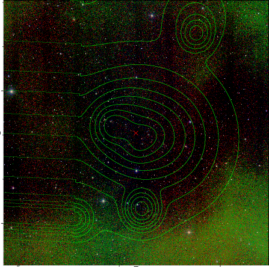  |

|[DES image](../image/231/231_des.pdf)   |
|-------------------|
| 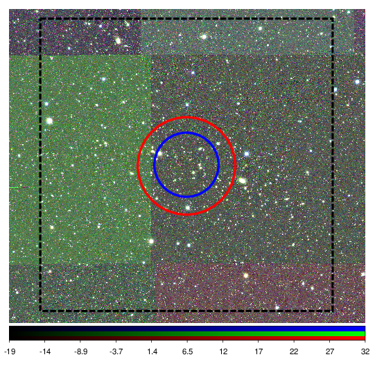  |
