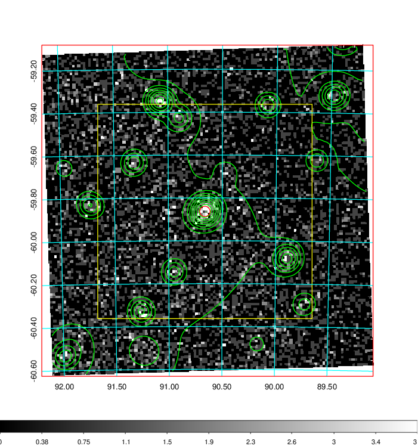
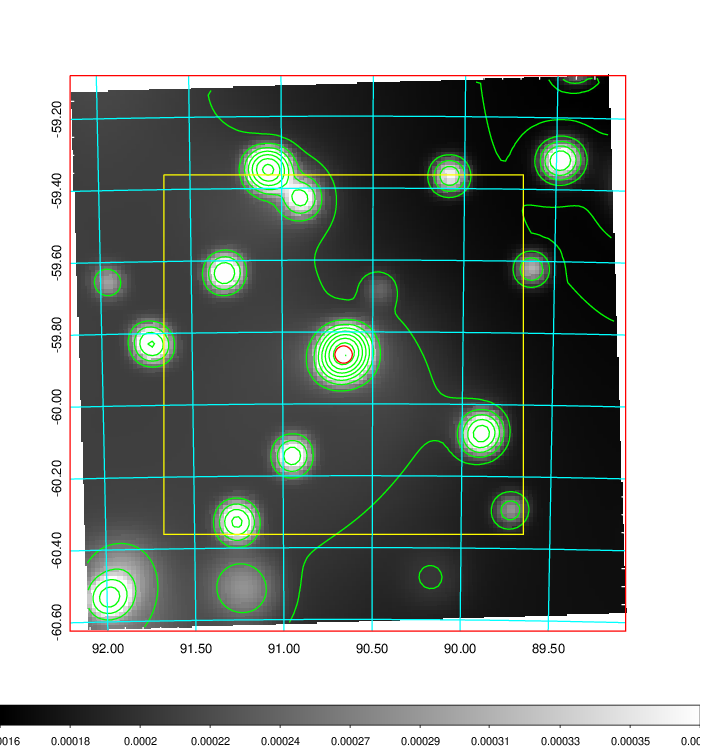
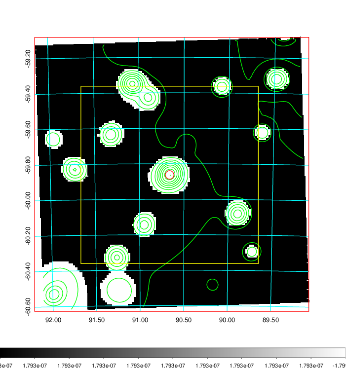
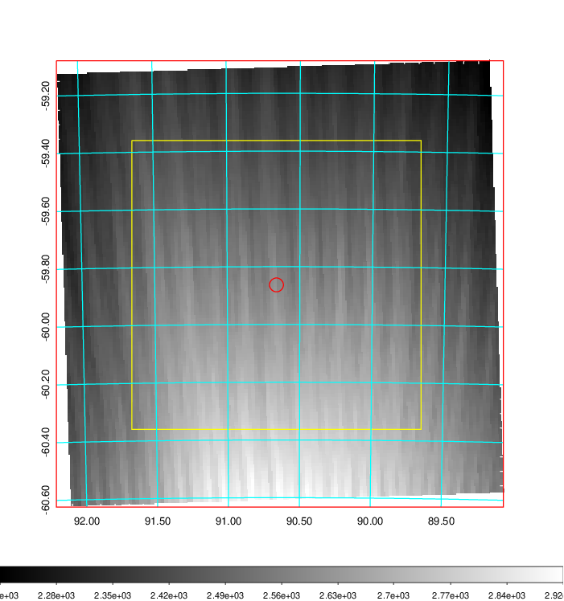
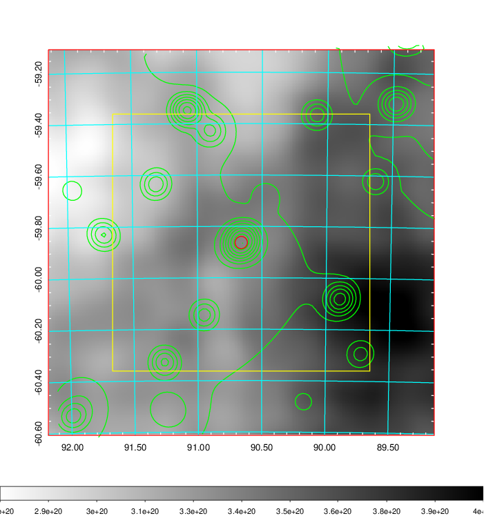
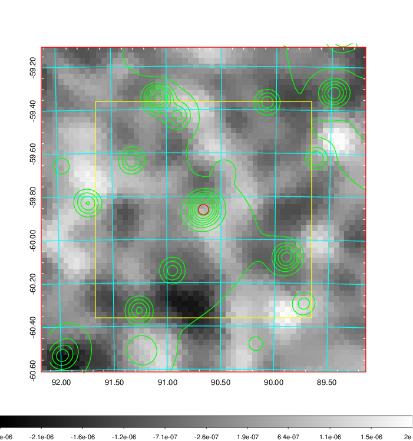
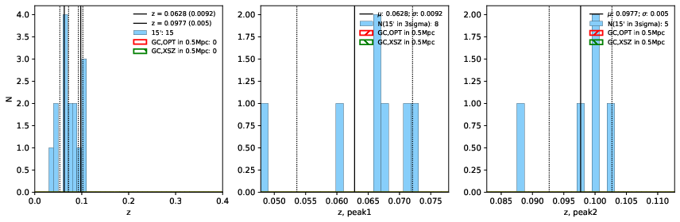
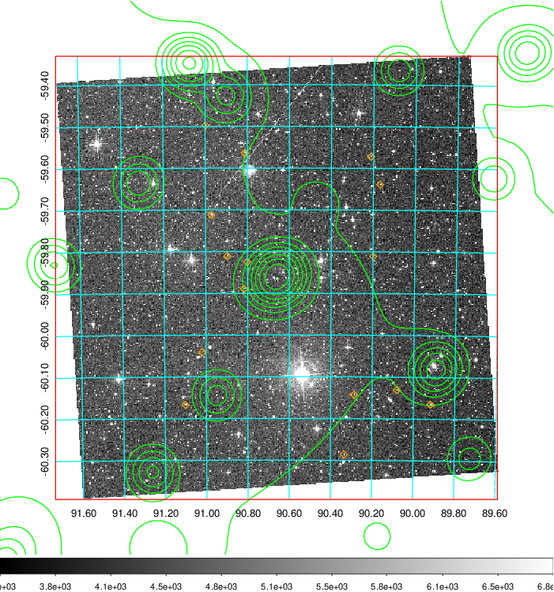
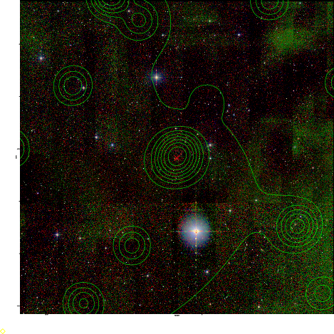
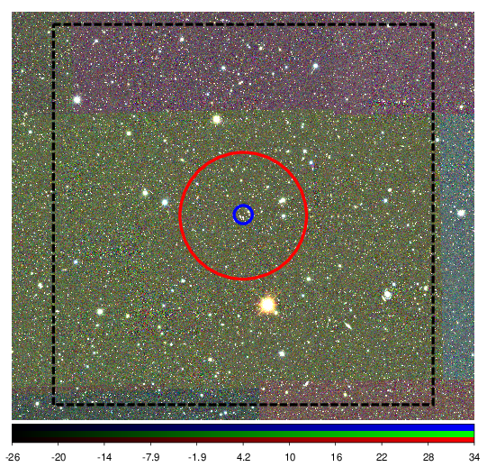

### 232

|Name|RAJ2000[deg]|DEJ2000[deg] |Ext[arcmin]| Ext,ml | z | z_src| C|GC(XSZ,Delta_z<0.01)| GC(OPT,Delta_z<0.01)|GC| R_sig[arcmin] | R500[arcmin] | R500[Mpc]| CRsig[c/s] | CR500[c/s] |L500[1E44 erg/s]|F500[1E-12 erg/s/cm^2]| M500[1E14 Msun]|Tx[keV]|Cnt_sig|Beta|Rc[arcmin]|Comment|Alias|
|---|---|---|---|---|---|------|---|--------|---------|----------|---|---|---|---|---|---|---|---|---|---|---|---|---|---|
|232| 90.661| -59.863| 1.44| 37.18| 0.0977(0.005)| z2,| G| -| -| W| 27.662| 7.645| 0.829| 0.159(0.026)| 0.142(0.024)| 0.631(0.144)| 2.617(0.596)| 1.78(0.20)| 3.15(0.23)| 487.2| 0.502(-0.002+0.004)| 2.594(-0.200+0.215)| -| t026|

|[RASS image](../image/232/232_img.pdf)|[filtered image](../image/232/232_fil.pdf)|[Segment image](../image/232/232_seg.pdf)|
|-------------------|--------------------|-------------------|
|   |    |   |

|[Exposure image](../image/232/232_mex.pdf)| [nH image](../image/232/232_nh.pdf)| [Planck image](../image/232/232_p.pdf)|
|-------------------|--------------------|-------------------|
|   |     |  |

|[Redshift Histogram](../image/232/232_zg.pdf) | [DSS image(z1)](../image/232/232_dss_z1.pdf)      |  [DSS image(z2)](../image/232/232_dss_z2.pdf)    |
|-------------------|--------------------|-------------------|
| |  Blue circle for optical clusters;  Magenta circle for XSZ clusters;  all with r=1Mpc;  Only GC with Delta_z<0.01 are shown. |  Blue circle for optical clusters;  Magenta circle for XSZ clusters;  all with r=1Mpc;  Only GC with Delta_z<0.01 are shown.  |

|[Previous-identified clusters](../image/232/232_gc.pdf) | [2MASS image](../image/232/232_2mass.pdf)      |
|-------------------|-------------------|
|  Green, magenta, and blue circles  for optical, X-ray and SZ clusters  respectively, with redshift of clusters  labelled. The radius of circles  are 1Mpc.|  |

|[DES image](../image/232/232_des.pdf)   |
|-------------------|
|   |
