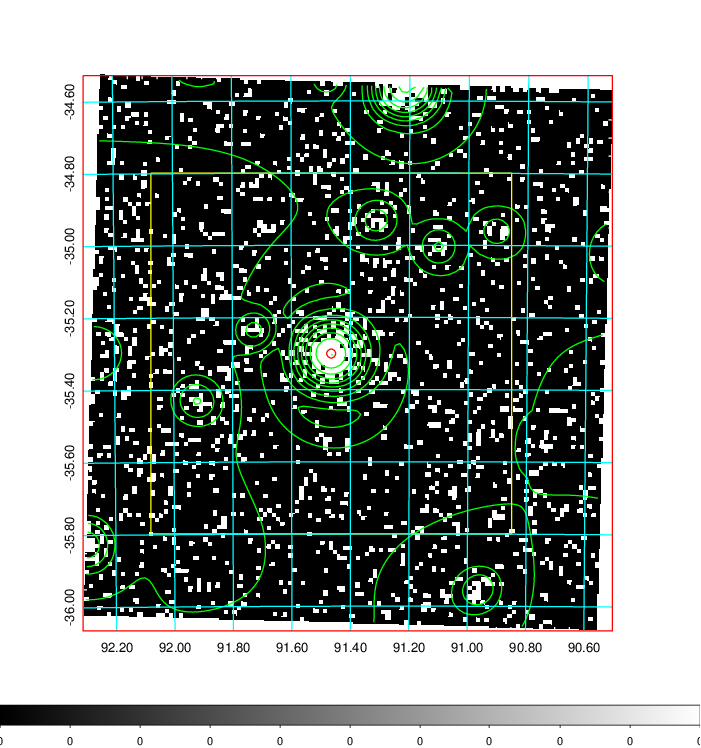
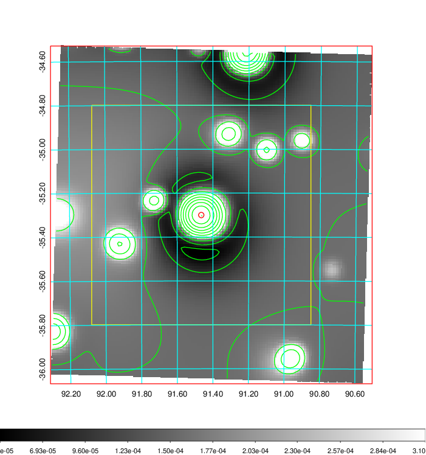
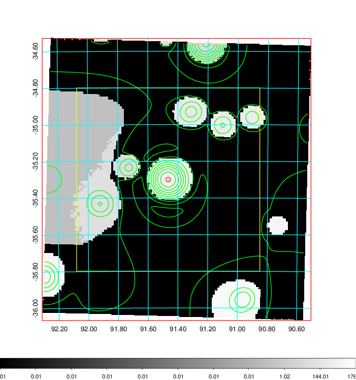
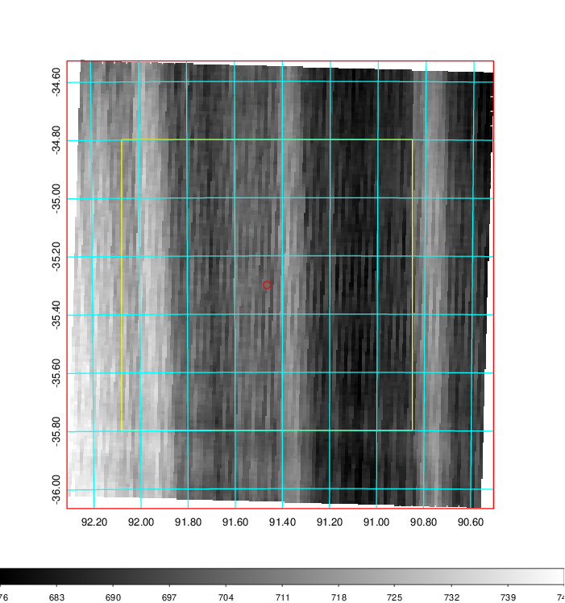
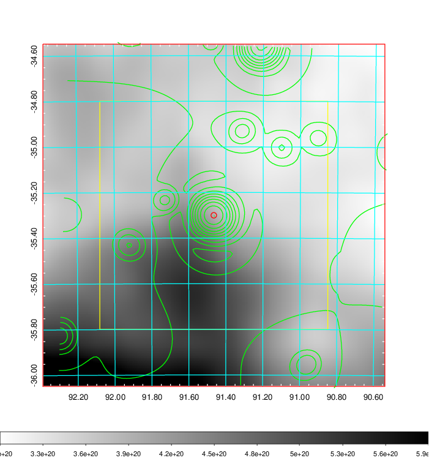
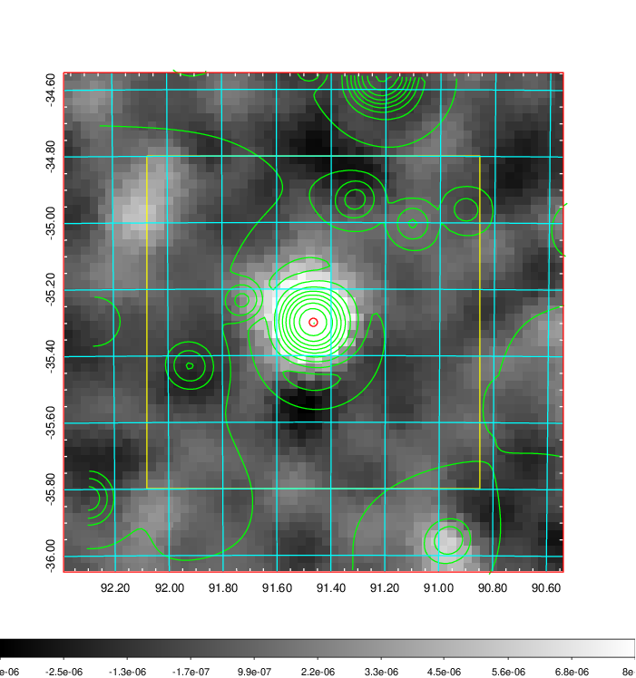
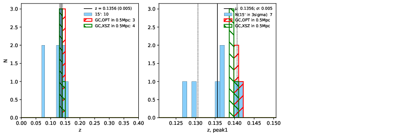
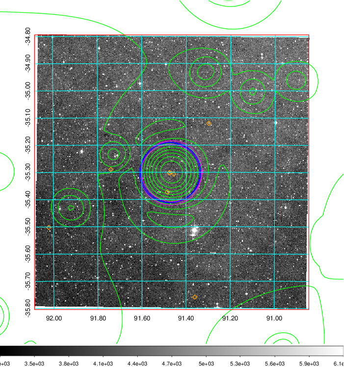
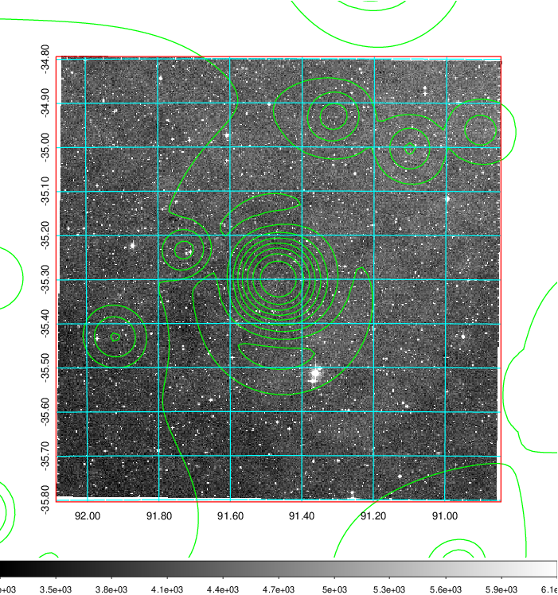
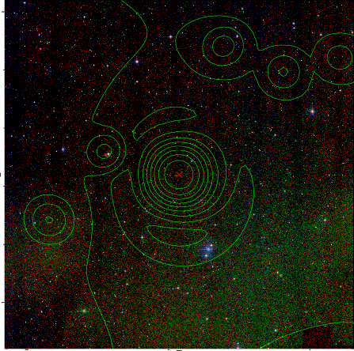

### 233

|Name|RAJ2000[deg]|DEJ2000[deg] |Ext[arcmin]| Ext,ml | z | z_src| C|GC(XSZ,Delta_z<0.01)| GC(OPT,Delta_z<0.01)|GC| R_sig[arcmin] | R500[arcmin] | R500[Mpc]| CRsig[c/s] | CR500[c/s] |L500[1E44 erg/s]|F500[1E-12 erg/s/cm^2]| M500[1E14 Msun]|Tx[keV]|Cnt_sig|Beta|Rc[arcmin]|Comment|Alias|
|---|---|---|---|---|---|------|---|--------|---------|----------|---|---|---|---|---|---|---|---|---|---|---|---|---|---|
|233| 91.465| -35.300| 0.74| 56.05| 0.1356(0.005)| z1, z_xsz| B| MCXC, PSZ2, Tar, XB| A, W| A, MCXC, PSZ2, Tar, W, XB| 7.338| 8.337| 1.201| 0.438(0.032)| 0.448(0.033)| 4.162(0.116)| 8.522(0.237)| 5.63(0.08)| 6.49(0.06)| 307.5| 0.909(-0.084+0.063)| 2.462(-0.359+0.260)| -| k007|

|[RASS image](../image/233/233_img.pdf)|[filtered image](../image/233/233_fil.pdf)|[Segment image](../image/233/233_seg.pdf)|
|-------------------|--------------------|-------------------|
|   |    |   |

|[Exposure image](../image/233/233_mex.pdf)| [nH image](../image/233/233_nh.pdf)| [Planck image](../image/233/233_p.pdf)|
|-------------------|--------------------|-------------------|
|   |     |  |

|[Redshift Histogram](../image/233/233_zg.pdf) | [DSS image(z1)](../image/233/233_dss_z1.pdf)      |  [DSS image(z2)](../image/233/233_dss_z2.pdf)    |
|-------------------|--------------------|-------------------|
| |  Blue circle for optical clusters;  Magenta circle for XSZ clusters;  all with r=1Mpc;  Only GC with Delta_z<0.01 are shown. |  Blue circle for optical clusters;  Magenta circle for XSZ clusters;  all with r=1Mpc;  Only GC with Delta_z<0.01 are shown.  |

|[known Abell/XSZ clusters](../image/233/233_gc.pdf) | [2MASS image](../image/233/233_2mass.pdf)      |
|-------------------|-------------------|
|  Magenta, blue and green circles  for optical, X-ray and SZ clusters  respectively, with redshift of clusters  labelled. The radius of circles  are 1Mpc.|  |

|[DES image](../image/233/233_des.pdf)   |
|-------------------|
|   |
