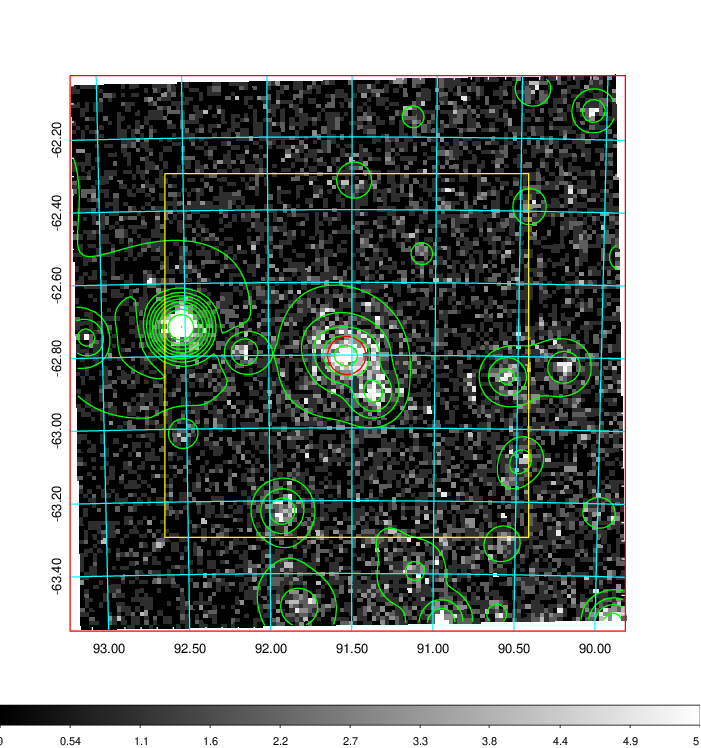
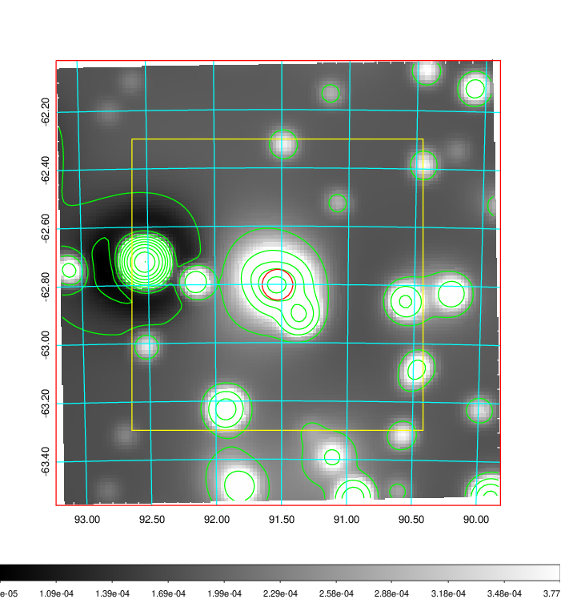
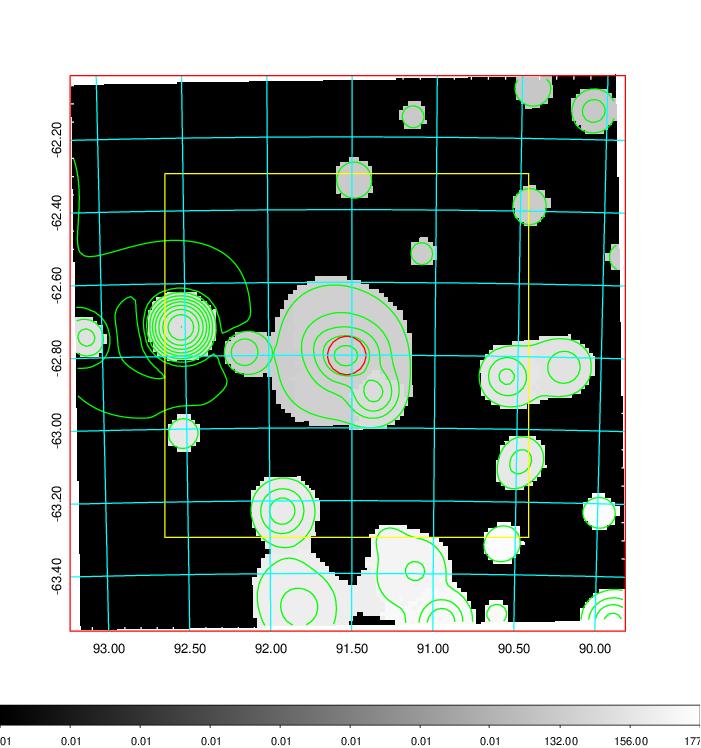
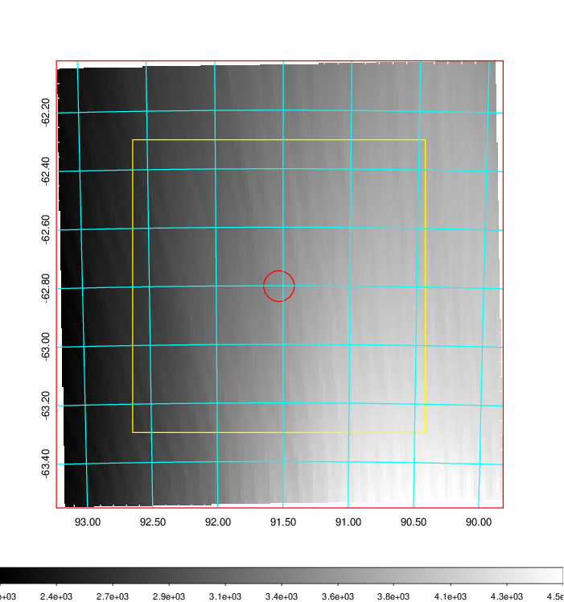
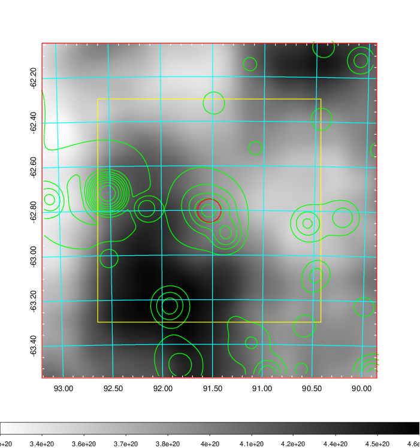
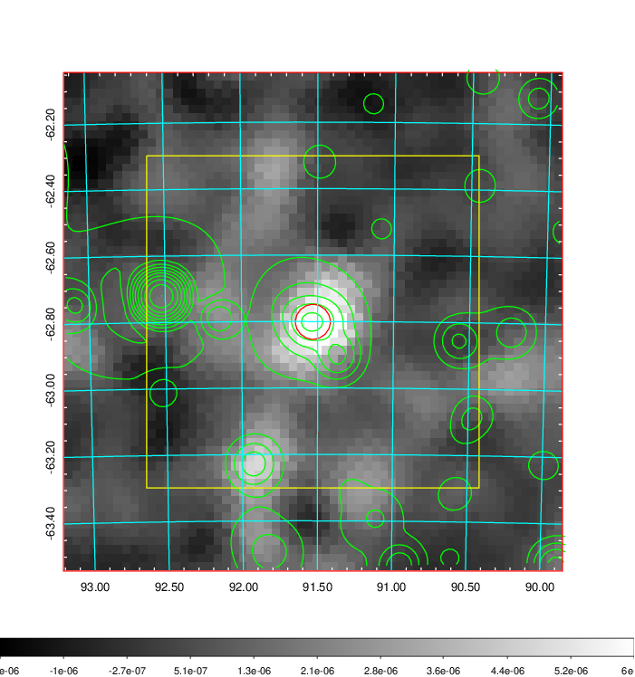
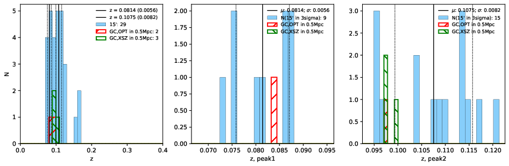
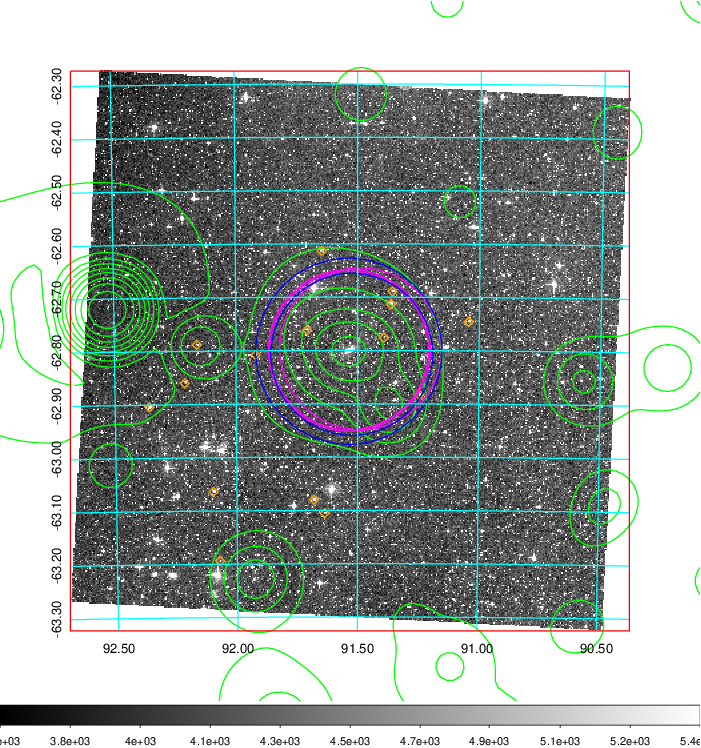
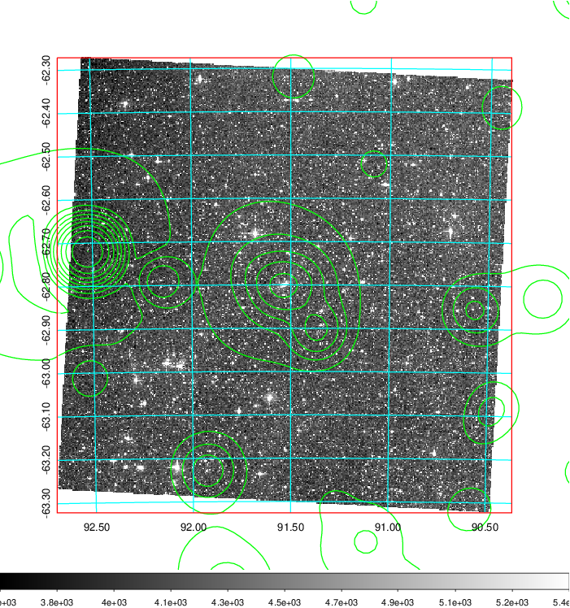
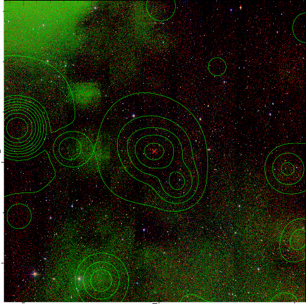

### 234

|Name|RAJ2000[deg]|DEJ2000[deg] |Ext[arcmin]| Ext,ml | z | z_src| C|GC(XSZ,Delta_z<0.01)| GC(OPT,Delta_z<0.01)|GC| R_sig[arcmin] | R500[arcmin] | R500[Mpc]| CRsig[c/s] | CR500[c/s] |L500[1E44 erg/s]|F500[1E-12 erg/s/cm^2]| M500[1E14 Msun]|Tx[keV]|Cnt_sig|Beta|Rc[arcmin]|Comment|Alias|
|---|---|---|---|---|---|------|---|--------|---------|----------|---|---|---|---|---|---|---|---|---|---|---|---|---|---|
|234| 91.531| -62.801| 3.15| 481.69| 0.1075(0.008)| z2, z_xsz| B| PSZ2, Tar| A| A, PSZ2, Tar, W| 14.162| 7.847| 0.925| 0.215(0.013)| 0.200(0.013)| 1.090(0.036)| 3.685(0.123)| 2.50(0.04)| 3.90(0.04)| 970.9| 0.779(-0.071+0.090)| 4.628(-0.607+0.696)| -| k390|

|[RASS image](../image/234/234_img.pdf)|[filtered image](../image/234/234_fil.pdf)|[Segment image](../image/234/234_seg.pdf)|
|-------------------|--------------------|-------------------|
|   |    |   |

|[Exposure image](../image/234/234_mex.pdf)| [nH image](../image/234/234_nh.pdf)| [Planck image](../image/234/234_p.pdf)|
|-------------------|--------------------|-------------------|
|   |     |  |

|[Redshift Histogram](../image/234/234_zg.pdf) | [DSS image(z1)](../image/234/234_dss_z1.pdf)      |  [DSS image(z2)](../image/234/234_dss_z2.pdf)    |
|-------------------|--------------------|-------------------|
| |  Blue circle for optical clusters;  Magenta circle for XSZ clusters;  all with r=1Mpc;  Only GC with Delta_z<0.01 are shown. |  Blue circle for optical clusters;  Magenta circle for XSZ clusters;  all with r=1Mpc;  Only GC with Delta_z<0.01 are shown.  |

|[Previous-identified clusters](../image/234/234_gc.pdf) | [2MASS image](../image/234/234_2mass.pdf)      |
|-------------------|-------------------|
|  Green, magenta, and blue circles  for optical, X-ray and SZ clusters  respectively, with redshift of clusters  labelled. The radius of circles  are 1Mpc.|  |

