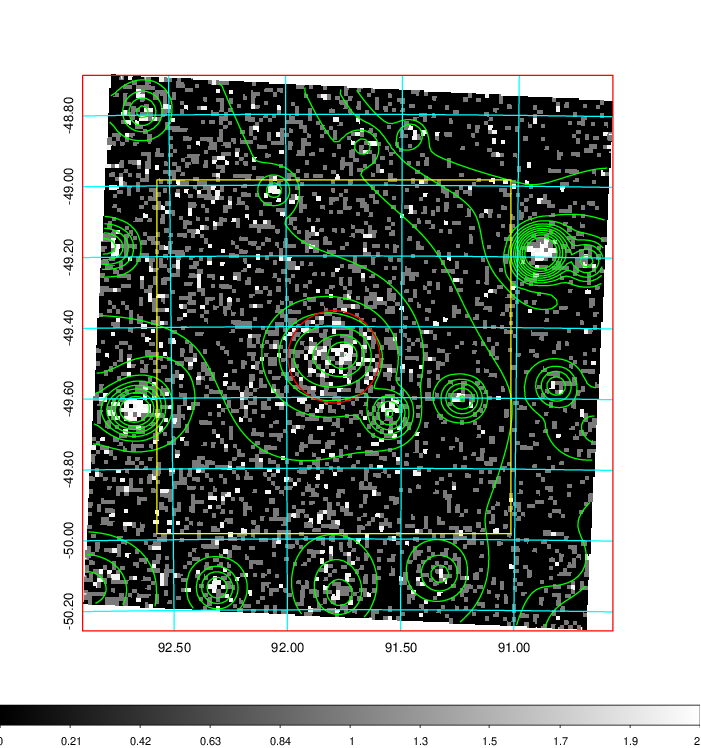
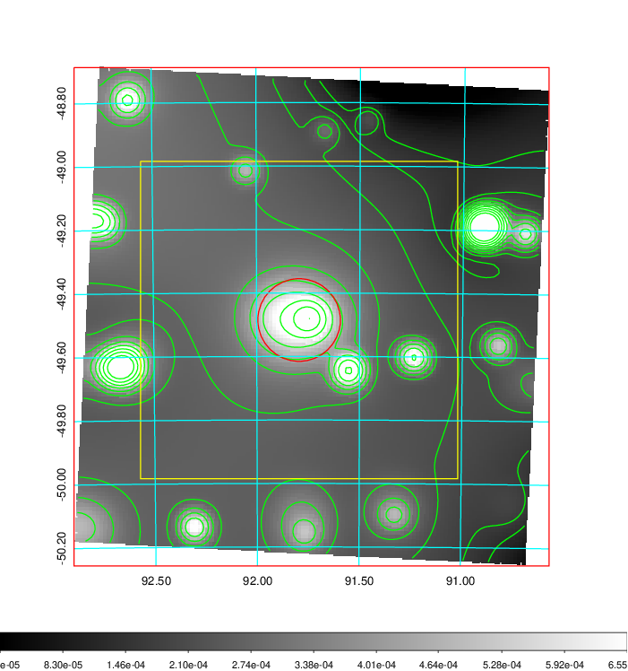
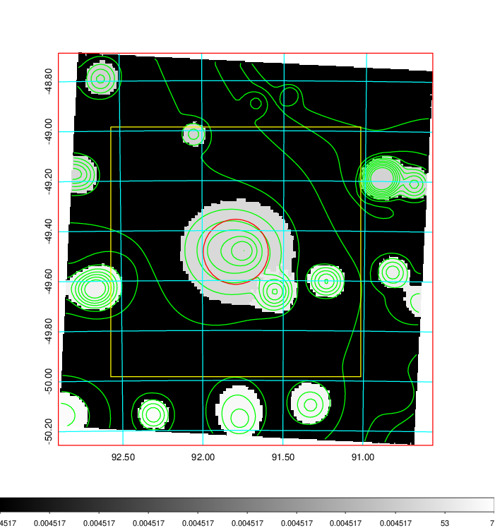
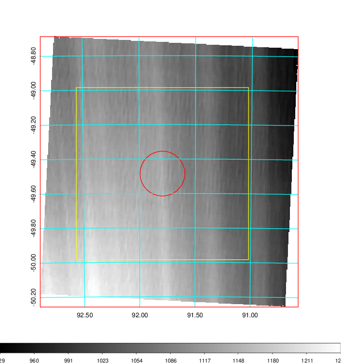
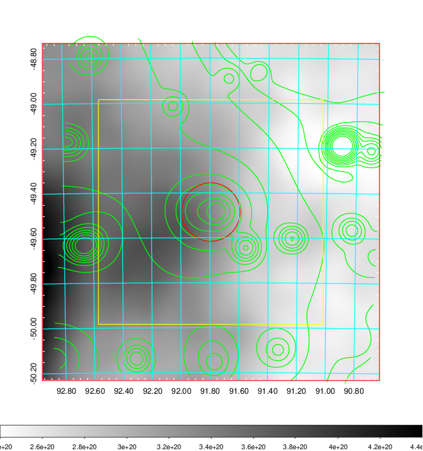
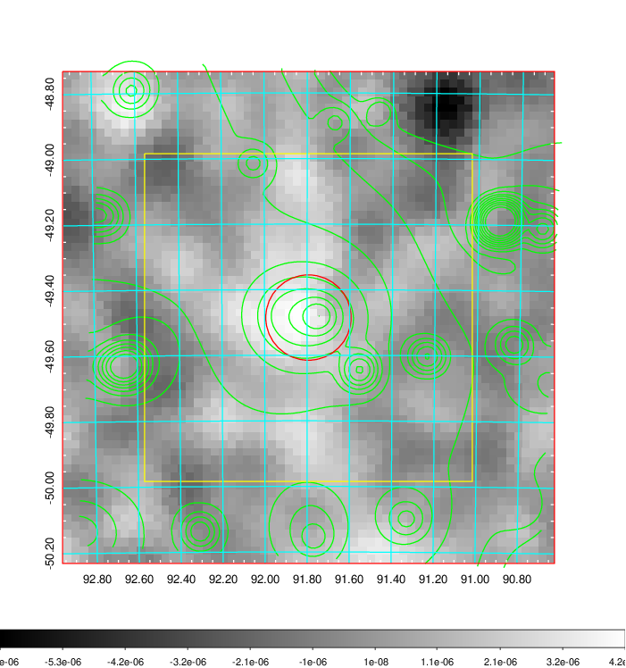
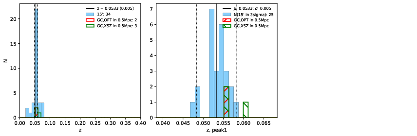
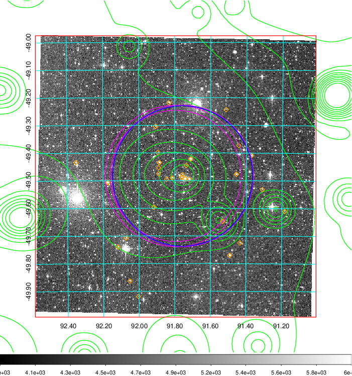
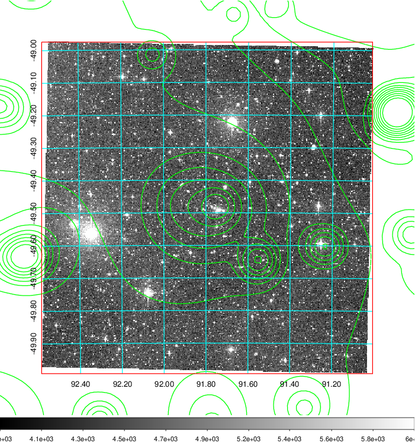
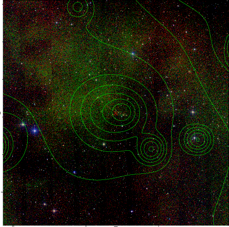

### 235

|Name|RAJ2000[deg]|DEJ2000[deg] |Ext[arcmin]| Ext,ml | z | z_src| C|GC(XSZ,Delta_z<0.01)| GC(OPT,Delta_z<0.01)|GC| R_sig[arcmin] | R500[arcmin] | R500[Mpc]| CRsig[c/s] | CR500[c/s] |L500[1E44 erg/s]|F500[1E-12 erg/s/cm^2]| M500[1E14 Msun]|Tx[keV]|Cnt_sig|Beta|Rc[arcmin]|Comment|Alias|
|---|---|---|---|---|---|------|---|--------|---------|----------|---|---|---|---|---|---|---|---|---|---|---|---|---|---|
|235| 91.794| -49.485| 7.81| 242.85| 0.0533(0.005)| z1, z_xsz| B| MCXC, Tar| A| A, MCXC, N, Tar, W| 44.065| 14.258| 0.888| 0.704(0.059)| 0.633(0.053)| 0.785(0.079)| 11.622(1.173)| 2.09(0.11)| 3.44(0.11)| 1117.5| 0.501(-0.001+0.002)| 7.996(-0.257+0.271)| -| k562|

|[RASS image](../image/235/235_img.pdf)|[filtered image](../image/235/235_fil.pdf)|[Segment image](../image/235/235_seg.pdf)|
|-------------------|--------------------|-------------------|
|   |    |   |

|[Exposure image](../image/235/235_mex.pdf)| [nH image](../image/235/235_nh.pdf)| [Planck image](../image/235/235_p.pdf)|
|-------------------|--------------------|-------------------|
|   |     |  |

|[Redshift Histogram](../image/235/235_zg.pdf) | [DSS image(z1)](../image/235/235_dss_z1.pdf)      |  [DSS image(z2)](../image/235/235_dss_z2.pdf)    |
|-------------------|--------------------|-------------------|
| |  Blue circle for optical clusters;  Magenta circle for XSZ clusters;  all with r=1Mpc;  Only GC with Delta_z<0.01 are shown. |  Blue circle for optical clusters;  Magenta circle for XSZ clusters;  all with r=1Mpc;  Only GC with Delta_z<0.01 are shown.  |

|[known Abell/XSZ clusters](../image/235/235_gc.pdf) | [2MASS image](../image/235/235_2mass.pdf)      |
|-------------------|-------------------|
|  Magenta, blue and green circles  for optical, X-ray and SZ clusters  respectively, with redshift of clusters  labelled. The radius of circles  are 1Mpc.|  |

|[DES image](../image/235/235_des.pdf)   |
|-------------------|
|   |
