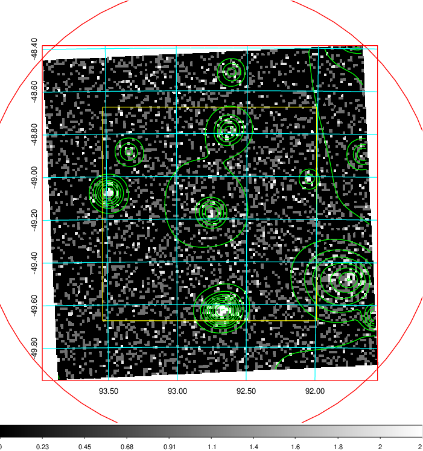
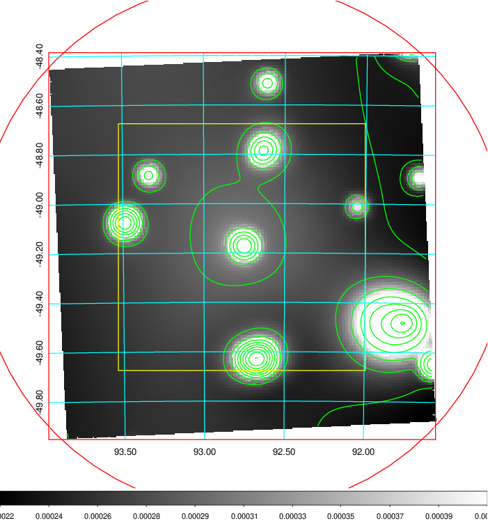
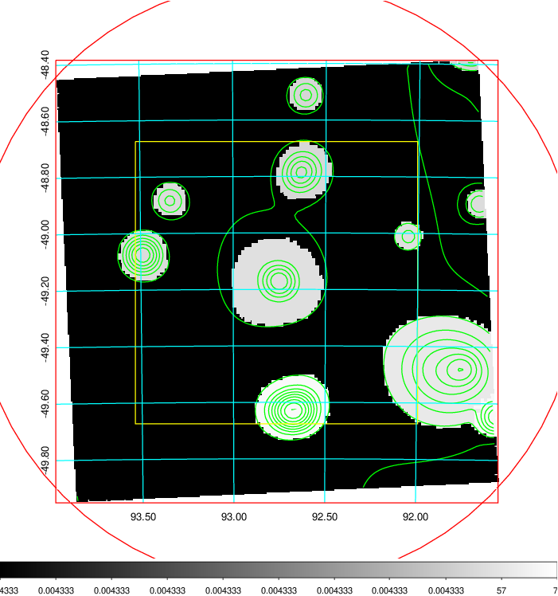
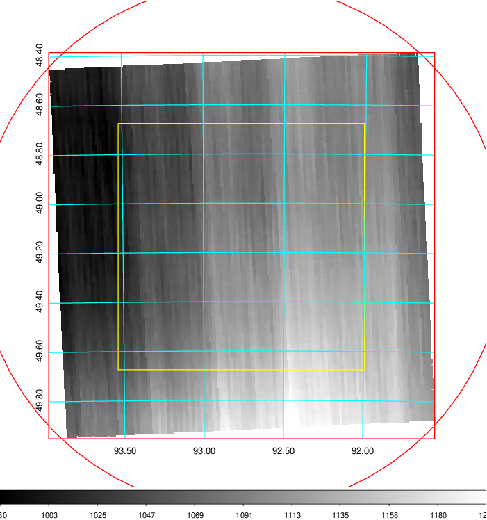
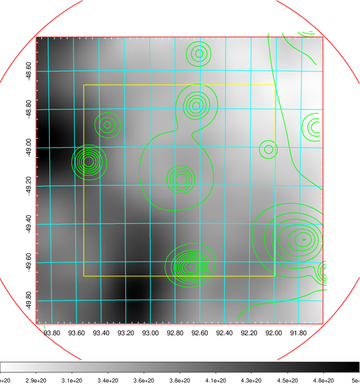
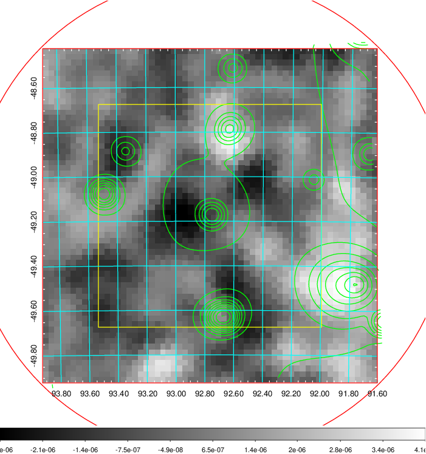
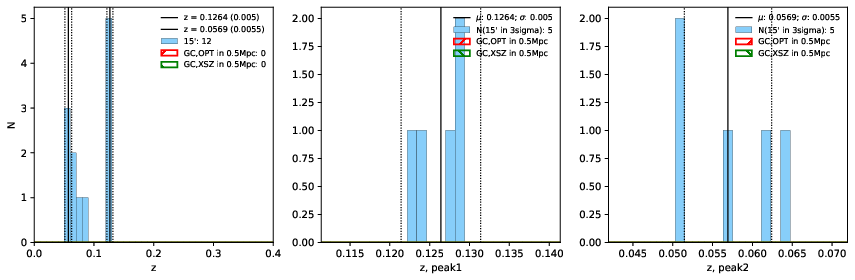
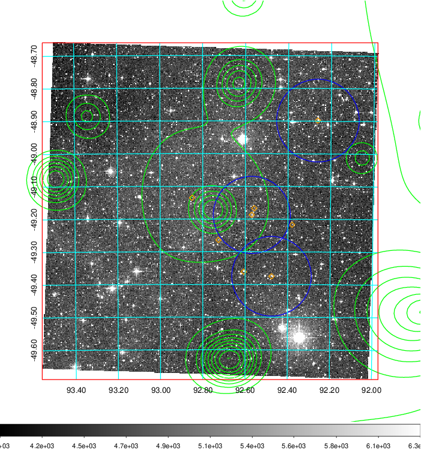
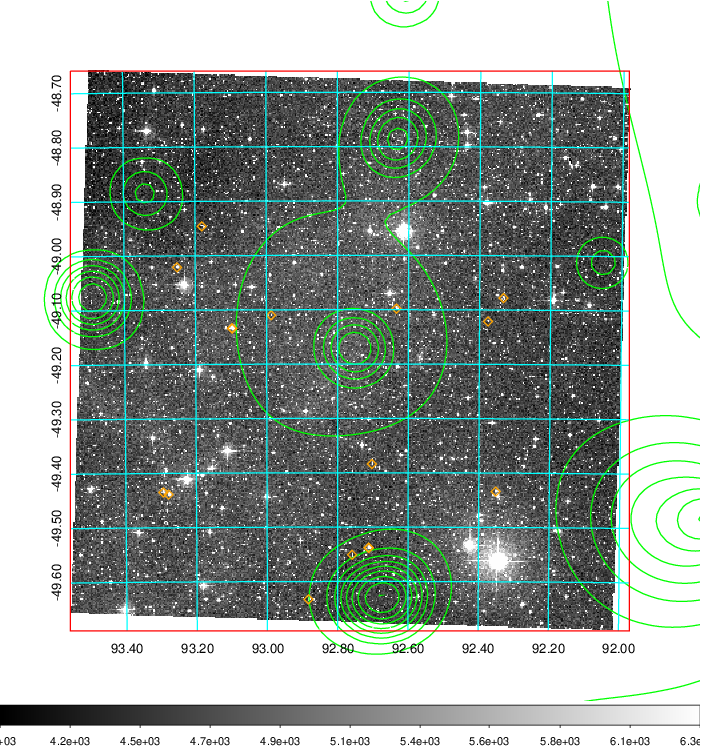
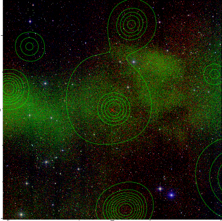

### 236

|Name|RAJ2000[deg]|DEJ2000[deg] |Ext[arcmin]| Ext,ml | z | z_src| C|GC(XSZ,Delta_z<0.01)| GC(OPT,Delta_z<0.01)|GC| R_sig[arcmin] | R500[arcmin] | R500[Mpc]| CRsig[c/s] | CR500[c/s] |L500[1E44 erg/s]|F500[1E-12 erg/s/cm^2]| M500[1E14 Msun]|Tx[keV]|Cnt_sig|Beta|Rc[arcmin]|Comment|Alias|
|---|---|---|---|---|---|------|---|--------|---------|----------|---|---|---|---|---|---|---|---|---|---|---|---|---|---|
|236| 92.765| -49.176| 64.14| 25.30| 0.1264(0.005)| z1,| G| -| -| W| 33.670| 7.811| 1.060| 0.323(0.063)| 0.286(0.056)| 2.266(1.471)| 5.404(3.508)| 3.83(1.21)| 5.10(1.03)| 758.9| 0.501(-0.001+0.002)| 6.736(-0.138+0.482)| -| t711|

|[RASS image](../image/236/236_img.pdf)|[filtered image](../image/236/236_fil.pdf)|[Segment image](../image/236/236_seg.pdf)|
|-------------------|--------------------|-------------------|
|   |    |   |

|[Exposure image](../image/236/236_mex.pdf)| [nH image](../image/236/236_nh.pdf)| [Planck image](../image/236/236_p.pdf)|
|-------------------|--------------------|-------------------|
|   |     |  |

|[Redshift Histogram](../image/236/236_zg.pdf) | [DSS image(z1)](../image/236/236_dss_z1.pdf)      |  [DSS image(z2)](../image/236/236_dss_z2.pdf)    |
|-------------------|--------------------|-------------------|
| |  Blue circle for optical clusters;  Magenta circle for XSZ clusters;  all with r=1Mpc;  Only GC with Delta_z<0.01 are shown. |  Blue circle for optical clusters;  Magenta circle for XSZ clusters;  all with r=1Mpc;  Only GC with Delta_z<0.01 are shown.  |

|[known Abell/XSZ clusters](../image/236/236_gc.pdf) | [2MASS image](../image/236/236_2mass.pdf)      |
|-------------------|-------------------|
|  Magenta, blue and green circles  for optical, X-ray and SZ clusters  respectively, with redshift of clusters  labelled. The radius of circles  are 1Mpc.|  |

|[DES image](../image/236/236_des.pdf)   |
|-------------------|
|   |
