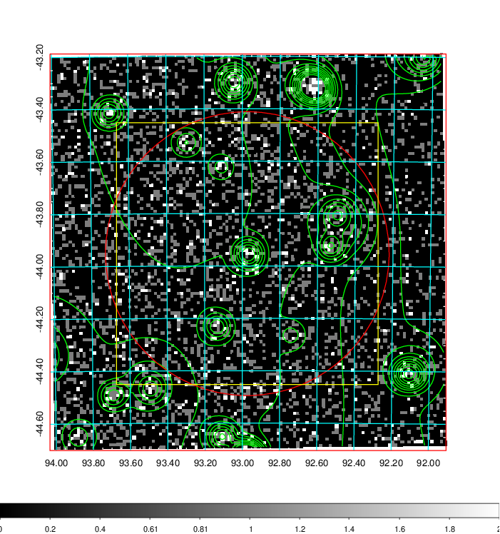
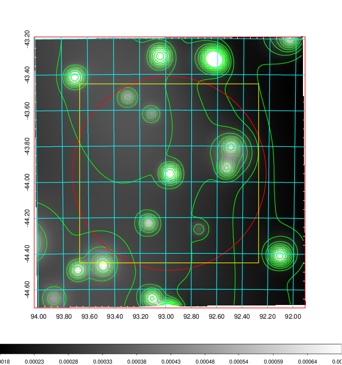
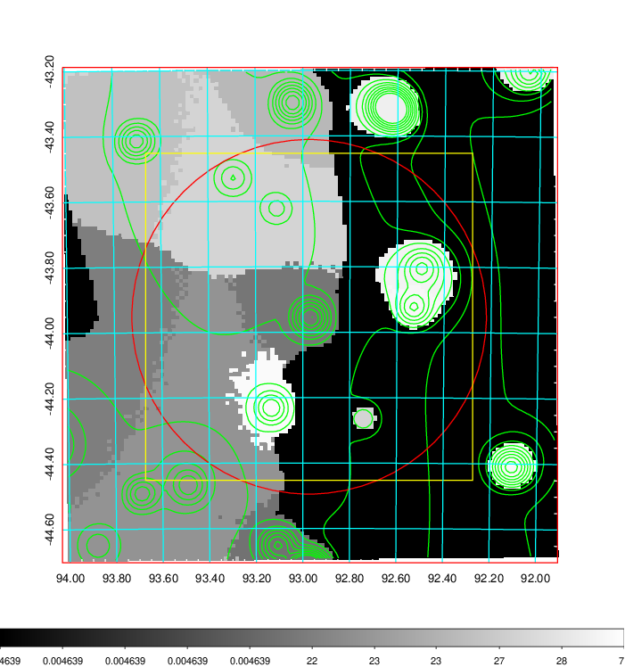
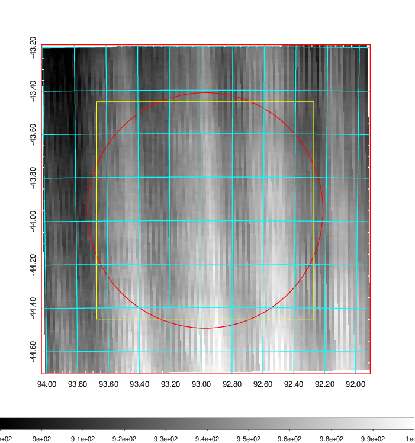
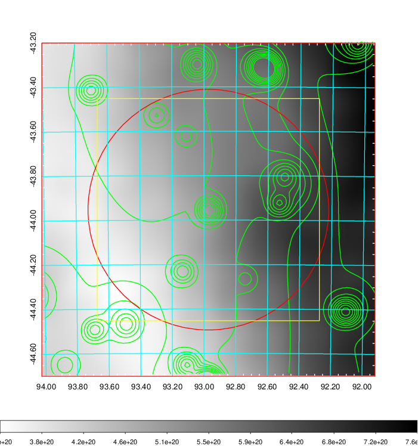
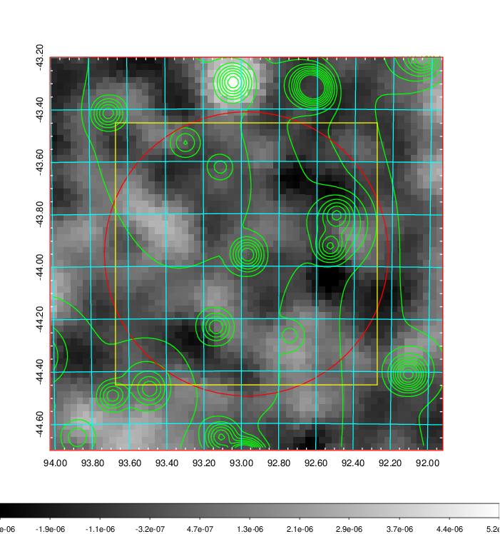
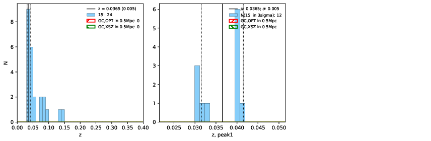
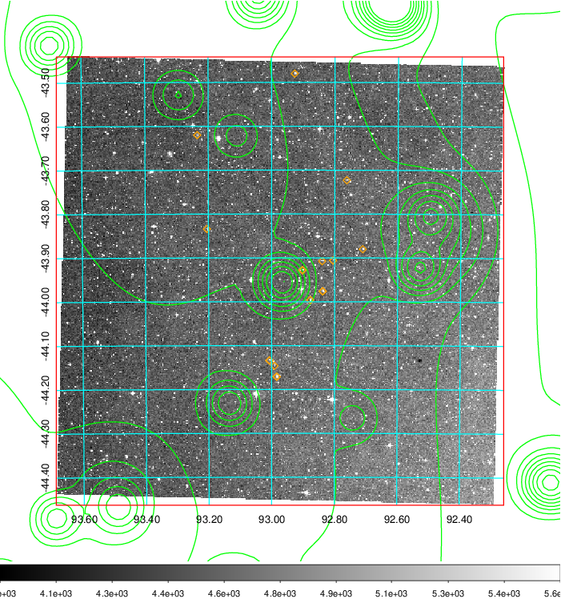
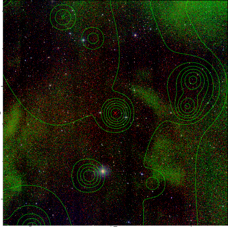
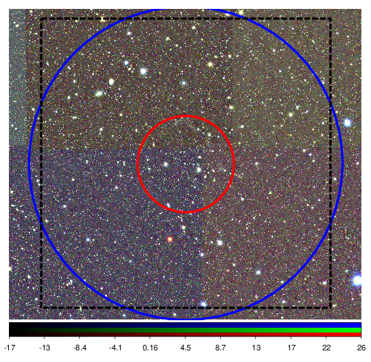

### 238

|Name|RAJ2000[deg]|DEJ2000[deg] |Ext[arcmin]| Ext,ml | z | z_src| C|GC(XSZ,Delta_z<0.01)| GC(OPT,Delta_z<0.01)|GC| R_sig[arcmin] | R500[arcmin] | R500[Mpc]| CRsig[c/s] | CR500[c/s] |L500[1E44 erg/s]|F500[1E-12 erg/s/cm^2]| M500[1E14 Msun]|Tx[keV]|Cnt_sig|Beta|Rc[arcmin]|Comment|Alias|
|---|---|---|---|---|---|------|---|--------|---------|----------|---|---|---|---|---|---|---|---|---|---|---|---|---|---|
|238| 92.973| -43.953| 32.51| 25.82| 0.0365(0.005)| z1,| G| -| -| A, N| 31.119| 14.450| 0.629| 0.272(0.052)| 0.250(0.048)| 0.123(0.059)| 3.978(1.918)| 0.73(0.18)| 1.79(0.28)| 590.6| 0.501(-0.001+0.004)| 5.657(-0.182+1.046)| An Abell cluster with no $z$ and offset = 0.22 Mpc| t650|

|[RASS image](../image/238/238_img.pdf)|[filtered image](../image/238/238_fil.pdf)|[Segment image](../image/238/238_seg.pdf)|
|-------------------|--------------------|-------------------|
|   |    |   |

|[Exposure image](../image/238/238_mex.pdf)| [nH image](../image/238/238_nh.pdf)| [Planck image](../image/238/238_p.pdf)|
|-------------------|--------------------|-------------------|
|   |     |  |

|[Redshift Histogram](../image/238/238_zg.pdf) | [DSS image(z1)](../image/238/238_dss_z1.pdf)      |  [DSS image(z2)](../image/238/238_dss_z2.pdf)    |
|-------------------|--------------------|-------------------|
| |  Blue circle for optical clusters;  Magenta circle for XSZ clusters;  all with r=1Mpc;  Only GC with Delta_z<0.01 are shown. |  Blue circle for optical clusters;  Magenta circle for XSZ clusters;  all with r=1Mpc;  Only GC with Delta_z<0.01 are shown.  |

|[Previous-identified clusters](../image/238/238_gc.pdf) | [2MASS image](../image/238/238_2mass.pdf)      |
|-------------------|-------------------|
|  Green, magenta, and blue circles  for optical, X-ray and SZ clusters  respectively, with redshift of clusters  labelled. The radius of circles  are 1Mpc.|  |

|[DES image](../image/238/238_des.pdf)   |
|-------------------|
|   |
