

### 239

|Name|RAJ2000[deg]|DEJ2000[deg] |Ext[arcmin]| Ext,ml | z | z_src| C|GC(XSZ,Delta_z<0.01)| GC(OPT,Delta_z<0.01)|GC| R_sig[arcmin] | R500[arcmin] | R500[Mpc]| CRsig[c/s] | CR500[c/s] |L500[1E44 erg/s]|F500[1E-12 erg/s/cm^2]| M500[1E14 Msun]|Tx[keV]|Cnt_sig|Beta|Rc[arcmin]|Comment|Alias|
|---|---|---|---|---|---|------|---|--------|---------|----------|---|---|---|---|---|---|---|---|---|---|---|---|---|---|
|239| 93.091| -45.063| 17.45| 376.62| 0.0478(0.005)| z1, z_opt| S| -| A| A, N, Tar, W| 12.700| 11.736| 0.660| 0.191(0.026)| 0.188(0.026)| 0.170(0.016)| 3.164(0.301)| 0.85(0.04)| 1.97(0.06)| 322.4| 0.780(-0.164+0.150)| 8.232(-1.987+1.562)| An SZ cluster with $z$ = 0.01 and offset = 0.37 Mpc, whose emission locates at the right peak.| t562|

|[RASS image](../image/239/239_img.pdf)|[filtered image](../image/239/239_fil.pdf)|[Segment image](../image/239/239_seg.pdf)|
|-------------------|--------------------|-------------------|
| 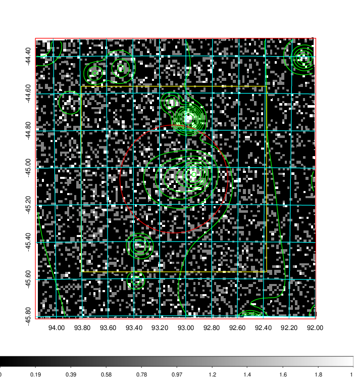  | 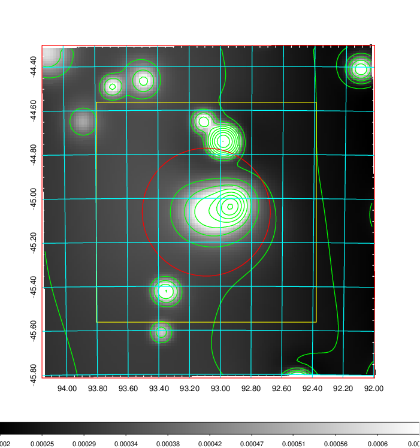   | 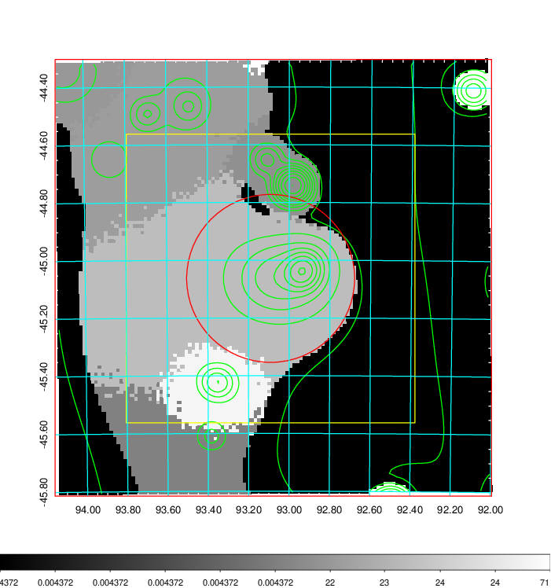  |

|[Exposure image](../image/239/239_mex.pdf)| [nH image](../image/239/239_nh.pdf)| [Planck image](../image/239/239_p.pdf)|
|-------------------|--------------------|-------------------|
|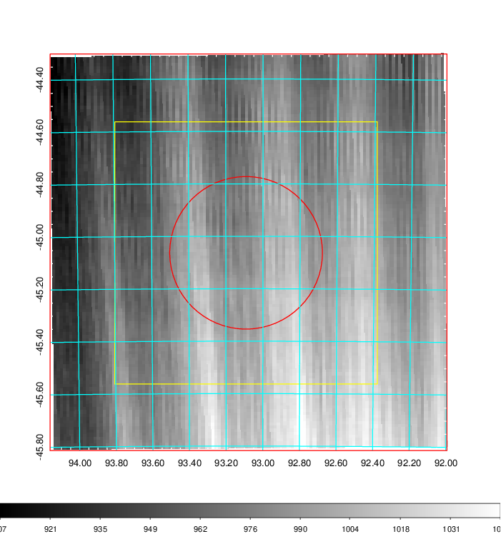   | 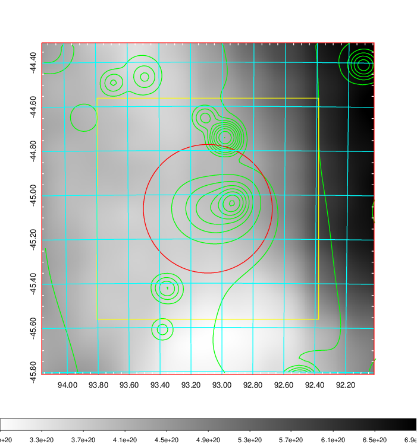    | 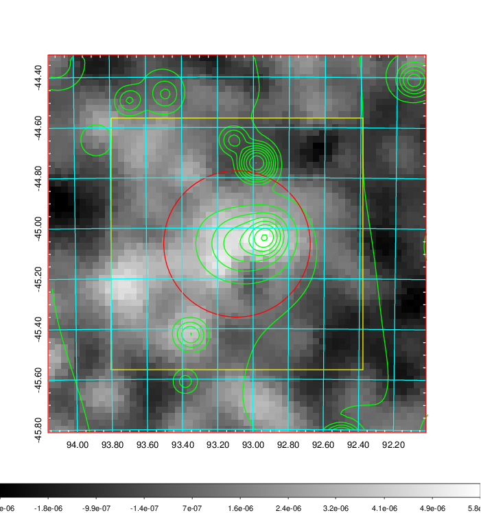 |

|[Redshift Histogram](../image/239/239_zg.pdf) | [DSS image(z1)](../image/239/239_dss_z1.pdf)      |  [DSS image(z2)](../image/239/239_dss_z2.pdf)    |
|-------------------|--------------------|-------------------|
|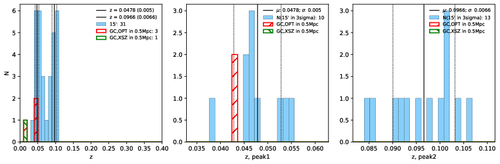 |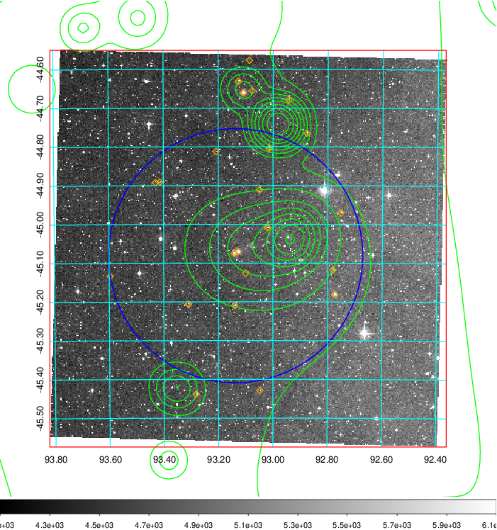  Blue circle for optical clusters;  Magenta circle for XSZ clusters;  all with r=1Mpc;  Only GC with Delta_z<0.01 are shown. | 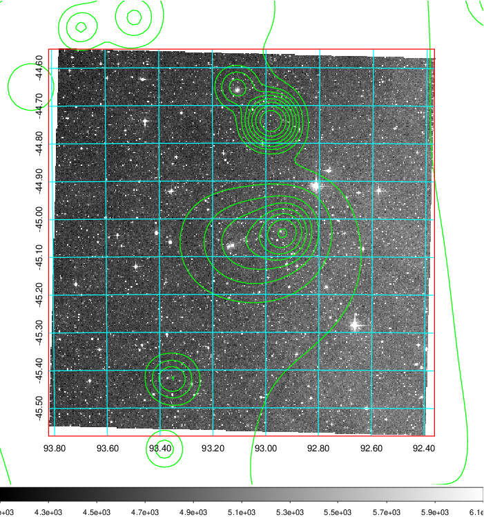 Blue circle for optical clusters;  Magenta circle for XSZ clusters;  all with r=1Mpc;  Only GC with Delta_z<0.01 are shown.  |

|[Previous-identified clusters](../image/239/239_gc.pdf) | [2MASS image](../image/239/239_2mass.pdf)      |
|-------------------|-------------------|
|  Green, magenta, and blue circles  for optical, X-ray and SZ clusters  respectively, with redshift of clusters  labelled. The radius of circles  are 1Mpc.|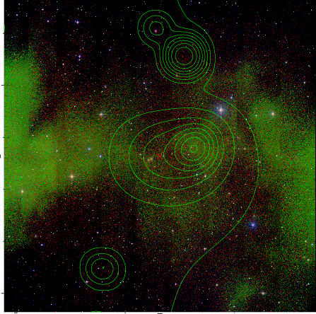  |

|[DES image](../image/239/239_des.pdf)   |
|-------------------|
| 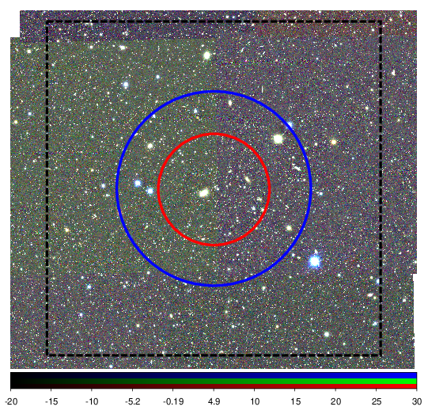  |
