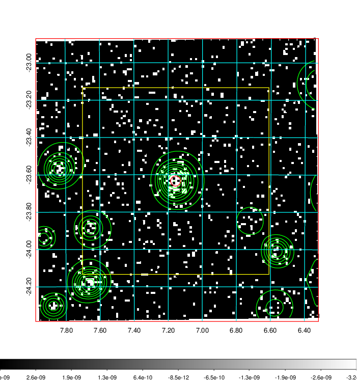
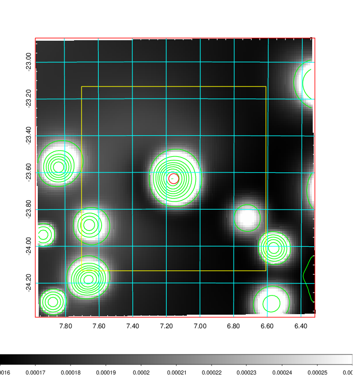
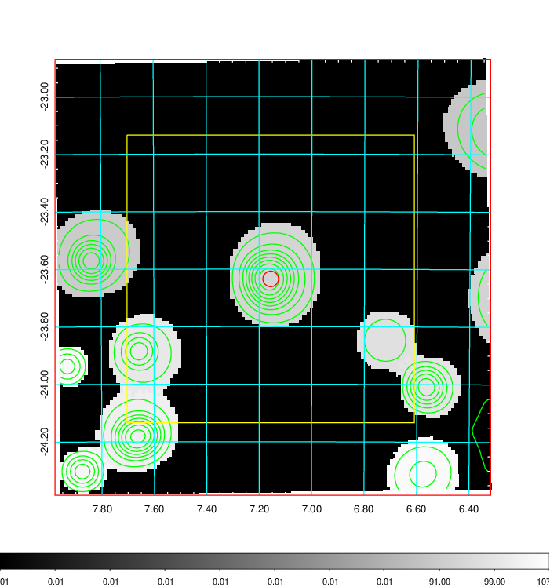
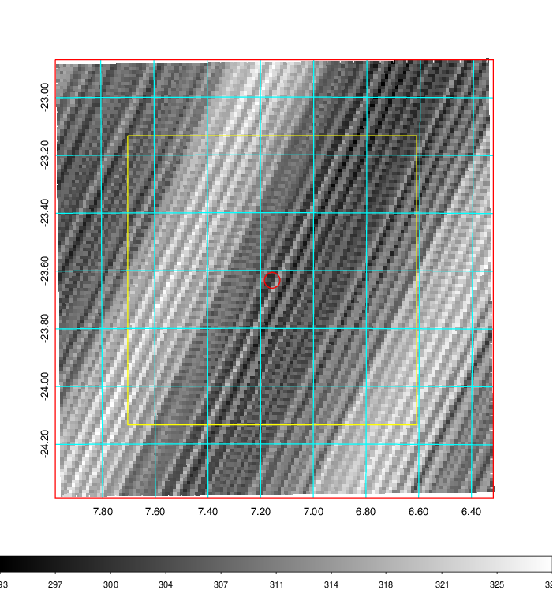
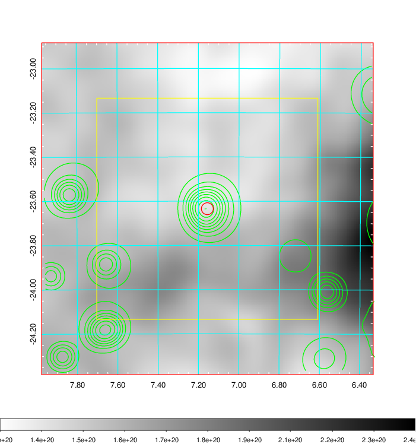
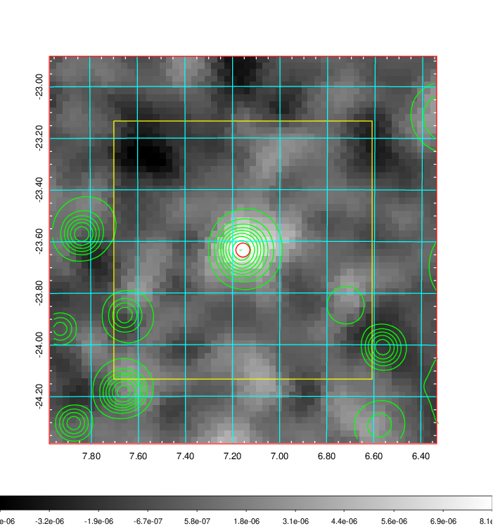
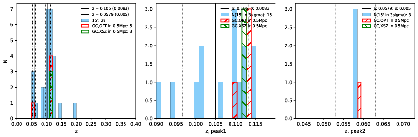
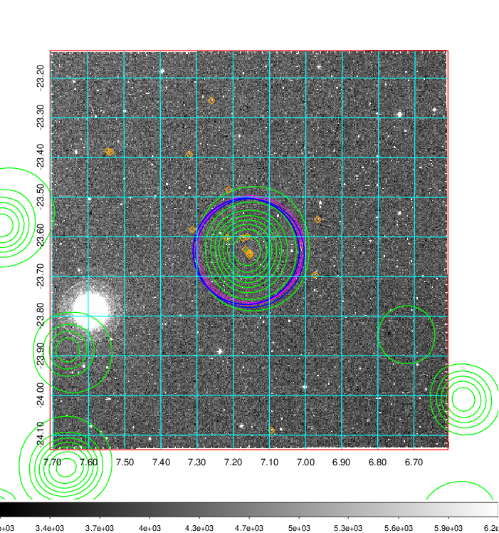
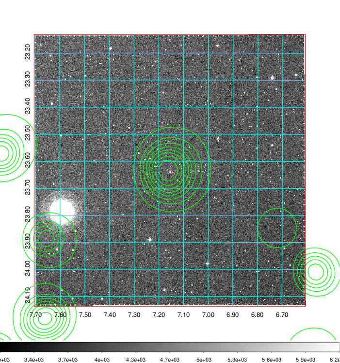
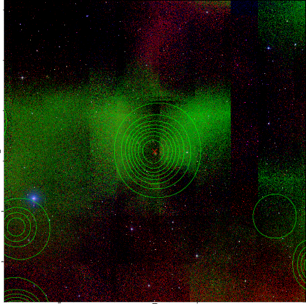

### 24

|Name|RAJ2000[deg]|DEJ2000[deg] |Ext[arcmin]| Ext,ml | z | z_src| C|GC(XSZ,Delta_z<0.01)| GC(OPT,Delta_z<0.01)|GC| R_sig[arcmin] | R500[arcmin] | R500[Mpc]| CRsig[c/s] | CR500[c/s] |L500[1E44 erg/s]|F500[1E-12 erg/s/cm^2]| M500[1E14 Msun]|Tx[keV]|Cnt_sig|Beta|Rc[arcmin]|Comment|Alias|
|---|---|---|---|---|---|------|---|--------|---------|----------|---|---|---|---|---|---|---|---|---|---|---|---|---|---|
|24| 7.156| -23.634| 1.63| 38.85| 0.1050(0.008)| z1, z_xsz| B| MCXC, PSZ2, Tar| A, W| A, MCXC, N, PSZ2, Tar, W| 14.162| 8.311| 0.960| 0.282(0.048)| 0.264(0.045)| 1.478(0.145)| 5.253(0.515)| 2.78(0.14)| 4.16(0.13)| 80.8| 0.866(-0.126+0.094)| 3.649(-0.736+0.553)| -| k144|

|[RASS image](../image/24/24_img.pdf)|[filtered image](../image/24/24_fil.pdf)|[Segment image](../image/24/24_seg.pdf)|
|-------------------|--------------------|-------------------|
|   |    |   |

|[Exposure image](../image/24/24_mex.pdf)| [nH image](../image/24/24_nh.pdf)| [Planck image](../image/24/24_p.pdf)|
|-------------------|--------------------|-------------------|
|   |     |  |

|[Redshift Histogram](../image/24/24_zg.pdf) | [DSS image(z1)](../image/24/24_dss_z1.pdf)      |  [DSS image(z2)](../image/24/24_dss_z2.pdf)    |
|-------------------|--------------------|-------------------|
| |  Blue circle for optical clusters;  Magenta circle for XSZ clusters;  all with r=1Mpc;  Only GC with Delta_z<0.01 are shown. |  Blue circle for optical clusters;  Magenta circle for XSZ clusters;  all with r=1Mpc;  Only GC with Delta_z<0.01 are shown.  |

|[known Abell/XSZ clusters](../image/24/24_gc.pdf) | [2MASS image](../image/24/24_2mass.pdf)      |
|-------------------|-------------------|
|  Magenta, blue and green circles  for optical, X-ray and SZ clusters  respectively, with redshift of clusters  labelled. The radius of circles  are 1Mpc.|  |

|[ATLAS image](../image/24/24_s.pdf)        |
|-------------------|
|   |
