

### 240

|Name|RAJ2000[deg]|DEJ2000[deg] |Ext[arcmin]| Ext,ml | z | z_src| C|GC(XSZ,Delta_z<0.01)| GC(OPT,Delta_z<0.01)|GC| R_sig[arcmin] | R500[arcmin] | R500[Mpc]| CRsig[c/s] | CR500[c/s] |L500[1E44 erg/s]|F500[1E-12 erg/s/cm^2]| M500[1E14 Msun]|Tx[keV]|Cnt_sig|Beta|Rc[arcmin]|Comment|Alias|
|---|---|---|---|---|---|------|---|--------|---------|----------|---|---|---|---|---|---|---|---|---|---|---|---|---|---|
|240| 94.020| -51.856| 3.51| 73.93| 0.0366(0.005)| z1, z_opt| S| -| A| A, N, W| 9.288| 12.024| 0.525| 0.110(0.022)| 0.116(0.023)| 0.051(0.008)| 1.655(0.243)| 0.42(0.03)| 1.28(0.06)| 142.6| 0.894(-0.116+0.076)| 5.221(-0.838+0.603)| -| t166|

|[RASS image](../image/240/240_img.pdf)|[filtered image](../image/240/240_fil.pdf)|[Segment image](../image/240/240_seg.pdf)|
|-------------------|--------------------|-------------------|
| 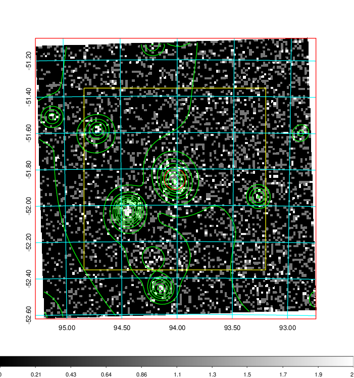  | 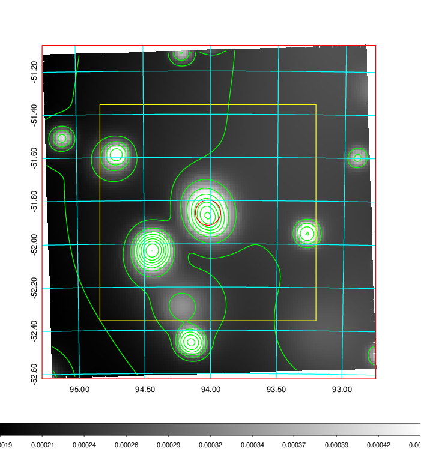   | 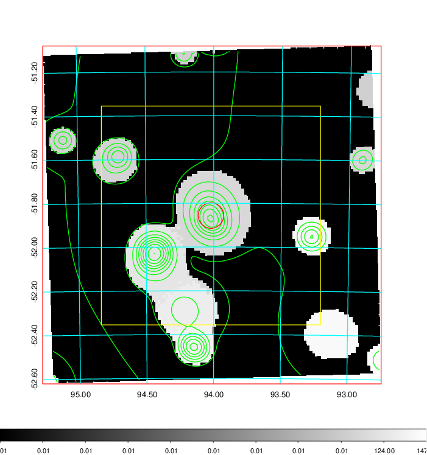  |

|[Exposure image](../image/240/240_mex.pdf)| [nH image](../image/240/240_nh.pdf)| [Planck image](../image/240/240_p.pdf)|
|-------------------|--------------------|-------------------|
|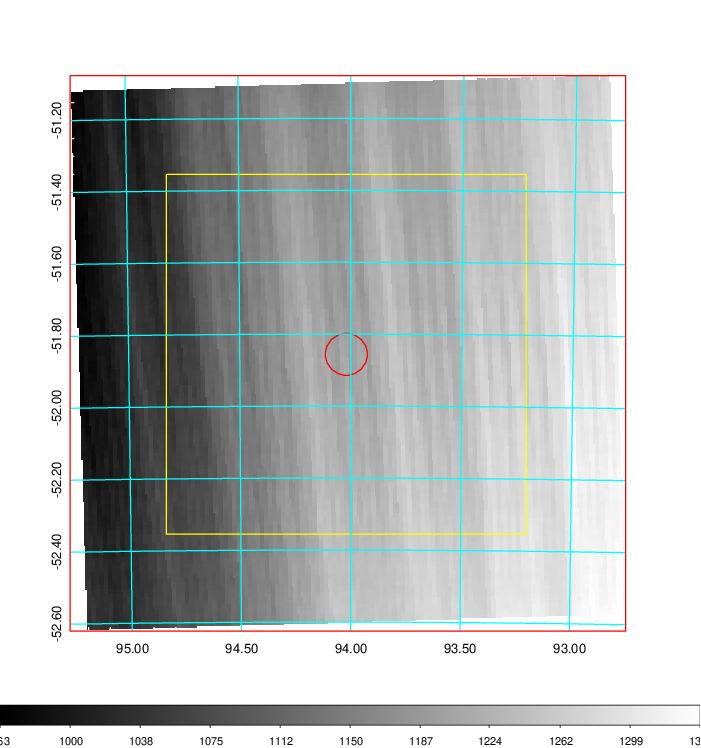   | 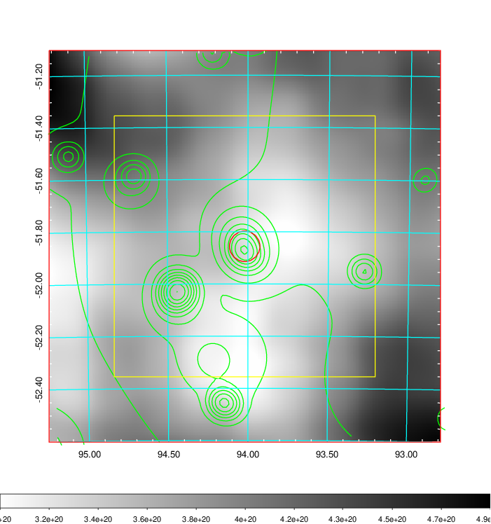    | 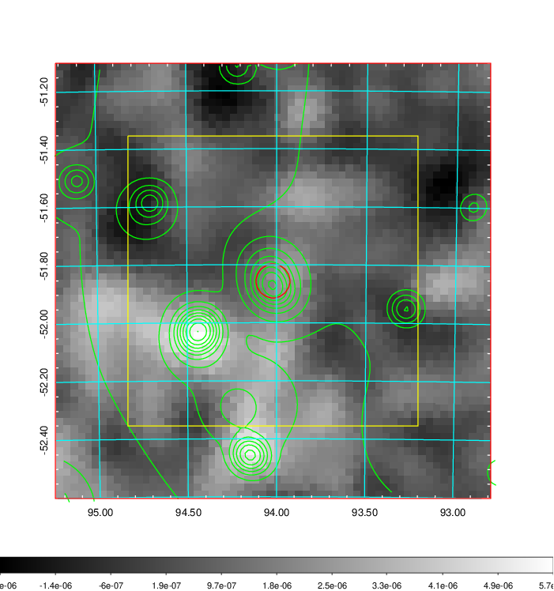 |

|[Redshift Histogram](../image/240/240_zg.pdf) | [DSS image(z1)](../image/240/240_dss_z1.pdf)      |  [DSS image(z2)](../image/240/240_dss_z2.pdf)    |
|-------------------|--------------------|-------------------|
|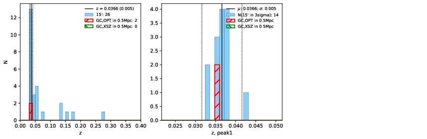 |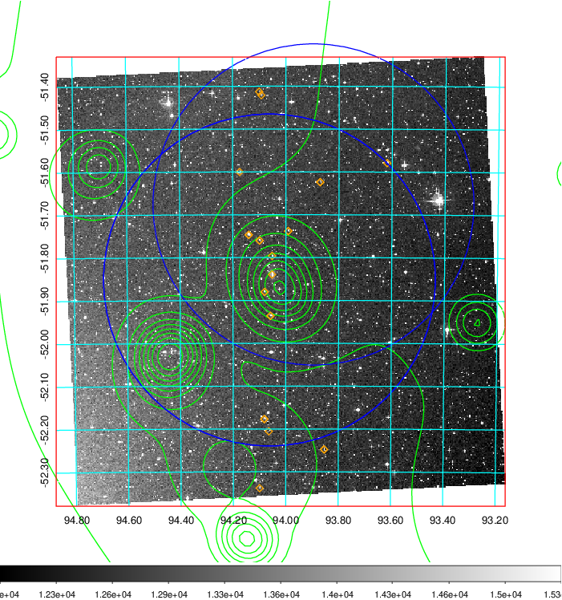  Blue circle for optical clusters;  Magenta circle for XSZ clusters;  all with r=1Mpc;  Only GC with Delta_z<0.01 are shown. | 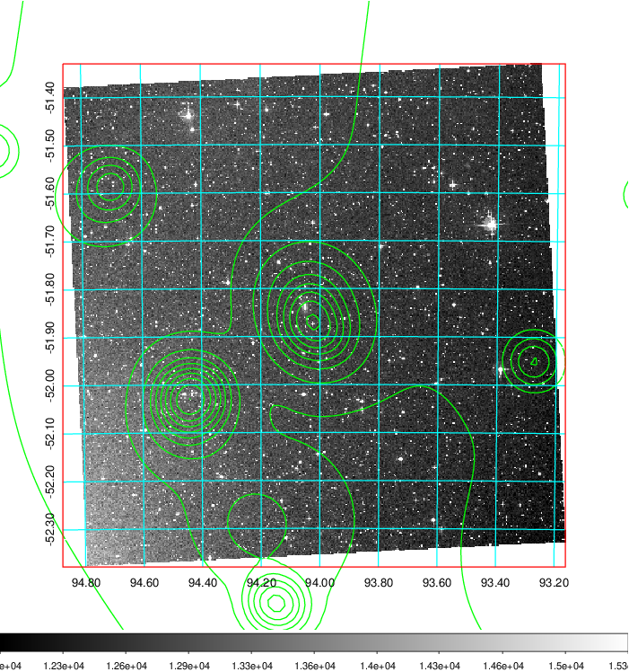 Blue circle for optical clusters;  Magenta circle for XSZ clusters;  all with r=1Mpc;  Only GC with Delta_z<0.01 are shown.  |

|[Previous-identified clusters](../image/240/240_gc.pdf) | [2MASS image](../image/240/240_2mass.pdf)      |
|-------------------|-------------------|
|  Green, magenta, and blue circles  for optical, X-ray and SZ clusters  respectively, with redshift of clusters  labelled. The radius of circles  are 1Mpc.|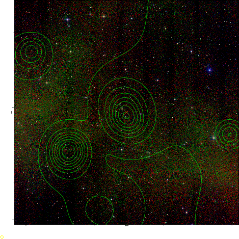  |

|[DES image](../image/240/240_des.pdf)   |
|-------------------|
| 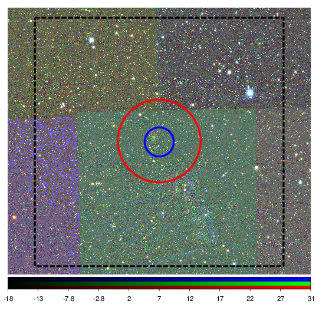  |
