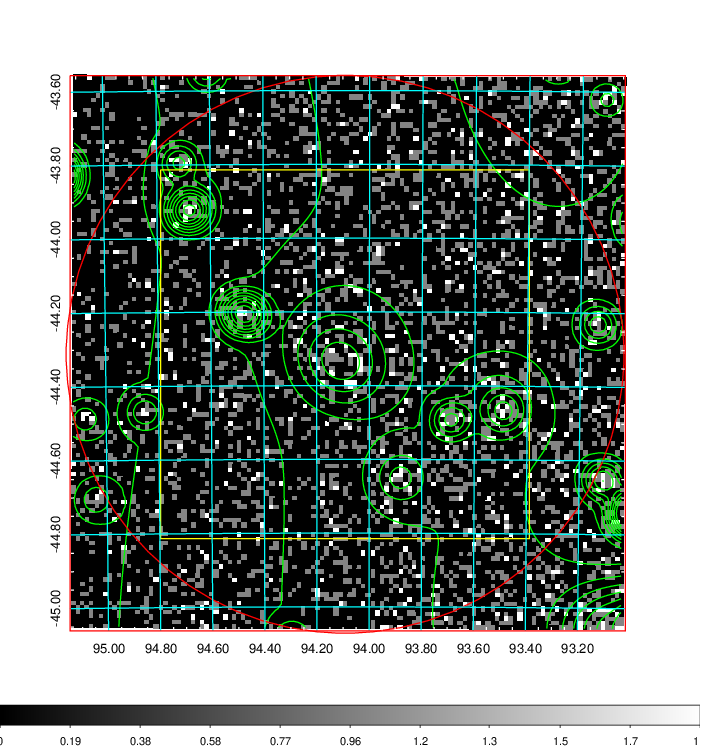
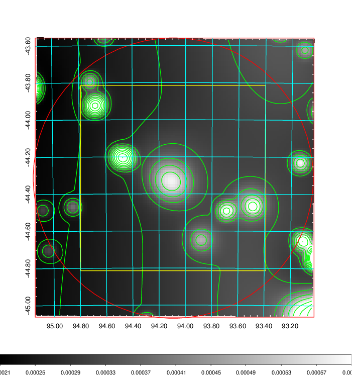
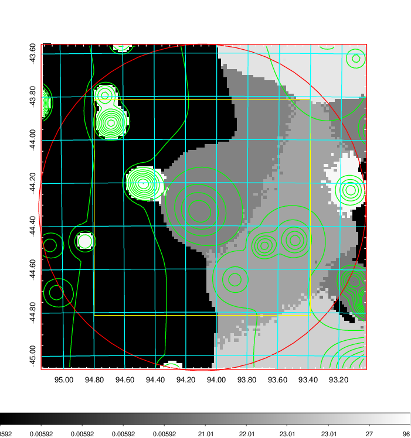
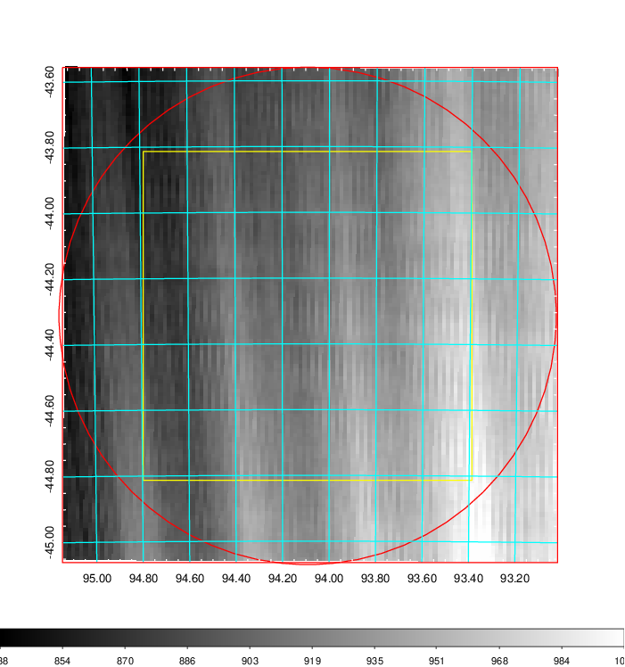
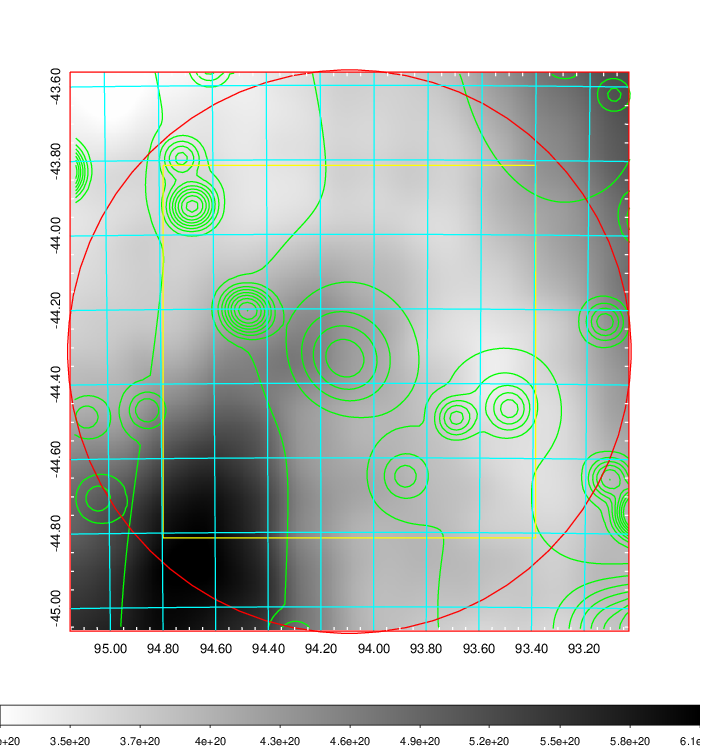
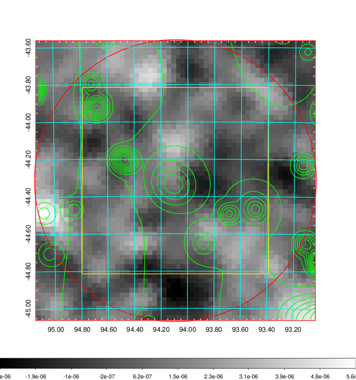
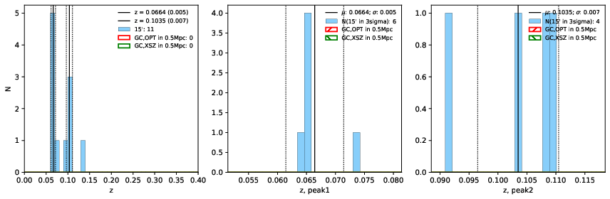
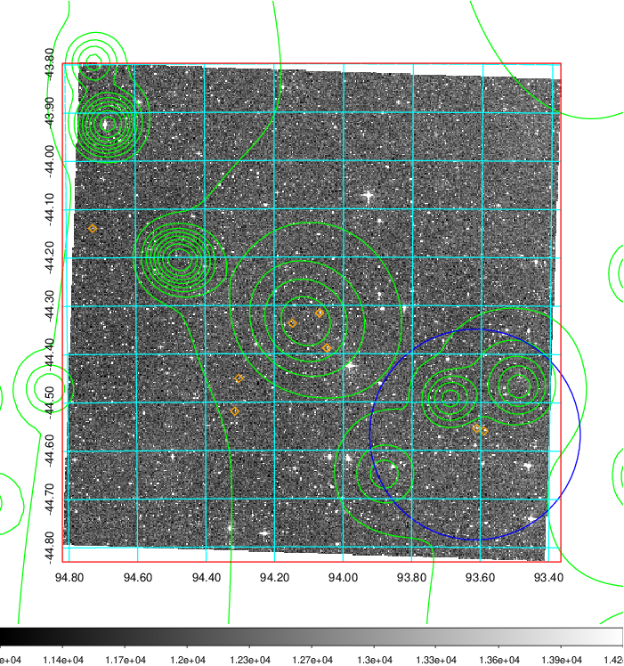
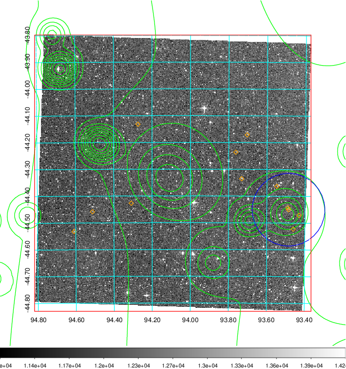
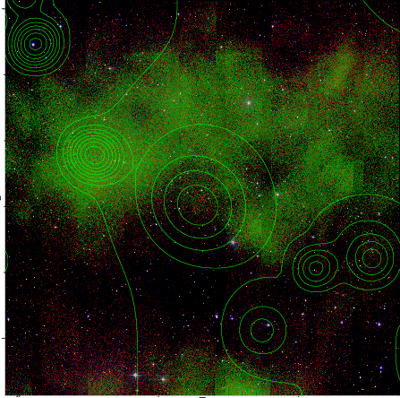

### 241

|Name|RAJ2000[deg]|DEJ2000[deg] |Ext[arcmin]| Ext,ml | z | z_src| C|GC(XSZ,Delta_z<0.01)| GC(OPT,Delta_z<0.01)|GC| R_sig[arcmin] | R500[arcmin] | R500[Mpc]| CRsig[c/s] | CR500[c/s] |L500[1E44 erg/s]|F500[1E-12 erg/s/cm^2]| M500[1E14 Msun]|Tx[keV]|Cnt_sig|Beta|Rc[arcmin]|Comment|Alias|
|---|---|---|---|---|---|------|---|--------|---------|----------|---|---|---|---|---|---|---|---|---|---|---|---|---|---|
|241| 94.092| -44.315| 45.38| 254.24| 0.0664(0.005)| z1,| G| -| -| B15, N| 16.306| 8.061| 0.616| 0.077(0.047)| 0.071(0.044)| 0.123(0.077)| 1.152(0.721)| 0.71(0.23)| 1.77(0.36)| 202.4| 0.635(-0.089+0.156)| 4.456(-1.264+1.676)| -| t689|

|[RASS image](../image/241/241_img.pdf)|[filtered image](../image/241/241_fil.pdf)|[Segment image](../image/241/241_seg.pdf)|
|-------------------|--------------------|-------------------|
|   |    |   |

|[Exposure image](../image/241/241_mex.pdf)| [nH image](../image/241/241_nh.pdf)| [Planck image](../image/241/241_p.pdf)|
|-------------------|--------------------|-------------------|
|   |     |  |

|[Redshift Histogram](../image/241/241_zg.pdf) | [DSS image(z1)](../image/241/241_dss_z1.pdf)      |  [DSS image(z2)](../image/241/241_dss_z2.pdf)    |
|-------------------|--------------------|-------------------|
| |  Blue circle for optical clusters;  Magenta circle for XSZ clusters;  all with r=1Mpc;  Only GC with Delta_z<0.01 are shown. |  Blue circle for optical clusters;  Magenta circle for XSZ clusters;  all with r=1Mpc;  Only GC with Delta_z<0.01 are shown.  |

|[known Abell/XSZ clusters](../image/241/241_gc.pdf) | [2MASS image](../image/241/241_2mass.pdf)      |
|-------------------|-------------------|
|  Magenta, blue and green circles  for optical, X-ray and SZ clusters  respectively, with redshift of clusters  labelled. The radius of circles  are 1Mpc.|  |

|[DES image](../image/241/241_des.pdf)   |
|-------------------|
|   |
