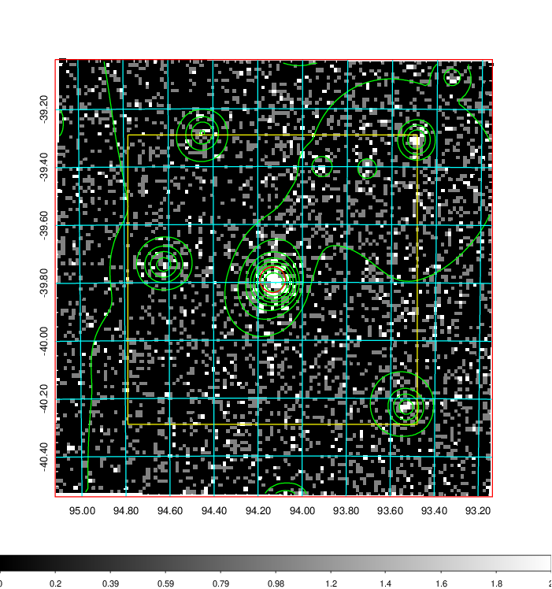
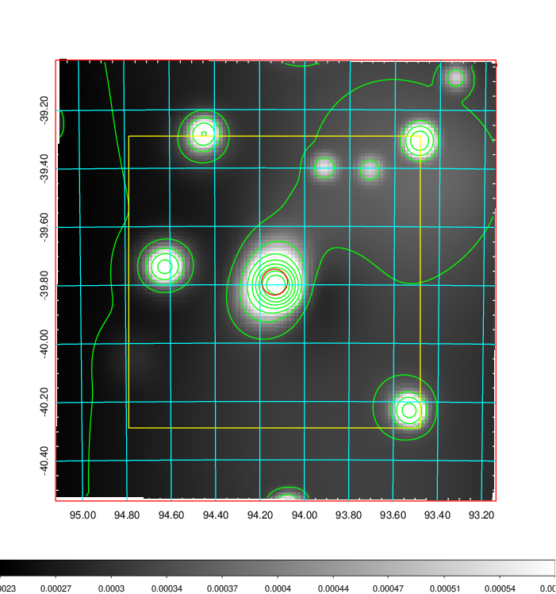
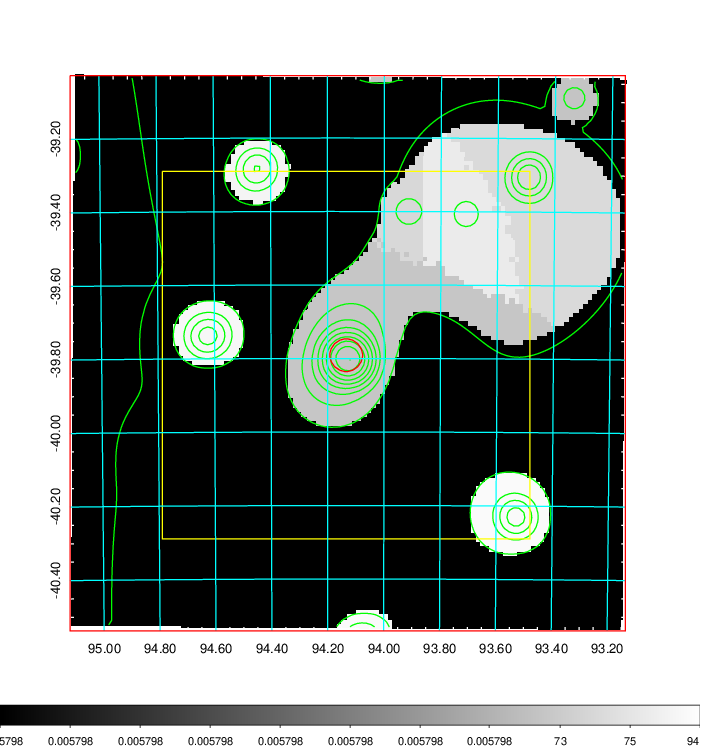
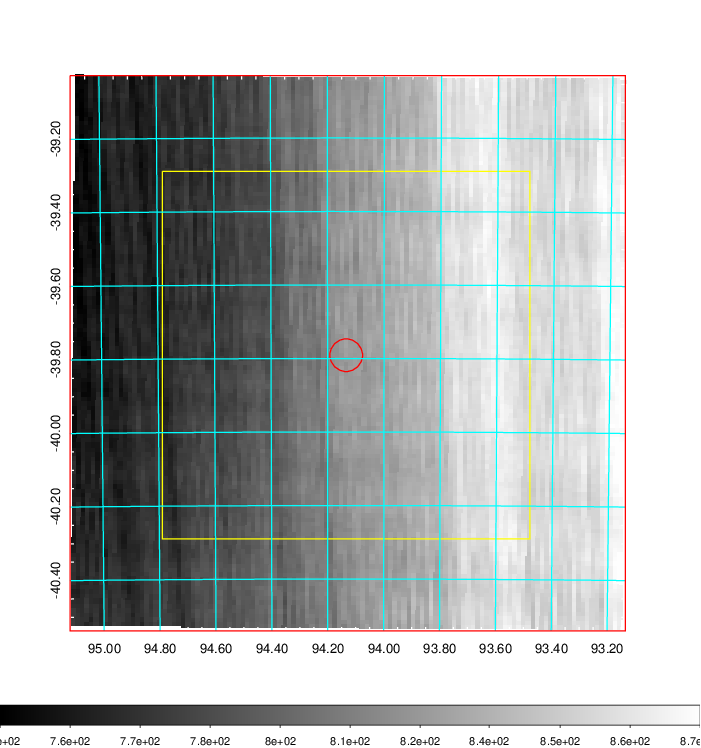
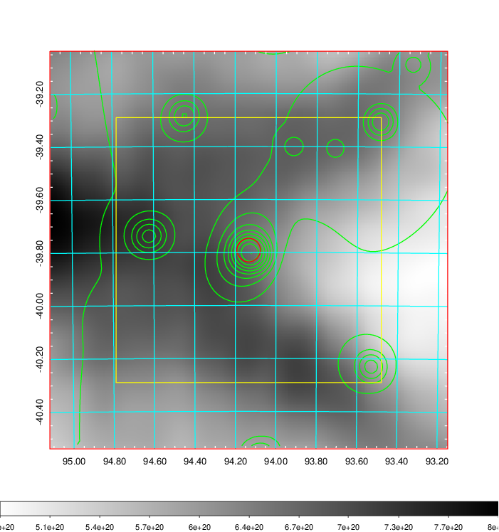
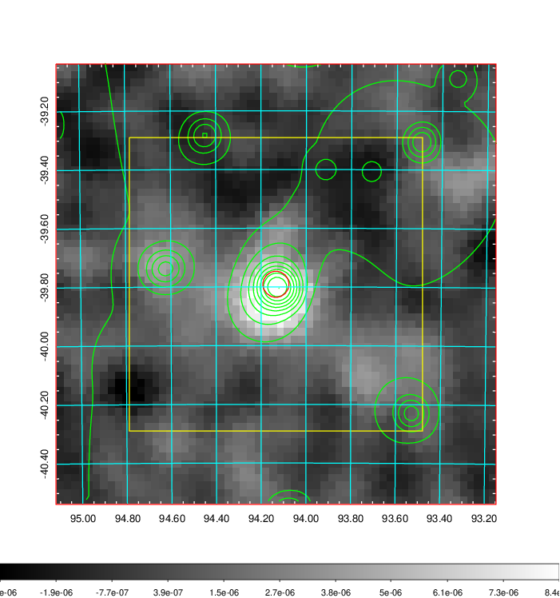
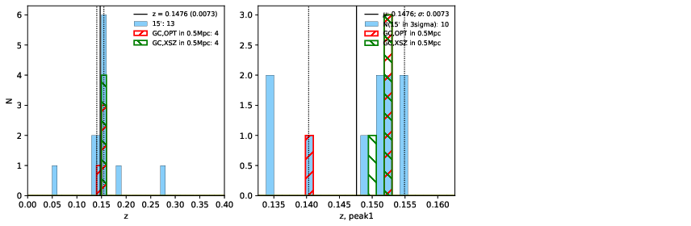
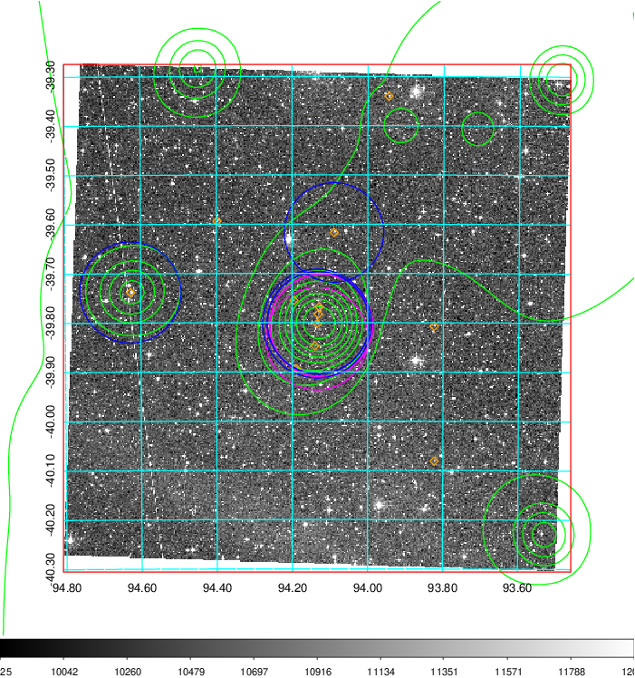
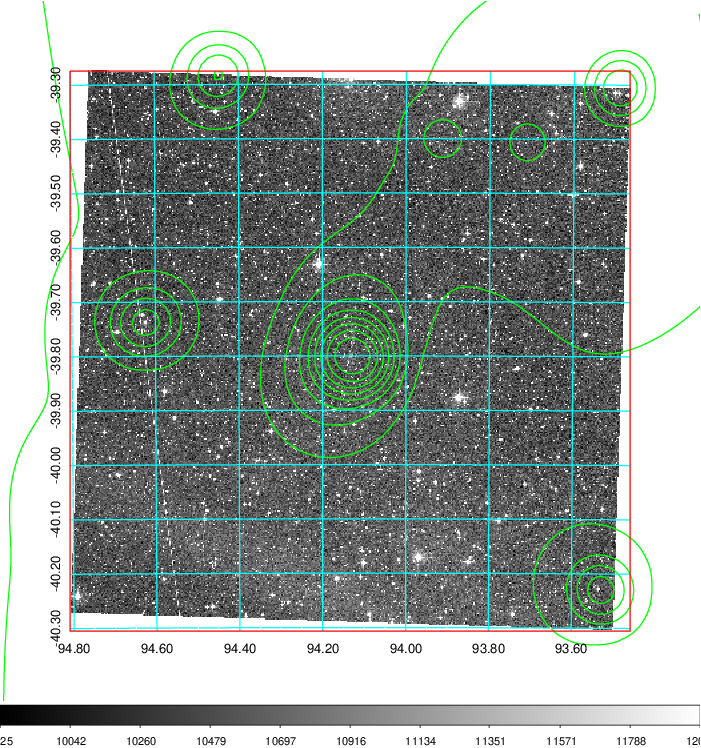
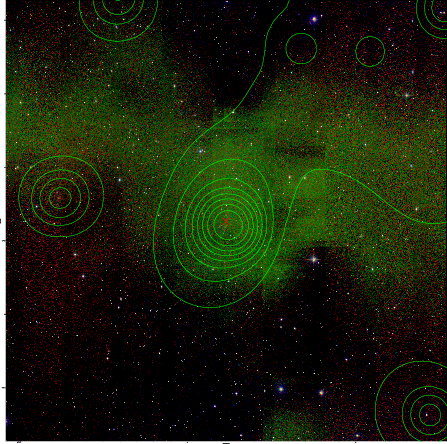

### 242

|Name|RAJ2000[deg]|DEJ2000[deg] |Ext[arcmin]| Ext,ml | z | z_src| C|GC(XSZ,Delta_z<0.01)| GC(OPT,Delta_z<0.01)|GC| R_sig[arcmin] | R500[arcmin] | R500[Mpc]| CRsig[c/s] | CR500[c/s] |L500[1E44 erg/s]|F500[1E-12 erg/s/cm^2]| M500[1E14 Msun]|Tx[keV]|Cnt_sig|Beta|Rc[arcmin]|Comment|Alias|
|---|---|---|---|---|---|------|---|--------|---------|----------|---|---|---|---|---|---|---|---|---|---|---|---|---|---|
|242| 94.134| -39.791| 2.67| 109.48| 0.1476(0.007)| z1, z_xsz| B| MCXC, PSZ2, Tar| A, N, W| A, MCXC, N, PSZ2, Tar, W| 8.800| 7.016| 1.086| 0.233(0.032)| 0.226(0.031)| 2.411(0.134)| 4.103(0.228)| 4.20(0.11)| 5.44(0.09)| 212.9| 0.806(-0.112+0.120)| 3.333(-0.736+0.684)| -| k332|

|[RASS image](../image/242/242_img.pdf)|[filtered image](../image/242/242_fil.pdf)|[Segment image](../image/242/242_seg.pdf)|
|-------------------|--------------------|-------------------|
|   |    |   |

|[Exposure image](../image/242/242_mex.pdf)| [nH image](../image/242/242_nh.pdf)| [Planck image](../image/242/242_p.pdf)|
|-------------------|--------------------|-------------------|
|   |     |  |

|[Redshift Histogram](../image/242/242_zg.pdf) | [DSS image(z1)](../image/242/242_dss_z1.pdf)      |  [DSS image(z2)](../image/242/242_dss_z2.pdf)    |
|-------------------|--------------------|-------------------|
| |  Blue circle for optical clusters;  Magenta circle for XSZ clusters;  all with r=1Mpc;  Only GC with Delta_z<0.01 are shown. |  Blue circle for optical clusters;  Magenta circle for XSZ clusters;  all with r=1Mpc;  Only GC with Delta_z<0.01 are shown.  |

|[known Abell/XSZ clusters](../image/242/242_gc.pdf) | [2MASS image](../image/242/242_2mass.pdf)      |
|-------------------|-------------------|
|  Magenta, blue and green circles  for optical, X-ray and SZ clusters  respectively, with redshift of clusters  labelled. The radius of circles  are 1Mpc.|  |

|[DES image](../image/242/242_des.pdf)   |
|-------------------|
|   |
