

### 243

|Name|RAJ2000[deg]|DEJ2000[deg] |Ext[arcmin]| Ext,ml | z | z_src| C|GC(XSZ,Delta_z<0.01)| GC(OPT,Delta_z<0.01)|GC| R_sig[arcmin] | R500[arcmin] | R500[Mpc]| CRsig[c/s] | CR500[c/s] |L500[1E44 erg/s]|F500[1E-12 erg/s/cm^2]| M500[1E14 Msun]|Tx[keV]|Cnt_sig|Beta|Rc[arcmin]|Comment|Alias|
|---|---|---|---|---|---|------|---|--------|---------|----------|---|---|---|---|---|---|---|---|---|---|---|---|---|---|
|243| 94.220| -47.813| 2.10| 85.32| 0.1128(0.007)| z2, z_xsz| B| MCXC, PSZ2, Tar| N| MCXC, N, PSZ2, Tar, W| 10.262| 7.323| 0.901| 0.168(0.025)| 0.160(0.024)| 0.971(0.079)| 2.960(0.240)| 2.32(0.09)| 3.73(0.10)| 214.0| 0.718(-0.100+0.133)| 2.439(-0.685+0.754)| -| k233|

|[RASS image](../image/243/243_img.pdf)|[filtered image](../image/243/243_fil.pdf)|[Segment image](../image/243/243_seg.pdf)|
|-------------------|--------------------|-------------------|
| 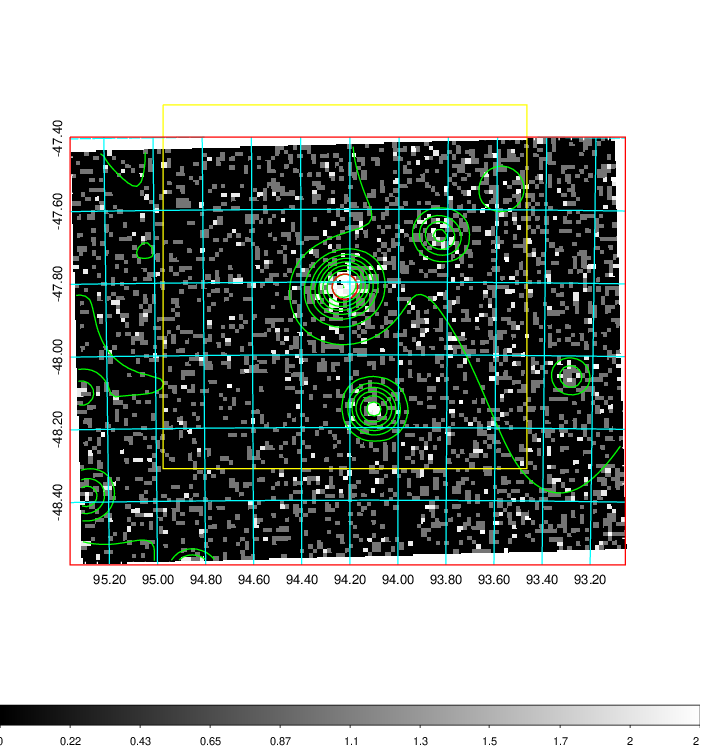  | 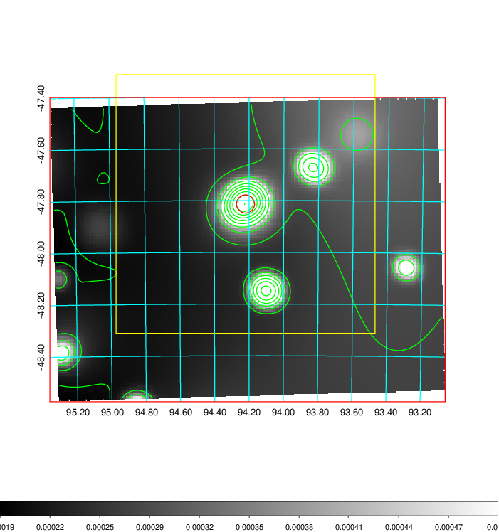   | 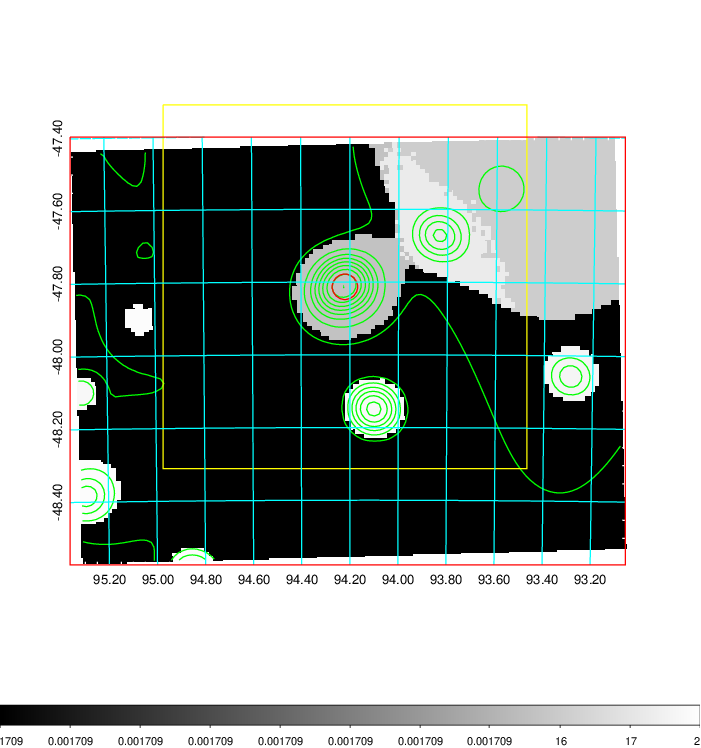  |

|[Exposure image](../image/243/243_mex.pdf)| [nH image](../image/243/243_nh.pdf)| [Planck image](../image/243/243_p.pdf)|
|-------------------|--------------------|-------------------|
|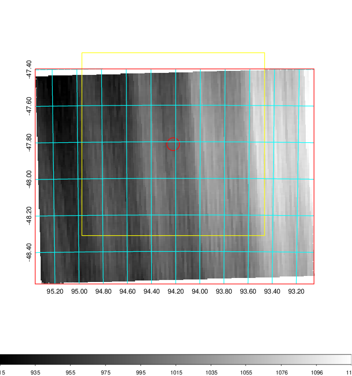   | 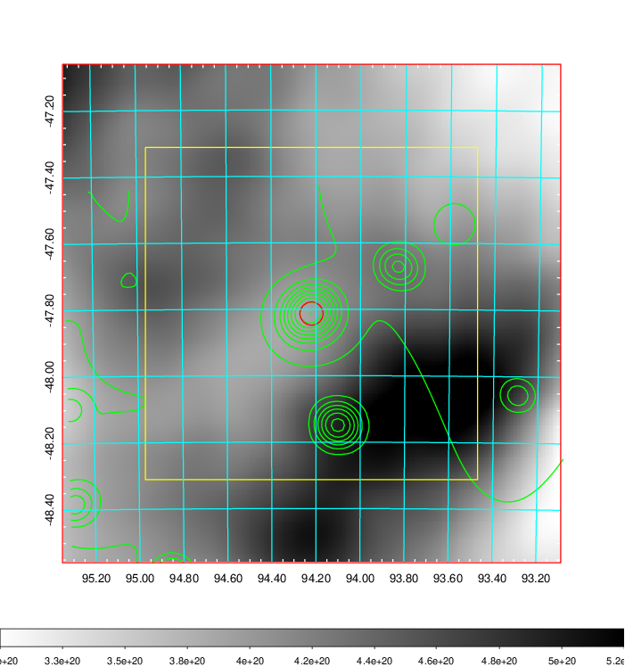    | 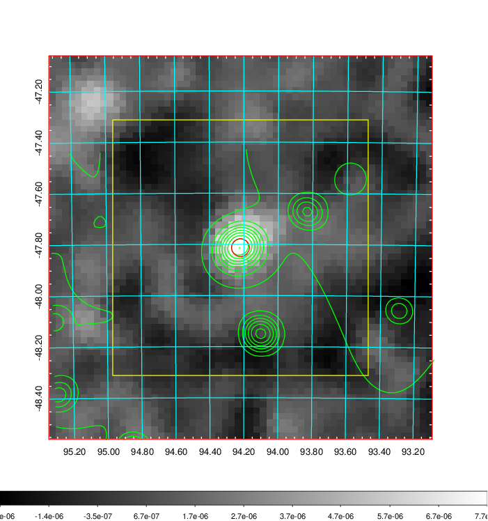 |

|[Redshift Histogram](../image/243/243_zg.pdf) | [DSS image(z1)](../image/243/243_dss_z1.pdf)      |  [DSS image(z2)](../image/243/243_dss_z2.pdf)    |
|-------------------|--------------------|-------------------|
|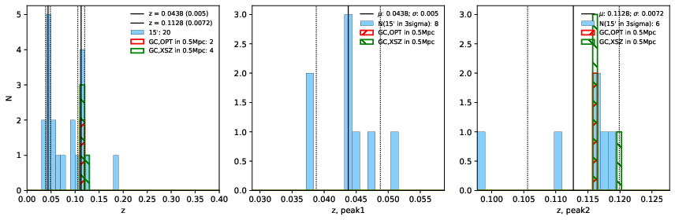 |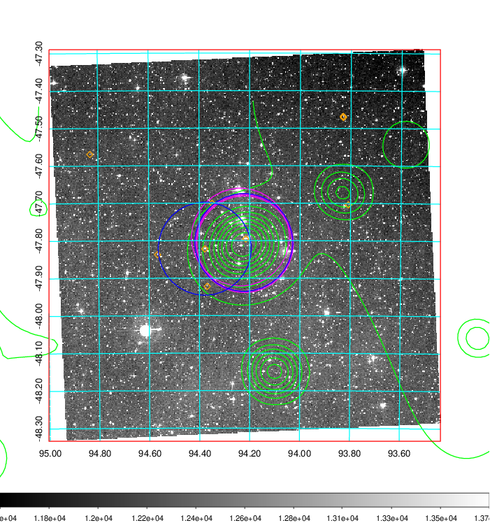  Blue circle for optical clusters;  Magenta circle for XSZ clusters;  all with r=1Mpc;  Only GC with Delta_z<0.01 are shown. | 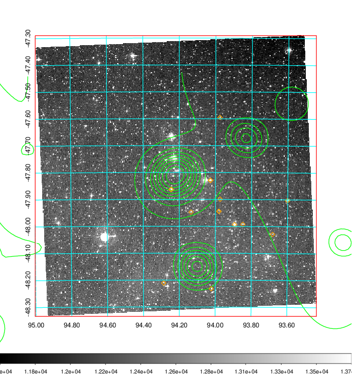 Blue circle for optical clusters;  Magenta circle for XSZ clusters;  all with r=1Mpc;  Only GC with Delta_z<0.01 are shown.  |

|[Previous-identified clusters](../image/243/243_gc.pdf) | [2MASS image](../image/243/243_2mass.pdf)      |
|-------------------|-------------------|
|  Green, magenta, and blue circles  for optical, X-ray and SZ clusters  respectively, with redshift of clusters  labelled. The radius of circles  are 1Mpc.|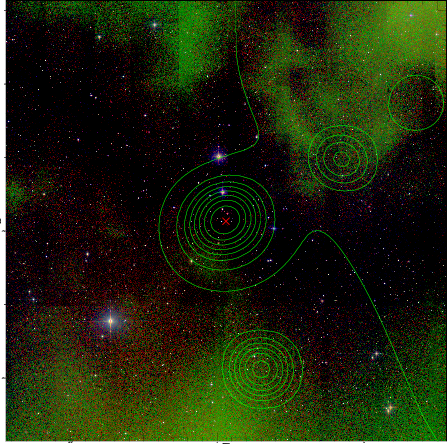  |

|[DES image](../image/243/243_des.pdf)   |
|-------------------|
| 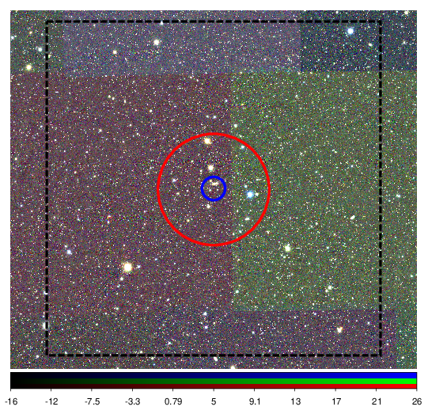  |
