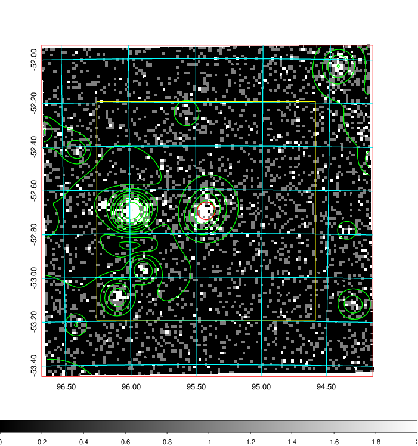
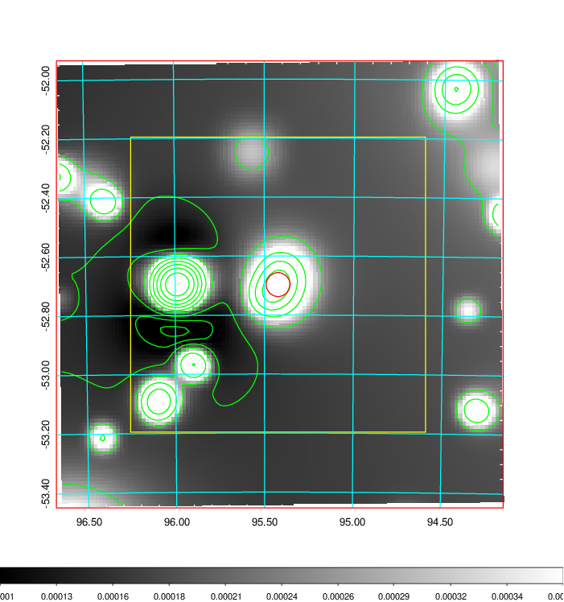
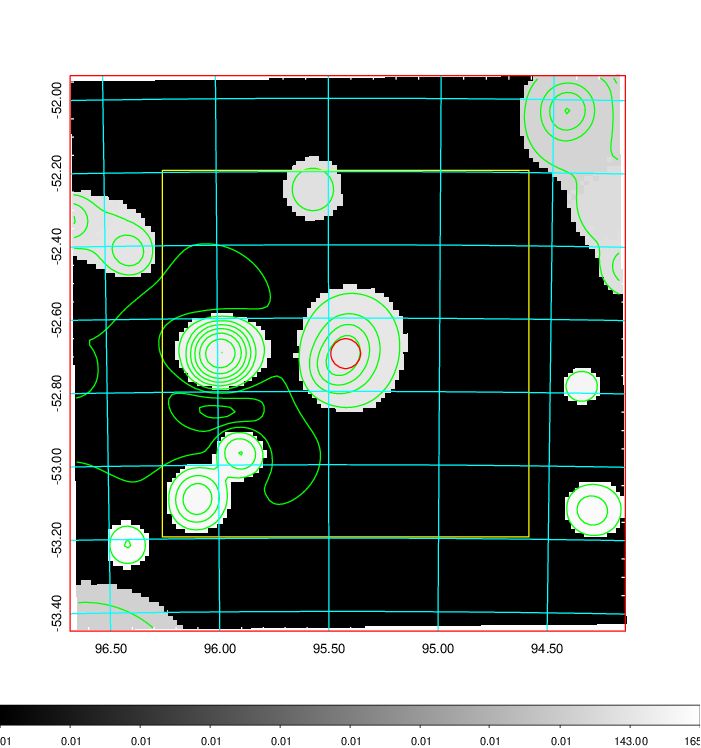
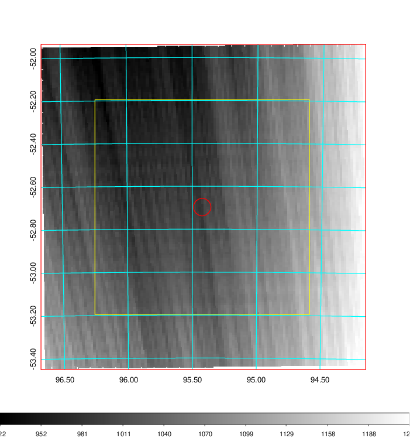
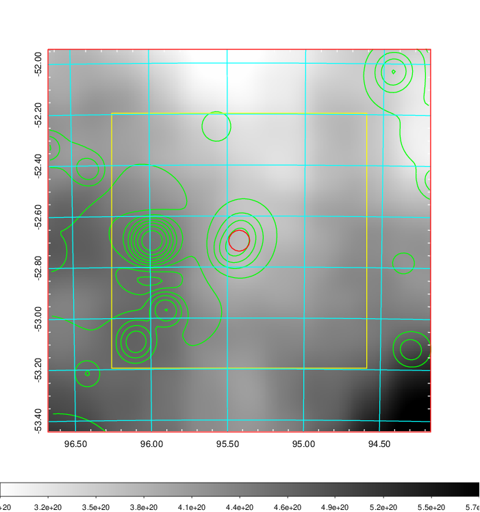
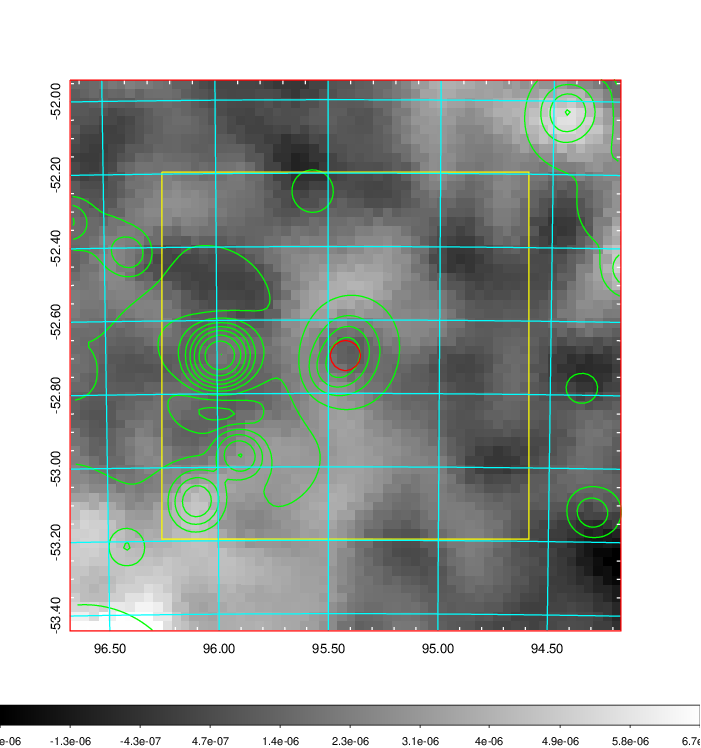
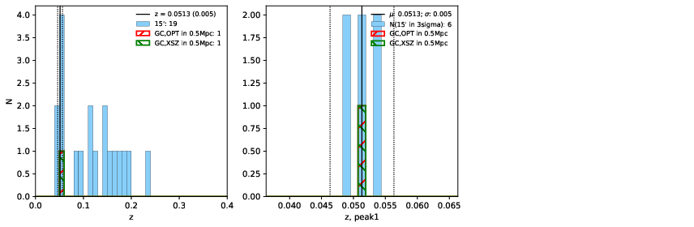
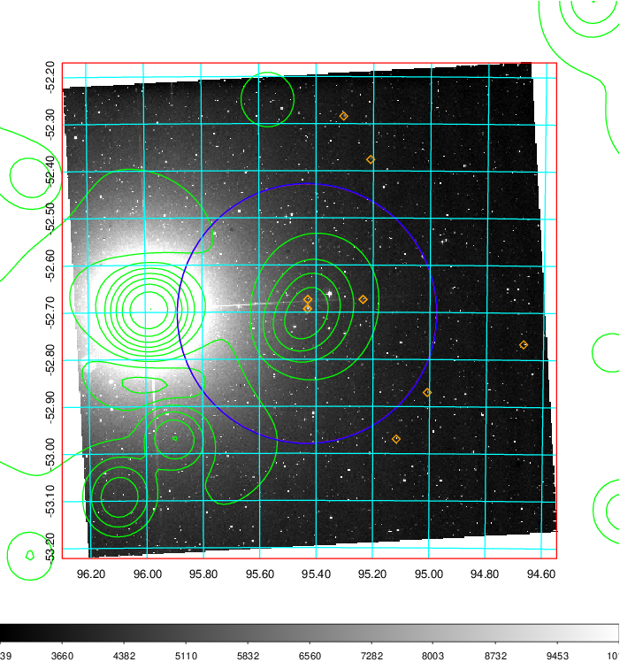
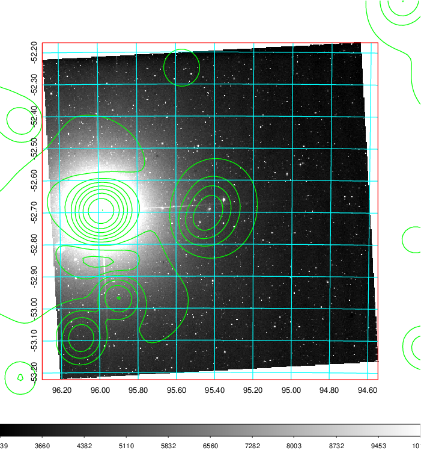
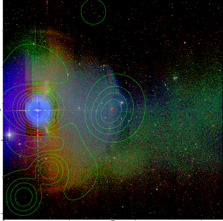

### 245

|Name|RAJ2000[deg]|DEJ2000[deg] |Ext[arcmin]| Ext,ml | z | z_src| C|GC(XSZ,Delta_z<0.01)| GC(OPT,Delta_z<0.01)|GC| R_sig[arcmin] | R500[arcmin] | R500[Mpc]| CRsig[c/s] | CR500[c/s] |L500[1E44 erg/s]|F500[1E-12 erg/s/cm^2]| M500[1E14 Msun]|Tx[keV]|Cnt_sig|Beta|Rc[arcmin]|Comment|Alias|
|---|---|---|---|---|---|------|---|--------|---------|----------|---|---|---|---|---|---|---|---|---|---|---|---|---|---|
|245| 95.423| -52.697| 2.44| 129.55| 0.0513(0.005)| z1, z_xsz| B| MCXC| N| MCXC, N| 11.238| 11.577| 0.696| 0.211(0.025)| 0.212(0.025)| 0.226(0.014)| 3.630(0.232)| 1.00(0.03)| 2.18(0.04)| 210.4| 0.931(-0.083+0.050)| 5.067(-0.527+0.376)| -| k289|

|[RASS image](../image/245/245_img.pdf)|[filtered image](../image/245/245_fil.pdf)|[Segment image](../image/245/245_seg.pdf)|
|-------------------|--------------------|-------------------|
|   |    |   |

|[Exposure image](../image/245/245_mex.pdf)| [nH image](../image/245/245_nh.pdf)| [Planck image](../image/245/245_p.pdf)|
|-------------------|--------------------|-------------------|
|   |     |  |

|[Redshift Histogram](../image/245/245_zg.pdf) | [DSS image(z1)](../image/245/245_dss_z1.pdf)      |  [DSS image(z2)](../image/245/245_dss_z2.pdf)    |
|-------------------|--------------------|-------------------|
| |  Blue circle for optical clusters;  Magenta circle for XSZ clusters;  all with r=1Mpc;  Only GC with Delta_z<0.01 are shown. |  Blue circle for optical clusters;  Magenta circle for XSZ clusters;  all with r=1Mpc;  Only GC with Delta_z<0.01 are shown.  |

|[known Abell/XSZ clusters](../image/245/245_gc.pdf) | [2MASS image](../image/245/245_2mass.pdf)      |
|-------------------|-------------------|
|  Magenta, blue and green circles  for optical, X-ray and SZ clusters  respectively, with redshift of clusters  labelled. The radius of circles  are 1Mpc.|  |

