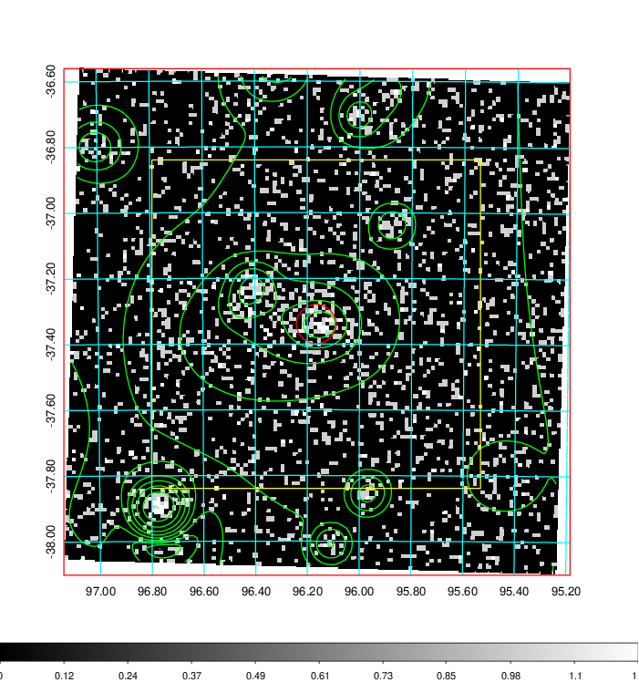
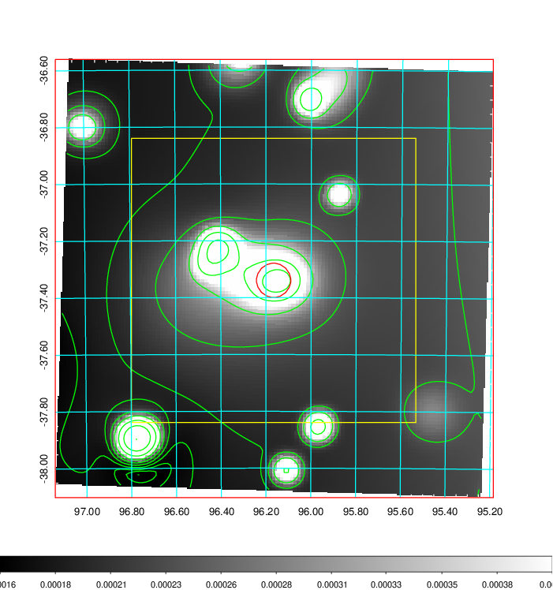
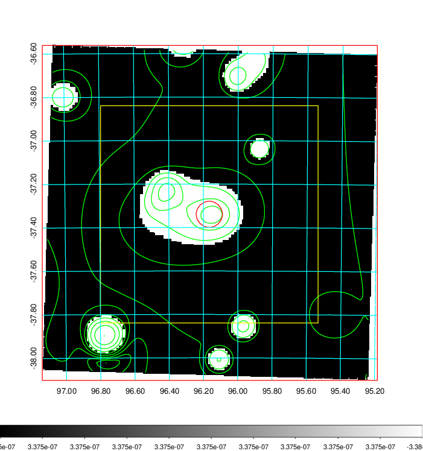
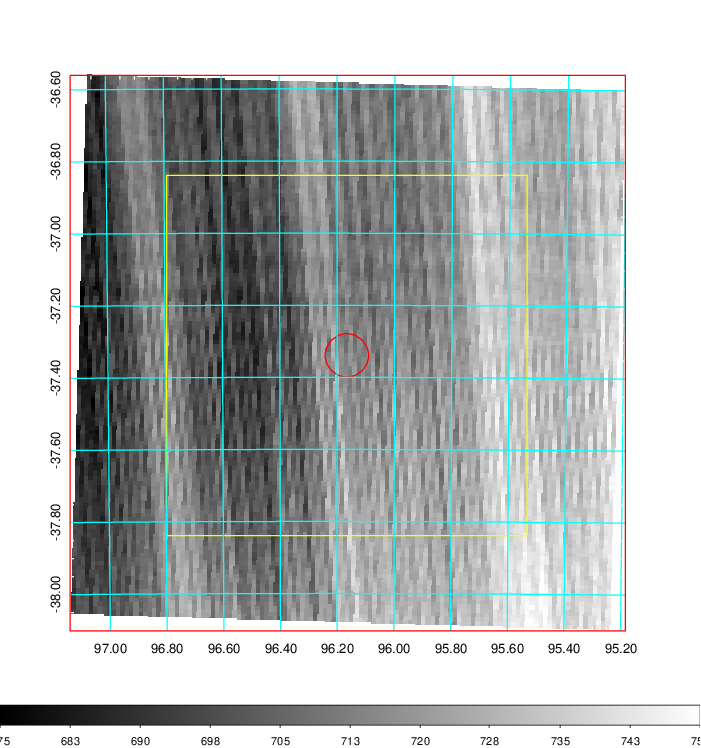
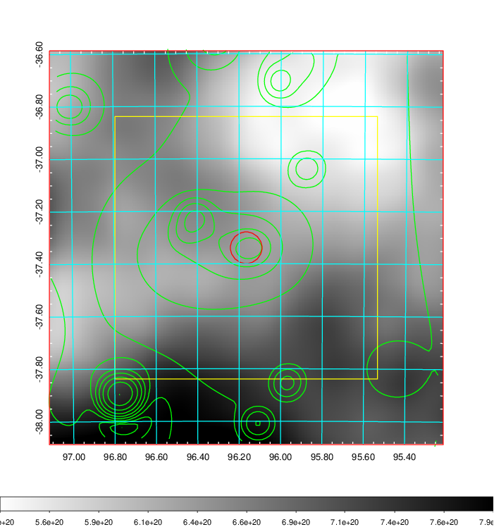
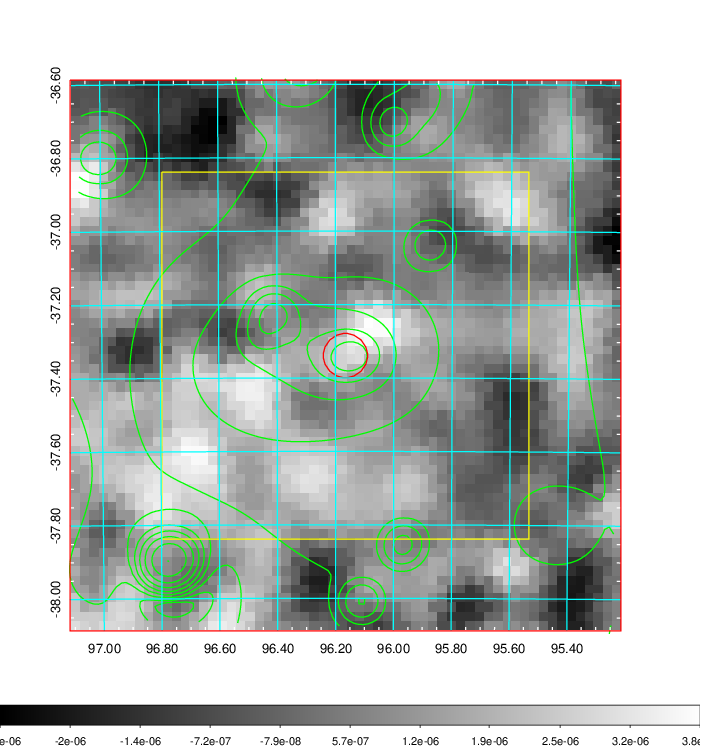
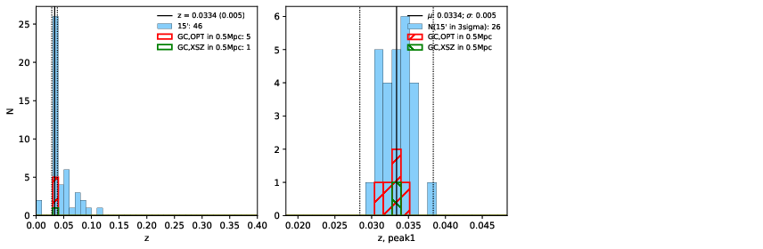
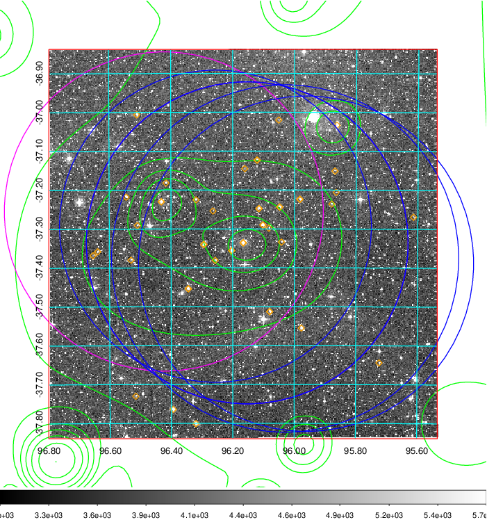
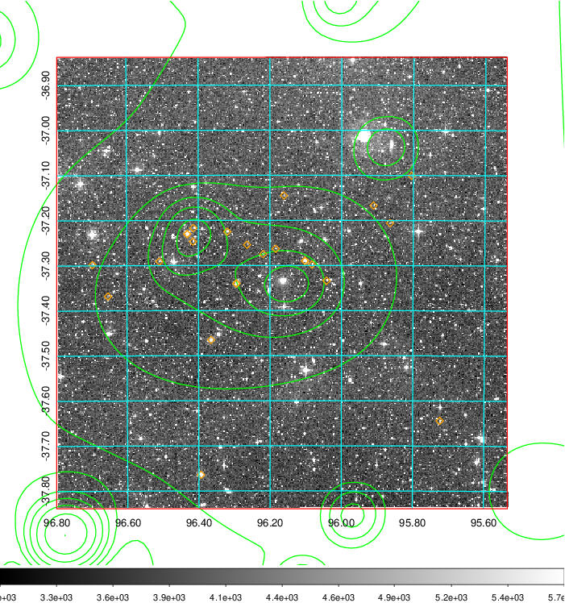

### 246

|Name|RAJ2000[deg]|DEJ2000[deg] |Ext[arcmin]| Ext,ml | z | z_src| C|GC(XSZ,Delta_z<0.01)| GC(OPT,Delta_z<0.01)|GC| R_sig[arcmin] | R500[arcmin] | R500[Mpc]| CRsig[c/s] | CR500[c/s] |L500[1E44 erg/s]|F500[1E-12 erg/s/cm^2]| M500[1E14 Msun]|Tx[keV]|Cnt_sig|Beta|Rc[arcmin]|Comment|Alias|
|---|---|---|---|---|---|------|---|--------|---------|----------|---|---|---|---|---|---|---|---|---|---|---|---|---|---|
|246| 96.166| -37.339| 3.62| 56.07| 0.0334(0.005)| z1, z_xsz| B| MCXC| A, N| A, MCXC, N, W, XB| 28.650| 15.389| 0.615| 0.276(0.053)| 0.256(0.050)| 0.104(0.014)| 4.021(0.561)| 0.68(0.05)| 1.71(0.08)| 324.5| 0.528(-0.020+0.033)| 3.474(-0.428+0.631)| -| k447|

|[RASS image](../image/246/246_img.pdf)|[filtered image](../image/246/246_fil.pdf)|[Segment image](../image/246/246_seg.pdf)|
|-------------------|--------------------|-------------------|
|   |    |   |

|[Exposure image](../image/246/246_mex.pdf)| [nH image](../image/246/246_nh.pdf)| [Planck image](../image/246/246_p.pdf)|
|-------------------|--------------------|-------------------|
|   |     |  |

|[Redshift Histogram](../image/246/246_zg.pdf) | [DSS image(z1)](../image/246/246_dss_z1.pdf)      |  [DSS image(z2)](../image/246/246_dss_z2.pdf)    |
|-------------------|--------------------|-------------------|
| |  Blue circle for optical clusters;  Magenta circle for XSZ clusters;  all with r=1Mpc;  Only GC with Delta_z<0.01 are shown. |  Blue circle for optical clusters;  Magenta circle for XSZ clusters;  all with r=1Mpc;  Only GC with Delta_z<0.01 are shown.  |

|[Previous-identified clusters](../image/246/246_gc.pdf) | [2MASS image](../image/246/246_2mass.pdf)      |
|-------------------|-------------------|
|  Green, magenta, and blue circles  for optical, X-ray and SZ clusters  respectively, with redshift of clusters  labelled. The radius of circles  are 1Mpc.|  |

