

### 247

|Name|RAJ2000[deg]|DEJ2000[deg] |Ext[arcmin]| Ext,ml | z | z_src| C|GC(XSZ,Delta_z<0.01)| GC(OPT,Delta_z<0.01)|GC| R_sig[arcmin] | R500[arcmin] | R500[Mpc]| CRsig[c/s] | CR500[c/s] |L500[1E44 erg/s]|F500[1E-12 erg/s/cm^2]| M500[1E14 Msun]|Tx[keV]|Cnt_sig|Beta|Rc[arcmin]|Comment|Alias|
|---|---|---|---|---|---|------|---|--------|---------|----------|---|---|---|---|---|---|---|---|---|---|---|---|---|---|
|247| 96.594| -53.687| 4.25| 1470.69| 0.0551(0.005)| z1, z_xsz| B| MCXC, PSZ2, Tar, XB| A, N| A, MCXC, N, PSZ2, Tar, XB| 31.612| 15.766| 1.013| 1.148(0.048)| 1.060(0.044)| 1.380(0.027)| 19.076(0.375)| 3.11(0.03)| 4.39(0.03)| 1405.8| 0.602(-0.013+0.014)| 4.297(-0.226+0.242)| -| k495|

|[RASS image](../image/247/247_img.pdf)|[filtered image](../image/247/247_fil.pdf)|[Segment image](../image/247/247_seg.pdf)|
|-------------------|--------------------|-------------------|
| 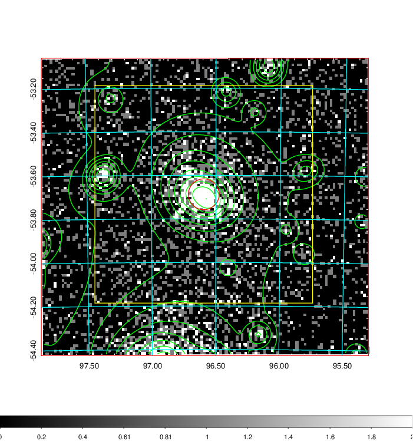  | 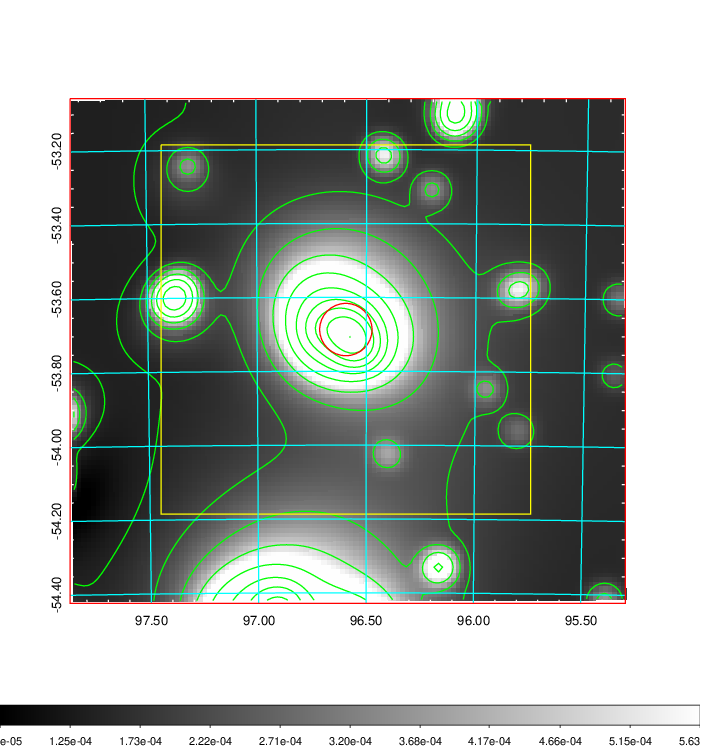   | 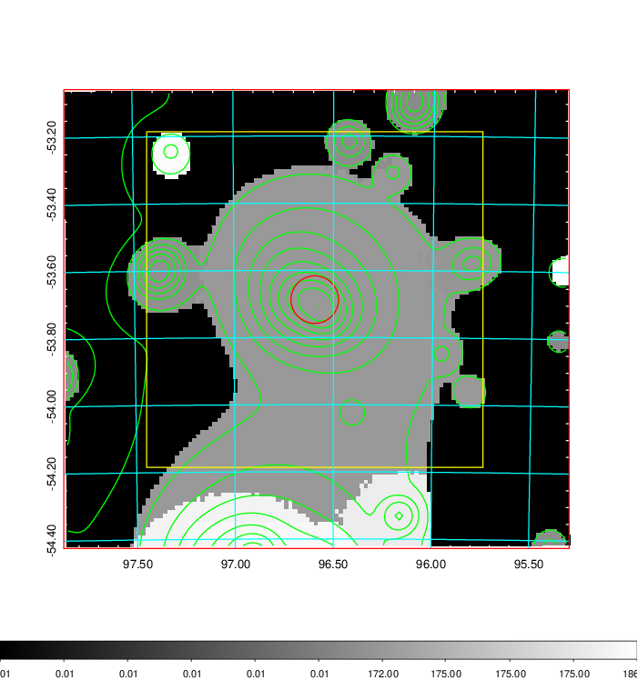  |

|[Exposure image](../image/247/247_mex.pdf)| [nH image](../image/247/247_nh.pdf)| [Planck image](../image/247/247_p.pdf)|
|-------------------|--------------------|-------------------|
|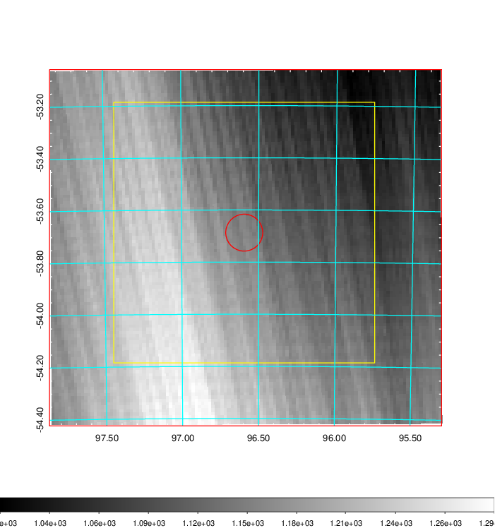   | 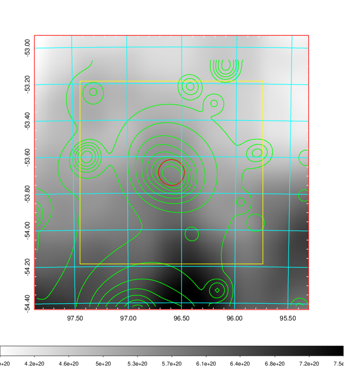    | 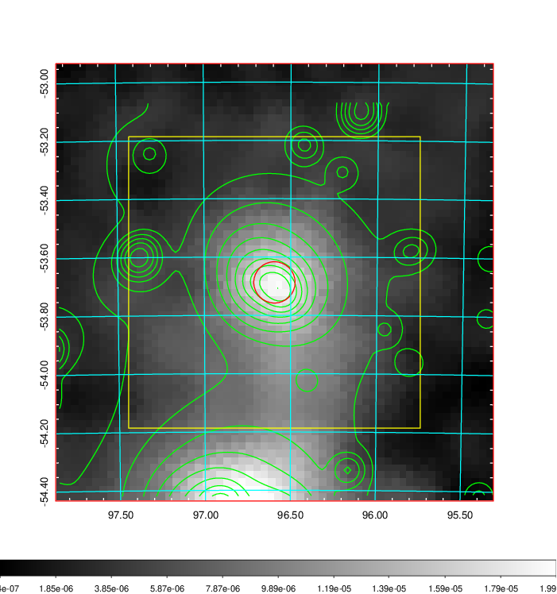 |

|[Redshift Histogram](../image/247/247_zg.pdf) | [DSS image(z1)](../image/247/247_dss_z1.pdf)      |  [DSS image(z2)](../image/247/247_dss_z2.pdf)    |
|-------------------|--------------------|-------------------|
|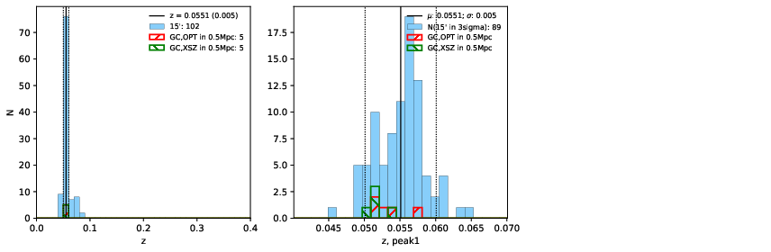 |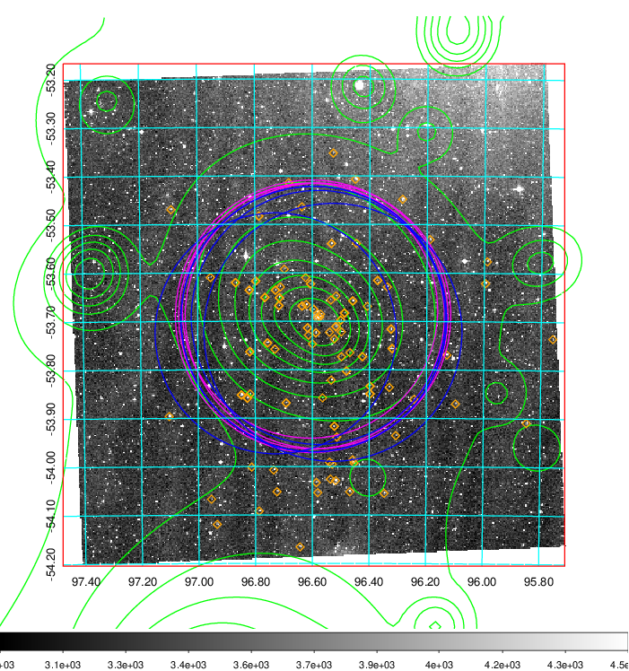  Blue circle for optical clusters;  Magenta circle for XSZ clusters;  all with r=1Mpc;  Only GC with Delta_z<0.01 are shown. | 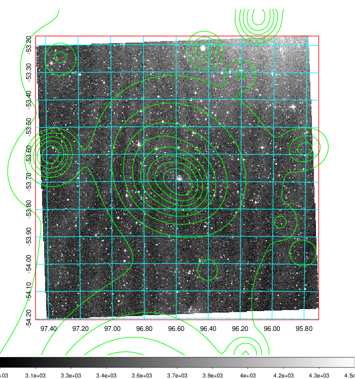 Blue circle for optical clusters;  Magenta circle for XSZ clusters;  all with r=1Mpc;  Only GC with Delta_z<0.01 are shown.  |

|[Previous-identified clusters](../image/247/247_gc.pdf) | [2MASS image](../image/247/247_2mass.pdf)      |
|-------------------|-------------------|
|  Green, magenta, and blue circles  for optical, X-ray and SZ clusters  respectively, with redshift of clusters  labelled. The radius of circles  are 1Mpc.|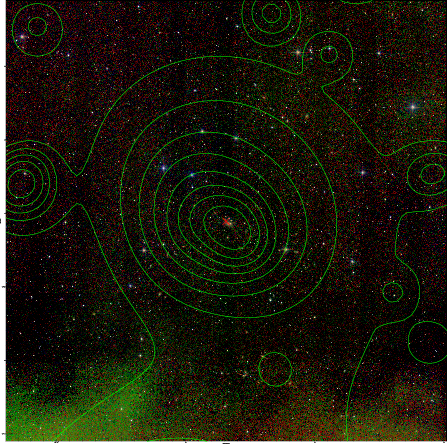  |

|[DES image](../image/247/247_des.pdf)   |
|-------------------|
| 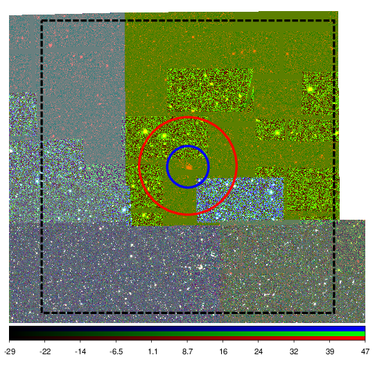  |
