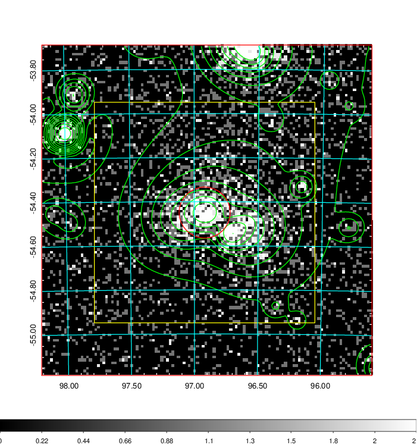
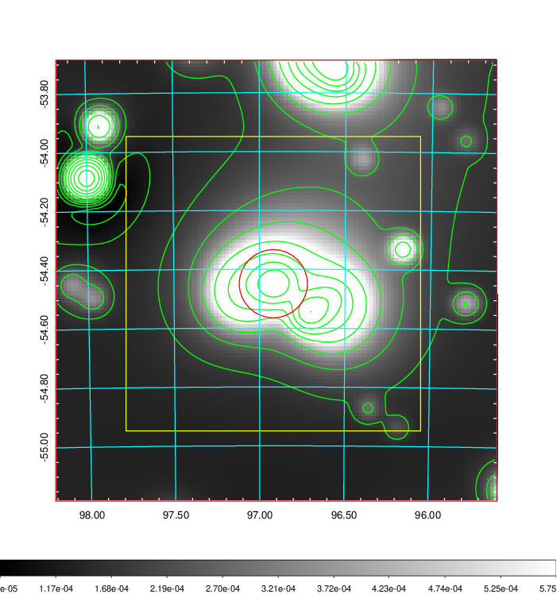
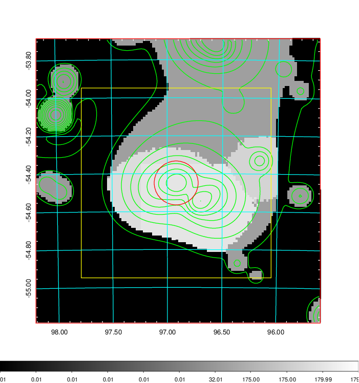
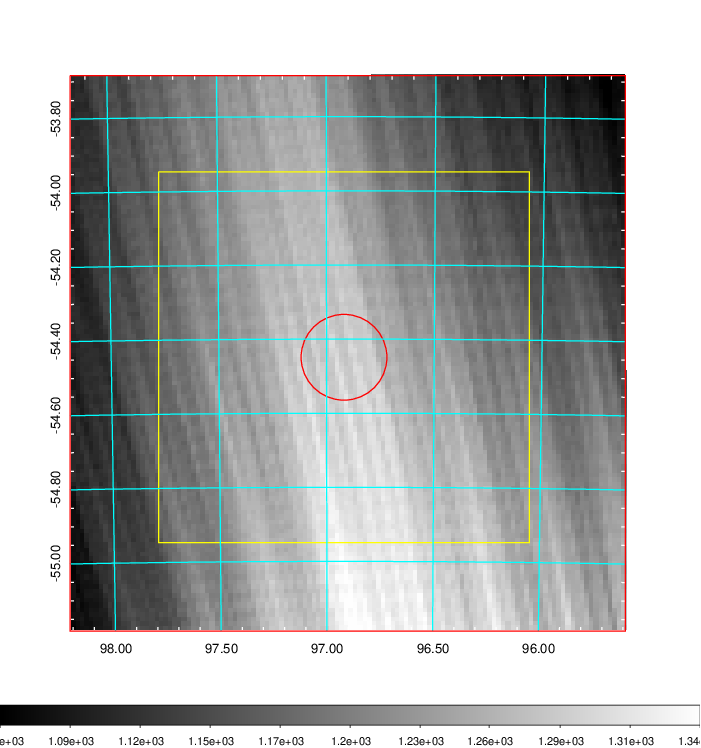
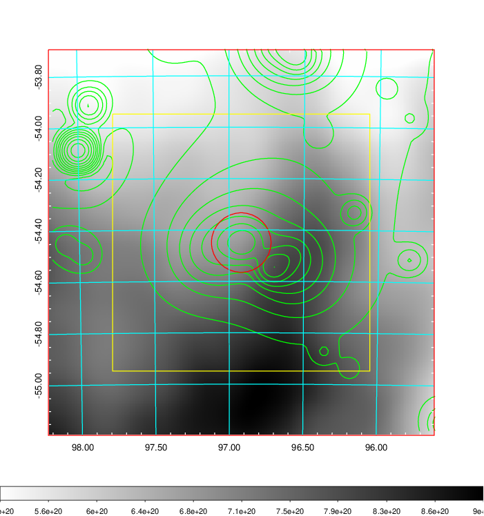
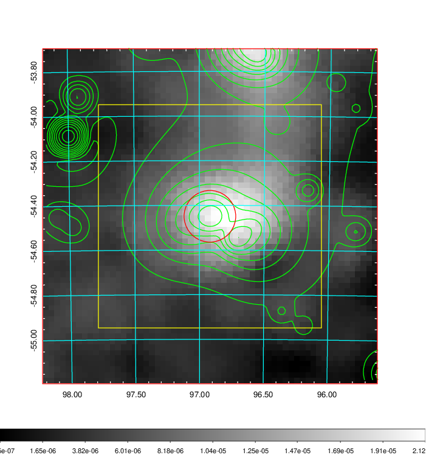
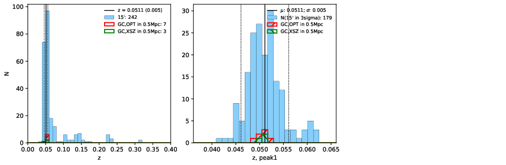
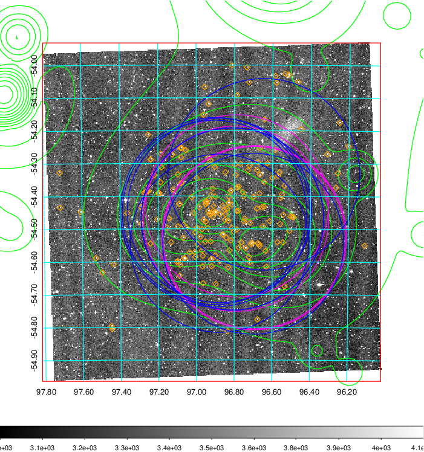
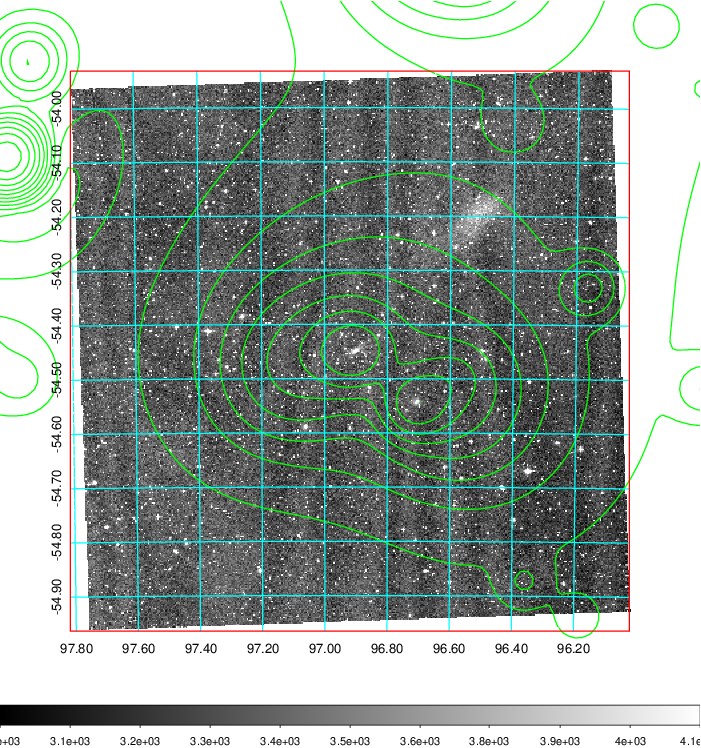
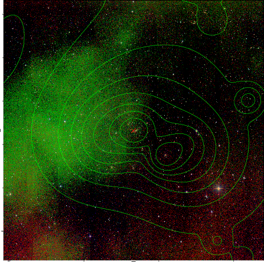

### 248

|Name|RAJ2000[deg]|DEJ2000[deg] |Ext[arcmin]| Ext,ml | z | z_src| C|GC(XSZ,Delta_z<0.01)| GC(OPT,Delta_z<0.01)|GC| R_sig[arcmin] | R500[arcmin] | R500[Mpc]| CRsig[c/s] | CR500[c/s] |L500[1E44 erg/s]|F500[1E-12 erg/s/cm^2]| M500[1E14 Msun]|Tx[keV]|Cnt_sig|Beta|Rc[arcmin]|Comment|Alias|
|---|---|---|---|---|---|------|---|--------|---------|----------|---|---|---|---|---|---|---|---|---|---|---|---|---|---|
|248| 96.919| -54.449| 6.95| 67.55| 0.0511(0.005)| z1, z_xsz| B| MCXC, PSZ2, XB| A, N, W| A, MCXC, N, PSZ2, Tar, W, XB| 27.662| 15.886| 0.951| 0.959(0.044)| 0.896(0.041)| 0.966(0.021)| 15.626(0.341)| 2.57(0.03)| 3.89(0.03)| 1491.3| 0.754(-0.034+0.039)| 8.636(-0.576+0.636)| -| k555|

|[RASS image](../image/248/248_img.pdf)|[filtered image](../image/248/248_fil.pdf)|[Segment image](../image/248/248_seg.pdf)|
|-------------------|--------------------|-------------------|
|   |    |   |

|[Exposure image](../image/248/248_mex.pdf)| [nH image](../image/248/248_nh.pdf)| [Planck image](../image/248/248_p.pdf)|
|-------------------|--------------------|-------------------|
|   |     |  |

|[Redshift Histogram](../image/248/248_zg.pdf) | [DSS image(z1)](../image/248/248_dss_z1.pdf)      |  [DSS image(z2)](../image/248/248_dss_z2.pdf)    |
|-------------------|--------------------|-------------------|
| |  Blue circle for optical clusters;  Magenta circle for XSZ clusters;  all with r=1Mpc;  Only GC with Delta_z<0.01 are shown. |  Blue circle for optical clusters;  Magenta circle for XSZ clusters;  all with r=1Mpc;  Only GC with Delta_z<0.01 are shown.  |

|[known Abell/XSZ clusters](../image/248/248_gc.pdf) | [2MASS image](../image/248/248_2mass.pdf)      |
|-------------------|-------------------|
|  Magenta, blue and green circles  for optical, X-ray and SZ clusters  respectively, with redshift of clusters  labelled. The radius of circles  are 1Mpc.|  |

|[DES image](../image/248/248_des.pdf)   |
|-------------------|
|   |
