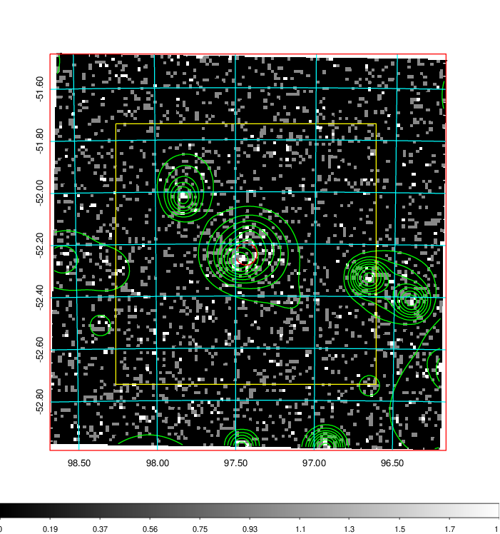
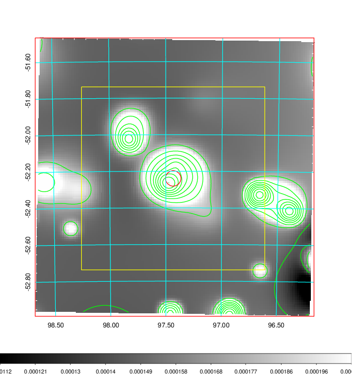
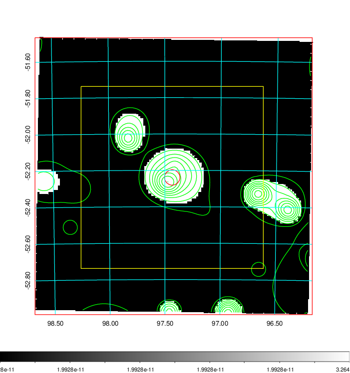
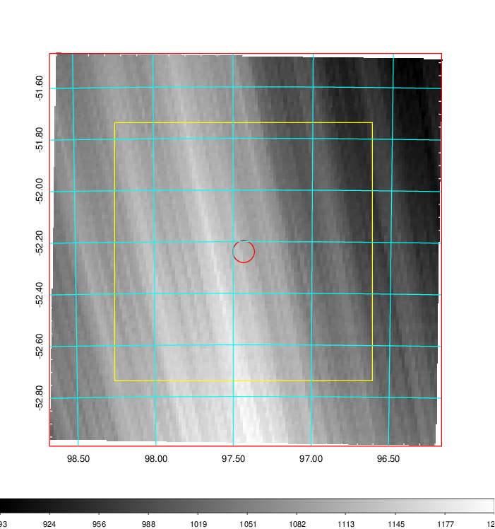
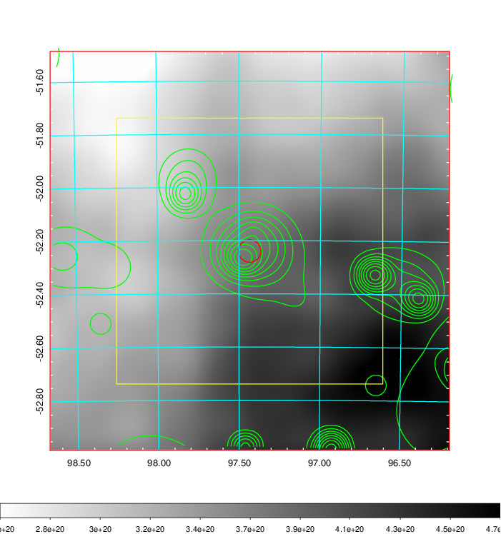
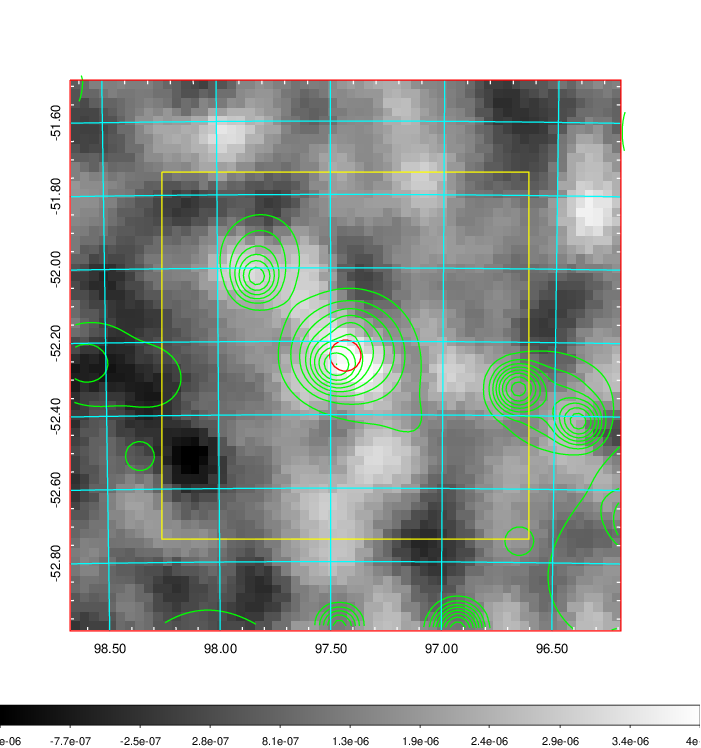
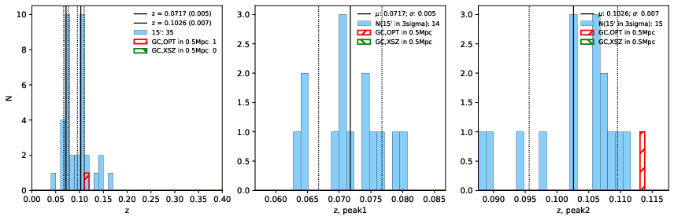
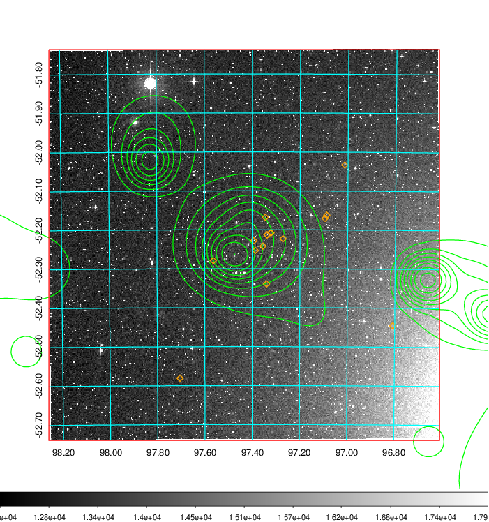
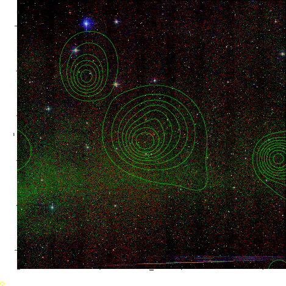

### 249

|Name|RAJ2000[deg]|DEJ2000[deg] |Ext[arcmin]| Ext,ml | z | z_src| C|GC(XSZ,Delta_z<0.01)| GC(OPT,Delta_z<0.01)|GC| R_sig[arcmin] | R500[arcmin] | R500[Mpc]| CRsig[c/s] | CR500[c/s] |L500[1E44 erg/s]|F500[1E-12 erg/s/cm^2]| M500[1E14 Msun]|Tx[keV]|Cnt_sig|Beta|Rc[arcmin]|Comment|Alias|
|---|---|---|---|---|---|------|---|--------|---------|----------|---|---|---|---|---|---|---|---|---|---|---|---|---|---|
|249| 97.434| -52.239| 2.54| 52.74| 0.0717(0.005)| z1,| G| -| -| A, W| 8.800| 8.467| 0.694| 0.110(0.019)| 0.109(0.019)| 0.236(0.025)| 1.882(0.197)| 1.02(0.05)| 2.21(0.07)| 83.5| 0.952(-0.067+0.035)| 6.863(-0.537+0.455)| An Abell cluster with no $z$ and offset = 0.08 Mpc| t097|

|[RASS image](../image/249/249_img.pdf)|[filtered image](../image/249/249_fil.pdf)|[Segment image](../image/249/249_seg.pdf)|
|-------------------|--------------------|-------------------|
|   |    |   |

|[Exposure image](../image/249/249_mex.pdf)| [nH image](../image/249/249_nh.pdf)| [Planck image](../image/249/249_p.pdf)|
|-------------------|--------------------|-------------------|
|   |     |  |

|[Redshift Histogram](../image/249/249_zg.pdf) | [DSS image(z1)](../image/249/249_dss_z1.pdf)      |  [DSS image(z2)](../image/249/249_dss_z2.pdf)    |
|-------------------|--------------------|-------------------|
| |  Blue circle for optical clusters;  Magenta circle for XSZ clusters;  all with r=1Mpc;  Only GC with Delta_z<0.01 are shown. |  Blue circle for optical clusters;  Magenta circle for XSZ clusters;  all with r=1Mpc;  Only GC with Delta_z<0.01 are shown.  |

|[Previous-identified clusters](../image/249/249_gc.pdf) | [2MASS image](../image/249/249_2mass.pdf)      |
|-------------------|-------------------|
|  Green, magenta, and blue circles  for optical, X-ray and SZ clusters  respectively, with redshift of clusters  labelled. The radius of circles  are 1Mpc.|  |

