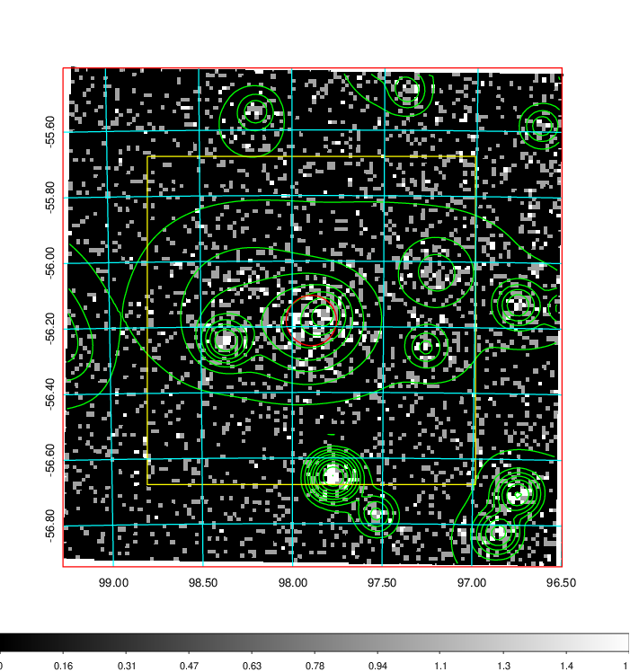
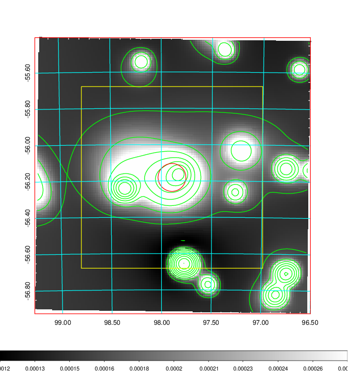
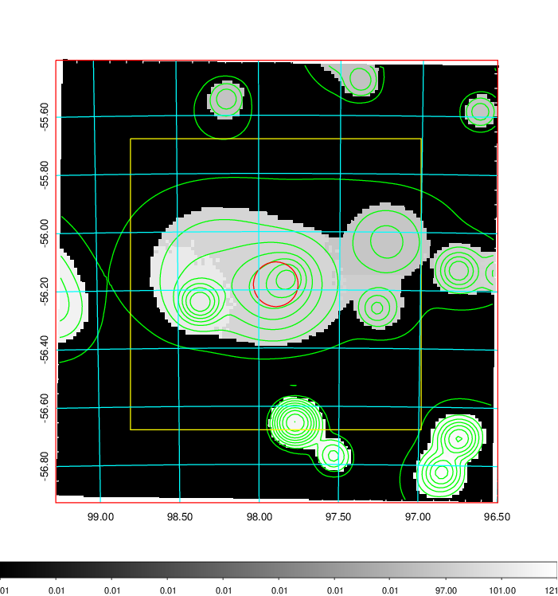
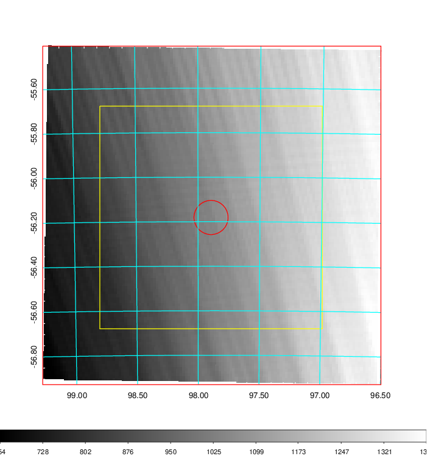
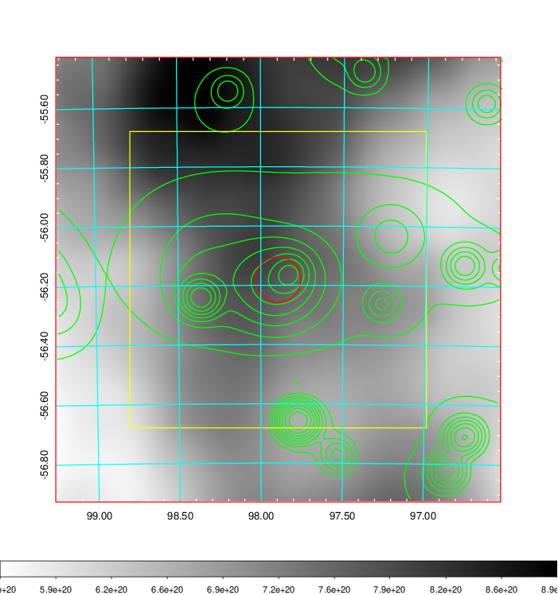
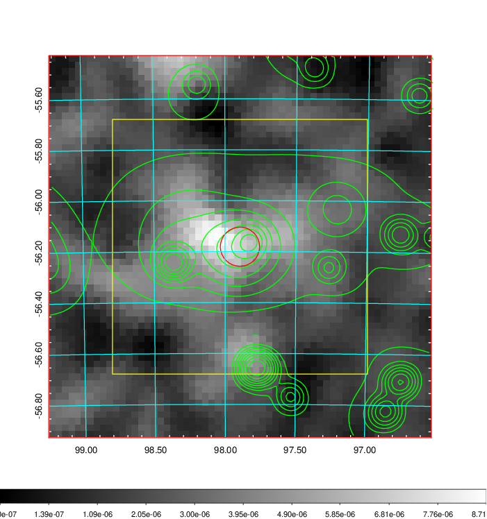
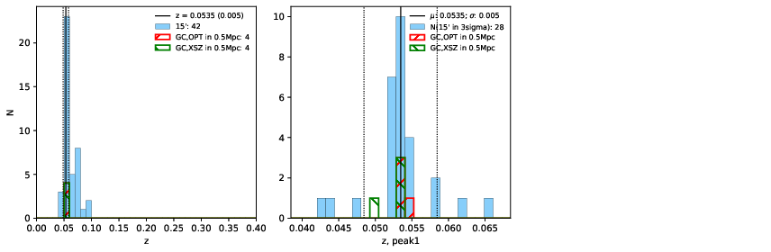
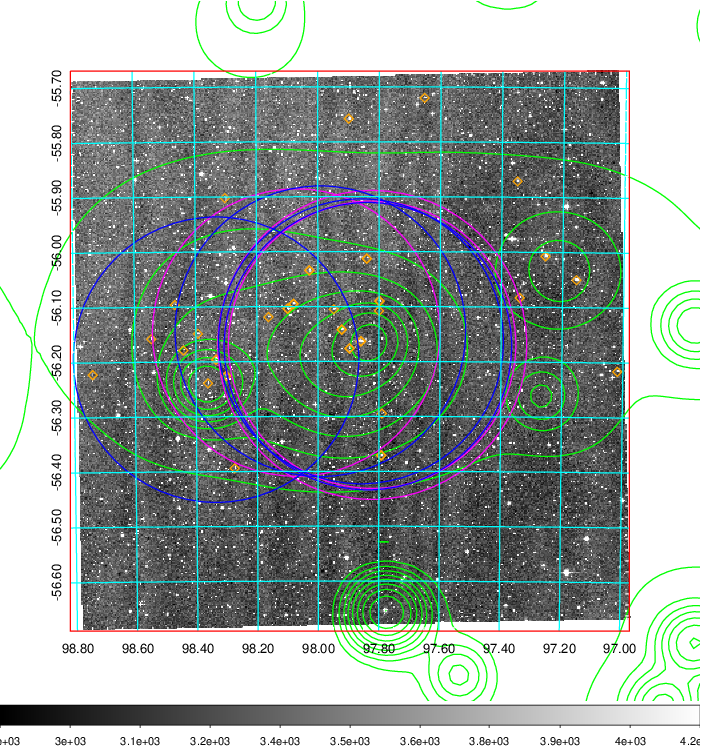
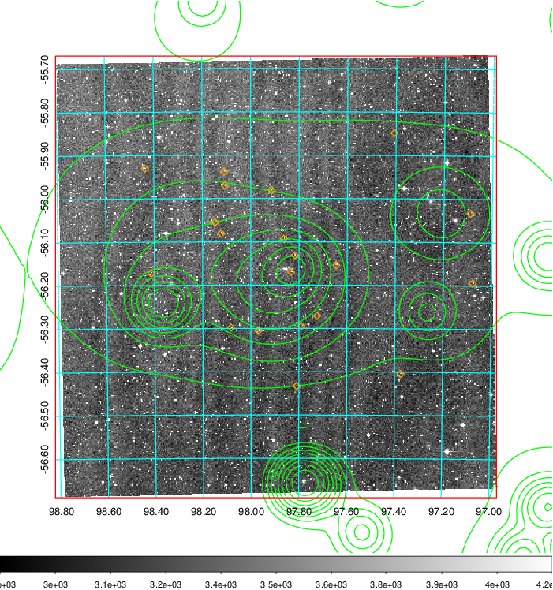
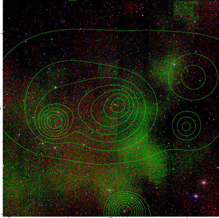

### 250

|Name|RAJ2000[deg]|DEJ2000[deg] |Ext[arcmin]| Ext,ml | z | z_src| C|GC(XSZ,Delta_z<0.01)| GC(OPT,Delta_z<0.01)|GC| R_sig[arcmin] | R500[arcmin] | R500[Mpc]| CRsig[c/s] | CR500[c/s] |L500[1E44 erg/s]|F500[1E-12 erg/s/cm^2]| M500[1E14 Msun]|Tx[keV]|Cnt_sig|Beta|Rc[arcmin]|Comment|Alias|
|---|---|---|---|---|---|------|---|--------|---------|----------|---|---|---|---|---|---|---|---|---|---|---|---|---|---|
|250| 97.895| -56.181| 4.61| 129.68| 0.0535(0.005)| z1, z_xsz| B| MCXC, PSZ2, Tar| N, W| MCXC, N, PSZ2, Tar, W| 24.700| 12.388| 0.774| 0.318(0.039)| 0.294(0.036)| 0.338(0.026)| 4.970(0.385)| 1.39(0.05)| 2.67(0.07)| 295.2| 0.688(-0.052+0.065)| 7.218(-0.887+1.041)| -| k510|

|[RASS image](../image/250/250_img.pdf)|[filtered image](../image/250/250_fil.pdf)|[Segment image](../image/250/250_seg.pdf)|
|-------------------|--------------------|-------------------|
|   |    |   |

|[Exposure image](../image/250/250_mex.pdf)| [nH image](../image/250/250_nh.pdf)| [Planck image](../image/250/250_p.pdf)|
|-------------------|--------------------|-------------------|
|   |     |  |

|[Redshift Histogram](../image/250/250_zg.pdf) | [DSS image(z1)](../image/250/250_dss_z1.pdf)      |  [DSS image(z2)](../image/250/250_dss_z2.pdf)    |
|-------------------|--------------------|-------------------|
| |  Blue circle for optical clusters;  Magenta circle for XSZ clusters;  all with r=1Mpc;  Only GC with Delta_z<0.01 are shown. |  Blue circle for optical clusters;  Magenta circle for XSZ clusters;  all with r=1Mpc;  Only GC with Delta_z<0.01 are shown.  |

|[known Abell/XSZ clusters](../image/250/250_gc.pdf) | [2MASS image](../image/250/250_2mass.pdf)      |
|-------------------|-------------------|
|  Magenta, blue and green circles  for optical, X-ray and SZ clusters  respectively, with redshift of clusters  labelled. The radius of circles  are 1Mpc.|  |

|[DES image](../image/250/250_des.pdf)   |
|-------------------|
|   |
