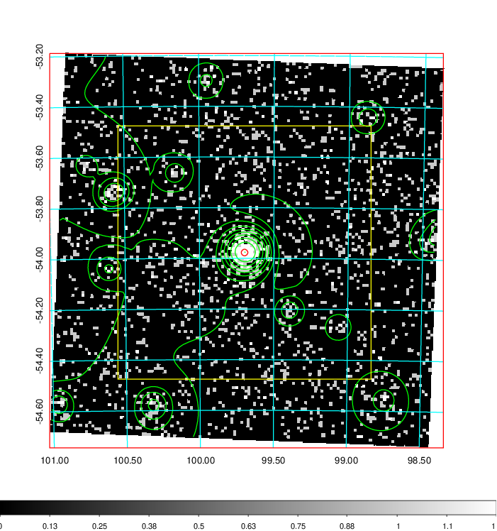
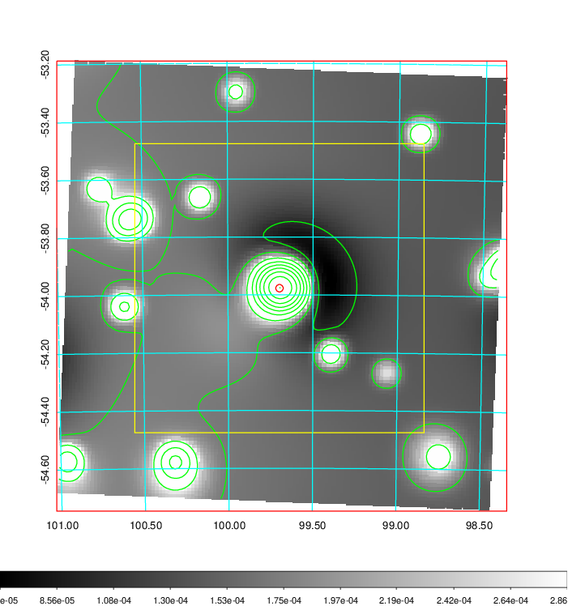
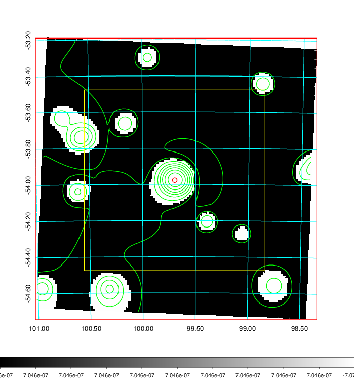
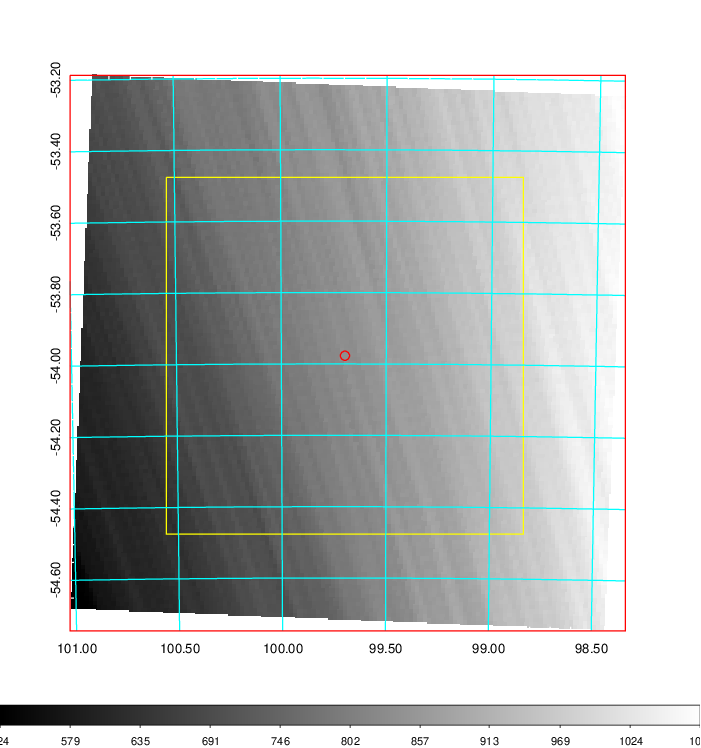
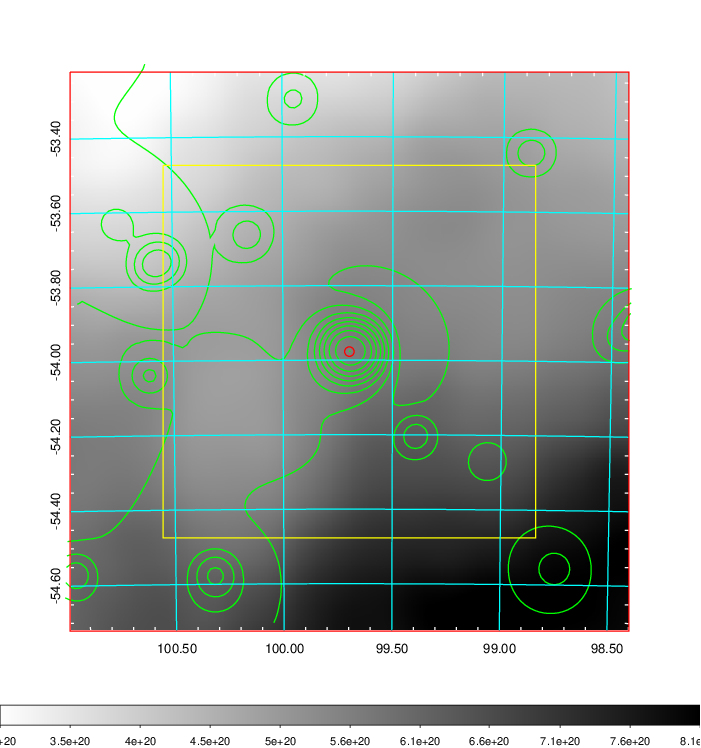
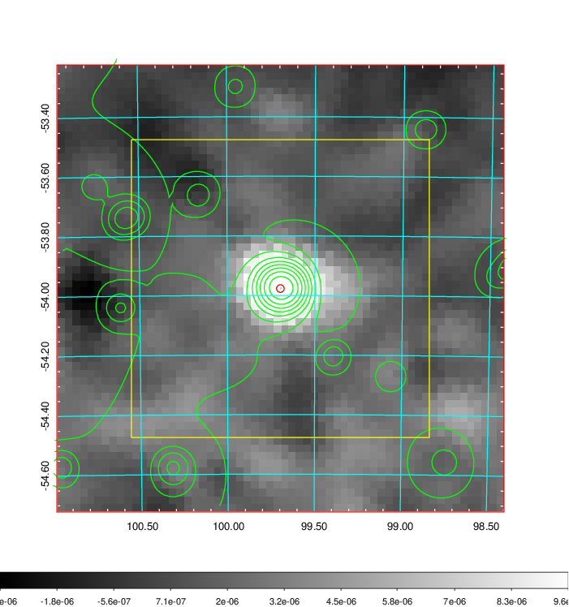
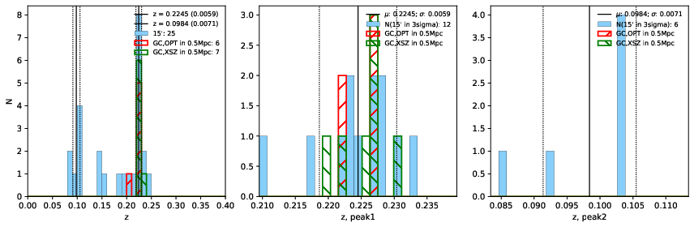
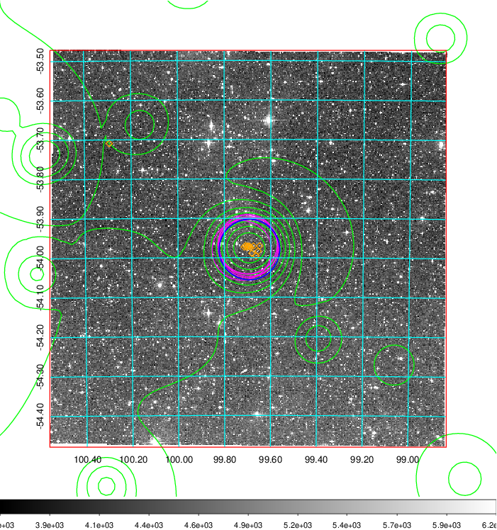
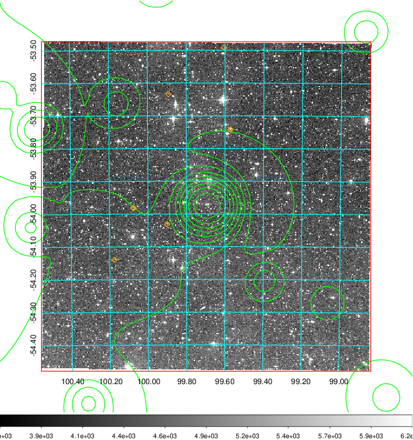
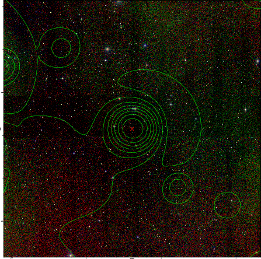

### 251

|Name|RAJ2000[deg]|DEJ2000[deg] |Ext[arcmin]| Ext,ml | z | z_src| C|GC(XSZ,Delta_z<0.01)| GC(OPT,Delta_z<0.01)|GC| R_sig[arcmin] | R500[arcmin] | R500[Mpc]| CRsig[c/s] | CR500[c/s] |L500[1E44 erg/s]|F500[1E-12 erg/s/cm^2]| M500[1E14 Msun]|Tx[keV]|Cnt_sig|Beta|Rc[arcmin]|Comment|Alias|
|---|---|---|---|---|---|------|---|--------|---------|----------|---|---|---|---|---|---|---|---|---|---|---|---|---|---|
|251| 99.697| -53.977| 0.78| 56.48| 0.2245(0.006)| z1, z_xsz| B| B15, H13, MCXC, PSZ2, Tar| A, N| A, B15, H13, MCXC, N, PSZ2, Tar, W| 14.650| 6.300| 1.364| 0.362(0.030)| 0.330(0.027)| 9.287(0.249)| 6.235(0.167)| 9.03(0.11)| 8.96(0.07)| 274.2| 0.804(-0.092+0.107)| 2.345(-0.495+0.495)| -| k009|

|[RASS image](../image/251/251_img.pdf)|[filtered image](../image/251/251_fil.pdf)|[Segment image](../image/251/251_seg.pdf)|
|-------------------|--------------------|-------------------|
|   |    |   |

|[Exposure image](../image/251/251_mex.pdf)| [nH image](../image/251/251_nh.pdf)| [Planck image](../image/251/251_p.pdf)|
|-------------------|--------------------|-------------------|
|   |     |  |

|[Redshift Histogram](../image/251/251_zg.pdf) | [DSS image(z1)](../image/251/251_dss_z1.pdf)      |  [DSS image(z2)](../image/251/251_dss_z2.pdf)    |
|-------------------|--------------------|-------------------|
| |  Blue circle for optical clusters;  Magenta circle for XSZ clusters;  all with r=1Mpc;  Only GC with Delta_z<0.01 are shown. |  Blue circle for optical clusters;  Magenta circle for XSZ clusters;  all with r=1Mpc;  Only GC with Delta_z<0.01 are shown.  |

|[known Abell/XSZ clusters](../image/251/251_gc.pdf) | [2MASS image](../image/251/251_2mass.pdf)      |
|-------------------|-------------------|
|  Magenta, blue and green circles  for optical, X-ray and SZ clusters  respectively, with redshift of clusters  labelled. The radius of circles  are 1Mpc.|  |

|[DES image](../image/251/251_des.pdf)   |
|-------------------|
|   |
