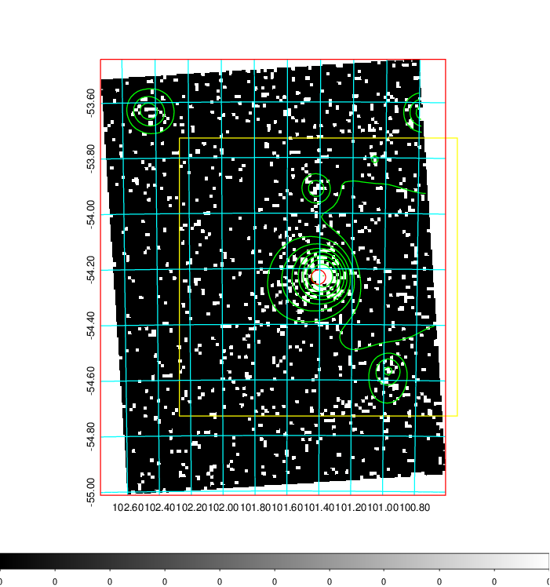
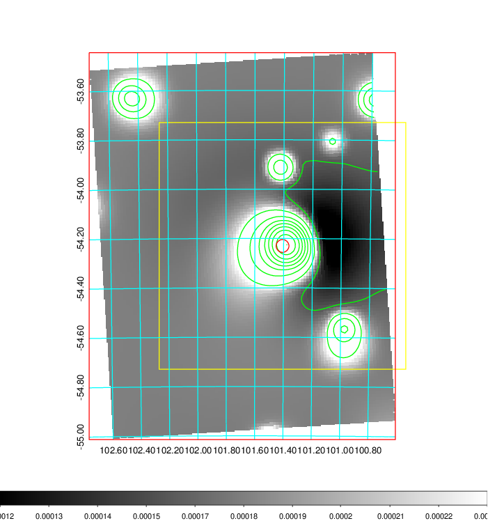
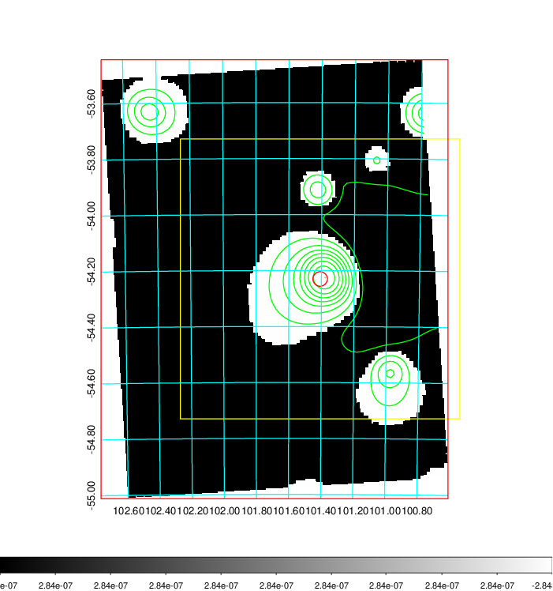
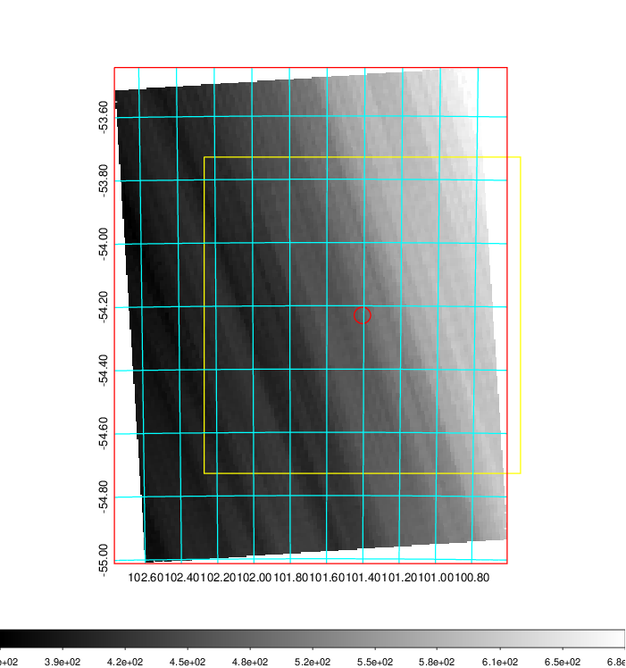
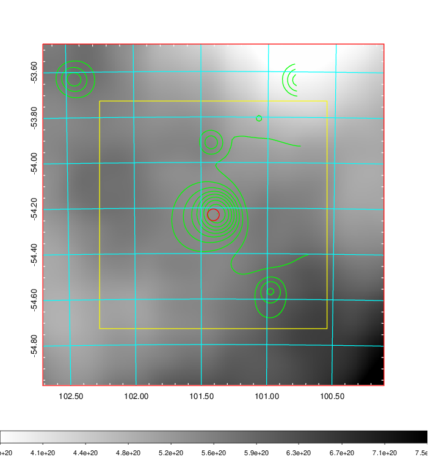
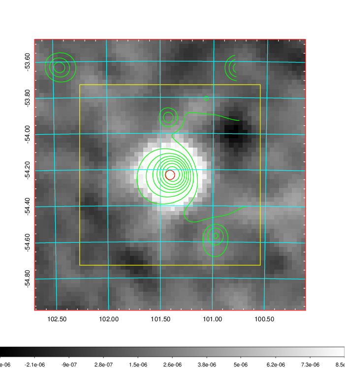
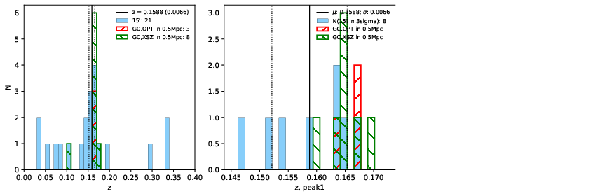
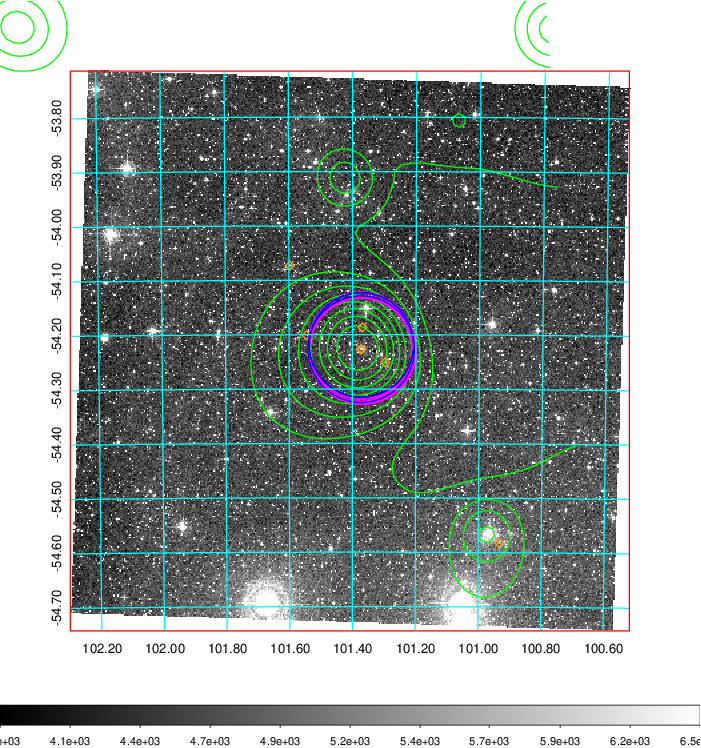
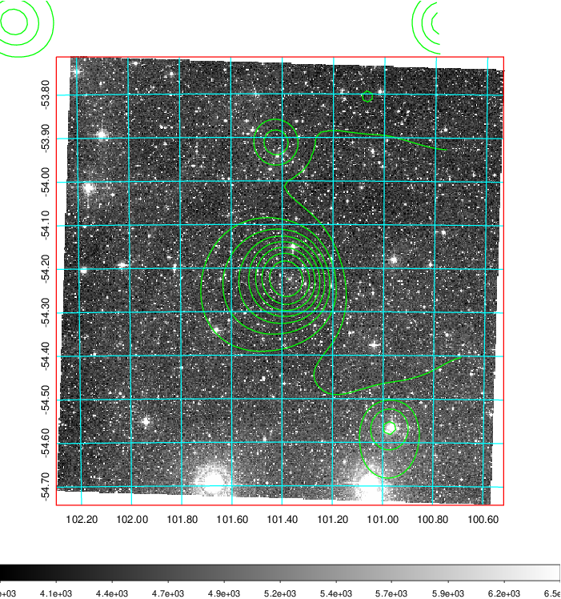
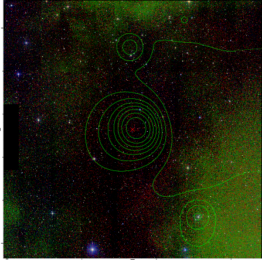

### 252

|Name|RAJ2000[deg]|DEJ2000[deg] |Ext[arcmin]| Ext,ml | z | z_src| C|GC(XSZ,Delta_z<0.01)| GC(OPT,Delta_z<0.01)|GC| R_sig[arcmin] | R500[arcmin] | R500[Mpc]| CRsig[c/s] | CR500[c/s] |L500[1E44 erg/s]|F500[1E-12 erg/s/cm^2]| M500[1E14 Msun]|Tx[keV]|Cnt_sig|Beta|Rc[arcmin]|Comment|Alias|
|---|---|---|---|---|---|------|---|--------|---------|----------|---|---|---|---|---|---|---|---|---|---|---|---|---|---|
|252| 101.408| -54.230| 1.56| 119.97| 0.1588(0.007)| z1, z_xsz| B| B15, H13, MCXC, PSZ2, Tar| A, W| A, B15, H13, MCXC, PSZ2, Tar, W, XB| 11.238| 7.735| 1.272| 0.454(0.040)| 0.432(0.038)| 5.556(0.179)| 8.057(0.260)| 6.84(0.10)| 7.38(0.07)| 234.0| 0.853(-0.095+0.093)| 3.732(-0.591+0.509)| -| k127|

|[RASS image](../image/252/252_img.pdf)|[filtered image](../image/252/252_fil.pdf)|[Segment image](../image/252/252_seg.pdf)|
|-------------------|--------------------|-------------------|
|   |    |   |

|[Exposure image](../image/252/252_mex.pdf)| [nH image](../image/252/252_nh.pdf)| [Planck image](../image/252/252_p.pdf)|
|-------------------|--------------------|-------------------|
|   |     |  |

|[Redshift Histogram](../image/252/252_zg.pdf) | [DSS image(z1)](../image/252/252_dss_z1.pdf)      |  [DSS image(z2)](../image/252/252_dss_z2.pdf)    |
|-------------------|--------------------|-------------------|
| |  Blue circle for optical clusters;  Magenta circle for XSZ clusters;  all with r=1Mpc;  Only GC with Delta_z<0.01 are shown. |  Blue circle for optical clusters;  Magenta circle for XSZ clusters;  all with r=1Mpc;  Only GC with Delta_z<0.01 are shown.  |

|[Previous-identified clusters](../image/252/252_gc.pdf) | [2MASS image](../image/252/252_2mass.pdf)      |
|-------------------|-------------------|
|  Green, magenta, and blue circles  for optical, X-ray and SZ clusters  respectively, with redshift of clusters  labelled. The radius of circles  are 1Mpc.|  |

