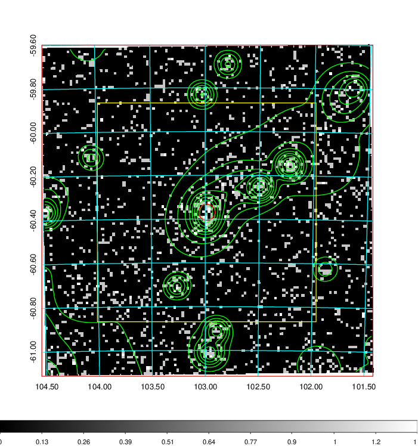
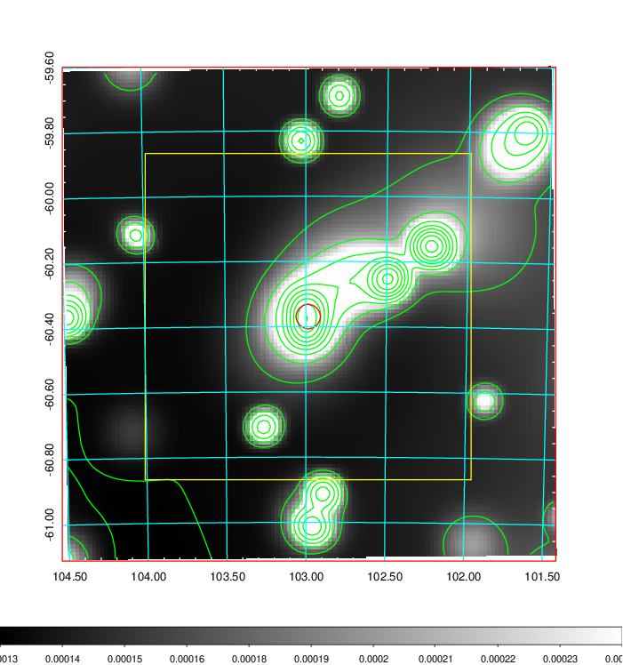
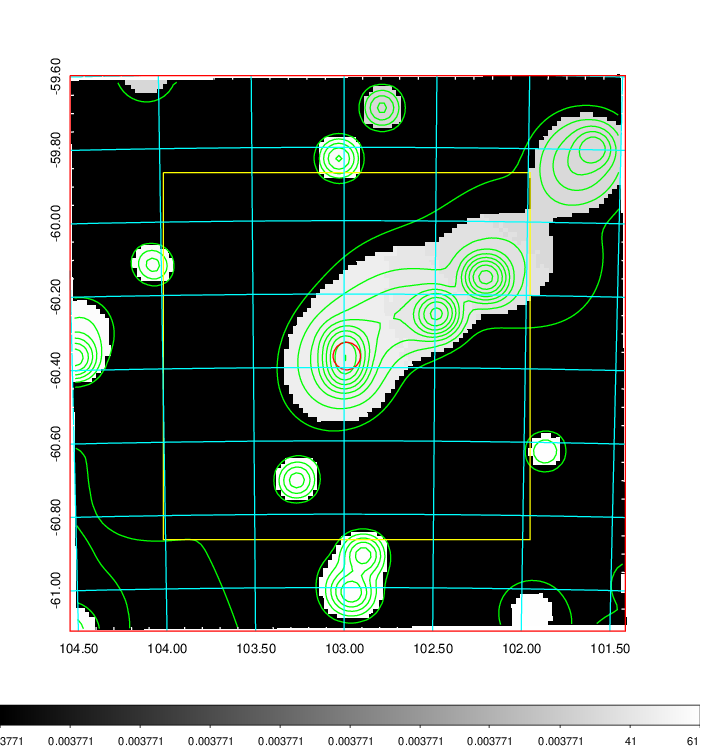
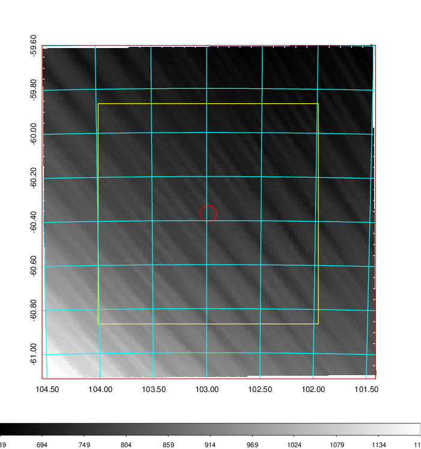
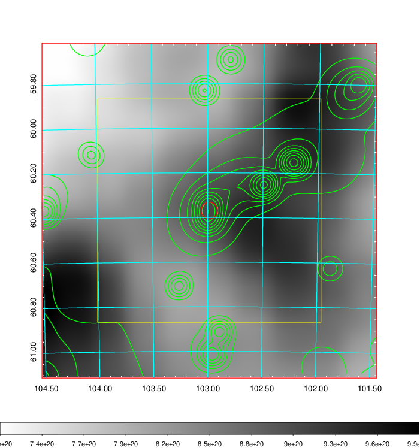
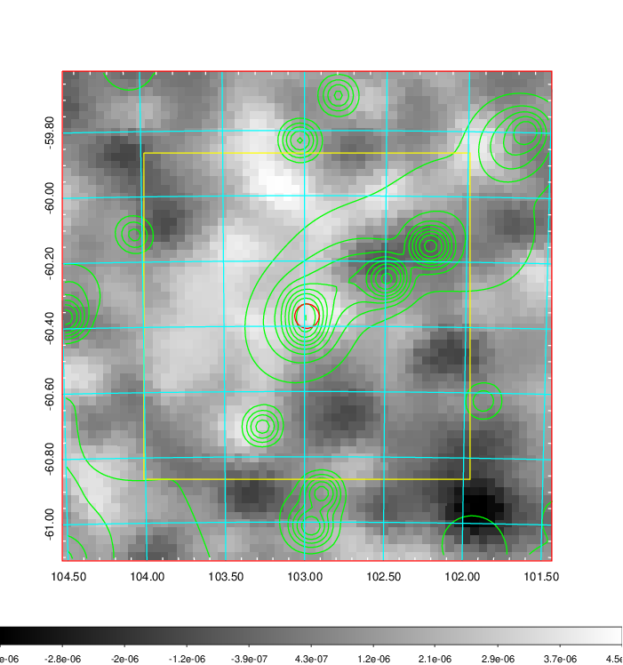
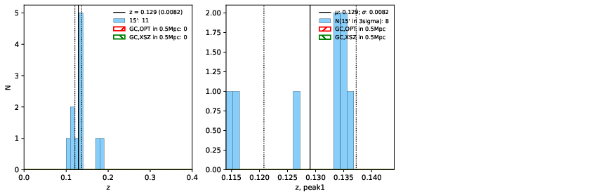
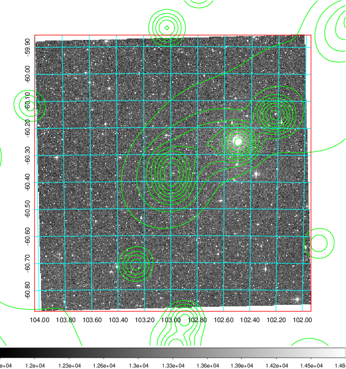
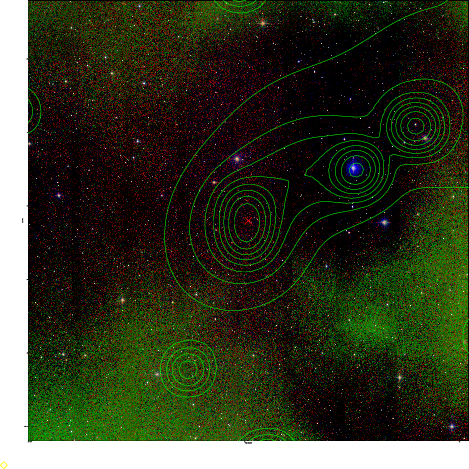

### 253

|Name|RAJ2000[deg]|DEJ2000[deg] |Ext[arcmin]| Ext,ml | z | z_src| C|GC(XSZ,Delta_z<0.01)| GC(OPT,Delta_z<0.01)|GC| R_sig[arcmin] | R500[arcmin] | R500[Mpc]| CRsig[c/s] | CR500[c/s] |L500[1E44 erg/s]|F500[1E-12 erg/s/cm^2]| M500[1E14 Msun]|Tx[keV]|Cnt_sig|Beta|Rc[arcmin]|Comment|Alias|
|---|---|---|---|---|---|------|---|--------|---------|----------|---|---|---|---|---|---|---|---|---|---|---|---|---|---|
|253| 102.985| -60.369| 2.24| 26.03| 0.1290(0.008)| z1,| G| -| -| N, W| 11.725| 6.450| 0.891| 0.114(0.023)| 0.106(0.021)| 0.808(0.095)| 1.843(0.217)| 2.28(0.13)| 3.71(0.14)| 75.8| 0.673(-0.115+0.174)| 3.844(-1.187+1.480)| -| t072|

|[RASS image](../image/253/253_img.pdf)|[filtered image](../image/253/253_fil.pdf)|[Segment image](../image/253/253_seg.pdf)|
|-------------------|--------------------|-------------------|
|   |    |   |

|[Exposure image](../image/253/253_mex.pdf)| [nH image](../image/253/253_nh.pdf)| [Planck image](../image/253/253_p.pdf)|
|-------------------|--------------------|-------------------|
|   |     |  |

|[Redshift Histogram](../image/253/253_zg.pdf) | [DSS image(z1)](../image/253/253_dss_z1.pdf)      |  [DSS image(z2)](../image/253/253_dss_z2.pdf)    |
|-------------------|--------------------|-------------------|
| |  Blue circle for optical clusters;  Magenta circle for XSZ clusters;  all with r=1Mpc;  Only GC with Delta_z<0.01 are shown. |  Blue circle for optical clusters;  Magenta circle for XSZ clusters;  all with r=1Mpc;  Only GC with Delta_z<0.01 are shown.  |

|[known Abell/XSZ clusters](../image/253/253_gc.pdf) | [2MASS image](../image/253/253_2mass.pdf)      |
|-------------------|-------------------|
|  Magenta, blue and green circles  for optical, X-ray and SZ clusters  respectively, with redshift of clusters  labelled. The radius of circles  are 1Mpc.|  |

