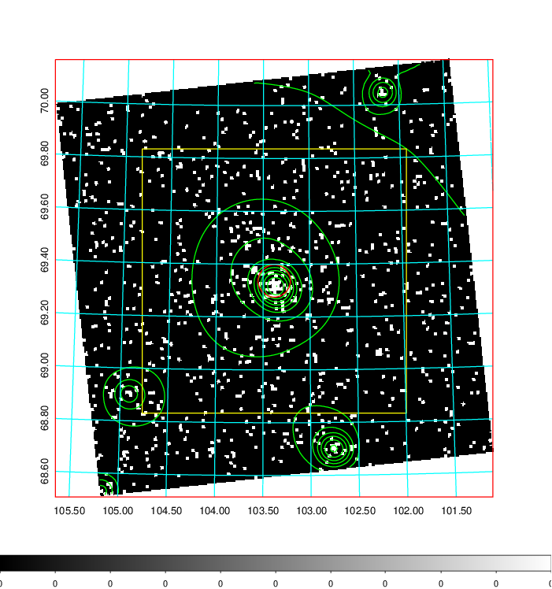
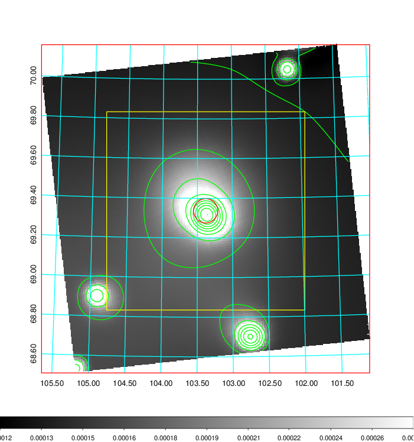
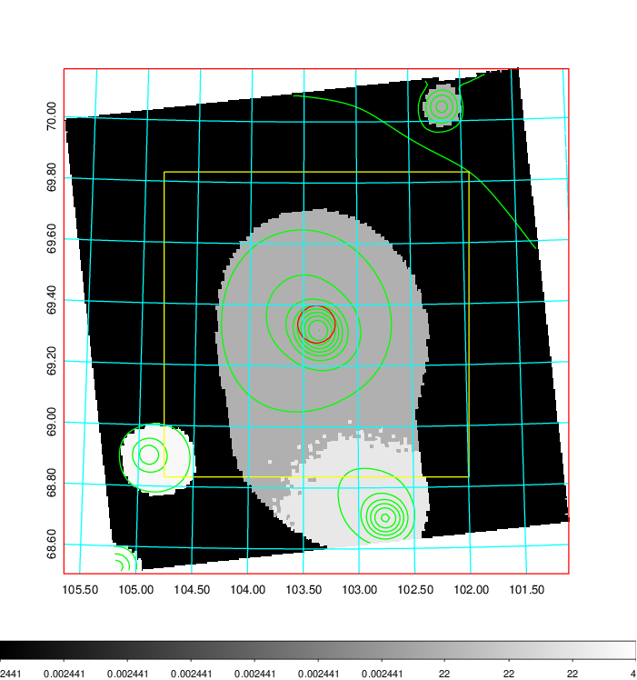
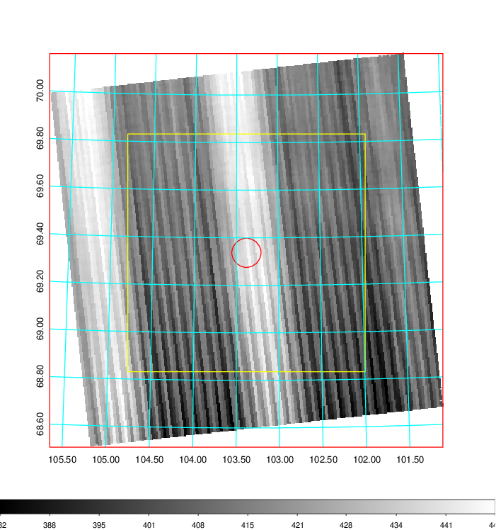
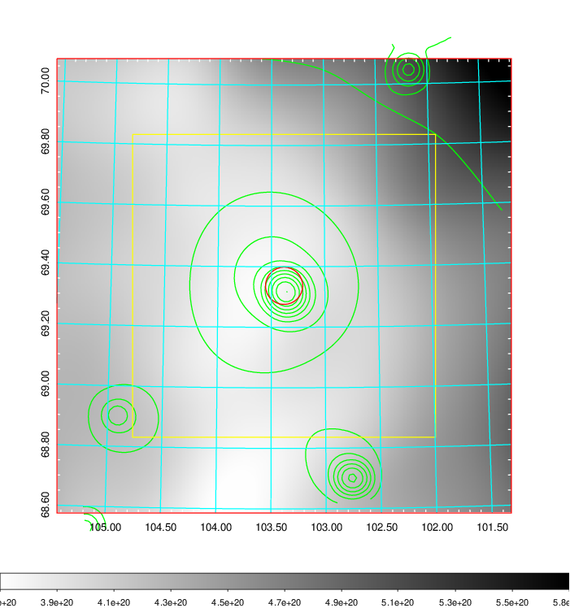
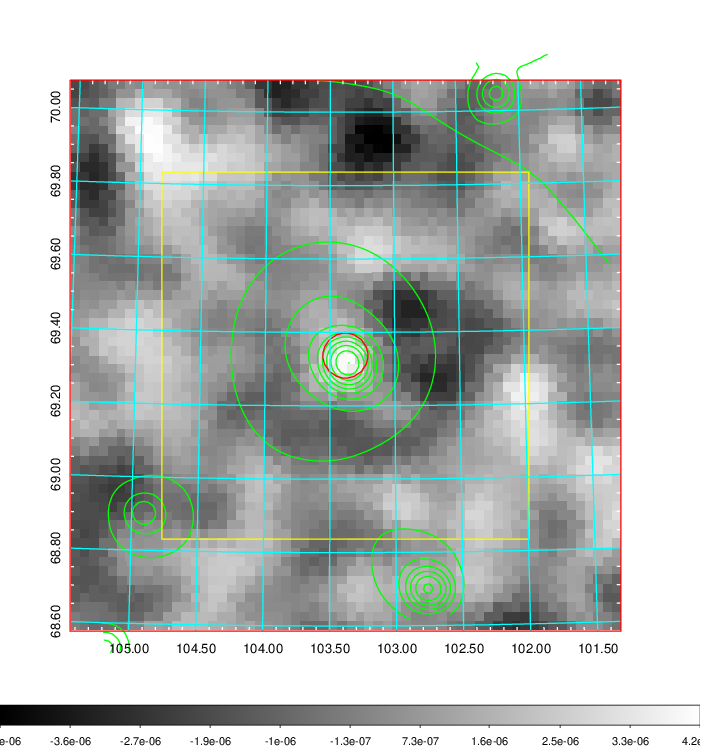
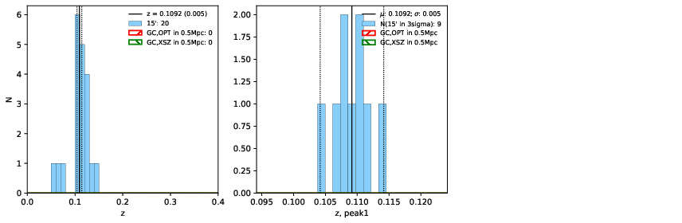
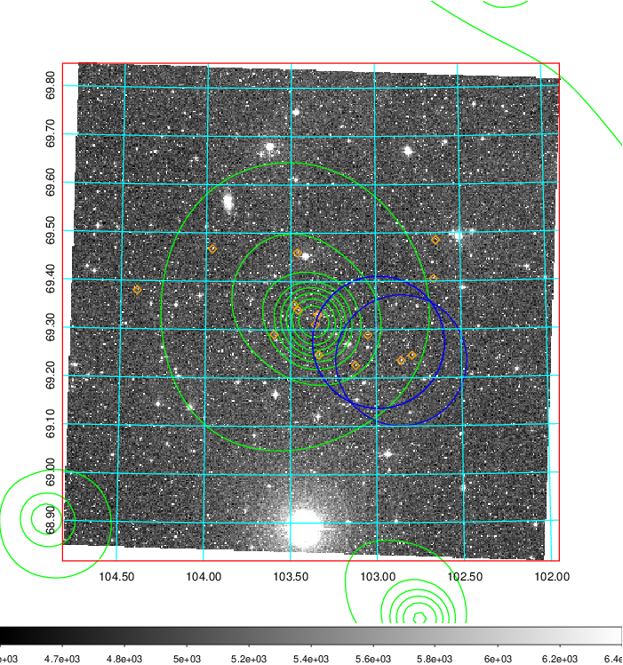
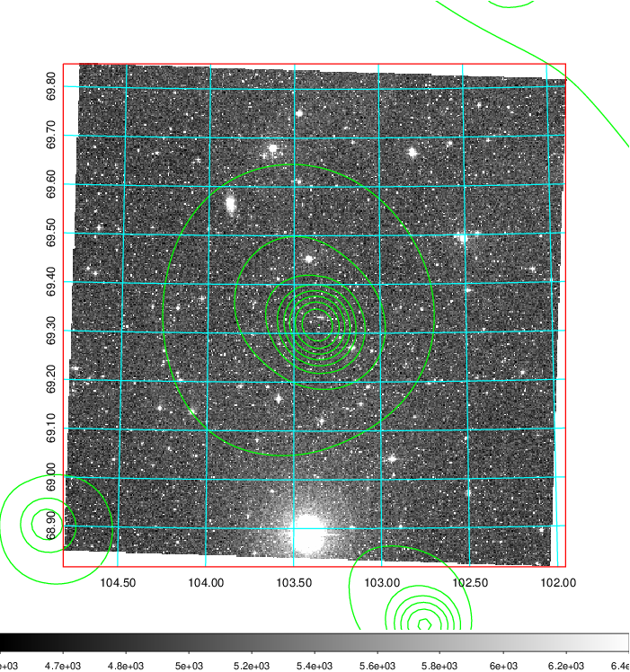
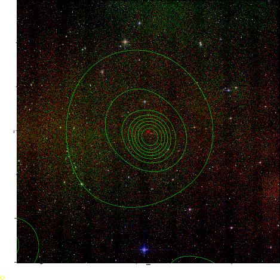

### 254

|Name|RAJ2000[deg]|DEJ2000[deg] |Ext[arcmin]| Ext,ml | z | z_src| C|GC(XSZ,Delta_z<0.01)| GC(OPT,Delta_z<0.01)|GC| R_sig[arcmin] | R500[arcmin] | R500[Mpc]| CRsig[c/s] | CR500[c/s] |L500[1E44 erg/s]|F500[1E-12 erg/s/cm^2]| M500[1E14 Msun]|Tx[keV]|Cnt_sig|Beta|Rc[arcmin]|Comment|Alias|
|---|---|---|---|---|---|------|---|--------|---------|----------|---|---|---|---|---|---|---|---|---|---|---|---|---|---|
|254| 103.381| 69.337| 3.68| 34.98| 0.1092(0.005)| z1,| G| -| -| A, N, W| 30.131| 8.622| 1.031| 0.363(0.060)| 0.325(0.054)| 1.870(0.352)| 6.111(1.151)| 3.46(0.32)| 4.77(0.28)| 147.4| 0.506(-0.004+0.009)| 3.652(-0.344+0.394)| An Abell cluster with $z$ = 0.11 and offset = 1.14 Mpc(9.20 arcmin)| t173|

|[RASS image](../image/254/254_img.pdf)|[filtered image](../image/254/254_fil.pdf)|[Segment image](../image/254/254_seg.pdf)|
|-------------------|--------------------|-------------------|
|   |    |   |

|[Exposure image](../image/254/254_mex.pdf)| [nH image](../image/254/254_nh.pdf)| [Planck image](../image/254/254_p.pdf)|
|-------------------|--------------------|-------------------|
|   |     |  |

|[Redshift Histogram](../image/254/254_zg.pdf) | [DSS image(z1)](../image/254/254_dss_z1.pdf)      |  [DSS image(z2)](../image/254/254_dss_z2.pdf)    |
|-------------------|--------------------|-------------------|
| |  Blue circle for optical clusters;  Magenta circle for XSZ clusters;  all with r=1Mpc;  Only GC with Delta_z<0.01 are shown. |  Blue circle for optical clusters;  Magenta circle for XSZ clusters;  all with r=1Mpc;  Only GC with Delta_z<0.01 are shown.  |

|[known Abell/XSZ clusters](../image/254/254_gc.pdf) | [2MASS image](../image/254/254_2mass.pdf)      |
|-------------------|-------------------|
|  Magenta, blue and green circles  for optical, X-ray and SZ clusters  respectively, with redshift of clusters  labelled. The radius of circles  are 1Mpc.|  |

|[PS1 image](../image/254/254_ps1.pdf)            |
|-------------------|
|   |
