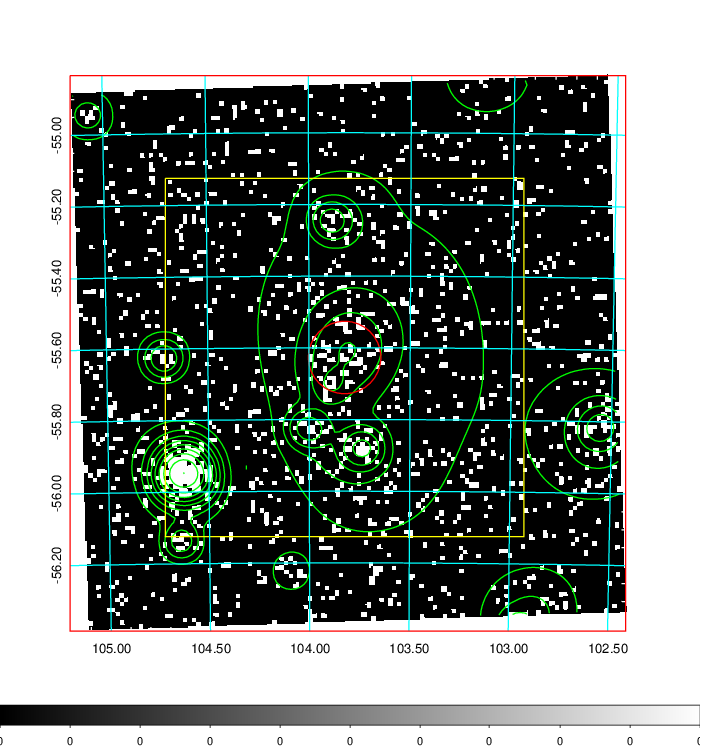
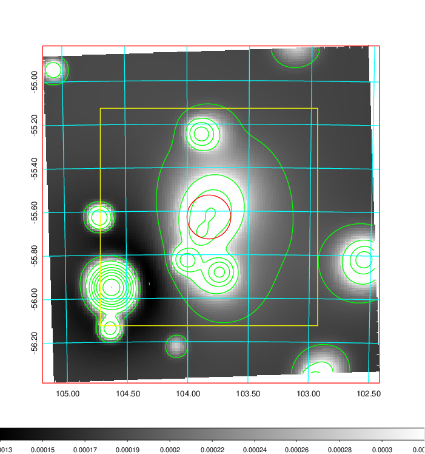
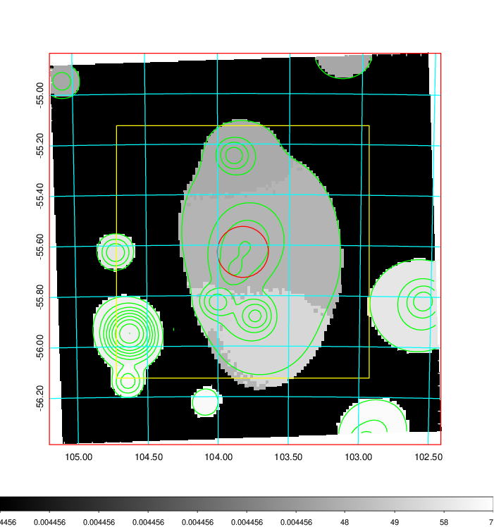
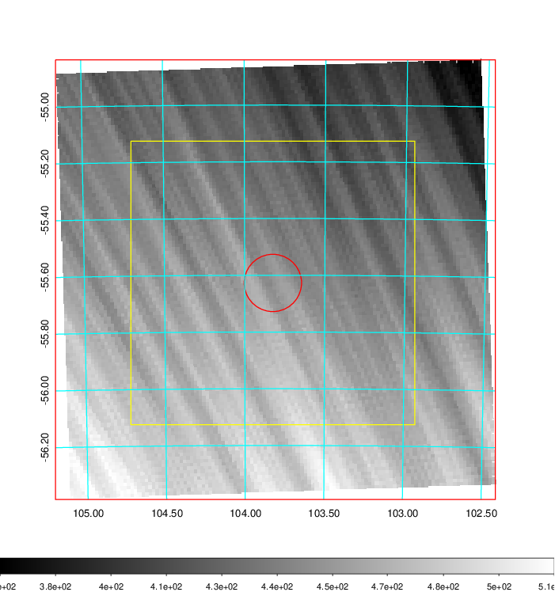
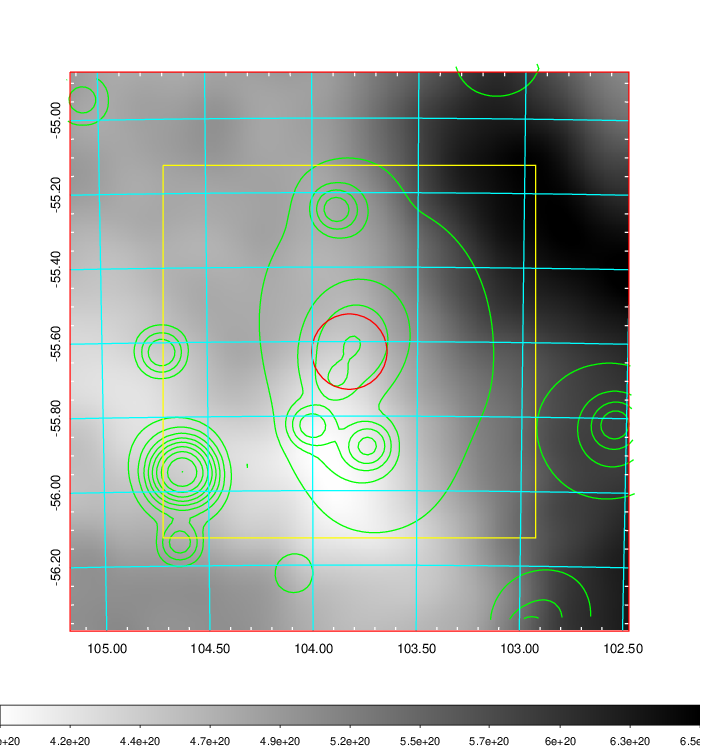
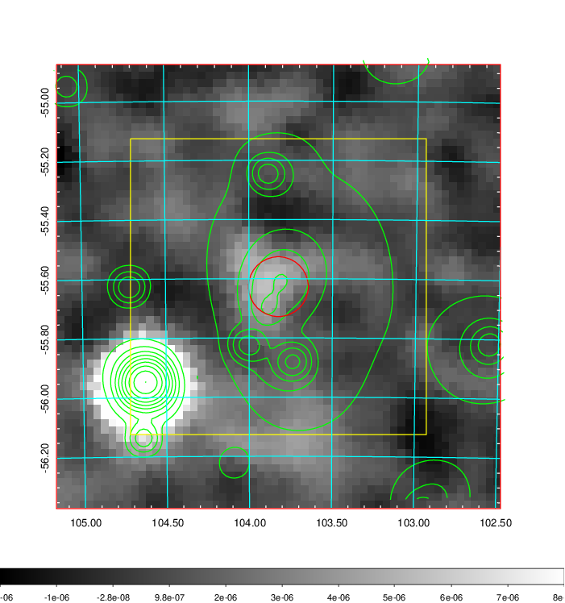
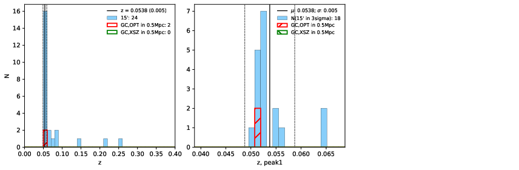
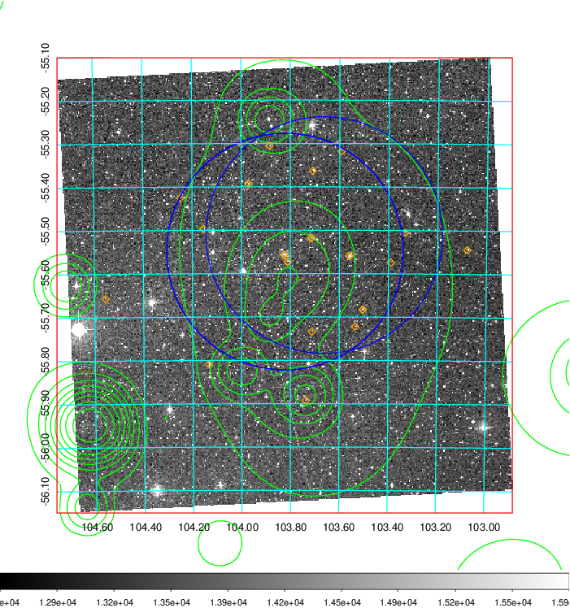
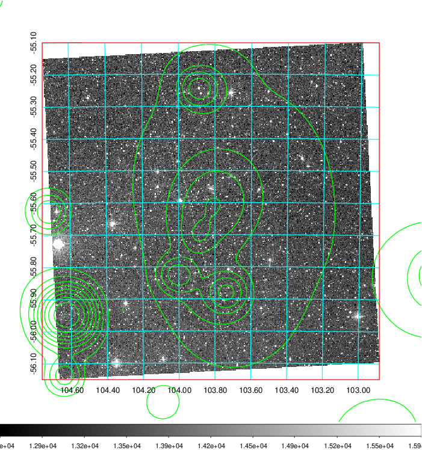
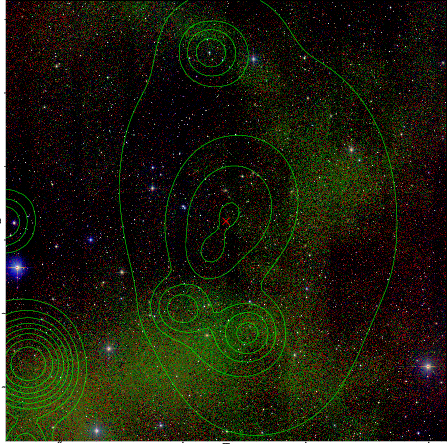

### 255

|Name|RAJ2000[deg]|DEJ2000[deg] |Ext[arcmin]| Ext,ml | z | z_src| C|GC(XSZ,Delta_z<0.01)| GC(OPT,Delta_z<0.01)|GC| R_sig[arcmin] | R500[arcmin] | R500[Mpc]| CRsig[c/s] | CR500[c/s] |L500[1E44 erg/s]|F500[1E-12 erg/s/cm^2]| M500[1E14 Msun]|Tx[keV]|Cnt_sig|Beta|Rc[arcmin]|Comment|Alias|
|---|---|---|---|---|---|------|---|--------|---------|----------|---|---|---|---|---|---|---|---|---|---|---|---|---|---|
|255| 103.824| -55.627| 6.06| 72.05| 0.0538(0.005)| z1, z_opt| S| -| A| A, B15, N, W| 13.188| 10.741| 0.675| 0.166(0.037)| 0.161(0.035)| 0.190(0.030)| 2.755(0.443)| 0.92(0.08)| 2.07(0.11)| 95.3| 0.812(-0.161+0.131)| 7.295(-1.724+1.341)| An SZ cluster with $z$ = 0.29 and offset = 0.31 Mpc| t309|

|[RASS image](../image/255/255_img.pdf)|[filtered image](../image/255/255_fil.pdf)|[Segment image](../image/255/255_seg.pdf)|
|-------------------|--------------------|-------------------|
|   |    |   |

|[Exposure image](../image/255/255_mex.pdf)| [nH image](../image/255/255_nh.pdf)| [Planck image](../image/255/255_p.pdf)|
|-------------------|--------------------|-------------------|
|   |     |  |

|[Redshift Histogram](../image/255/255_zg.pdf) | [DSS image(z1)](../image/255/255_dss_z1.pdf)      |  [DSS image(z2)](../image/255/255_dss_z2.pdf)    |
|-------------------|--------------------|-------------------|
| |  Blue circle for optical clusters;  Magenta circle for XSZ clusters;  all with r=1Mpc;  Only GC with Delta_z<0.01 are shown. |  Blue circle for optical clusters;  Magenta circle for XSZ clusters;  all with r=1Mpc;  Only GC with Delta_z<0.01 are shown.  |

|[known Abell/XSZ clusters](../image/255/255_gc.pdf) | [2MASS image](../image/255/255_2mass.pdf)      |
|-------------------|-------------------|
|  Magenta, blue and green circles  for optical, X-ray and SZ clusters  respectively, with redshift of clusters  labelled. The radius of circles  are 1Mpc.|  |

