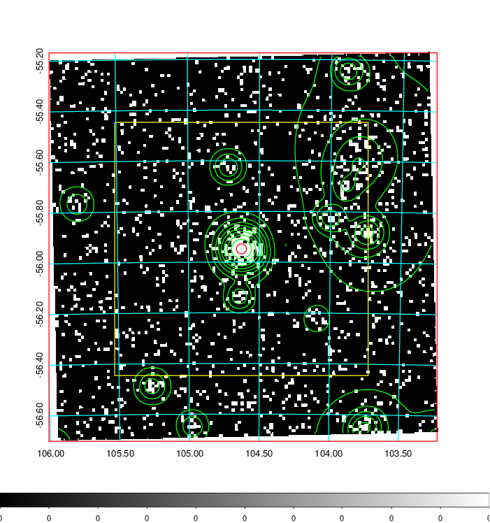
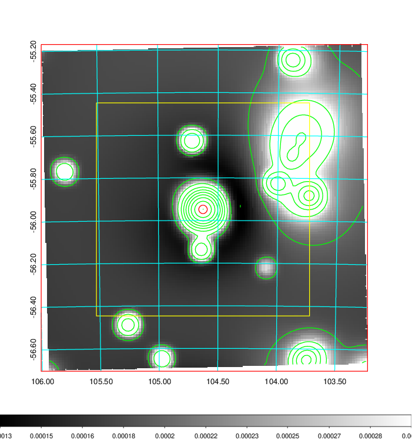
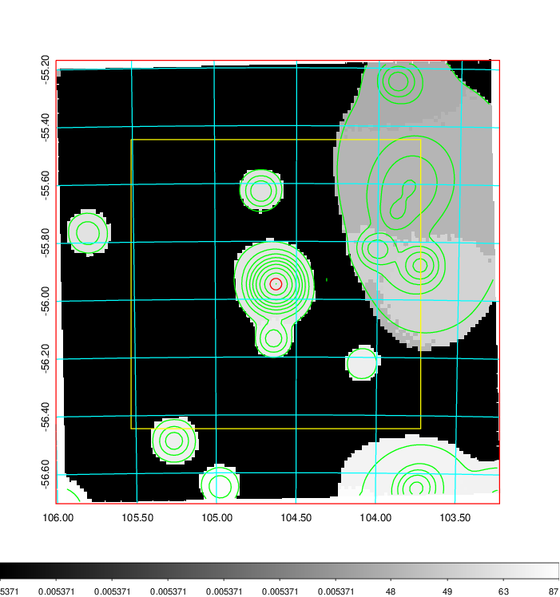
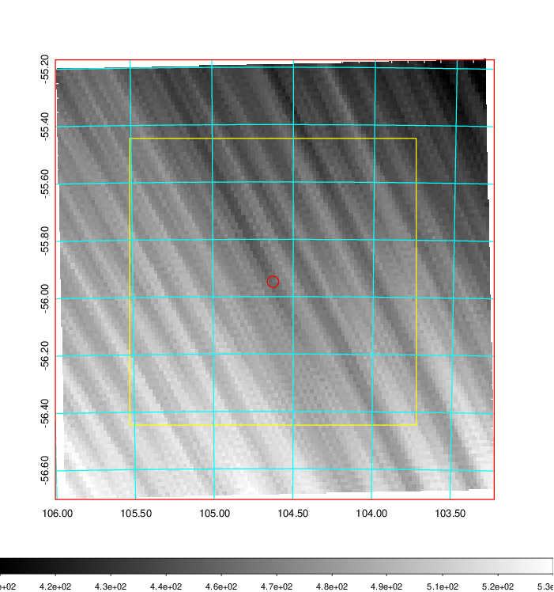
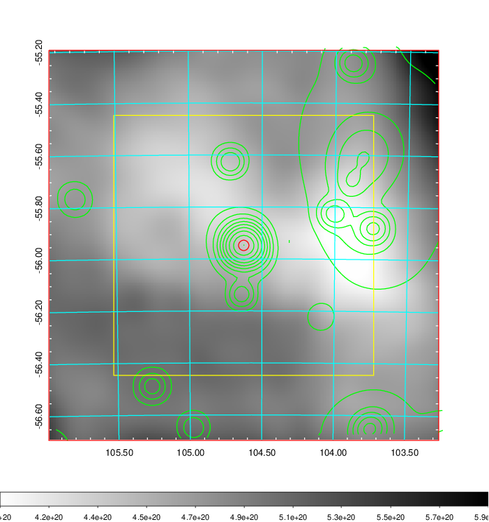
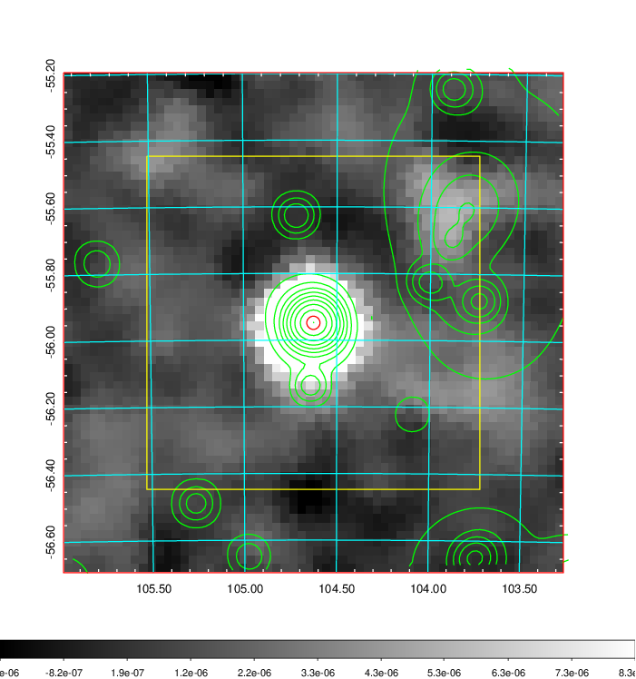
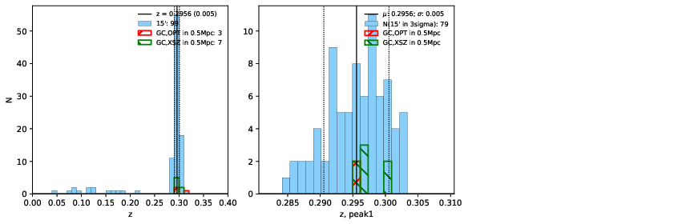
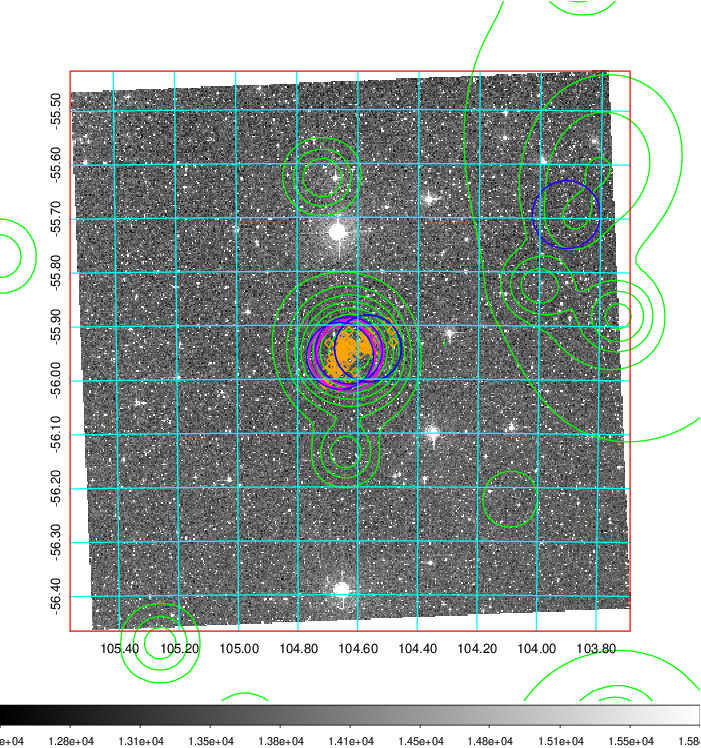
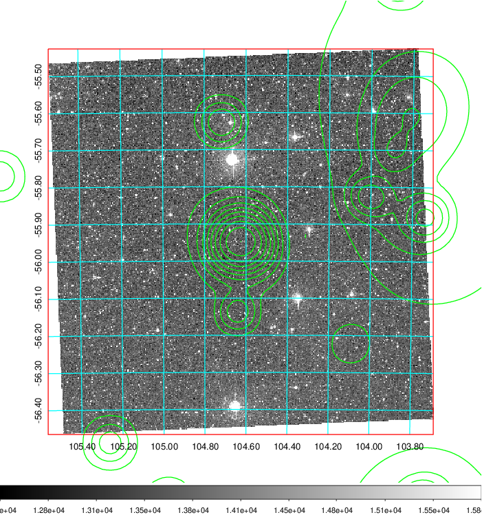
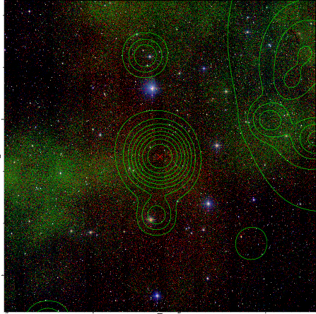

### 256

|Name|RAJ2000[deg]|DEJ2000[deg] |Ext[arcmin]| Ext,ml | z | z_src| C|GC(XSZ,Delta_z<0.01)| GC(OPT,Delta_z<0.01)|GC| R_sig[arcmin] | R500[arcmin] | R500[Mpc]| CRsig[c/s] | CR500[c/s] |L500[1E44 erg/s]|F500[1E-12 erg/s/cm^2]| M500[1E14 Msun]|Tx[keV]|Cnt_sig|Beta|Rc[arcmin]|Comment|Alias|
|---|---|---|---|---|---|------|---|--------|---------|----------|---|---|---|---|---|---|---|---|---|---|---|---|---|---|
|256| 104.626| -55.948| 1.19| 75.03| 0.2956(0.005)| z1, z_xsz| B| B15, H13, MCXC, PSZ2, Tar| N| B15, H13, MCXC, N, PSZ2, Tar, W| 13.188| 5.882| 1.556| 0.453(0.043)| 0.415(0.039)| 22.445(0.695)| 8.050(0.249)| 14.50(0.20)| 12.30(0.11)| 224.0| 0.870(-0.102+0.088)| 3.131(-0.536+0.421)| -| k060|

|[RASS image](../image/256/256_img.pdf)|[filtered image](../image/256/256_fil.pdf)|[Segment image](../image/256/256_seg.pdf)|
|-------------------|--------------------|-------------------|
|   |    |   |

|[Exposure image](../image/256/256_mex.pdf)| [nH image](../image/256/256_nh.pdf)| [Planck image](../image/256/256_p.pdf)|
|-------------------|--------------------|-------------------|
|   |     |  |

|[Redshift Histogram](../image/256/256_zg.pdf) | [DSS image(z1)](../image/256/256_dss_z1.pdf)      |  [DSS image(z2)](../image/256/256_dss_z2.pdf)    |
|-------------------|--------------------|-------------------|
| |  Blue circle for optical clusters;  Magenta circle for XSZ clusters;  all with r=1Mpc;  Only GC with Delta_z<0.01 are shown. |  Blue circle for optical clusters;  Magenta circle for XSZ clusters;  all with r=1Mpc;  Only GC with Delta_z<0.01 are shown.  |

|[known Abell/XSZ clusters](../image/256/256_gc.pdf) | [2MASS image](../image/256/256_2mass.pdf)      |
|-------------------|-------------------|
|  Magenta, blue and green circles  for optical, X-ray and SZ clusters  respectively, with redshift of clusters  labelled. The radius of circles  are 1Mpc.|  |

